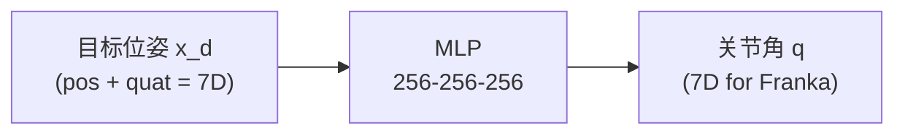

# 第五章：学习型 IK——神经网络、IKFlow 与 VLA 的结合

> 前情提要：[第 3 章](./03_雅可比迭代法IK)和[第 4 章](./04_基于优化的IK)的方法都需要在推理时做迭代计算。本章探索一种完全不同的思路：用数据驱动的方法，训练一个神经网络直接从目标位姿映射到关节角——推理时只需一次前向传播，无需迭代。

**知识链接**：
- [雅可比矩阵与微分运动学](/前置知识/003b_前置知识_雅可比矩阵与微分运动学)
- [Flow Matching 与连续归一化流](/前置知识/000g_前置知识_Flow_Matching与连续归一化流)

---

## 1. 为什么用学习来做 IK？

传统 IK 方法（解析、雅可比、优化）已经很成熟，为什么还要用学习？


| 动机 | 说明 |
|------|------|
| **推理速度** | 前向传播 ~100μs，比迭代法更快且延迟确定 |
| **多解覆盖** | 生成式方法可以一次采样出多个有效解 |
| **隐式约束学习** | 训练数据天然满足关节限位/碰撞约束 |
| **端到端集成** | 可以和 VLA/策略网络联合训练，梯度可以流过 IK |
| **泛化到新机器人** | 一个网络可能适配多种运动学结构 |

但学习型 IK 也有代价：精度通常不如解析/迭代法（mm 级 vs sub-mm），且需要大量训练数据。所以它更适合**精度要求稍低但速度要求高**的场景（如实时策略推理、批量采样）。

---

## 2. 方法一：简单 MLP 回归

### 2.1 思路

最朴素的做法：收集大量 $(\mathbf{x}, \mathbf{q})$ 数据对（正运动学正向生成），训练一个 MLP 学习映射 $g_\theta: SE(3) \to \mathbb{R}^n$。



### 2.2 训练数据生成

不需要真实数据——直接用 FK：
1. 在关节空间均匀/随机采样 $\mathbf{q}_i$
2. 计算 $\mathbf{x}_i = f(\mathbf{q}_i)$
3. 得到训练对 $(\mathbf{x}_i, \mathbf{q}_i)$

核心代码：

```python
import numpy as np
import torch

def generate_ik_dataset(fk_func, q_limits, n_samples=1000000):
    """
    通过随机采样关节角 + FK 生成 IK 训练数据。
    不需要真实机器人数据——纯正运动学计算即可。
    """
    q_min, q_max = q_limits  # (n,), (n,)
    n_joints = len(q_min)
    
    # 均匀随机采样关节角
    qs = np.random.uniform(q_min, q_max, size=(n_samples, n_joints))
    
    # 批量计算 FK
    xs = np.array([fk_func(q) for q in qs])  # (n_samples, 7): pos(3) + quat(4)
    
    return torch.FloatTensor(xs), torch.FloatTensor(qs)
```

### 2.3 问题：多解歧义

IK 是一对多映射。给定同一个 $\mathbf{x}$，有多个有效的 $\mathbf{q}$。如果用 MSE loss 训练：

$$
L = \frac{1}{N}\sum_{i=1}^N \|g_\theta(\mathbf{x}_i) - \mathbf{q}_i\|^2
$$

**这个公式在做什么**：标准 MSE 回归损失——让网络输出尽量接近训练数据中的关节角。

::: details 📐 逐符号拆解 + 数值代入（点击展开）
**逐符号拆解**：

| 符号 | 含义 |
|------|------|
| $g_\theta(\mathbf{x}_i)$ | 网络对第 $i$ 个目标位姿的预测关节角 |
| $\mathbf{q}_i$ | 训练数据中对应的"真值"关节角（FK 生成时的采样值） |
| $N$ | 训练样本数 |

**数值代入**：假设同一个 $\mathbf{x}$ 在数据集中出现两次（对应两个不同 IK 解）：$\mathbf{q}_A = (0.2, -0.5, ...)$ 和 $\mathbf{q}_B = (-0.3, -1.2, ...)$。MSE loss 会把网络推向两者的平均 $\mathbf{q}_{\text{avg}} = (-0.05, -0.85, ...)$。但 $f(\mathbf{q}_{\text{avg}}) \ne \mathbf{x}$——平均解不在解流形上。

**为什么是这个形式**：MSE 是最自然的回归损失，但它隐含假设目标是唯一的。对多模态分布（如 IK 多解），MSE 会导致 mode averaging 问题。
:::

网络会学到**多解的平均**——而平均解往往不满足 FK 约束（不在解流形上）。这是 MLP 回归做 IK 的根本缺陷。

**解决方案**：
- 用 FK 精度作为 loss（$\|f(g_\theta(\mathbf{x})) - \mathbf{x}\|^2$）而非直接监督 $\mathbf{q}$
- 加条件化信息（如"肘上"/"肘下"的 one-hot）消除歧义
- 使用生成式模型（下节的 IKFlow）

---

## 3. 方法二：IKFlow——生成式 IK

### 3.1 核心思想

IKFlow (2022) 把 IK 问题重新定义为**条件密度估计**：学习分布 $p(\mathbf{q} | \mathbf{x}_d)$——给定目标位姿，关节角的条件概率分布。

对冗余机器人，这个条件分布是一个**连续流形**（自运动流形），IKFlow 用条件 Normalizing Flow 来建模它。

### 3.2 模型结构

$$
\mathbf{q} = g_\theta(\mathbf{z}; \mathbf{x}_d), \quad \mathbf{z} \sim \mathcal{N}(\mathbf{0}, I)
$$

**这个公式在做什么**：从标准正态噪声 $\mathbf{z}$ 出发，经过以 $\mathbf{x}_d$ 为条件的可逆变换 $g_\theta$，得到满足 IK 约束的关节角 $\mathbf{q}$。

::: details 📐 逐符号拆解 + 数值代入（点击展开）
**逐符号拆解**：

| 符号 | 含义 |
|------|------|
| $\mathbf{z} \in \mathbb{R}^n$ | 潜变量，从标准正态采样 |
| $g_\theta$ | 条件 Normalizing Flow（一系列可逆仿射耦合层） |
| $\mathbf{x}_d$ | 条件信息：目标末端位姿（7D = pos + quat） |
| $\mathbf{q}$ | 输出：一个满足 IK 的关节角向量 |

**采样多解**：由于 $\mathbf{z}$ 是随机的，每次采样得到不同的 $\mathbf{q}$，都满足 $f(\mathbf{q}) \approx \mathbf{x}_d$。采样 100 次就得到 100 个不同的 IK 解。

**数值代入**：对 7-DOF Franka，$\mathbf{z} \in \mathbb{R}^7$，Flow 输出 $\mathbf{q} \in \mathbb{R}^7$。条件 $\mathbf{x}_d = (0.5, 0.2, 0.1, 0, 0, 0, 1)$（位置 + 四元数）。每次采不同的 $\mathbf{z}$：
- $\mathbf{z}_1 = (0.3, -0.5, ...)$ → $\mathbf{q}_1 = (0.21, -0.56, ...)$（"肘高"构型）
- $\mathbf{z}_2 = (-0.8, 0.2, ...)$ → $\mathbf{q}_2 = (-0.32, -1.2, ...)$（"肘低"构型）

两者都满足 $\|f(\mathbf{q}_i) - \mathbf{x}_d\| < 1$ mm。

**为什么是这个形式**：Normalizing Flow 的可逆性保证了模型学到的分布覆盖完整的解流形（不会 mode collapse）。Flow 比 VAE 更适合 IK，因为 IK 的解流形是连续且低维的，Flow 的精确密度估计能完整捕获它。
:::

### 3.3 训练

IKFlow 的 loss 是标准的 Flow 训练目标——最大化数据的对数似然：

$$
L = -\frac{1}{N}\sum_{i=1}^N \log p_\theta(\mathbf{q}_i | \mathbf{x}_i) = -\frac{1}{N}\sum_{i=1}^N \left[\log p_z(g_\theta^{-1}(\mathbf{q}_i; \mathbf{x}_i)) + \log|\det J_{g_\theta^{-1}}|\right]
$$

**这个公式在做什么**：训练 Flow 使得在给定条件 $\mathbf{x}_i$ 下，训练数据中的关节角 $\mathbf{q}_i$ 的概率最大。

::: details 📐 逐符号拆解 + 数值代入（点击展开）
**逐符号拆解**：

| 项 | 含义 |
|----|------|
| $g_\theta^{-1}(\mathbf{q}_i; \mathbf{x}_i)$ | 把数据 $\mathbf{q}_i$ 反向映射到潜空间，得到对应的 $\mathbf{z}_i$ |
| $\log p_z(\mathbf{z}_i)$ | $\mathbf{z}_i$ 在标准正态下的对数概率 |
| $\log|\det J_{g^{-1}}|$ | 变换的雅可比行列式（体积变化因子） |

训练数据和 MLP 回归一样——随机采样 $\mathbf{q}$ + FK 得到 $\mathbf{x}$。

**为什么是这个形式**：这是 Normalizing Flow 的标准最大似然训练。利用变量替换公式把关节空间的概率转换为潜空间中的标准正态概率。
:::

### 3.4 IKFlow 的优缺点

| 优势 | 劣势 |
|------|------|
| 一次前向传播（~200μs） | 精度 ~1-5mm（不如迭代法 sub-mm） |
| 天然多解（采样即可） | 需要训练（~几小时 per robot） |
| 解的多样性可控（调节温度） | 不保证解满足碰撞约束 |
| 可微——梯度可以流回策略网络 | Flow 架构增加模型复杂度 |

---

## 4. 方法三：学习 IK 的残差修正

折中方案：先用传统方法（如 DLS）得到一个近似解 $\mathbf{q}_0$，再用网络预测残差：

$$
\mathbf{q}^* = \mathbf{q}_0 + \Delta\mathbf{q}_\theta(\mathbf{q}_0, \mathbf{x}_d)
$$

**这个公式在做什么**：传统 IK 出粗解，神经网络只负责"微调"——输入粗解和目标位姿，输出一个小修正量。

::: details 📐 逐符号拆解 + 数值代入（点击展开）
**逐符号拆解**：

| 符号 | 含义 |
|------|------|
| $\mathbf{q}_0$ | 传统方法（DLS / 伪逆 / PyBullet）给出的初始解 |
| $\Delta\mathbf{q}_\theta$ | 网络预测的残差修正（通常很小，~0.01 rad） |
| $\mathbf{q}^*$ | 修正后的最终解 |

**数值代入**：DLS 给出 $\mathbf{q}_0$，FK 误差 2mm。网络预测 $\Delta\mathbf{q} = (0.003, -0.005, 0.001, ...)$，修正后 FK 误差降到 0.1mm。

**为什么是这个形式**：残差学习（ResNet 的核心思想）——学"差值"比学"绝对值"容易。$\Delta\mathbf{q}$ 的分布集中在零附近，网络更容易拟合。
:::

网络只需学习"传统方法错哪了"，难度远低于从头学完整映射。且初始解 $\mathbf{q}_0$ 通常已经很接近目标，残差很小。

---

## 5. 学习型 IK 在 VLA 中的应用

### 5.1 端到端 IK 层

一些 VLA 模型在输出层集成可微 IK：


优势：策略在训练时就"知道" IK 的约束，不会输出 IK 不可达的 EEF 动作。

### 5.2 IK 作为数据增强

训练 VLA 时，可以用 IK 的多解性来增强数据：
- 同一个 EEF 轨迹，用不同的 IK 解（不同肘部构型）生成多条关节空间轨迹
- 让策略学到"目标构型不唯一"，提高泛化性

---

## 6. 总结

| 方法 | 推理速度 | 精度 | 多解 | 可微 | 适用场景 |
|------|----------|------|------|------|----------|
| MLP 回归 | ~100μs | 低（~5mm） | ❌ | ✅ | 低精度场景、初始化 |
| IKFlow | ~200μs | 中（~1-3mm） | ✅ | ✅ | 批量采样、多样性需求 |
| 残差修正 | ~1ms | 高（sub-mm） | ❌ | ✅ | 加速传统方法 |
| 解析 + 网络选解 | ~100μs | 精确 | ✅ | ✅ | 特殊构型 + 选解策略 |

**下一章预告**：[第 6 章：工程实战与工具对比](./06_工程实战与工具对比) 将动手对比 cuRobo、MoveIt、PyBullet、Pinocchio 等主流 IK 工具的实际使用体验——安装配置、API 调用、性能测试、踩坑经验。
