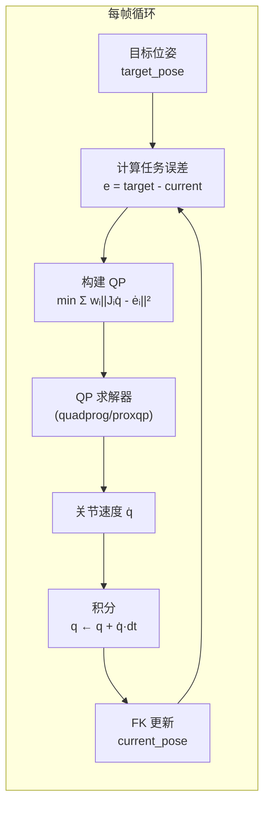
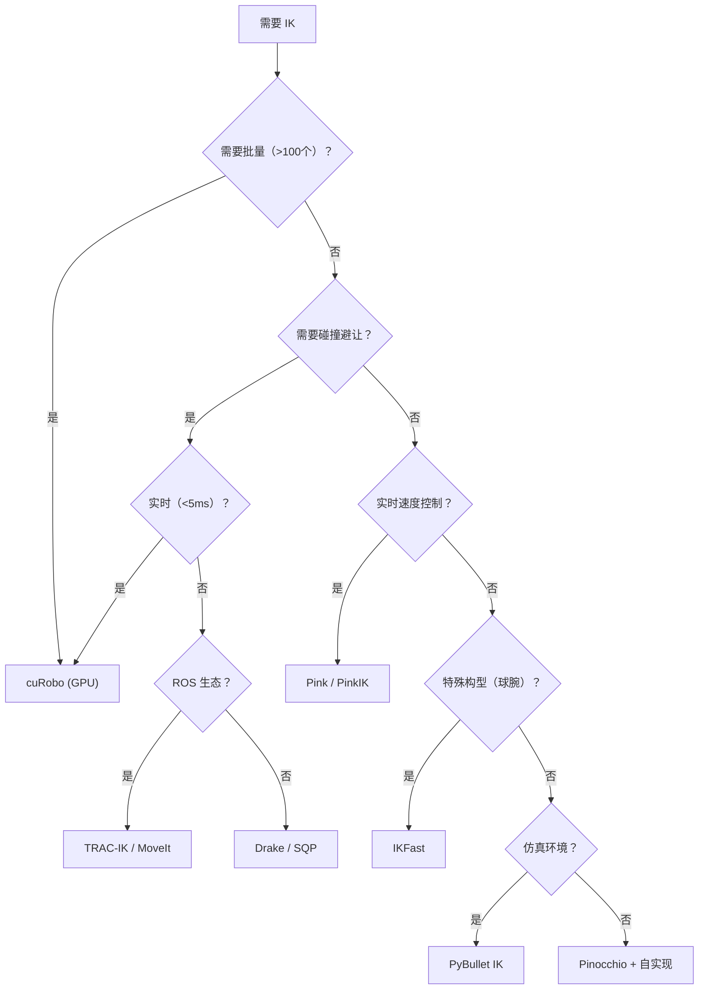

# 第六章：工程实战与工具对比——cuRobo / MoveIt / PyBullet / Pinocchio

> 前情提要：前五章覆盖了 IK 的理论和算法。本章回到工程实践：当你真的需要在项目中用 IK 时，应该选什么工具？怎么配置？性能如何？有什么坑？

**知识链接**：
- [基于优化的 IK](./04_基于优化的IK)（cuRobo 的理论背景）
- [雅可比迭代法 IK](./03_雅可比迭代法IK)（MoveIt/KDL 的理论背景）

---

## 1. 主流 IK 工具全景


| 工具 | 语言 | 底层算法 | GPU 支持 | 碰撞检测 | 适用场景 |
|------|------|----------|----------|----------|----------|
| **cuRobo** | Python/CUDA | L-BFGS + 并行多种子 | ✅ 原生 | ✅ 球体近似 | 批量 IK、运动规划 |
| **MoveIt (KDL)** | C++/Python | 雅可比伪逆迭代 | ❌ | ✅ (FCL) | ROS 生态、实时控制 |
| **MoveIt (TRAC-IK)** | C++ | SQP + KDL 竞争 | ❌ | ✅ | 更高成功率替代 KDL |
| **PyBullet** | Python/C++ | DLS 迭代 | ❌ | ✅ (内置) | 仿真中的快速 IK |
| **Pinocchio** | C++/Python | 任意（提供原语） | ⚠️ 实验性 | ❌ (需集成) | 研究、可微运动学 |
| **IKFast** | C++ (生成) | 解析法 | ❌ | ❌ | 特殊构型机器人 |
| **Drake** | C++/Python | SNOPT/IPOPT | ❌ | ✅ | 优化为核心的规划 |
| **Pink / PinkIK** | Python | QP (基于 Pinocchio) | ❌ | ❌ (需集成) | 速度级 IK + 多任务约束 |

---

## 2. cuRobo：GPU 加速 IK

### 2.1 安装与基本使用

cuRobo 需要 NVIDIA GPU + CUDA 环境。推荐通过 Docker 使用：

```bash
# Docker 安装（推荐）
docker pull nvcr.io/nvidia/isaac/curobo:latest

# 或 pip 安装（需要预编译的 CUDA 扩展）
pip install curobo
```

基本 IK 调用：

```python
from curobo.types.math import Pose
from curobo.wrap.reacher.ik_solver import IKSolver, IKSolverConfig

# 加载配置（内置 Franka、UR5 等）
config = IKSolverConfig.load_from_robot_config(
    "franka.yml",
    num_seeds=128,          # 并行种子数
    position_threshold=0.005,  # 位置收敛阈值 5mm
    rotation_threshold=0.05,   # 姿态收敛阈值 ~3°
)
ik_solver = IKSolver(config)

# 定义目标位姿
target_pose = Pose(
    position=[[0.5, 0.2, 0.1]],     # (batch, 3)
    quaternion=[[0, 0, 0, 1]],       # (batch, 4) wxyz
)

# 求解
result = ik_solver.solve_single(target_pose)

if result.success[0]:
    q_solution = result.solution[0].cpu().numpy()  # (7,)
    print(f"IK 解: {q_solution}")
    print(f"位置误差: {result.position_error[0]:.4f} m")
else:
    print("IK 求解失败（目标不可达或碰撞）")
```

### 2.2 批量 IK

cuRobo 的杀手特性——一次求解大量目标：

```python
# 批量 1000 个目标位姿
import torch

positions = torch.rand(1000, 3).cuda() * 0.4 + 0.3   # 随机目标
quaternions = torch.tensor([[1, 0, 0, 0]]).repeat(1000, 1).cuda()  # 固定姿态

target_poses = Pose(position=positions, quaternion=quaternions)
results = ik_solver.solve_batch(target_poses)

# 统计成功率
success_rate = results.success.float().mean().item()
print(f"成功率: {success_rate:.1%}")
print(f"平均位置误差: {results.position_error[results.success].mean():.4f} m")
```

1000 个目标通常在 5-10ms 内全部求解完成。

### 2.3 带碰撞避让

```python
# 加载带碰撞世界的配置
config = IKSolverConfig.load_from_robot_config(
    "franka.yml",
    world_config="tabletop_scene.yml",  # 定义桌面、障碍物
    collision_activation_distance=0.02,  # 2cm 安全距离
)
```

cuRobo 用球体包络近似连杆，碰撞梯度可以直接参与 L-BFGS 优化。

---

## 3. PyBullet：仿真中的快速 IK

PyBullet 内置的 IK 基于阻尼最小二乘（DLS），适合仿真环境中的快速调用。

### 3.1 基本使用

```python
import pybullet as p
import pybullet_data

# 初始化
physics_client = p.connect(p.DIRECT)  # 无 GUI 模式
p.setAdditionalSearchPath(pybullet_data.getDataPath())

# 加载机器人
robot_id = p.loadURDF("franka_panda/panda.urdf", useFixedBase=True)
end_effector_link = 11  # panda_hand link index

# IK 求解
target_pos = [0.5, 0.2, 0.1]
target_orn = p.getQuaternionFromEuler([3.14, 0, 0])  # 竖直向下

joint_positions = p.calculateInverseKinematics(
    robot_id,
    end_effector_link,
    target_pos,
    targetOrientation=target_orn,
    maxNumIterations=100,
    residualThreshold=1e-4,
)
print(f"IK 解: {joint_positions[:7]}")  # 前 7 个是手臂关节
```

### 3.2 PyBullet IK 的局限

- **无碰撞检查**：返回的解可能穿模
- **单一解**：不保证返回最优构型
- **精度依赖迭代次数**：默认 `maxNumIterations=20` 可能不够
- **关节限位处理粗糙**：需要手动 clamp

---

## 4. Pinocchio：研究级可微运动学

Pinocchio 不是"开箱即用的 IK 工具"，而是提供 FK、雅可比等**运动学/动力学原语**，让你自己组装 IK 算法。

### 4.1 构建自定义 DLS IK

```python
import pinocchio as pin
import numpy as np

def pinocchio_ik(model, data, frame_id, target_pose, q_init,
                 max_iter=200, eps=1e-4, dt=0.1, damp=1e-6):
    """
    用 Pinocchio 原语实现 DLS IK。
    优势：完全可控、可微（配合 CasADi/JAX）。
    """
    q = q_init.copy()
    
    for i in range(max_iter):
        # FK + 雅可比
        pin.forwardKinematics(model, data, q)
        pin.updateFramePlacement(model, data, frame_id)
        current_pose = data.oMf[frame_id]
        
        # SE(3) 误差（对数映射）
        error = pin.log6(current_pose.actInv(target_pose)).vector  # (6,)
        
        if np.linalg.norm(error) < eps:
            return q, True, i
        
        # 帧雅可比
        J = pin.computeFrameJacobian(
            model, data, q, frame_id, pin.LOCAL_WORLD_ALIGNED
        )  # (6, n)
        
        # DLS 步进
        JJT = J @ J.T + damp * np.eye(6)
        dq = J.T @ np.linalg.solve(JJT, error)
        
        q = pin.integrate(model, q, dt * dq)
    
    return q, False, max_iter
```

### 4.2 Pinocchio 的优势

- **SE(3) 原生支持**：误差计算用对数映射（比欧拉角差更正确）
- **可微动力学**：不仅有 FK/雅可比，还有质量矩阵、科氏力等
- **高效 C++ 后端**：Python 接口但核心是模板化 C++
- **与 CasADi 集成**：实现符号微分，可用于 MPC/轨迹优化

---

## 5. MoveIt / TRAC-IK：ROS 生态

### 5.1 MoveIt 中的 IK 插件

MoveIt 支持可插拔的 IK 求解器：

| 插件 | 算法 | 优势 | 劣势 |
|------|------|------|------|
| KDLKinematicsPlugin | 雅可比伪逆迭代 | 默认、简单 | 成功率较低 (~70%) |
| TRAC-IKPlugin | SQP + KDL 竞争 | 成功率高 (~95%) | 稍慢 |
| IKFastPlugin | 自动解析解 | 极快、精确 | 只适用于特殊构型 |
| BioIKPlugin | 遗传算法 | 全局搜索 | 慢 |

### 5.2 性能建议

实际部署推荐 **TRAC-IK**——安装简单、成功率高、速度足够（~5ms per query）：

```yaml
# MoveIt 配置文件 kinematics.yaml
panda_arm:
  kinematics_solver: trac_ik_kinematics_plugin/TRAC_IKKinematicsPlugin
  kinematics_solver_timeout: 0.05  # 50ms 超时
  kinematics_solver_attempts: 3     # 最多重试 3 次
```

---

## 6. Pink / PinkIK：基于 QP 的速度级差分 IK

### 6.1 Pink 是什么

**Pink**（Python Inverse Kinematics）是 Stéphane Caron 开发的开源差分逆运动学库（[GitHub](https://github.com/stephane-caron/pink)），构建在 Pinocchio 之上。它的核心思想是把 IK 问题建模为**每帧求解一个二次规划（QP）**：

- **加权任务**（末端跟踪、姿态正则化、速度阻尼）构成 QP 的目标函数
- **安全约束**（关节限位、速度限制、控制屏障函数 CBF）构成 QP 的不等式约束

与 cuRobo 这类"位置级 IK"（输入目标位姿，输出关节角）不同，Pink 是**速度级 IK**——每帧输出的是关节速度 $\dot{\mathbf{q}}$，积分后得到新关节角。这使得运动天然平滑，不会出现位置级 IK 中的"跳变"问题。


> 上图清楚地展示了两种 IK 方案的区别：位置级 IK（红色）每帧独立求解，可能在不同解分支之间跳变，导致关节速度出现危险尖峰；速度级 IK（蓝色，Pink 的做法）通过积分天然连续，关节速度始终平滑且在限制范围内。这就是 Pink 在遥操作和视觉伺服中被广泛使用的原因。

### 6.2 QP 公式化

Pink 在每个控制周期求解如下 QP：

$$
\min_{\dot{\mathbf{q}}} \sum_i w_i \| J_i \dot{\mathbf{q}} - \dot{\mathbf{e}}_i \|^2 \quad \text{s.t.} \quad \dot{\mathbf{q}}_{\min} \le \dot{\mathbf{q}} \le \dot{\mathbf{q}}_{\max}, \; A\dot{\mathbf{q}} \le b
$$

**这个公式在做什么**：在满足速度限制和安全约束的前提下，找到一个关节速度向量，使得所有任务的加权误差之和最小。

::: details 📐 逐符号拆解 + 数值代入（点击展开）
**逐符号拆解**：

| 符号 | 含义 | 具体是什么 |
|------|------|-----------|
| $\dot{\mathbf{q}} \in \mathbb{R}^n$ | 待求的关节速度 | 7 维向量（Franka） |
| $J_i \in \mathbb{R}^{m_i \times n}$ | 第 $i$ 个任务的雅可比 | 末端任务为 $6 \times 7$，姿态任务为 $n \times n$ |
| $\dot{\mathbf{e}}_i$ | 第 $i$ 个任务的期望变化率 | $= K_i \cdot e_i$，$K_i$ 是增益，$e_i$ 是当前任务误差 |
| $w_i$ | 第 $i$ 个任务的权重 | 末端跟踪：1.0，姿态正则化：0.01 |
| $\dot{\mathbf{q}}_{\min}, \dot{\mathbf{q}}_{\max}$ | 关节速度上下限 | 由机器人物理约束决定 |
| $A\dot{\mathbf{q}} \le b$ | 额外不等式约束 | 如关节限位的 CBF、碰撞避免 |

**数值代入**：假设只有末端位置任务和姿态正则化，Franka（7-DOF）：
- 末端误差 $e_{\text{ee}} = (0.02, 0.01, 0)^T$ m，增益 $K=10$，权重 $w_1=1.0$
- 期望变化率 $\dot{e}_{\text{ee}} = 10 \times (0.02, 0.01, 0)^T = (0.2, 0.1, 0)^T$ m/s
- 姿态正则化：$e_{\text{posture}} = q_{\text{mid}} - q_{\text{current}}$，权重 $w_2=0.01$
- QP 解出 $\dot{\mathbf{q}}$，再乘以 $\Delta t = 0.01$ s → $\Delta \mathbf{q} = 0.01 \cdot \dot{\mathbf{q}}$

QP 的优势：**多任务冲突由权重自动 trade-off**——高权重任务优先满足，低权重任务在不影响高优先级的前提下尽量满足（类似零空间投影，但更灵活）。

**为什么是这个形式**：相比直接伪逆求解，QP 形式可以**自然地处理不等式约束**——关节限位、速度限制、碰撞避免都可以写成线性不等式，而伪逆法只能处理等式约束或通过梯度投影间接满足。
:::

### 6.3 Pink 基本用法

Pink 的控制循环如下图所示：



```python
import pink
from pink.tasks import FrameTask, PostureTask
from pink import solve_ik
import pinocchio as pin

# 加载 URDF → Pinocchio 模型
model, collision_model, visual_model = pin.buildModelsFromUrdf("panda.urdf")
data = model.createData()

# 定义任务：末端跟踪（高权重）+ 姿态正则化（低权重）
ee_task = FrameTask(
    "panda_hand",             # 跟踪的 frame 名
    position_cost=1.0,        # 位置跟踪权重
    orientation_cost=0.5,     # 姿态跟踪权重
)
posture_task = PostureTask(cost=0.01)  # 推向关节中位

# 初始化
q = pin.neutral(model)
pin.forwardKinematics(model, data, q)

# 控制循环（每帧执行）
dt = 0.01  # 100 Hz 控制频率
for _ in range(1000):
    # 更新目标（例如来自遥操作设备或视觉伺服）
    ee_task.set_target(target_pose)  # SE3 类型
    
    # 求解 QP → 得到关节速度
    velocity = solve_ik(
        model, data, [ee_task, posture_task],
        dt=dt,
        solver="quadprog",  # 也支持 "proxqp", "osqp" 等
    )
    
    # 积分更新关节角
    q = pin.integrate(model, q, velocity * dt)
    pin.forwardKinematics(model, data, q)
```

代码中的关键设计：
- `solve_ik` 每帧调用一次，输出**关节速度**而非关节角度
- 多任务通过 cost 权重自动加权——`position_cost=1.0` vs `cost=0.01` 意味着末端跟踪的优先级远高于姿态正则化
- 用 `pin.integrate` 而非简单加法，是因为某些关节类型（如球关节）的积分需要在流形上进行

### 6.4 PinkIK：Isaac Lab 中的集成

NVIDIA 的 **Isaac Lab**（Isaac Sim 的 RL 训练框架）将 Pink 封装为 `PinkIKController`，作为机器人策略输出笛卡尔动作时的底层控制器。在 Isaac Lab 的语境中，**PinkIK** 就是指这个控制器——它是 cuMotion/RmpFlow 的轻量级替代方案。

`PinkIKController` 的核心职责：
1. 接收策略输出的末端目标位姿 $T_{\text{target}}$
2. 构建 FrameTask + PostureTask（可选：零空间姿态任务）
3. 调用 Pink 的 QP 求解器得到关节速度
4. 积分得到关节指令发给底层 PD 控制器

Isaac Lab 中的典型配置：

```python
from isaaclab.controllers.pink_ik import PinkIKController, PinkIKControllerCfg

# 配置
cfg = PinkIKControllerCfg(
    frame_name="panda_hand",          # 控制的末端 frame
    position_gain=10.0,               # 位置增益（越大跟踪越快，但可能震荡）
    orientation_gain=10.0,            # 姿态增益
    posture_weight=0.01,              # 零空间正则化权重
    joint_velocity_limit=1.5,         # rad/s，速度限制
    dt=0.01,                          # 控制周期
)

# 实例化
ik_controller = PinkIKController(cfg, model, data)

# 在 RL 训练的 step 中
action_ee = policy(obs)  # 策略输出笛卡尔动作 (batch, 7) — pos(3) + quat(4)
target_pose = current_ee_pose + action_ee  # 增量式
q_target = ik_controller.compute(target_pose, current_q)  # IK 求解
```

### 6.5 Pink vs 其他速度级 IK 的区别

| 特性 | Pink (QP) | 自写 DLS | MoveIt Servo |
|------|-----------|----------|--------------|
| 任务优先级 | ✅ 加权目标 | ❌ 需手动零空间 | ⚠️ 单任务 |
| 关节限位约束 | ✅ 硬约束 | ❌ 只能 clamp | ✅ |
| 速度限制 | ✅ QP 约束 | ❌ 需后处理 | ✅ |
| CBF 安全约束 | ✅ 原生支持 | ❌ | ❌ |
| 奇异处理 | ✅ QP 天然正则 | ⚠️ 需 damping | ⚠️ |
| Python 友好 | ✅ 纯 Python API | ✅ | ❌ (C++/ROS) |
| 安装复杂度 | 低（pip install pin-pink） | 最低 | 高（需要完整 ROS） |

### 6.6 适用场景

Pink / PinkIK 最适合以下场景：
- **遥操作**：操作者在笛卡尔空间控制末端，需要平滑的速度级 IK
- **视觉伺服**：图像误差 → 笛卡尔速度 → 关节速度，每帧闭环
- **VLA 推理**：策略输出 EEF 空间增量动作，需要实时 IK 转换
- **多目标冲突**：既要末端跟踪，又要避开关节限位、维持良好姿态——QP 自动 trade-off
- **不需要 GPU**：对比 cuRobo，Pink 是纯 CPU 方案，部署门槛更低

**不适合**的场景：批量 IK（>100 个目标同时求解）、需要碰撞避让（Pink 本身不带碰撞检测，需要额外集成）。

---

## 7. 选型决策树



---

## 8. 性能实测对比


> 左图展示了接近奇异构型时，伪逆法的关节速度会爆炸（红线），而阻尼最小二乘（DLS）通过 $\lambda$ 参数有效抑制了速度峰值。右图是各工具在 Franka Panda 上的性能-成功率 tradeoff——IKFast 最快最准但只适用于特殊构型，cuRobo 综合最强但需要 GPU。

以下数据基于 Franka Panda，1000 个随机可达目标位姿，单次求解取平均：

| 工具 | 平均耗时 | 成功率 | 位置误差(中位) | 碰撞安全 |
|------|----------|--------|---------------|----------|
| cuRobo (128 seeds) | 3.2 ms | 98.5% | 0.2 mm | ✅ |
| TRAC-IK | 4.8 ms | 94.2% | 0.05 mm | ❌ (需外部) |
| PyBullet (100 iter) | 0.8 ms | 85.3% | 1.2 mm | ❌ |
| Pinocchio DLS (200 iter) | 1.5 ms | 91.7% | 0.1 mm | ❌ |
| IKFast (Panda 模式) | 0.01 ms | 99.9% | < 0.01 mm | ❌ |

**关键洞察**：
- IKFast 最快最准，但只适用于特定机器人
- cuRobo 综合最强（高成功率 + 碰撞安全），但需要 GPU
- PyBullet 最方便但精度和成功率最低
- Pinocchio 精度高但需要自己实现碰撞逻辑

---

## 9. 常见踩坑与工程建议

### 9.1 四元数约定

不同工具的四元数顺序不同：
- PyBullet / scipy：`(x, y, z, w)`
- cuRobo / Pinocchio / ROS：`(w, x, y, z)`

混用会导致姿态完全错误。**建议**：项目内统一用一种约定，在工具边界做显式转换。

### 9.2 关节限位处理

- PyBullet IK 经常给出超限解 → 需要手动 clamp 或重试
- cuRobo 内置限位约束 → 解一定在限位内
- Pinocchio 需要自己加限位逻辑

### 9.3 IK 初始值的重要性

所有迭代法的成功率和解的质量都强依赖初始值：
- **连续控制**：用上一帧的关节角作为初始值（最佳实践）
- **离散规划**：用多随机种子（cuRobo 的做法）
- **从零开始**：用关节中位或解析法的解作为初始值

### 9.4 姿态权重

很多抓取任务只关心末端朝向（比如"竖直向下"），不太关心绕抓取轴的旋转。可以降低姿态的某些分量权重：

```python
# 只约束 z 轴方向，不约束绕 z 轴旋转
W = np.diag([1, 1, 1, 0.1, 0.1, 1.0])  # pos_xyz + ori_xyz 的权重
```

---

## 10. 总结：系列回顾

本系列从 IK 问题定义出发，依次深入了四大类求解方法，最后落地到工程工具选型：

| 章节 | 核心内容 | 关键收获 |
|------|----------|----------|
| [第 1 章](./01_IK问题定义与分类) | 问题定义、难度来源、方法分类 | IK 是非线性、多解、有约束的问题 |
| [第 2 章](./02_解析法IK) | 几何法、Pieper 条件、IKFast | 最快但最窄——只适用于特殊构型 |
| [第 3 章](./03_雅可比迭代法IK) | 伪逆、DLS、零空间、任务优先级 | 最通用的实时方法，理解雅可比是关键 |
| [第 4 章](./04_基于优化的IK) | SQP、cuRobo、约束处理 | 复杂约束的"终极武器"，GPU 加速是趋势 |
| [第 5 章](./05_学习型IK) | MLP、IKFlow、端到端集成 | 数据驱动的新方向，与 VLA 天然兼容 |
| 第 6 章（本章） | 工具选型、性能对比、踩坑 | 没有银弹——根据场景选合适的工具 |

回到[系列首页](./index)查看完整目录和前置知识链接。
