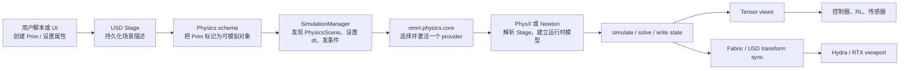

# 全景图：Isaac Sim 的物理栈到底有几层

本章先建立地图。后面讨论 solver、GPU 或 tensor 时，读者始终要知道它们属于哪一层。

## 一个“落体方块”要经过什么

假设我们在 `/World/Cube` 下放一个带碰撞体和质量的方块，在 `/World/PhysicsScene` 下定义重力。点击 Play 后，真正发生的事情不是“USD 自己在算物理”，而是下面这条链路：

> 注意 `USD Stage` 和“运行时模型”是两份不同的东西。Stage 是可组合、可保存的描述；后端会把它解析成自己的刚体、关节、碰撞和求解器数据结构。

## 四层职责

### 1. Kit 与扩展层

Isaac Sim 不是一个单一二进制，而是 Omniverse Kit 上的一组扩展。`isaacsim.exp.full.kit` 依赖 `isaacsim.exp.base`，再加载资产导入、传感器、机器人工具和 `omni.physx.bundle`。这决定了“是否能用 PhysX”首先是应用配置问题，而不是 Python import 问题。

### 2. USD 与 schema 层

OpenUSD Stage 保存 Prim、层、引用和属性。`UsdPhysics` 提供跨后端的公共语义，例如 `PhysicsScene`、`RigidBodyAPI`、`CollisionAPI`、`MassAPI`、`Joint` 和 `MaterialAPI`。PhysX 的 `PhysxSchema` 与 Newton 的 `NewtonSceneAPI` 等扩展 schema 只承载各自后端的额外参数。

### 3. Omni Physics 接口层

`omni.physics.core` 定义 simulation registry、`SimulationFns` 和 `StageUpdateFns` 等接口。`SimulationManager.switch_physics_engine("physx")` 或 `("newton")` 通过这层查找名称、停用旧 provider、激活新 provider。它是“可替换”的关键，不是一个新的求解器。

### 4. 运行时数据层

后端在初始化时解析 USD，创建运行时状态。PhysX 维护自己的 GPU/CPU scene 和缓存；Newton 维护 `newton.Model`、`State`、Warp arrays，并可把变换写到 Fabric。tensor view 只是这些运行时数组的批量读写入口，不是第三套物理引擎。

## 三个容易混淆的名字

| 名字 | 它是什么 | 它不是什么 |
|---|---|---|
| Isaac Sim | 基于 Omniverse Kit 的完整仿真应用 | 不是一个单独的 solver |
| PhysX | NVIDIA 的物理引擎，在 Isaac Sim 里由 Omni 扩展包装 | 不是 USD，也不是 Isaac Lab |
| Newton | 独立的 GPU/可扩展物理引擎，在 6.0 作为可选 provider 接入 | 不是 PhysX 的内部模块，也不是牛顿定律本身 |

## 为什么默认是 PhysX

默认 `isaacsim.core.simulation_manager` 的设置是 `default_engine = "physx"`，完整应用加载 `omni.physics.physx`、`omni.physics.stageupdate` 和 PhysX tensors。这样能覆盖 Isaac Sim 成熟的机器人、传感器、资产验证和工具链。Newton 应用则显式加载 Newton 扩展，并关闭 PhysX 相关扩展，避免两个 stage-update 同时修改同一 Stage。

这一点解释了一个常见误区：安装了 Newton 包，不等于当前仿真已经在用 Newton；必须让 Newton provider 注册并成为 active simulation。

## 读源码的入口

- 应用组合：[`source/apps/isaacsim.exp.full.kit`](https://github.com/isaac-sim/IsaacSim/blob/main/source/apps/isaacsim.exp.full.kit) 与 [`isaacsim.exp.full.newton.kit`](https://github.com/isaac-sim/IsaacSim/blob/main/source/apps/isaacsim.exp.full.newton.kit)。
- 统一控制：[`isaacsim.core.simulation_manager`](https://github.com/isaac-sim/IsaacSim/tree/main/source/extensions/isaacsim.core.simulation_manager)。
- Newton 注册：[`register_simulation.py`](https://github.com/isaac-sim/IsaacSim/blob/main/source/extensions/isaacsim.physics.newton/python/impl/register_simulation.py)。

下一章把视线放到 USD：后端为什么能够读取同一个刚体，哪些属性是公共契约，哪些属性会导致后端行为分叉。
