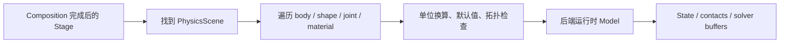

# USD 物理数据模型：一个刚体如何被两个后端读懂

物理后端不直接读取“网格长什么样”来猜物理意义，而是读取 USD schema。Schema 是后端之间最重要的契约。

## Stage 中的最小物理图

```mermaid
flowchart TB
    W[/World] --> PS[/World/PhysicsScene<br/>gravity + timestep]
    W --> R[/World/Robot<br/>ArticulationRoot]
    R --> L1[Link prim<br/>RigidBody + Mass]
    R --> J[Joint prim<br/>body0/body1 + limits/drive]
    L1 --> C[Collision shape<br/>CollisionAPI + Mesh/Sphere/Box]
    C --> M[PhysicsMaterial<br/>friction + restitution]
    W --> O[Dynamic object<br/>RigidBody + Collision]
    PS -. discovers .-> R
    PS -. discovers .-> O
```

> 读图时把 `PhysicsScene` 看成“时钟和重力的入口”，把刚体、形状、关节看成它扫描出来的对象图；材质挂在碰撞形状上，决定接触参数。

## 公共 schema 与后端私有 schema

公共 schema 的价值是让资产能跨 PhysX/Newton 迁移：同一个 `PhysicsScene` 提供重力方向和大小，同一个 `RigidBodyAPI` 表示动态刚体，同一个 `CollisionAPI` 表示参与碰撞，同一个关节关系表达 parent-child 拓扑。

后端私有 schema 则用于“公共语义不够表达”的参数。PhysX 使用 `PhysxSceneAPI` 的 GPU dynamics、solver type、broadphase 等属性；Newton 使用 `NewtonSceneAPI` 的 `newton:timeStepsPerSecond`、最大迭代次数和 XPBD/Kamino 参数，碰撞体还可写 `newton:contactMargin` 与 `newton:contactGap`。私有属性不会自动变成另一后端的等价参数。

## 从 USD 到运行时模型的四步



1. **Composition**：解析引用、payload、variant 和层叠，后端看到的是组合后的 Stage，而不是某个单独 usda 文件。
2. **发现对象**：以 PhysicsScene 为锚点，识别刚体、碰撞 shape、关节和材料关系。
3. **规范化**：补默认质量、惯量、接触参数，处理 meters-per-unit，并检查关节方向、零尺寸碰撞体等合法性。
4. **冻结结构**：生成运行时数组和索引。结构属性通常在初始化时确定，运行时 tensor API 更适合改状态和控制量，不适合随意增删 link。

## 单位和时间步是隐形契约

USD 的长度单位由 Stage 元数据描述，Isaac Sim 默认 meters-per-unit 为 1.0。Newton 的 `NewtonSimulationFunctions.initialize()` 明确以 `meters_per_unit=1.0` attach Stage；如果资产实际按厘米建模却没有正确元数据，两个后端都会得到错误尺度，但错误表现可能不同：重力、惯量、接触 margin 和控制增益会一起失真。

时间步也有两处：Timeline/render loop 的 tick，以及 PhysicsScene 的 physics frequency。渲染一帧不等于只推进一次物理步；高频物理可能在一个渲染帧内推进多步。第 5 章会把这条时间线展开。

## 后端分歧从哪里开始

同一公共 schema 经过后端解析后会出现三类分歧：

| 分歧位置 | PhysX 的典型入口 | Newton 的典型入口 |
|---|---|---|
| scene 参数 | `PhysxSceneAPI` | `NewtonSceneAPI` / `NewtonConfig` |
| drive 解释 | PhysX drive API、TGS/PGS | Newton actuator/MuJoCo 参数映射 |
| 碰撞细节 | PhysX contact offset、CCD 等 | Newton margin/gap、solver-specific contact |

因此“USD 文件相同”只保证输入语义大体相同，不保证轨迹逐 bit 相同。跨后端验证必须比较质量、关节拓扑、碰撞近似、dt 和控制器参数。

下一章先看默认的 PhysX 后端：它如何利用 GPU Dynamics、TGS 和 Fabric，把工业级场景接入 Isaac Sim 的主循环。
