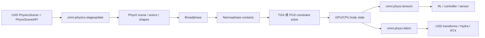

# PhysX 后端：GPU Dynamics、TGS 与 Fabric 数据通路

PhysX 是 Isaac Sim 6.0 的默认后端。这里的“PhysX”要理解成 PhysX SDK 加上 `omni.physics.physx`、`omni.physics.stageupdate`、`omni.physx.fabric`、`omni.physx.tensors` 等 Kit 扩展，而不是只看底层库名字。

## PhysX 的运行时通路



> GPU Dynamics 主要改变“状态、碰撞和求解在哪个设备执行”，并不会把 USD 或渲染器变成物理引擎；Fabric 是高吞吐同步路径，tensor 是批量控制和读取路径。

## GPU Dynamics 不等于“所有物理都在 GPU”

在 `PhysxScene` 包装器里，GPU dynamics、solver type、broadphase、CCD 和 stabilization 是独立设置。启用 GPU dynamics 后，刚体动力学和接触相关工作可以使用 CUDA，但场景解析、某些查询、USD 写回和传感器仍可能经过 CPU 或同步边界。判断性能时要看完整 profile，而不是只看一个布尔开关。

GPU 模式还要求合理的 GPU buffer 容量。接触数、触点、暂存空间不足时，表现可能是警告、丢接触或初始化失败；工程上要从训练场景的最大物体数和接触密度估算容量。

## TGS 与 PGS 的位置

TGS（Temporal Gauss-Seidel）和 PGS（Projected Gauss-Seidel）是约束求解器选择，不是两个后端。约束包括关节、接触、摩擦和限制。TGS 通常在堆叠、关节链和较大时间步下更稳，但每步成本和参数敏感性也要实测；PGS 在部分简单场景更快或更宽容。不要把“用了 GPU”直接等同于“用了 TGS”。

## Fabric 为什么存在

传统路径是每步把 PhysX 的 body pose 写回 USD，再让 Hydra/RTX 读取 USD。大量并行环境或高频控制时，这个往返会成为瓶颈。Fabric 提供面向运行时场景图的快速数据通路，PhysX Fabric 扩展可以把变换、速度、关节状态和传感器相关数据以更少的 USD 开销同步。

Newton 应用配置里把 `omni.physx.fabric` 和 PhysX stage update 一起关闭，原因不是 Fabric 不能工作，而是 Newton 有自己的 Warp state 到 Fabric 的写入逻辑；两套 tracker 同时工作会造成重复写入和状态竞争。

## 典型 PhysX 配置路径

下面的调用用于说明设置的层级：先取得 `PhysxScene`，再设置场景级属性；具体数值应以任务和版本验证为准。

```python
from isaacsim.core.simulation_manager import PhysxScene

scene = PhysxScene("/World/PhysicsScene")
scene.set_enabled_gpu_dynamics(True)
scene.set_solver_type("TGS")
scene.set_broadphase_type("GPU")
```

这段代码改的是 USD/场景配置，不是直接调用 PhysX solver。运行中的场景通常要求先暂停，修改后重新初始化；否则属性可能要到下一次 play 才生效，甚至被运行时缓存覆盖。

## PhysX 的优势与边界

优势是 Isaac Sim 生态最成熟：机器人导入、传感器、调试 UI、资产验证和既有教程都围绕它构建。边界是它的行为仍受 PhysX 的接触模型、GPU buffer、solver 选项和 USD/Fabric 同步策略影响；“更快”必须和接触稳定性、控制频率、真实机器人误差一起测。

官方源码入口：[`isaacsim.exp.base.kit`](https://github.com/isaac-sim/IsaacSim/blob/main/source/apps/isaacsim.exp.base.kit)、[`PhysxScene`](https://github.com/isaac-sim/IsaacSim/blob/main/source/extensions/isaacsim.core.simulation_manager/python/impl/physx_scene.py)。下一章看 Newton 如何通过同一接口接入，而不是把 PhysX 的内部类替换掉。
