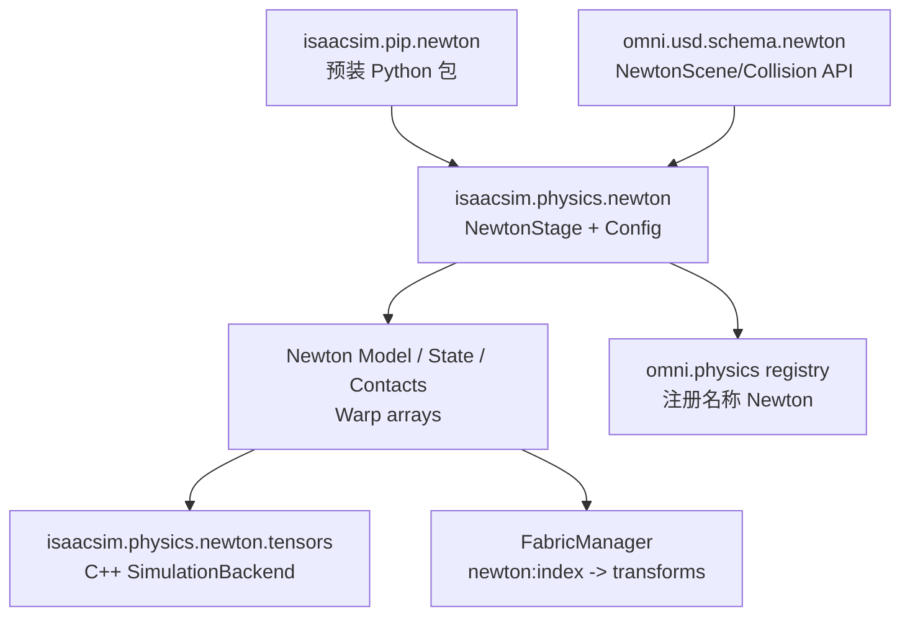
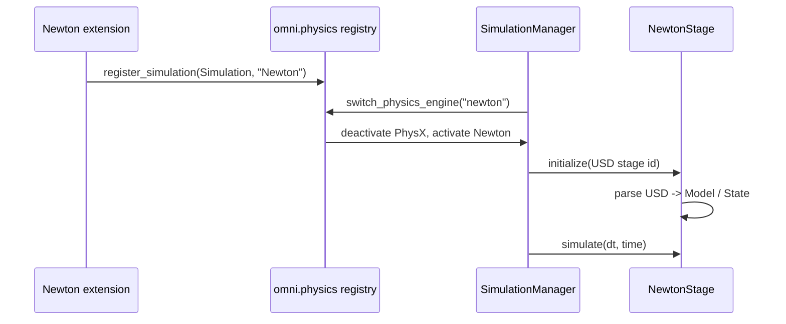

# Newton 后端：Warp、求解器与 USD 适配层

Newton 在 Isaac Sim 6.0 中是一个**替代 PhysX 的 provider**。它的底层库来自 `newton[sim]`、`mujoco-warp`、`newton-usd-schemas` 等包；Isaac Sim 扩展负责生命周期、USD 适配、统一接口注册和 tensor/Fabric 桥接。

## Newton 在 Isaac Sim 中的四个组件

> 关键是分清“Newton 包”和“Newton Isaac Sim 扩展”：前者提供求解器与数据结构，后者让它能理解当前 USD Stage 并遵守 Kit 的播放/暂停/回调协议。

## 默认 solver 与可选 solver

Isaac Sim 扩展的 `NewtonConfig` 默认使用 `MuJoCoSolverConfig`。这不是说 Isaac Sim 变成了 MuJoCo，而是 Newton 把 MuJoCo Warp 作为一个 solver backend。Newton 本身还可配置 XPBD、VBD、Featherstone、SemiImplicit、Kamino 等求解路径；每条路径对刚体、软体、接触、可微性和约束稳定性的侧重点不同。

Newton 系列已经逐章解释这些 solver 的内部算法，本系列只关注接入边界：`NewtonStage` 负责把 USD 解析成 Newton model，并在每个 `step_sim` 调用 solver；应用层不应该绕过 Stage 直接改 solver 私有数组。

## Unified Physics 注册是如何发生的

`register_simulation.py` 创建 `Simulation` 对象，把 `initialize`、`simulate`、`fetch_results`、`on_attach`、`on_update` 等函数指针绑定到 `NewtonSimulationFunctions` 与 `NewtonStageUpdateFunctions`，再调用 `physics.register_simulation(self.simulation, "Newton")`。因此 `SimulationManager` 可以用名字发现并切换它。

## Newton 的配置分两层

`NewtonConfig` 把应用级设置和 solver 级设置分开。应用级包括 `physics_frequency`、`num_substeps`、CUDA graph、Fabric 更新和固定关节折叠；solver 级包括 MuJoCo/XPBD 的迭代、接触、关节限制和 actuator 参数。这样同一套 Stage 可以在不改资产的情况下改变 solver 策略，但仍要重新初始化运行时模型。

Newton 的 USD schema 还提供 `newton:contactMargin` 和 `newton:contactGap`。margin 是有效表面的外扩，gap 是何时把候选接触送进 solver 的距离阈值；它们不是 PhysX 的同名参数，跨后端迁移时不能直接复制数值。

## 6.0 的明确限制信号

仓库测试对 Newton 的输入检查更严格，例如：动态 body 需要有效质量和碰撞几何，关节必须形成开放 articulation，闭环约束不被 Newton 接受，某些 USD composition 错误会在初始化时直接报错。这里的“限制”不是说 Newton 不能做物理，而是它的 USD parser 对模型拓扑和数值合法性有明确假设。

## Newton 与独立 Newton 系列的关系

独立 Newton 项目讲的是通用引擎、ModelBuilder、Worlds、solver 和可微仿真；本系列讲的是 Isaac Sim 如何把它装进 Kit：哪个扩展负责包依赖，哪个类注册接口，哪个 backend 暴露 tensor，哪个 Fabric manager 更新画面。两者是“引擎本体”和“宿主适配层”的关系。

源码入口：[`isaacsim.physics.newton`](https://github.com/isaac-sim/IsaacSim/tree/main/source/extensions/isaacsim.physics.newton)、[`Newton tensors`](https://github.com/isaac-sim/IsaacSim/tree/main/source/extensions/isaacsim.physics.newton.tensors)。
