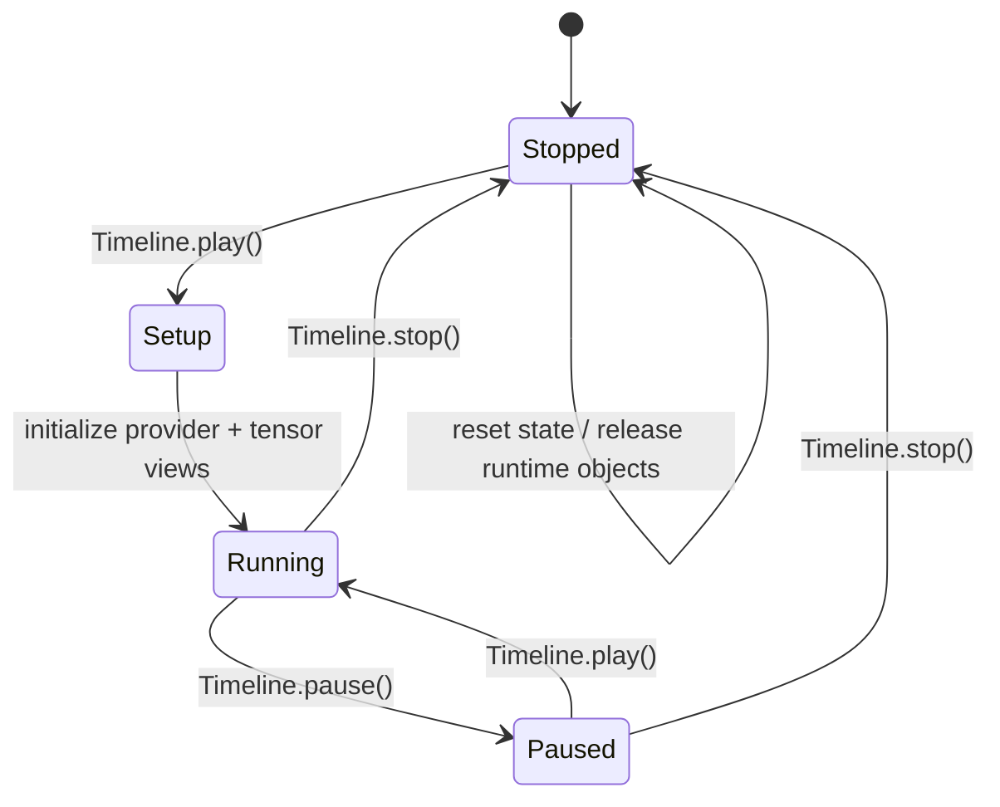
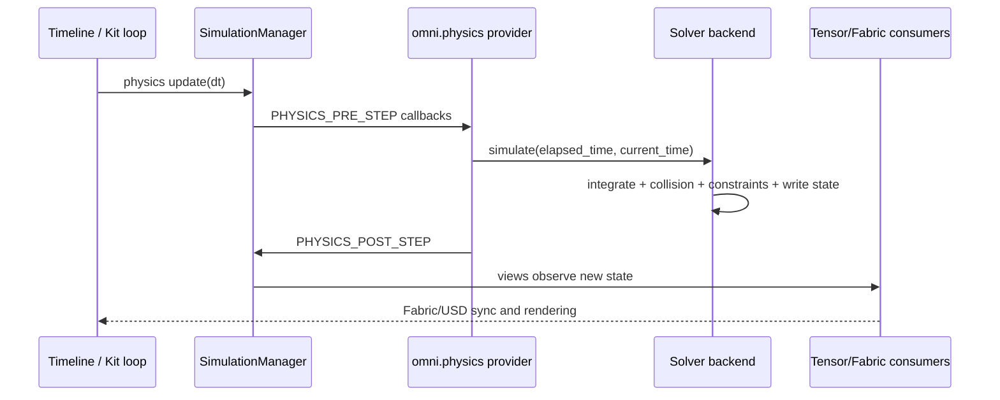

# 一次 physics step 的生命周期：从 Timeline 到传感器

调仿真时最容易犯的错，是把“调用 `world.step()`”“渲染一帧”和“物理推进一次”当成同一件事。Isaac Sim 6.0 通过 Timeline、SimulationManager 和 `omni.physics` 回调把三者连接起来，但它们仍是不同事件。

## Play 到 Stop 的状态机

首次 Play 会先发 `SIMULATION_SETUP`，准备 physics views，再发 `SIMULATION_STARTED`。用户自己的初始化回调通常应放在 started 之后；Stop 会使运行时 physics objects 失效，重新 Play 需要重新取得 view。

## 一步内部发生什么

Newton 的实现很适合用来核对这张图：`simulate()` 先执行 pre-step callbacks，调用 `newton_stage.step_sim(elapsed_time)`，再执行 post-step callbacks。PhysX 走同一个统一接口，但内部 `simulate/fetch_results` 可能有异步 GPU 工作，所以“post-step 回调可读到什么”仍应以接口契约和实测为准。

## dt、物理频率与渲染频率

PhysicsScene 的 `timeStepsPerSecond` 或 Newton 的 `physics_frequency` 决定物理 dt。应用的 `timeCodesPerSecond`、viewport tick rate 和 manual mode 决定 Kit 时间推进。它们可以相同，也可以不同：例如 60 Hz 渲染配 240 Hz 物理时，一个渲染帧可能包含四个 physics step。

固定步长通常更适合 RL 和回归测试，因为动作、接触和奖励都对应确定的物理时间；变步长适合交互预览，但会放大控制器和接触阈值的差异。Newton 的 `simulate()` 文档还特别说明不会自动 substep，调用方要传入合理的 elapsed time；这和某些 PhysX 高层封装的内部 substep 语义不能混为一谈。

## 传感器应该在哪个事件读

关节状态、接触力、IMU 等 physics sensor 依赖 solver 已经写出新状态，通常在 post-step 或下一帧读取。RTX 相机和激光雷达属于渲染/传感器 tick，可能有自己的频率和异步队列。要做时间对齐，记录 physics step count、simulation timestamp 和 sensor timestamp，而不是只记录 wall-clock。

## 复位的真实含义

Stop 不只是把时间停在零点。SimulationManager 会让后端 detach/reset，tensor view 可能指向旧的 runtime object。可靠的 episode reset 顺序是：停止或暂停、重设 USD/状态、等待 physics setup、重新创建 view、再 Play。训练代码若缓存旧 view，常见结果是“第一个 episode 正常，第二个 episode 读到无效或过期对象”。

下一章沿着状态的三种副本继续：USD、Fabric 和 tensor 为什么都存在，以及它们各自适合什么读写边界。
