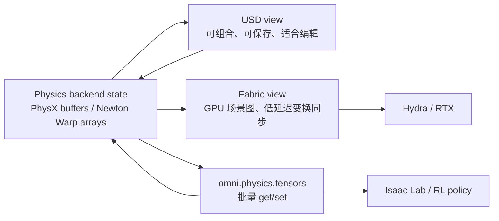

# Tensor 与 Fabric：仿真状态如何进入 RL 和渲染

仿真状态同时出现在 USD、Fabric 和 tensor view 中，不是重复设计，而是三个不同读写边界：可保存的场景描述、低延迟的运行时场景图、面向批处理的数值数组。

## 三种状态视图



> 读写方向很重要：USD 适合建模和配置，tensor 适合每步控制，Fabric 适合让画面追上运行时状态；不要把每个动作都写回 USD 再期待获得高吞吐。

## Unified tensor API 的意义

PhysX 的 `omni.physx.tensors` 和 Newton 的 `isaacsim.physics.newton.tensors` 都围绕 `omni.physics.tensors` 接口提供 articulation、rigid body、contact view。应用可以用相似的 `get_dof_positions()`、`set_dof_position_targets()`、`get_root_transforms()` 访问状态，后端选择被压到 view 创建和 provider 注册层。

Newton tensor backend 的源码明确分成 `Base*View`、CPU view 和 GPU view，并支持三种设备组合：CC（CPU 仿真/CPU tensor）、GC（GPU 仿真/CPU tensor）、GG（GPU 仿真/GPU tensor）。GC 会用预分配 staging buffer 做设备拷贝，GG 则尽量直接使用设备指针。

## 为什么 RL 偏爱 GG

RL rollout 的瓶颈往往不是单个求解器，而是每个 step 在 Python、CPU 和 GPU 之间来回搬运。GG 让策略输入、动作输出和 physics tensor 保持在 GPU，避免每个环境都做 host round-trip。代价是调试更困难，部分 NumPy-only 工具需要显式 `.cpu()` 或 `.numpy()`，而且 GPU buffer 容量与索引映射必须稳定。

## Fabric 的写回路径

Newton 的 Fabric manager 在动态 Prim 上写入 `newton:index`，再用这个索引从 `state.body_q` 取变换，运行 Warp kernel 更新 Fabric world matrices。PhysX 则由 PhysX Fabric 扩展管理类似的同步。两者都在“后端状态已经更新”之后执行，但属性名、tracker 和禁用开关不同，所以切换应用配置时不能只替换 engine name。

## 一个安全的控制回路

下面的伪代码只展示边界顺序：先在 setup 后创建 view，动作写 tensor，推进固定步，再读 tensor。真实项目还需要处理 episode reset、device 和 view validity。

```python
sim = tensors.create_simulation_view(backend="newton")
robot = sim.create_articulation_view("/World/Robot")

for _ in range(horizon):
    action = policy(observation)       # action stays on the chosen device
    robot.set_dof_position_targets(action)
    SimulationManager.step(steps=1)
    observation = robot.get_dof_positions()
```

代码中的 `backend="newton"` 是示意；在完整应用里应先确认 Newton 已注册且为 active engine，PhysX 则使用对应的 backend/extension。关键点不是 API 名字完全相同，而是应用只通过 view 触碰运行时数组。

## 接触传感器的特殊性

接触力不是静态属性，而是本步 solver 产生的结果。Newton view 会根据 simulation timestamp 懒刷新 contact pointers；PhysX contact report 也有“一步有效”的事件语义。读取接触力时必须明确 dt、法向方向、shape0/shape1 的符号约定，以及 reset 后是否重建了 view。

## 调试建议

遇到“画面不动但 tensor 在动”，先检查 Fabric/Hydra 同步；遇到“tensor 不更新但画面在动”，检查是否读到了旧 view 或 provider 没有 active；遇到“动作延迟一拍”，检查动作写入发生在 pre-step 还是 post-step，以及渲染 tick 是否低于 physics tick。
