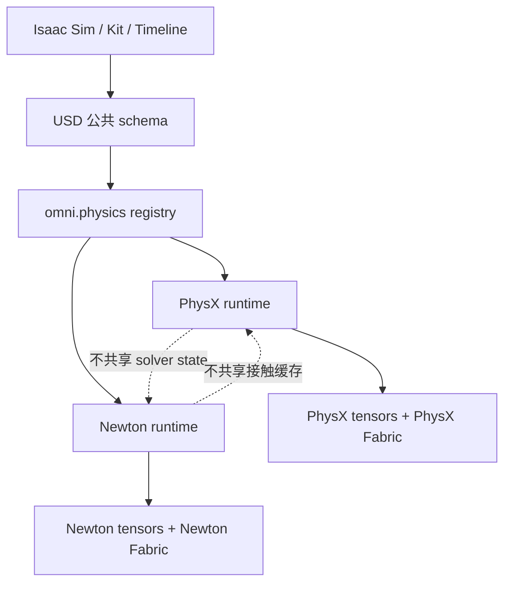

# PhysX 与 Newton 的关系和差异

最短答案是：**共享宿主和输入契约，竞争运行时实现**。它们不是串联关系，也不是 Newton 在 PhysX 上再跑一遍。

## 共享与不共享

| 维度 | PhysX | Newton |
|---|---|---|
| Isaac Sim 位置 | 默认 provider | 6.0 可选 provider |
| 运行时数据 | PhysX scene、GPU/CPU buffers | Newton Model/State、Warp arrays |
| 统一入口 | `omni.physics` + `omni.physx.tensors` | `omni.physics` + Newton tensor backend |
| 典型 solver 选择 | TGS / PGS | MuJoCo Warp、XPBD、VBD、Featherstone、SemiImplicit、Kamino 等 |
| 同步路径 | PhysX Fabric / USD stage update | Newton Fabric manager / USD schema |
| 生态成熟度 | Isaac Sim 工具链默认路径 | 新集成，资产和功能覆盖仍在扩展 |
| 主要风险 | GPU buffer、接触参数、TGS/PGS、同步开销 | parser 严格性、schema 映射、solver/actuator 语义差异 |

## 为什么轨迹不会完全一致

即使公共 USD 属性完全相同，下面因素也会改变轨迹：碰撞几何近似、contact margin/gap、摩擦和恢复系数的组合、关节 drive 的离散化、求解器迭代顺序、warm start、substep、浮点设备和状态写回时机。两后端的目标都是近似连续物理，不是保证同一套离散数值路径。

## 选型不是“快还是慢”二选一

| 任务 | 优先考察 |
|---|---|
| 既有 Isaac Sim 资产、传感器和调试工具 | 先用 PhysX，减少集成变量 |
| 大规模 GPU rollout，且需要 Newton 的 tensor/Fabric 路径 | 评估 Newton GG 和 CUDA graph |
| 依赖复杂 PhysX 专属功能或旧教程 | PhysX |
| 需要比较 MuJoCo 风格动力学、XPBD 或可微路径 | Newton 的对应 solver |
| 接触密集的 Sim2Real | 两者都做真实轨迹回归，不凭直觉决定 |

## 一个更实用的判断框架

先问四个问题：

1. 资产是否只使用公共 USD schema，还是依赖 PhysX 专属属性？
2. 控制器读取的是 tensor、USD 还是某个 PhysX 私有接口？
3. 训练吞吐瓶颈在 solver，还是在 Python/CPU/GPU 拷贝？
4. 真实机器人失败来自接触模型、驱动器延迟，还是视觉/渲染差距？

如果第 3 个问题的答案是数据搬运，换 solver 可能没有收益；如果第 4 个问题是执行器误差，换 PhysX/Newton 也不能替代系统辨识。

## “Newton 默认 MuJoCo solver”不矛盾

Newton 是引擎框架，MuJoCo Warp 是其中一个 solver backend。PhysX 是另一个独立引擎。比较时应把“PhysX”与“Newton + MuJoCo solver”放在后端层比较，再把“Newton + XPBD”作为 Newton 内部另一种配置比较，不能把引擎名和 solver 名混成同一层。

## 与已有 Newton 系列的连接

若要比较求解器的广义坐标、最大坐标、接触模型、可微性和多世界并行，请读[Newton 引擎深度解析](/系列/newton_engine_deep_dive/index)。本章只保留 Isaac Sim 6.0 适配层的差异，避免把两套文档重复写成一篇。
