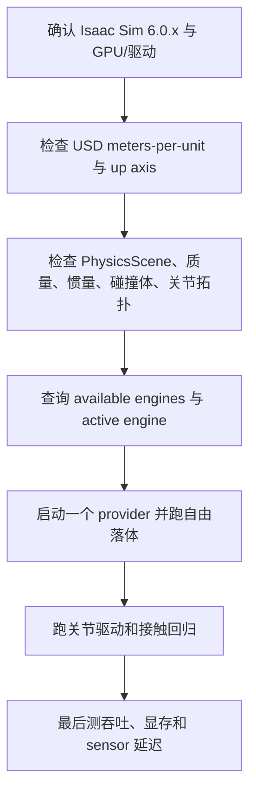

# 工程选型与验证：如何在 Isaac Sim 6.0 中切换并对齐后端

前七章建立了架构；本章把它变成可执行的工程流程。核心原则是：**先验证 provider 和输入，再比较轨迹，最后才比较吞吐**。

## 两种启动方式

默认应用使用 PhysX。Newton 应用 `isaacsim.exp.full.newton.kit` 显式启用 Newton 扩展，并关闭 `omni.physics.stageupdate`、`omni.physics.physx`、`omni.physx.fabric` 以及 PhysX sensor extensions。这个关闭列表很重要，它保证一个 Stage 只有一个物理 provider 在驱动。

运行时也可以通过 `SimulationManager.switch_physics_engine("newton")` 切换，但切换会停用旧 provider、触发 Stage reset，并让已有 runtime view 失效。不要在 episode 中途切换后继续复用旧 view。

## 切换前的检查清单

最小的 provider 查询应记录 `get_available_physics_engines()` 和 `get_active_physics_engine()`；日志里也应看到 Newton 注册成功或 PhysX simulation active。否则“两个后端结果不同”的实验可能实际上一直只跑了一个后端。

## 对齐实验的四个阶段

### 阶段一：无接触自由落体

只放一个已知质量和初始高度的刚体，关闭驱动和摩擦，比较重力方向、dt、位置和速度。这个实验发现尺度、坐标轴和时间频率错误，不会被接触 solver 掩盖。

### 阶段二：单关节 drive

用一个旋转关节测试位置目标、速度目标、刚度、阻尼和 armature。PhysX drive 和 Newton actuator/MuJoCo 参数可能有不同映射；必须从实际 tensor 状态反推响应，而不是只比较 USD 属性名。

### 阶段三：单接触与堆叠

测试方块落地、斜面摩擦、两个方块堆叠和高速度碰撞。记录接触点、法向、摩擦力、穿透/分离和 solver iteration。这里才开始调 PhysX 的 contact offset/CCD 或 Newton 的 margin/gap。

### 阶段四：完整机器人任务

最后再加入 articulation、传感器、控制策略和并行环境。把 success rate、末端轨迹、关节误差、接触事件和真实机器人日志一起保存，避免只用最终 reward 判断后端差异。

## 一个可复用的回归记录表

| 类别 | 必须固定的字段 |
|---|---|
| Stage | commit、USD hash、meters-per-unit、up axis |
| Scene | gravity、physics frequency、substeps、solver iterations |
| Body | mass、COM、inertia、collision approximation |
| Contact | friction、restitution、margin/gap 或 PhysX offset |
| Control | action rate、drive gains、latency、clamp |
| Runtime | active engine、device、tensor mode CC/GC/GG、CUDA graph |
| Output | state、contacts、sensor timestamp、step count、wall time |

## 常见失败及定位

| 症状 | 优先检查 |
|---|---|
| Newton 启动后仍显示 PhysX | Newton 扩展是否加载、default engine、active registry |
| 切换后机器人不动 | 旧 tensor view 是否失效、是否重新 setup/play |
| 画面和 tensor 不一致 | Fabric tracker、USD 写回开关、Hydra tick |
| Newton 初始化失败 | 零质量、零尺寸 shape、闭环 joint、body0/body1 方向、composition |
| RL 很慢 | GG/GC 拷贝、Python 回调、渲染是否仍开启、CUDA graph 是否捕获 |
| 两后端接触差异大 | 碰撞近似、margin/gap、摩擦、substep、solver iteration 和 drive 映射 |

## 最终建议

把 PhysX 当作 Isaac Sim 6.0 的稳态基线，把 Newton 当作可替换的 GPU/solver 实验与扩展路径。项目需要交付时，先用 PhysX 建立通过传感器、控制器和 Sim2Real 的基线；当 Newton 的特定 solver、tensor 路径或吞吐确实解决了瓶颈，再用上述四阶段实验把差异量化。这样“换引擎”才是可回滚的工程决策，而不是一次不可解释的参数大改。

## 官方源码索引

- [Isaac Sim 6.0 release repository](https://github.com/isaac-sim/IsaacSim)
- [SimulationManager API](https://github.com/isaac-sim/IsaacSim/tree/main/source/extensions/isaacsim.core.simulation_manager)
- [Newton physics extension](https://github.com/isaac-sim/IsaacSim/tree/main/source/extensions/isaacsim.physics.newton)
- [Newton tensor backend](https://github.com/isaac-sim/IsaacSim/tree/main/source/extensions/isaacsim.physics.newton.tensors)
- [Newton USD schemas](https://github.com/isaac-sim/IsaacSim/tree/main/source/extensions/omni.usd.schema.newton)
