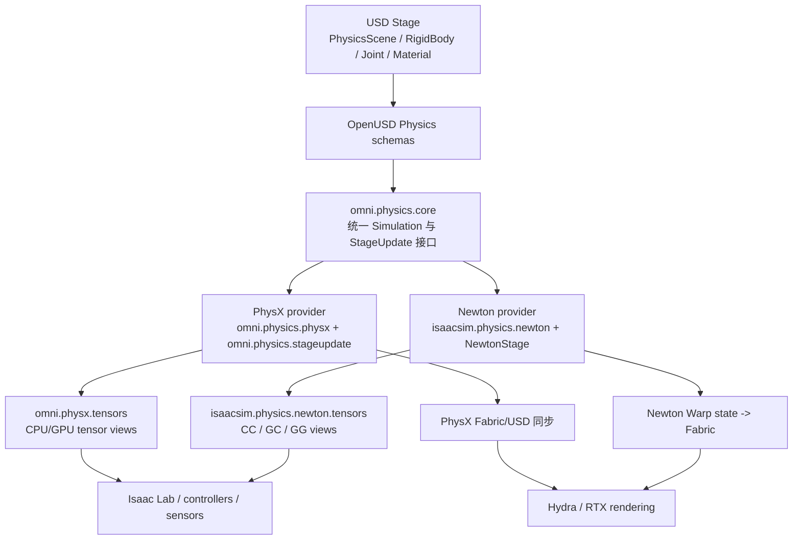

# Isaac Sim 6.0 物理系统深度解析：从 USD 到 PhysX 与 Newton

> 这不是把 PhysX 或 Newton 的算法手册再抄一遍，而是沿着 Isaac Sim 6.0 的真实源码，回答一个工程问题：一个 USD 场景从“写进 Stage”到“产生接触力、关节状态和传感器读数”，中间究竟经过哪些层？PhysX 和 Newton 又分别插在哪一层？

## 先给结论

Isaac Sim 6.0 的物理系统可以分成四层：**USD 场景与 schema、Omni Physics 统一接口、具体物理后端、数据与渲染同步层**。默认应用启用 PhysX；6.0 同时提供 `isaacsim.exp.full.newton.kit`，可把 Newton 注册为另一个后端。Newton 不是 PhysX 的“新版本”，也不是 Isaac Sim 的上层 API；它们是同一套 `omni.physics` 注册表里的两个互斥 simulation provider。

> 图中最重要的关系是“同一个接口、两个后端”：应用层通常通过 `SimulationManager` 和 `omni.physics.tensors` 工作，不应把 PhysX 私有调用误当成 Isaac Sim 的物理 API。

## 章节目录

| 章节 | 标题 | 本章回答的问题 |
|---|---|---|
| 01 | [全景图：Isaac Sim 的物理栈到底有几层](./01_全景图_IsaacSim物理栈到底有几层) | Kit、USD、Omni Physics、PhysX、Newton 的边界是什么 |
| 02 | [USD 物理数据模型：一个刚体如何被两个后端读懂](./02_USD物理数据模型_刚体关节材质如何被后端读懂) | PhysicsScene、刚体、碰撞体、关节、材质如何组成可运行模型 |
| 03 | [PhysX 后端：GPU Dynamics、TGS 与 Fabric 数据通路](./03_PhysX后端_GPUDynamics_TGS与Fabric数据通路) | Isaac Sim 默认的 PhysX 执行链路和调参入口是什么 |
| 04 | [Newton 后端：Warp、求解器与 USD 适配层](./04_Newton后端_Warp求解器与USD适配层) | Newton 在 Isaac Sim 6.0 中到底负责什么，和独立 Newton 项目是什么关系 |
| 05 | [一次 physics step 的生命周期：从 Timeline 到传感器](./05_一次physics_step的生命周期_从Timeline到传感器) | Play、初始化、pre-step、求解、post-step、同步的先后顺序是什么 |
| 06 | [Tensor 与 Fabric：仿真状态如何进入 RL 和渲染](./06_Tensor与Fabric_仿真状态如何进入RL和渲染) | 为什么同一个机器人状态有 USD、Fabric、tensor 三种视图 |
| 07 | [PhysX 与 Newton 的关系和差异](./07_PhysX与Newton的关系和差异) | 二者共享什么、不同什么，为什么不能只看速度选型 |
| 08 | [工程选型与验证：如何在 Isaac Sim 6.0 中切换并对齐后端](./08_工程选型与验证_如何切换并对齐后端) | 如何选择、切换、做回归测试，以及常见失败原因 |

## 版本与证据边界

本系列以 [IsaacSim GitHub 仓库](https://github.com/isaac-sim/IsaacSim) 的 6.0.1 源码快照为主。克隆仓库的 `VERSION` 为 `6.0.1-rc.7`，应用配置标注 `6.0.1`；因此文中把“6.0”理解为 6.0.x 这一代，而不是声称所有未来补丁行为都完全不变。Newton 的底层包版本、支持的 schema 和已知限制均以仓库 `deps/pip_newton.toml`、扩展文档和测试为准。

## 相关前置与延伸

- [IsaacLab 仿真对齐与参数调优](/工程实践/IsaacLab仿真对齐与参数调优) — 从相机、关节 PD 和 dt 角度做工程对齐。
- [Newton 引擎深度解析](/系列/newton_engine_deep_dive/index) — 继续深入 Newton 的数据模型、碰撞和求解器，而不是 Isaac Sim 的适配层。
- [物体解算器从零实现](/系列/newton_solver_from_zero/index) — 用最小实现建立接触、约束和时间推进直觉。
- [URDF 转 USD 完整工程流程详解](/工程实践/URDF转USD完整工程流程详解) — 资产导入如何影响物理 schema。
