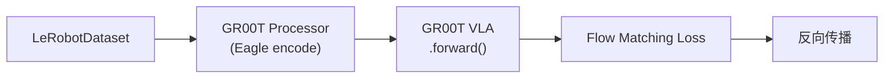
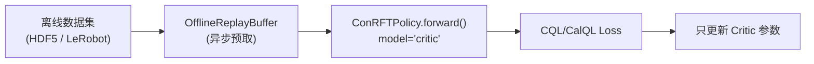
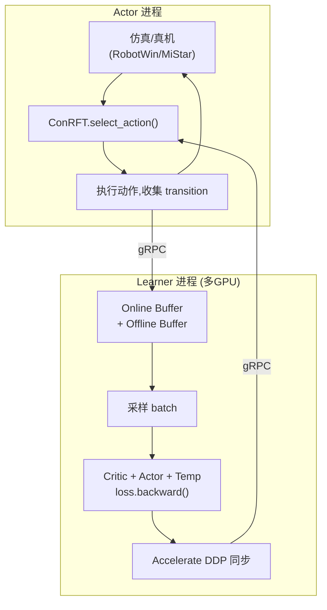
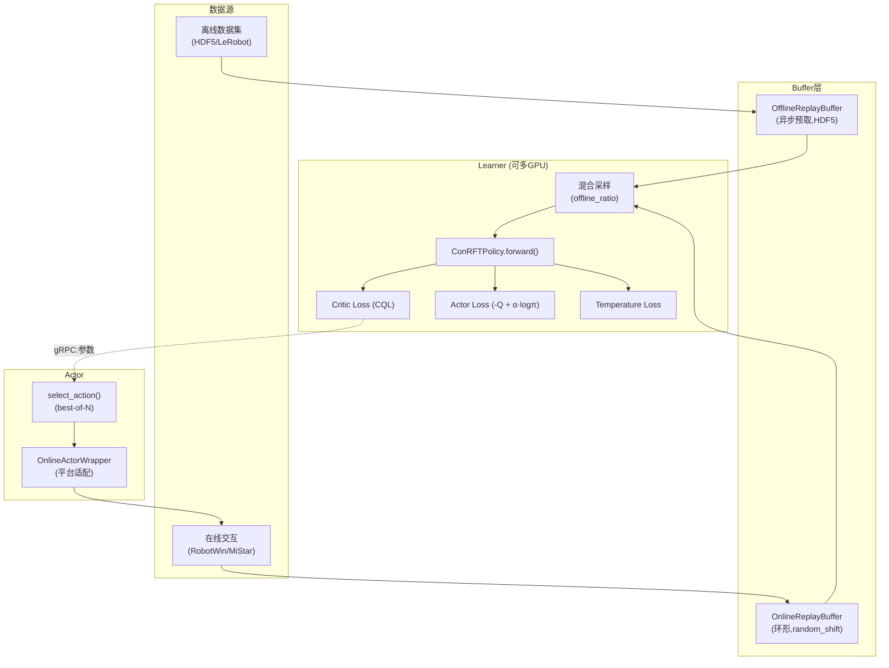

# 第一章：全局架构与模块职责

> 本系列拆解 `lerobot_vlarl`（分支 `dev_wq_temp_temp`）——一个将 NVIDIA GR00T VLA 模型与多种 RL 算法整合在 LeRobot 框架中的完整工程系统。

**知识链接**：
- [SAC Soft Actor-Critic 基础](/前置知识/000k_前置知识_SAC_Soft_Actor_Critic)
- [GR00T N1.7 深度解析](/系列/groot_n1d7_deep_dive/)
- [Flow Matching 基础](/前置知识/0013_前置知识_FlowMatching基础)

---

## 1. 项目定位：它到底是什么？

`lerobot_vlarl` 是一个**平台级工程系统**，在 LeRobot 框架之上集成了三套完整的训练管线：

| 训练范式 | 核心模型 | 典型用途 | 入口 |
|----------|----------|----------|------|
| **IL 微调** | GR00T N1.5 VLA | 用演示数据微调 VLA | `lerobot-train --policy.type=groot` |
| **离线 RL** | ConRFT（VLA + Critic） | 冻结 VLA，用离线数据训练 Critic | `python -m lerobot.rl.learner --train_offline=true` |
| **在线 RL** | SAC-QC / ConRFT | 真机/仿真在线交互增强策略 | Learner + Actor 分别启动 |

三套管线共享底层基础设施，但训练循环、网络架构、数据流各不相同。

---

## 2. 目录结构

```
src/lerobot/
├── policies/              # 🧠 策略模型
│   ├── groot/             #   GR00T VLA（IL 微调用）
│   │   ├── groot_n1.py                 # GR00TN15 模型（Flow Matching）
│   │   ├── groot_n1_dev.py             # GR00TN15 模型（Consistency Policy）
│   │   ├── action_head/               # FM / CP 动作头
│   │   ├── eagle2_hg_model/           # Eagle2 视觉-语言骨干
│   │   ├── modeling_groot.py           # GrootPolicy LeRobot 包装层
│   │   └── processor_groot.py          # 数据预处理管线
│   ├── conrft/            #   ConRFT（VLA + Critic 融合 RL）
│   │   ├── modeling_conrft.py          # ConRFTPolicy 顶层编排
│   │   ├── conrft_policy_base.py       # 抽象基类（定义 Actor/Critic 接口）
│   │   ├── conrft_policy_groot.py      # GROOT 具体实现（冻结 VLA + Critic head）
│   │   └── conrft_policy_groot_critic.py  # Critic 网络定义
│   ├── sac_qc/           #   SAC-QC（Q-Chunking SAC）
│   │   ├── modeling_sac_qc.py          # SACQCPolicy（支持 chunk-level Q）
│   │   └── configuration_sac_qc.py    # 配置
│   ├── sac/               #   原版 SAC（单步动作）
│   └── factory.py         #   策略工厂
│
├── rl/                    # 🔄 RL 训练系统
│   ├── learner.py         #   Learner 主循环（2964行，核心）
│   ├── actor.py           #   传统 Actor（真机 HILSerl）
│   ├── actor_online_training.py  #   统一在线训练 Actor（可插拔）
│   ├── online_actor_wrappers.py  #   平台适配层（RobotWin / MiStar / Fake）
│   ├── online_buffer.py   #   在线 Replay Buffer
│   ├── offline_buffer.py  #   离线 Buffer（HDF5 + LeRobotDataset）
│   ├── offline_buffer_hdf5.py  # HDF5 专用离线 buffer
│   ├── vla_rl_server.py   #   VLA 推理服务器（RobotWin 适配）
│   ├── vla_rl_service.py  #   VLA 推理服务（MiStar 适配）
│   ├── miuniverse_manipulator.py  # MiUniverse 环境封装
│   ├── gym_manipulator.py #   传统真机 Gym 封装
│   └── rollout_episode_recorder.py  # Episode 录制
│
├── transport/             # 📡 gRPC 通信层
├── processor/             # ⚙️ 数据处理管线
├── configs/               # 📋 配置系统
├── envs/                  # 🌍 环境配置
│   └── miuniverse/        #   MiUniverse 仿真环境
└── utils/                 # 🔧 工具
```

---

## 3. 三大训练范式详解

### 3.1 IL 微调（监督学习）



与之前的版本相同：单进程监督训练，用 Flow Matching loss 微调 VLA 的 action head。

### 3.2 离线 RL（ConRFT offline stage）

这是本分支的核心新增。目标是：**冻结 VLA backbone，用离线演示数据训练一个 Critic 网络**，让系统学会评估"什么动作好、什么动作差"。



关键特点：
- VLA backbone（Eagle + LLM + DiT）**完全冻结**
- 只训练外挂的 Critic head（~几M 参数）
- 使用 CQL（Conservative Q-Learning）防止 Q 值在未见过的动作上过估计
- 支持 Accelerate DDP 多 GPU 训练

### 3.3 在线 RL（Actor-Learner 分离）

在离线训练完 Critic 后，切换到在线模式——让 Actor 在真机/仿真中交互，Learner 持续更新策略：



关键特点：
- Actor 通过 `OnlineActorWrapper` 适配不同平台
- Learner 支持 `Accelerate` 多 GPU 并行
- 在线/离线 buffer 混合采样
- 支持 best-of-N 动作选择（Actor 采 N 条 chunk，用 Critic 选最好的）

---

## 4. 策略工厂与类型切换

`policies/factory.py` 通过配置的 `type` 字段决定实例化哪个策略：

| type 值 | 策略类 | 用途 |
|---------|--------|------|
| `"groot"` | `GrootPolicy` | IL 微调 |
| `"sac"` | `SACPolicy` | 传统单步 RL |
| `"sac_qc"` | `SACQCPolicy` | Q-Chunking SAC |
| `"conrft"` | `ConRFTPolicy` | VLA + Critic 融合 RL |

`ConRFTPolicy` 内部再根据 `base_vla_type` 决定用哪个 VLA 作为 backbone：

```python
if self.config.base_vla_type == 'groot-cp':
    from .conrft_policy_groot import ConRFTPolicyGroot
    policy_cls = ConRFTPolicyGroot
```

---

## 5. 配置系统

配置继承关系：

```
TrainPipelineConfig（IL 微调总配置）
    └── TrainRLServerPipelineConfig（RL 训练总配置）
         ├── policy: ConRFTConfig / SACQCConfig
         ├── env: HILSerlRobotEnvConfig / LiberoEnv
         ├── dataset: DatasetConfig（离线数据）
         ├── train_offline: bool（离线/在线模式切换）
         └── offline_steps / online_steps
```

**两阶段训练的配置模式**：

```json
{
  "train_offline": true,       // 第一阶段：离线训练 Critic
  "offline_steps": 50000,
  "policy": {
    "type": "conrft",
    "base_vla_type": "groot-cp",
    "bc_weight_offline": 1.0,  // 离线阶段 BC loss 权重
    "q_weight_offline": 0.1,   // 离线阶段 Q loss 权重
    "bc_weight_online": 0.1,   // 在线阶段 BC loss 权重
    "q_weight_online": 1.0     // 在线阶段 Q loss 权重
  }
}
```

---

## 6. 统一在线 Actor 接口

`actor_online_training.py` 引入了**可插拔的 Actor 架构**。核心抽象：

```python
@dataclass
class ActorObservation:
    images: dict[str, np.ndarray]
    state: np.ndarray
    task: str
    task_index: int | None = None

@dataclass
class StepResult:
    done: bool
    success: bool
    reward: float | None = None
    truncated: bool = False

class OnlineActorWrapper:
    """平台适配基类。子类实现 serve()，把平台协议转为标准接口"""
    def serve(self, core: OnlineActorCoreProtocol) -> None:
        raise NotImplementedError
```

不同平台的适配器：

| Wrapper | 平台 | 通信协议 |
|---------|------|---------|
| `RobotwinWrapper` | RobotWin 仿真 | ZeroMQ + TorchSerializer |
| `MiStarWrapper` | MiStar 实机 | 自定义 RPC |
| `FakeWrapper` | 单元测试 | 内存直连 |

这意味着训练逻辑代码**完全不需要修改**——只需要切换 `--wrapper robotwin` 或 `--wrapper mistar` 就能在不同平台上运行。

---

## 7. 全局数据流总览



---

## 8. 本章总结

| 要点 | 内容 |
|------|------|
| 项目本质 | LeRobot + GR00T VLA + 多 RL 策略的统一工程平台 |
| 三大路径 | IL 微调 / 离线 RL（CQL）/ 在线 RL（Actor-Learner） |
| 核心创新 | ConRFT（VLA+Critic 融合）、可插拔 Actor、Accelerate DDP |
| 配置驱动 | `type` 字段切换策略，`train_offline` 切换训练阶段 |
| 平台适配 | OnlineActorWrapper 抽象，一套代码多平台 |

---

**下一章预告**：[第 2 章](/系列/lerobot_vlarl_deep_dive/02_VLA模型层_Eagle视觉到FlowMatching动作生成) 深入 GR00T N1.5 的模型内部——Eagle2 如何编码图像、DiT 如何融合多模态信息、Flow Matching 如何训练和推理。
