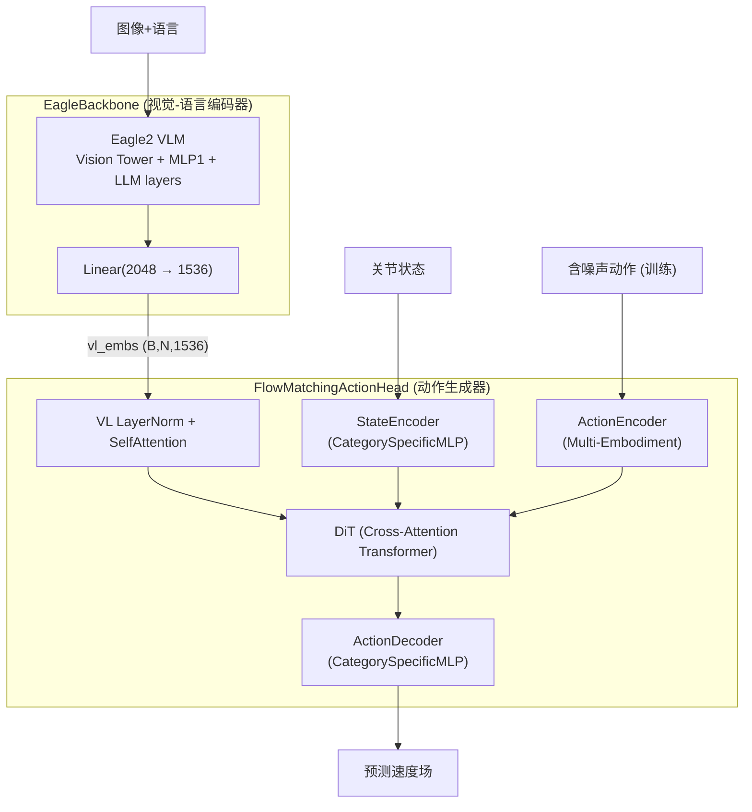
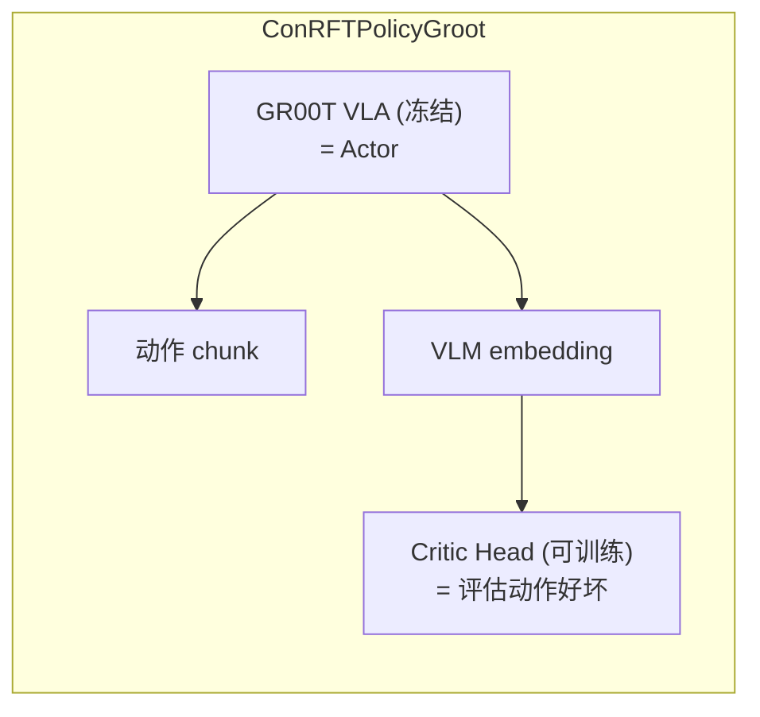

# 第二章：GR00T VLA 模型层——从 Eagle 视觉到 Flow Matching 动作生成

> 前情提要：[第 1 章](/系列/lerobot_vlarl_deep_dive/01_全局架构与模块职责) 介绍了项目的三大训练路径。本章深入 IL 微调路径和 ConRFT 的共同基础——GR00T N1.5 VLA 模型的内部结构。

**知识链接**：
- [Flow Matching 基础](/前置知识/0013_前置知识_FlowMatching基础)
- [GR00T N1.7 深度解析](/系列/groot_n1d7_deep_dive/)

---

## 1. 模型三层架构

GR00T N1.5 的实现分为三层，每层职责明确：



核心设计：Eagle 负责"理解世界"（图像+语言→token 序列），DiT 负责"规划动作"（基于世界理解+噪声动作生成速度场）。两者通过 Cross-Attention 连接。

---

## 2. EagleBackbone：视觉-语言编码器

### 2.1 结构与初始化

Eagle2 是一个多模态 VLM（Vision Tower + MLP 投影 + LLM）。在 GR00T 中只取 LLM 的**中间层隐状态**作为视觉-语言的联合表征，不做文本生成：

```python
# 关键操作：截断 LLM 层数——只保留前 select_layer 层
while len(self.eagle_model.language_model.model.layers) > select_layer:
    self.eagle_model.language_model.model.layers.pop(-1)

# 投影到 action head 的维度
self.eagle_linear = nn.Linear(2048, 1536)
```

### 2.2 可训练参数控制

| tune_llm | tune_visual | 训练参数 | 适用场景 |
|----------|-------------|---------|----------|
| False | False | 仅投影层 | 极低资源微调 / ConRFT 离线阶段 |
| False | True | Vision Tower + 投影层 | 适配新相机 |
| True | False | LLM + 投影层 | 适配新指令 |
| True | True | 全部 | 充分微调 |

冻结模块会被显式设为 `eval()` 模式，确保 Dropout/BatchNorm 行为正确。这点关键：HuggingFace 训练器每步调用 `model.train()`，不手动恢复会导致冻结模块的 Dropout 仍随机 mask。

### 2.3 前向传播输出

```python
def forward(self, vl_input):
    self.set_frozen_modules_to_eval_mode()
    eagle_embeds, eagle_mask = self.forward_eagle(vl_input)
    # eagle_embeds: (B, N_tokens, 1536)  N_tokens 可变（取决于图像数量和分辨率）
    # eagle_mask: (B, N_tokens) 标记有效 token
    return BatchFeature(data={"backbone_features": eagle_embeds, "backbone_attention_mask": eagle_mask})
```

---

## 3. CategorySpecificLinear：多具身体支持

不同机器人（Franka 7DoF、G1 人形 23DoF、Cobot 6DoF）的"关节角"语义完全不同。`CategorySpecificLinear` 为每种机器人维护独立的权重矩阵：

```python
class CategorySpecificLinear(nn.Module):
    def __init__(self, num_categories, input_dim, hidden_dim):
        # N 组独立权重
        self.W = nn.Parameter(0.02 * torch.randn(num_categories, input_dim, hidden_dim))
        self.b = nn.Parameter(torch.zeros(num_categories, hidden_dim))
    
    def forward(self, x, cat_ids):
        selected_w = self.W[cat_ids]  # (B, input_dim, hidden_dim) — 按 embodiment_id 索引
        selected_b = self.b[cat_ids]
        return torch.bmm(x, selected_w) + selected_b.unsqueeze(1)
```

`torch.bmm` 对 batch 中每个样本用其对应的权重做矩阵乘。Franka 的关节通过 Franka 的权重映射，Cobot 的关节通过 Cobot 的权重映射。

---

## 4. FlowMatchingActionHead：训练前向传播

训练时，Flow Matching 目标是学习从噪声到动作的**速度场**。步骤：

### Step 1：采样时间步 t（Beta 分布）

```python
t = self.sample_time(batch_size, device, dtype)
# Beta(1.5, 1.0) 分布 → 偏向大 t（更多训练"接近真值"的去噪步骤，加速收敛）
```

### Step 2：线性插值构造含噪声动作

```python
noise = torch.randn(actions.shape, ...)
noisy_trajectory = (1 - t) * noise + t * actions  # t=0 纯噪声，t=1 纯动作
velocity = actions - noise                         # 真实速度场方向
```

### Step 3：编码并送入 DiT

```python
state_features = self.state_encoder(state, embodiment_id)
action_features = self.action_encoder(noisy_trajectory, t_discretized, embodiment_id)

# 拼接序列：[state | future_tokens | action_features]
sa_embs = torch.cat([state_features, future_tokens, action_features], dim=1)

# DiT: self-attention(内部交互) + cross-attention(查阅 vl_embs)
model_output = self.model(
    hidden_states=sa_embs,
    encoder_hidden_states=vl_embs,    # Eagle 输出
    encoder_attention_mask=vl_attn_mask,
    timestep=t_discretized,           # 给 AdaLN 用
)
```

### Step 4：计算 loss

```python
pred = self.action_decoder(model_output, embodiment_id)
pred_actions = pred[:, -actions.shape[1]:]  # 取动作序列部分

loss = F.mse_loss(pred_actions, velocity, reduction="none") * action_mask
loss = loss.sum() / action_mask.sum()  # mask 掉填充维度
```

---

## 5. 推理前向传播：欧拉积分去噪

推理时从纯噪声开始，通过学到的速度场做 ODE 积分：

```python
@torch.no_grad()
def get_action(self, backbone_output, action_input):
    actions = torch.randn(size=(B, action_horizon, action_dim), ...)  # 纯噪声起点
    num_steps = self.num_inference_timesteps  # 如 10 步
    dt = 1.0 / num_steps
    
    for t in range(num_steps):
        t_cont = t / float(num_steps)
        # 编码当前噪声动作 → DiT → 预测速度
        pred_velocity = self.forward_one_step(actions, t_cont, ...)
        # 欧拉积分
        actions = actions + dt * pred_velocity
    
    return actions  # 去噪后的动作轨迹
```

推理步数是精度-速度的权衡：10 步通常足够。

---

## 6. Consistency Policy 变体（groot_n1_dev.py）

本分支还支持 **Consistency Policy** 动作头——一种更快的推理方式。与 Flow Matching 的对比：

| 维度 | Flow Matching | Consistency Policy |
|------|--------------|-------------------|
| 训练目标 | 预测速度场 | 一致性约束（跳步去噪） |
| 推理步数 | 10+ 步 ODE | 1-2 步直接映射 |
| 推理延迟 | ~100ms | ~10ms |
| 精度 | 更高 | 略低但足够 |

ConRFT 使用 `groot_n1_dev.py`（Consistency Policy 版本），因为在线 RL 需要快速推理。

---

## 7. GrootPolicy 包装层

`modeling_groot.py` 适配 LeRobot 接口：

- **训练 forward**：提取 batch 中 GR00T 需要的字段 → `model.forward()` → 返回 loss
- **推理 predict_action_chunk**：`model.get_action()` → 返回动作 chunk
- **select_action**：维护 `deque` 实现 action chunking（生成整个 chunk，每次弹出一个 step）
- **bf16 autocast**：`torch.autocast(dtype=torch.bfloat16)` 减半显存占用

---

## 8. 在 ConRFT 中的角色

在 ConRFT 体系中，GR00T VLA 的角色发生了变化：



- VLA 作为**冻结的 Actor**：直接输出动作（不更新参数）
- VLA 的 backbone embedding 同时作为 Critic 的**输入特征**
- Critic 学习评估"在当前视觉-语言上下文下，这个动作 chunk 有多好"

这个设计让 3B 参数的 VLA 不需要反向传播（节省 90% 显存），只有几 M 参数的 Critic head 需要训练。

---

## 9. 本章总结

| 层级 | 组件 | 职责 | 参数量 |
|------|------|------|--------|
| 视觉-语言层 | EagleBackbone | 图像+语言 → token 序列 | ~2.5B（通常冻结） |
| 动作生成层 | FlowMatchingActionHead | 速度场预测 + ODE 积分 | ~50M |
| 快速推理变体 | ConsistencyPolicyHead | 1-2 步直接去噪 | ~50M |
| 包装层 | GrootPolicy | LeRobot 接口适配 | 0 |

关键设计选择：
- **CategorySpecific 层**：多机器人一个模型
- **截断 LLM**：只用中间特征不用生成
- **Beta 分布采样 t**：加速收敛
- **Consistency Policy 变体**：满足在线 RL 的低延迟需求

---

**下一章预告**：[第 3 章](/系列/lerobot_vlarl_deep_dive/03_ConRFT与SACQC_VLA加Critic的RL策略融合) 深入 ConRFT 和 SAC-QC——如何在冻结的 VLA 上外挂 Critic、如何用 CQL 做离线训练、离线→在线阶段如何平滑切换。
