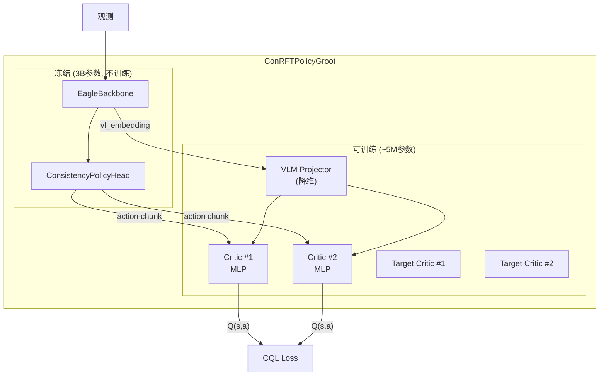

# 第三章：ConRFT 与 SAC-QC——VLA + Critic 的 RL 策略融合

> 前情提要：[第 2 章](/系列/lerobot_vlarl_deep_dive/02_VLA模型层_Eagle视觉到FlowMatching动作生成) 拆解了 GR00T VLA 的模型结构。本章深入 RL 路径的两个核心策略——ConRFT 和 SAC-QC。

**知识链接**：
- [SAC Soft Actor-Critic 基础](/前置知识/000k_前置知识_SAC_Soft_Actor_Critic)
- [CQL / CalQL 离线强化学习](/前置知识/000m_前置知识_CQL_CalQL_离线强化学习)
- [Q 函数与 Value 函数](/前置知识/000b_前置知识_Q函数与Value函数)

---

## 1. ConRFT 的核心思想

ConRFT（Consistency RL Fine-Tuning）的设计哲学是：

> **不动 VLA 的 Actor 参数，只训练一个轻量的 Critic 来"评估"VLA 输出的动作好不好。**

为什么这样做？因为 GR00T VLA 有 3B 参数——如果要在 RL 中反向传播整个 VLA，显存和计算完全不可接受。ConRFT 的方案是：

1. **冻结 VLA**：整个 Eagle + LLM + Action Head 不动
2. **外挂 Critic**：用 VLA backbone 的 embedding 作为输入，训练独立的 Q 网络
3. **Best-of-N 推理**：VLA 生成 N 条动作轨迹，用 Critic 选最好的那条执行



---

## 2. ConRFTPolicy 的类层级

```
ConRFTPolicy (顶层编排)
    ├── config: ConRFTConfig (全局配置)
    ├── policy: ConRFTPolicyGroot (VLA + Critic 具体实现)
    │       ├── actor: GrootPolicyWrapper (冻结的 VLA)
    │       │       ├── vlm_encoder → EagleBackbone
    │       │       └── action_head → ConsistencyPolicyHead
    │       ├── critic_ensemble: CriticEnsemble (多 Critic)
    │       │       └── [CriticHead, CriticHead, ...]
    │       └── critic_ensemble_target: CriticEnsemble (EMA 目标)
    ├── log_alpha: nn.Parameter (温度参数)
    └── return_scale: buffer (分布式 Q 的缩放因子)
```

---

## 3. Critic 网络设计

### 3.1 输入特征

Critic 的输入由两部分拼接而成：

| 输入 | 来源 | 维度 | 说明 |
|------|------|------|------|
| VLM embedding | Eagle backbone 输出经 projector 降维 | `(B, proj_dim)` | 编码了视觉-语言上下文 |
| Action chunk | VLA 输出或 buffer 中的动作 | `(B, chunk_size × action_dim)` | 展平的动作轨迹 |

VLM projector 的作用是把高维的 backbone 特征（1536 × N_tokens）压缩到一个固定维度的向量（如 256 维），供 Critic 使用。

### 3.2 CriticEnsemble

```python
class CriticEnsemble(nn.Module):
    def __init__(self, prototype: nn.Module, num_critics: int = 2):
        self.critics = nn.ModuleList([copy.deepcopy(prototype) for _ in range(num_critics)])
    
    def forward(self, batch, *args, return_all=False, **kwargs):
        q_values = [critic(batch, *args, **kwargs) for critic in self.critics]
        if return_all:
            return torch.stack(q_values)
        return torch.stack(q_values).min(dim=0)[0]  # Clipped Double-Q
```

默认 2 个 Critic（`num_critics=2`），取最小值防止 Q 值过估计。

### 3.3 标量 Q vs 分布式 Q

配置参数 `critic_loss_type` 支持两种 Critic 输出模式：

| 模式 | `critic_loss_type` | 输出 | 优势 |
|------|-------------------|------|------|
| 标量 Q | `"scalar"` | 单个 Q 值 | 简单，训练快 |
| 分布式 Q | `"distributional"` | `num_atoms=101` 个 logits | 更精确，对稀疏奖励更稳定 |

分布式 Q（C51 / QR-DQN 系列思想）把 Q 值的分布离散化为 101 个 atom，每个 atom 代表一个可能的 return 值。训练时用交叉熵 loss 拟合分布，比标量 MSE 更稳定。

---

## 4. 训练阶段：离线 → 在线

ConRFT 的训练分为两个明确的阶段，通过 `set_training_stage()` 切换：

### 4.1 离线阶段（`"offline"`）

目标：用离线数据训练 Critic，让它学会"评估动作质量"。

**Loss 组成**：

$$
L_{\text{offline}} = w_{\text{bc}} \cdot L_{\text{BC}} + w_{\text{q}} \cdot L_{\text{CQL}}
$$

| Loss 项 | 权重(默认) | 作用 |
|---------|-----------|------|
| $L_{\text{BC}}$ | `bc_weight_offline=1.0` | 行为克隆——让 Actor 输出和数据中的动作一致 |
| $L_{\text{CQL}}$ | `q_weight_offline=0.1` | Conservative Q-Learning——限制 Q 值在未见动作上的过估计 |

CQL 的核心思想：在标准 TD loss 基础上，额外惩罚那些"策略偏好但数据中没见过"的动作的 Q 值。

### 4.2 在线阶段（`"online"`）

目标：用在线交互数据微调 Critic 和温度参数，让策略在真实环境中改善。

**Loss 组成**：

$$
L_{\text{online}} = w_{\text{bc}} \cdot L_{\text{BC}} + w_{\text{q}} \cdot L_{\text{TD}}
$$

| Loss 项 | 权重(默认) | 作用 |
|---------|-----------|------|
| $L_{\text{BC}}$ | `bc_weight_online=0.1` | 正则化——防止 Critic 训练偏离原始 VLA 行为太远 |
| $L_{\text{TD}}$ | `q_weight_online=1.0` | 标准 TD error——用真实奖励更新 Q 值 |

注意权重的反转：离线阶段 BC 权重大（保守学习），在线阶段 Q 权重大（积极改善）。

### 4.3 阶段切换的代码逻辑

```python
def set_training_stage(self, stage: str):
    if stage == "offline":
        self.bc_weight = self.config.bc_weight_offline
        self.q_weight = self.config.q_weight_offline
    elif stage == "online":
        self.bc_weight = self.config.bc_weight_online
        self.q_weight = self.config.q_weight_online
```

Learner 在 `add_actor_information_and_train` 中根据 `cfg.train_offline` 自动切换：

```python
if not cfg.train_offline:
    policy.set_training_stage("online")
else:
    policy.set_training_stage("offline")
```

---

## 5. Best-of-N 动作选择

ConRFT 的推理策略不是简单地执行 VLA 输出的动作，而是：

1. VLA 生成 N 条动作 chunk（通过不同的初始噪声）
2. 用 Critic 对每条 chunk 评分
3. 选得分最高的那条执行

```python
@torch.no_grad()
def select_action(self, batch, num_repeat=1, q_select_type="none", ...):
    if num_repeat > 1 and q_select_type != "none":
        # 1. 重复 batch N 次
        repeated_batch = repeat_batch(batch, num_repeat)
        # 2. VLA 生成 N 条不同的 action chunk（随机性来自 Consistency Policy 的噪声）
        actions = self.actor.predict_action_chunk(repeated_batch)
        # 3. Critic 评分
        q_values = self.critic_ensemble(repeated_batch, actions)  # (B*N,)
        # 4. 按原始 batch 分组，取 Q 值最高的
        q_values = q_values.view(B, num_repeat)
        best_idx = q_values.argmax(dim=1)
        actions = select_by_index(actions, best_idx)
    else:
        actions = self.actor.predict_action_chunk(batch)
    return actions
```

`q_select_type` 控制选择策略：
- `"none"`：直接执行第一条（不用 Critic）
- `"min"`：取 ensemble 中最小 Q 值作为评分（保守）
- `"mean"`：取 ensemble 平均（中性）
- `"opt"`：取最大 Q 值（乐观）

---

## 6. SAC-QC：Q-Chunking SAC

SAC-QC 是另一个 RL 策略，适合**不使用预训练 VLA**的场景。它扩展了标准 SAC，支持**chunk-level 的 Q 函数评估**：

### 6.1 与标准 SAC 的区别

| 维度 | 标准 SAC | SAC-QC |
|------|---------|--------|
| 动作输出 | 单步 `(action_dim,)` | 多步 `(chunk_size, action_dim)` |
| Q 函数输入 | 单步 (s, a) | 整个 chunk (s, a₁:ₜ) |
| 图像编码器 | 轻量 CNN | 可用预训练 ResNet |
| 离散动作 | 可选 | 可选 |

### 6.2 SACQCPolicy 结构

```
SACQCPolicy
    ├── encoder: SACQCObservationEncoder (共享)
    │       ├── image_encoder (PretrainedImageEncoder / DefaultCNN)
    │       ├── spatial_embeddings (可学习空间位置)
    │       └── state_encoder (Linear → LayerNorm → Tanh)
    ├── actor: Policy (MLP → TanhGaussian)
    ├── critic_ensemble: CriticEnsemble (Double-Q)
    ├── critic_target: CriticEnsemble (EMA)
    └── log_alpha: nn.Parameter (温度)
```

SAC-QC 的 forward 和标准 SAC 类似，但 Critic 接受的是展平的 action chunk 而非单步动作。

---

## 7. forward() 的统一接口

无论 ConRFT 还是 SAC-QC，Learner 通过统一的 `policy.forward(batch, model=...)` 接口调用不同的 loss 计算：

```python
# Learner 训练循环中
critic_output = policy.forward(batch, model="critic")      # CQL/TD loss
actor_output = policy.forward(batch, model="actor")        # -Q + α·logπ
temp_output = policy.forward(batch, model="temperature")   # 温度自适应
```

ConRFT 的 forward 内部路由逻辑：

```python
def forward(self, batch, model="critic"):
    if model == "critic":
        return self.compute_critic_loss(batch)   # CQL 或 TD
    elif model == "actor":
        return self.compute_actor_loss(batch)    # BC + Q-guided
    elif model == "temperature":
        return self.compute_temperature_loss(batch)
```

---

## 8. 目标网络与软更新

两个策略都使用 EMA（指数移动平均）维护目标 Critic：

```python
def update_target_networks(self):
    τ = self.config.soft_target_update_rate  # 默认 0.005
    for target_p, p in zip(self.critic_ensemble_target.parameters(),
                           self.critic_ensemble.parameters()):
        target_p.data.copy_(τ * p.data + (1 - τ) * target_p.data)
```

每步只移动 0.5%，提供稳定的训练目标。

---

## 9. Monte Carlo Returns（可选）

ConRFT 支持使用 **Monte Carlo Returns** 替代 TD target：

```python
if self.config.use_mc_returns:
    # 用 episode 完整回报作为 Q target（不用 bootstrap）
    mc_return = batch["complementary_info"]["mc_return"]
    td_target = mc_return * reward_scale + reward_bias
```

MC Returns 在稀疏奖励（只有 episode 结束时 reward=1）场景下特别有用——TD bootstrap 在中间步骤几乎没有信号，而 MC 直接把最终结果传播到所有步骤。

---

## 10. ConRFT vs SAC-QC 的选择

| 场景 | 推荐策略 | 原因 |
|------|---------|------|
| 有预训练 VLA + 少量在线数据 | **ConRFT** | 冻结 VLA 省显存，Critic 轻量快训练 |
| 无预训练 VLA，纯 RL 学习 | **SAC-QC** | 从零训练 Actor + Critic |
| 需要极低推理延迟 | **SAC-QC** | MLP Actor 比 VLA 快 50x |
| 多任务/多指令泛化 | **ConRFT** | 利用 VLA 的语言理解能力 |
| 数据极其稀缺（<100 demo） | **ConRFT** | VLA 的预训练知识提供强先验 |

---

## 11. 本章总结

| 策略 | 核心设计 | Actor | Critic | 训练阶段 |
|------|---------|-------|--------|---------|
| ConRFT | VLA 冻结 + Critic 外挂 | GR00T VLA (3B, 冻结) | MLP (~5M, 可训练) | offline CQL → online TD |
| SAC-QC | 标准 Actor-Critic | MLP (~1M) | MLP (~1M) | 直接在线 |

---

**下一章预告**：[第 4 章](/系列/lerobot_vlarl_deep_dive/04_分布式ActorLearner架构与训练循环) 将深入分布式训练系统——Learner 如何用 Accelerate 做多 GPU 训练、Actor 如何通过可插拔 Wrapper 适配不同平台、异步预处理管线如何消除 IO 瓶颈。
