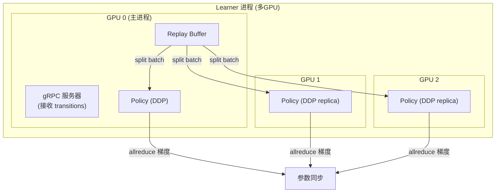

# 第四章：分布式 Actor-Learner 架构与训练循环

> 前情提要：[第 3 章](/系列/lerobot_vlarl_deep_dive/03_ConRFT与SACQC_VLA加Critic的RL策略融合) 拆解了 ConRFT 和 SAC-QC 的策略设计。本章解释这些策略是如何在分布式系统中训练的。

**知识链接**：
- [第 1 章：全局架构](/系列/lerobot_vlarl_deep_dive/01_全局架构与模块职责)

---

## 1. 为什么需要分离？

| 约束 | Actor 侧 | Learner 侧 |
|------|----------|------------|
| 延迟要求 | 严格（10Hz 控制 = 100ms/step） | 宽松 |
| 计算需求 | 轻量推理（VLA forward ~50ms） | 重 GPU（多次 backward） |
| 硬件 | 机器人本地 / 仿真服务器 | 远程 GPU 集群 |
| 运行模式 | 实时、连续 | 异步、批量 |

Actor-Learner 分离让两侧独立运行，通过 gRPC 异步通信。

---

## 2. gRPC 通信协议

```protobuf
service LearnerService {
    rpc StreamParameters(Empty) returns (stream Parameters);       // Learner → Actor
    rpc SendTransitions(stream Transition) returns (Empty);        // Actor → Learner
    rpc SendInteractions(stream InteractionMessage) returns (Empty); // Actor → Learner
    rpc Ready(Empty) returns (Empty);                              // 心跳
}
```

大消息（包含图像的 transition）会自动分块传输（突破 gRPC 4MB 限制），接收端拼装还原。

本分支增加了**双向通信 retry 机制**：如果网络抖动导致连接断开，两端会自动重连而不是崩溃。

---

## 3. Learner 端：Accelerate DDP 多 GPU

本分支的一个重要升级是 Learner 支持 `Accelerate` 做数据并行训练：



关键实现细节：

```python
# 启动时
accelerator = Accelerator()
policy = accelerator.prepare(policy)

# 训练时：只在主进程接收 transitions
if accelerator.is_main_process:
    process_transitions(transition_queue, replay_buffer, ...)

# 采样 batch 后广播到所有 GPU
batch = ddp_split_batch(batch, accelerator, batch_size)

# 梯度自动 allreduce
loss.backward()  # Accelerate 自动处理 DDP 同步
optimizer.step()
```

`ddp_split_batch` 把一个大 batch 切分给各 GPU，每个 GPU 只处理自己的子集，梯度通过 allreduce 聚合。

---

## 4. Actor 端：可插拔 OnlineActorWrapper

### 4.1 统一抽象

`actor_online_training.py` 定义了与平台无关的 Actor 核心逻辑，所有平台特定的 IO 通过 `OnlineActorWrapper` 抽象：

```python
class OnlineActorWrapper:
    """平台适配基类"""
    name = "base"
    def serve(self, core: OnlineActorCoreProtocol) -> None:
        """启动平台通信，循环：收观测 → 调 core → 发动作"""
        raise NotImplementedError

class OnlineActorCoreProtocol(Protocol):
    """Actor 核心逻辑接口"""
    def select_action_chunk(self, observation: ActorObservation) -> np.ndarray: ...
    def reset_episode(self) -> None: ...
    def observe_action_chunk(self, *, observation, action_chunk, next_observation, result) -> None: ...
    def finish_episode(self, result, episode_info) -> None: ...
```

### 4.2 具体平台适配

| Wrapper | 通信方式 | 适配对象 |
|---------|---------|---------|
| `RobotwinWrapper` | ZeroMQ + TorchSerializer | RobotWin 仿真器 |
| `MiStarWrapper` | 自定义 RPC | MiStar 实机控制 |
| `CobotWrapper` | HTTP callback | Cobot 256 实机 |
| `FakeWrapper` | 内存直连 | 单元测试 / 冒烟测试 |

切换平台只需改一个参数：

```bash
python -m lerobot.rl.actor_online_training --wrapper robotwin --config_path ...
python -m lerobot.rl.actor_online_training --wrapper mistar --config_path ...
```

### 4.3 Actor 核心循环

```python
# actor_online_training.py 的核心逻辑（简化）
class OnlineActorCore:
    def select_action_chunk(self, observation: ActorObservation) -> np.ndarray:
        # 1. 把 observation 转成策略输入格式
        batch = self.preprocess(observation)
        
        # 2. 策略推理（best-of-N）
        with torch.no_grad():
            action = self.policy.select_action(
                batch, num_repeat=self.args.num_repeat,
                q_select_type=self.args.q_select_type,
            )
        
        # 3. 可选：时间集成（temporal ensemble）
        if self.time_ensemble_coeff is not None:
            action = self.temporal_ensemble(action)
        
        return action.cpu().numpy()
    
    def observe_action_chunk(self, *, observation, action_chunk, next_observation, result):
        # 4. 构造 Transition 并发送给 Learner
        transition = Transition(
            state=observation, action=action_chunk,
            reward=result.reward, next_state=next_observation,
            done=result.done, ...
        )
        self.send_transition_to_learner(transition)
```

### 4.4 时间集成（Temporal Ensemble）

可选的推理增强技术：对连续多步的动作预测做指数移动平均，平滑执行轨迹：

```python
def temporal_ensemble(self, new_action):
    α = self.time_ensemble_coeff  # 如 0.3
    self.running_action = α * new_action + (1 - α) * self.running_action
    return self.running_action
```

---

## 5. Learner 训练循环详解

`add_actor_information_and_train` 是整个系统的心脏（2964 行文件中的核心函数）。其结构：

### 5.1 初始化阶段

```python
# 创建策略
policy = make_policy(cfg.policy, env_cfg=cfg.env)
policy.train()
policy.set_training_stage("online" if not cfg.train_offline else "offline")

# 创建优化器（多组件独立学习率）
optimizers, lr_scheduler = make_optimizers_and_scheduler(cfg, policy)

# 初始化 Buffer
offline_replay_buffer = initialize_offline_replay_buffer(cfg, ...)  # HDF5 离线数据
replay_buffer = initialize_replay_buffer(cfg, ...)                   # 在线环形 buffer
```

### 5.2 核心训练循环

```python
while optimization_step < training_steps:
    # 1. 接收在线 transitions（非离线模式）
    if not cfg.train_offline:
        process_transitions(transition_queue, replay_buffer, ...)
    
    # 2. 采样 batch（在线 + 离线混合）
    batch = sample_training_forward_batch()
    
    # 3. 预处理（异步管线）
    batch = get_preprocessed_pipeline_batch()
    
    # 4. Critic 更新（可能多次 UTD）
    for _ in range(utd_ratio):
        critic_output = policy.forward(batch, model="critic")
        critic_loss = critic_output["loss_critic"]
        critic_loss.backward()
        optimizer["critic"].step()
        policy.update_target_networks()
    
    # 5. Actor 更新（按频率）
    if optimization_step % policy_update_freq == 0:
        actor_output = policy.forward(batch, model="actor")
        actor_loss = actor_output["loss_actor"]
        actor_loss.backward()
        optimizer["actor"].step()
    
    # 6. Temperature 更新
    temp_output = policy.forward(batch, model="temperature")
    ...
    
    # 7. 推送参数给 Actor
    if time_since_push > push_frequency:
        push_actor_policy_to_queue(parameters_queue, policy)
    
    # 8. Checkpoint
    if optimization_step % save_freq == 0:
        save_training_checkpoint(...)
    
    optimization_step += 1
```

### 5.3 异步预处理管线

本分支的一个重要性能优化：**后台线程预取+预处理 batch**，训练主循环永远不等 IO。

```python
def preprocess_pipeline_worker():
    """后台线程：持续从 buffer 采样并预处理"""
    while not shutdown_event.is_set():
        raw_batch = sample_from_buffers()
        processed_batch = policy.preprocess_batch(raw_batch)  # 图像编码等重计算
        batch_queue.put(processed_batch)

# 主循环中
batch = batch_queue.get()  # 零等待——后台已经准备好了
```

这对 ConRFT 特别重要：因为 `preprocess_batch` 需要对图像做 Eagle VLM 编码（~20ms），如果同步执行会严重拖慢训练循环。

---

## 6. Replay Buffer 设计

### 6.1 Online Buffer（环形缓冲区）

```python
class ReplayBuffer:
    # 固定容量环形 buffer
    # 支持 random_shift 图像增强
    # 支持异步预取迭代器
    def get_iterator(self, batch_size, async_prefetch=True, queue_size=2):
        ...
```

### 6.2 Offline Buffer（HDF5 / LeRobotDataset）

本分支大幅增强了离线 buffer：

```python
class OfflineReplayBuffer:
    # 从 HDF5 文件高效加载
    # 支持多 worker 并行预处理
    # 支持 epoch-based 采样（保证每条数据都被见到）
    # 支持 MC Returns 预计算
    # 支持 Accelerate DDP 分片
```

关键特性：
- **MC Returns 预计算**：加载数据时就算好每条 transition 的 Monte Carlo return
- **Task 感知采样**：支持按 task_index 平衡采样（多任务场景）
- **线程池预处理**：多个 worker 并行做图像 augmentation

### 6.3 混合采样策略

```python
def sample_training_forward_batch():
    if offline_replay_buffer is not None and replay_buffer is not None:
        # 在线/离线各采一半
        online_batch = next(online_iterator)
        offline_batch = next(offline_iterator)
        return concatenate_batch_transitions(online_batch, offline_batch)
    elif cfg.train_offline:
        return next(offline_iterator)
    else:
        return next(online_iterator)
```

---

## 7. 参数同步机制

### 7.1 Learner → Actor（定时推送）

```python
# 每 50 秒推送一次（本分支增大了间隔，因为 VLA 参数大）
if time.time() - last_time_policy_pushed > policy_parameters_push_frequency:
    push_actor_policy_to_queue(parameters_queue, policy)
```

注意：ConRFT 中 Actor 侧的 VLA 是冻结的——推送的只是 Critic 参数（用于 best-of-N 选择）。

### 7.2 Actor → Learner（流式 transitions）

Actor 把收集到的 transition 打包后通过 gRPC 流式发送。本分支增加了 retry 机制：

```python
# 发送失败自动重试
for attempt in range(max_retries):
    try:
        send_transitions(transitions)
        break
    except grpc.RpcError:
        time.sleep(backoff * attempt)
        reconnect()
```

---

## 8. Episode 录制

`RolloutEpisodeRecorder` 可以在 Actor 端录制完整的 episode 数据，用于后续离线训练或调试：

```python
recorder = RolloutEpisodeRecorder(
    root=rollout_dataset_root,
    repo_id=rollout_repo_id,
    fps=30,
    record_success_rollouts=True,
    record_failure_rollouts=True,
)
# 每个 episode 结束时
recorder.save_episode(observations, actions, rewards, success=result.success)
```

录制的数据直接是 LeRobotDataset 格式，可以无缝作为下一轮离线训练的输入。

---

## 9. 优雅关闭与异常处理

```python
class ProcessSignalHandler:
    # 第一次 Ctrl-C：设置 shutdown_event
    # 第二次 Ctrl-C：强制退出
    def _signal_handler(self, signum, frame):
        self.shutdown_event.set()
        if self._counter > 1:
            sys.exit(1)
```

所有组件（训练循环、gRPC 服务器、Actor 循环、预处理线程）都检查 `shutdown_event`，确保数据一致性和 checkpoint 完整性。

---

## 10. 本章总结

| 要点 | 内容 |
|------|------|
| 通信方式 | gRPC 流式 + 自动 retry |
| 多 GPU | Accelerate DDP，batch 自动切分 |
| Actor 适配 | OnlineActorWrapper 可插拔（RobotWin / MiStar / Fake） |
| 异步预处理 | 后台线程预取 + Eagle 编码，训练零等待 |
| Buffer 混合 | Online + Offline 同时采样 |
| 参数推送 | 定时（50s），只推 Critic（VLA 冻结不变） |

---

**下一章预告**：[第 5 章](/系列/lerobot_vlarl_deep_dive/05_数据处理管线与环境适配层) 将深入数据处理管线和环境适配——从 HDF5 数据加载到 Eagle 编码的完整预处理流程、RobotWin/MiStar 的具体适配细节。
