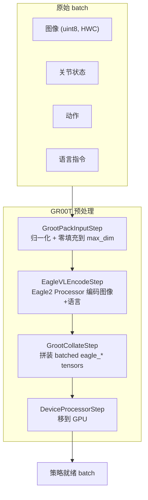
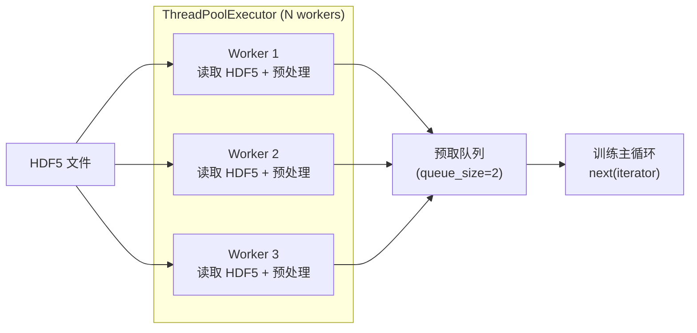
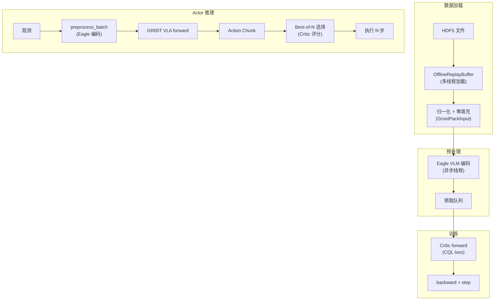
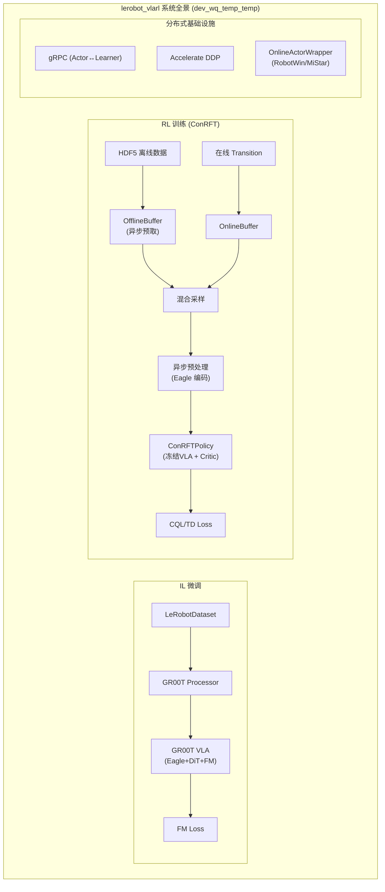

# 第五章：数据处理管线与环境适配层

> 前情提要：[第 4 章](/系列/lerobot_vlarl_deep_dive/04_分布式ActorLearner架构与训练循环) 拆解了分布式训练系统的架构。本章是系列收尾，深入系统最底层——数据如何从原始格式变成策略输入，以及不同机器人平台如何接入。

**知识链接**：
- [第 1 章：全局架构](/系列/lerobot_vlarl_deep_dive/01_全局架构与模块职责)
- [第 2 章：GR00T VLA 模型层](/系列/lerobot_vlarl_deep_dive/02_VLA模型层_Eagle视觉到FlowMatching动作生成)

---

## 1. 数据处理的核心挑战

系统中有三种不同的数据格式需要互相转换：

| 数据源 | 格式 | 特点 |
|--------|------|------|
| HDF5 离线数据 | numpy array + metadata | 大文件、按 episode 组织 |
| LeRobotDataset | Parquet + MP4 | HF 标准格式、支持流式加载 |
| 在线 Transition | dict of tensors | 实时产生、需要即时处理 |

所有数据最终都要变成 `ConRFTPolicy.preprocess_batch()` 期望的格式——包含 Eagle 编码后的 VLM token。

---

## 2. Processor Pipeline 设计

### 2.1 责任链模式


每个 `ProcessorStep` 接收一个 `EnvTransition` 字典，修改其中某些字段，传给下一步。步骤可自由组合。

### 2.2 EnvTransition 统一容器

```python
EnvTransition = TypedDict("EnvTransition", {
    "observation": dict[str, Any] | None,
    "action": PolicyAction | RobotAction | EnvAction | None,
    "reward": float | torch.Tensor | None,
    "done": bool | torch.Tensor | None,
    "truncated": bool | torch.Tensor | None,
    "info": dict[str, Any] | None,
    "complementary_data": dict[str, Any] | None,
})
```

---

## 3. GR00T 专用预处理（ConRFT 路径）

ConRFT 使用 GR00T 的 Processor Pipeline，核心步骤：



### 3.1 GrootPackInputStep

三个关键操作：
1. **归一化**：用 dataset_stats 的 min/max 把 state/action 映射到 [-1, 1]
2. **零填充**：不同机器人维度不同（6DoF vs 14DoF vs 23DoF），统一填充到 `max_state_dim=64`、`max_action_dim=32`
3. **Mask 生成**：`state_mask[i]=1` 表示第 i 维是真实数据，`=0` 表示是填充

### 3.2 EagleVLEncodeStep

这是最重要（也最耗时）的步骤——调用 Eagle2 的 HuggingFace Processor 把图像和文本编码为 VLM 输入格式：

```python
# 伪代码
eagle_processor = AutoProcessor.from_pretrained("lerobot/eagle2hg-processor-groot-n1p5")
eagle_content = eagle_processor(images=images, text=language_instruction, ...)
# 输出包含：eagle_input_ids, eagle_pixel_values, eagle_attention_mask 等
```

这一步耗时 ~20ms/sample，所以在 Learner 中被放到**异步预处理线程**中执行。

### 3.3 preprocess_batch 在 ConRFT 中的调用链

```python
class ConRFTPolicyGroot(ConRFTPolicyBase):
    def preprocess_batch(self, batch):
        # 1. 构建 GR00T 输入格式
        groot_inputs = self.actor.get_groot_inputs(batch)
        
        # 2. Eagle backbone forward（冻结，不计算梯度）
        with torch.no_grad():
            backbone_output = self.actor.vlm_encoder(groot_inputs)
        
        # 3. 把 backbone embedding 存回 batch 供 Critic 使用
        batch["vlm_embedding"] = backbone_output["backbone_features"]
        return batch
```

---

## 4. Offline Buffer：HDF5 数据加载

### 4.1 HDF5 数据格式

本分支使用 HDF5 作为主要离线数据格式（比 LeRobotDataset 的 Parquet+MP4 更适合大规模机器人数据）：

```
dataset.hdf5
├── episode_0/
│   ├── observations/
│   │   ├── images/
│   │   │   ├── image_primary   (T, H, W, C) uint8
│   │   │   └── image_wrist     (T, H, W, C) uint8
│   │   └── state               (T, state_dim) float32
│   ├── actions                  (T, action_dim) float32
│   ├── rewards                  (T,) float32
│   └── dones                    (T,) bool
├── episode_1/
│   └── ...
└── metadata
    ├── fps: 30
    ├── num_episodes: 100
    └── task_description: "pick up the cube"
```

### 4.2 异步加载架构



关键性能优化：
- **多 worker 并行**：N 个线程同时从 HDF5 读取不同的 episode
- **预取队列**：总是有 2 个 batch 在队列中等待，训练永不阻塞
- **长超时**：设置 `IDLE_WORKER_TIMEOUT = 3600s`（默认 60s 会导致 worker 在 epoch 边界退出重建）

### 4.3 MC Return 预计算

```python
def compute_mc_returns(rewards, dones, gamma):
    """从后往前累积折扣回报"""
    mc_returns = torch.zeros_like(rewards)
    running_return = 0
    for t in reversed(range(len(rewards))):
        if dones[t]:
            running_return = 0
        running_return = rewards[t] + gamma * running_return
        mc_returns[t] = running_return
    return mc_returns
```

MC Returns 在数据加载时一次性计算好，存入 buffer，训练时直接索引取用。

### 4.4 Task 感知采样

多任务场景下，不同任务的数据量可能严重不平衡。`OfflineReplayBuffer` 支持按 task 均衡采样：

```python
# 每个 task 有独立的 index 列表
# 每次采样时从所有 task 等概率选择
task_indices = {task_id: [idx1, idx2, ...] for task_id, idxs in dataset.groupby("task")}
```

---

## 5. Online Buffer：环形缓冲区

### 5.1 核心结构

```python
class ReplayBuffer:
    def __init__(self, capacity, storage_device="cpu"):
        self.capacity = capacity
        self.buffer = []  # 环形存储
        self.position = 0
    
    def add(self, transition: Transition):
        if len(self.buffer) < self.capacity:
            self.buffer.append(transition)
        else:
            self.buffer[self.position] = transition
        self.position = (self.position + 1) % self.capacity
```

### 5.2 Random Shift 数据增强

采样时对图像做微小随机平移（DrQ 技巧）：

```python
def random_shift(images, pad=4):
    # 四边各填充 4 像素（复制边界），再随机裁剪回原始大小
    images = F.pad(images, pad=(4,4,4,4), mode="replicate")
    return random_crop_vectorized(images, output_size=(h, w))
```

这在视觉 RL 中显著提升样本效率（相当于免费的数据增强）。

---

## 6. 环境适配层

### 6.1 RobotWin 仿真适配

RobotWin 使用 ZeroMQ + TorchSerializer 协议通信。`RobotwinWrapper` 实现了这个协议：

```python
class RobotwinWrapper(OnlineActorWrapper):
    name = "robotwin"
    
    def serve(self, core: OnlineActorCoreProtocol):
        server = RobotwinServer(host=self.host, port=self.port)
        
        while True:
            # 接收仿真器的观测
            obs_raw = server.receive_observation()
            observation = self.parse_observation(obs_raw)
            
            # 调用核心逻辑
            action_chunk = core.select_action_chunk(observation)
            
            # 发送动作给仿真器
            server.send_action(action_chunk)
            
            # 接收 step 结果
            result = server.receive_step_result()
            core.observe_action_chunk(observation=observation, 
                                      action_chunk=action_chunk, ...)
```

### 6.2 MiStar/MiUniverse 实机适配

MiUniverse 是小米的机器人仿真/实机控制平台。适配逻辑类似但通信协议不同：

```python
class RobotInferenceServerMiUniverse:
    """MiUniverse 的推理服务器"""
    # 处理 6D rotation representation (ortho6d)
    # 处理相机内参和外参
    # 处理关节空间 ↔ 末端空间的转换
```

关键转换函数：
- `ortho6d_to_rotation_matrix`：6 维正交表示 → 3×3 旋转矩阵
- `rotation_matrix_to_ortho6d`：反向转换
- `robotwin14_to_cobot256`：RobotWin 14 维动作 → Cobot 256 格式

### 6.3 传统真机适配（HILSerl）

对于 SO100 等简单机械臂，保留了原有的 `gym_manipulator.py` 封装：

```python
class GymManipulatorEnv(gym.Env):
    """标准 Gym 接口封装"""
    def reset(self): 
        # 移到初始位姿
    def step(self, action):
        # 发送关节命令 → 读取新观测
```

配合传统的 `actor.py`（非可插拔版本）和完整的 Processor Pipeline（包含 IK、安全检查等）。

---

## 7. 动作空间处理

### 7.1 14 维动作格式（RobotWin/Cobot）

本分支主要使用 14 维动作空间：

| 维度 | 含义 |
|------|------|
| 0-2 | 右臂末端位置增量 (Δx, Δy, Δz) |
| 3-8 | 右臂末端旋转增量 (ortho6d 表示) |
| 9 | 右夹爪 |
| 10-12 | 左臂末端位置增量 |
| 13 | 左夹爪 |

### 7.2 Action Mask

不是所有维度都参与训练。`action_mask` 标记哪些维度有效：

```python
# 例如只用右臂（前 10 维有效）
valid_action_dim = 10
action_mask = torch.zeros(max_action_dim)
action_mask[:valid_action_dim] = 1.0
```

Critic 和 loss 计算中都会 mask 掉无效维度。

### 7.3 Action Chunk 执行

VLA 输出一个 chunk（如 16 步），但每次只执行一部分：

```python
# execute_chunk_steps 控制每次执行多少步
action_chunk = policy.select_action(batch)  # (chunk_size, action_dim)
for step in range(execute_chunk_steps):
    env.step(action_chunk[step])
```

---

## 8. 完整数据流：从 HDF5 到电机



---

## 9. 配置一个新平台需要什么

### 9.1 必须实现的接口

创建一个新的 `OnlineActorWrapper` 子类：

```python
class MyRobotWrapper(OnlineActorWrapper):
    name = "my_robot"
    
    def serve(self, core: OnlineActorCoreProtocol):
        # 1. 连接你的机器人
        # 2. 循环：接收观测 → 调 core.select_action_chunk() → 发送动作
        # 3. 调 core.observe_action_chunk() 记录 transition
        # 4. Episode 结束时调 core.finish_episode()
```

### 9.2 需要配置的参数

```python
OnlineActorArgs(
    wrapper="my_robot",           # 适配器名称
    task_index=1,                 # 任务 ID
    embodiment_id=31,             # GR00T 的 embodiment ID
    valid_action_dim=14,          # 有效动作维度
    max_episode_steps=150,        # 最大步数
    execute_chunk_steps=4,        # 每个 chunk 执行几步
    num_repeat=1,                 # best-of-N 中的 N
    q_select_type="none",         # Critic 选择策略
)
```

---

## 10. 本章总结与全系列回顾

| 要点 | 内容 |
|------|------|
| 数据格式 | HDF5（主要） / LeRobotDataset（兼容） / 在线 Transition |
| 预处理关键 | Eagle VLM 编码（最耗时，放异步线程） |
| 离线 Buffer | HDF5 多线程加载 + MC Return 预计算 + Task 均衡采样 |
| 在线 Buffer | 环形 + random_shift 增强 |
| 平台适配 | OnlineActorWrapper 可插拔（RobotWin / MiStar / Cobot） |
| 动作格式 | 14 维 ortho6d + action_mask + chunk 执行 |

---

## 全系列知识图谱



| 章节 | 覆盖范围 |
|------|---------|
| [第 1 章](/系列/lerobot_vlarl_deep_dive/01_全局架构与模块职责) | 三大路径、目录结构、配置系统 |
| [第 2 章](/系列/lerobot_vlarl_deep_dive/02_VLA模型层_Eagle视觉到FlowMatching动作生成) | GR00T 内部：Eagle → DiT → FM/CP |
| [第 3 章](/系列/lerobot_vlarl_deep_dive/03_ConRFT与SACQC_VLA加Critic的RL策略融合) | ConRFT 冻结VLA+Critic、CQL、Best-of-N |
| [第 4 章](/系列/lerobot_vlarl_deep_dive/04_分布式ActorLearner架构与训练循环) | gRPC + Accelerate + 异步预处理 |
| [第 5 章](/系列/lerobot_vlarl_deep_dive/05_数据处理管线与环境适配层)（本章） | 数据管线 + Buffer + 平台适配 |

读完这五章，你完整理解了从"HDF5 数据文件"到"机器人执行动作"之间的每一步计算和通信。这套系统的设计核心是**模块化 + 可插拔**：换 VLA backbone？改 `base_vla_type`。换机器人平台？换 `wrapper`。离线→在线？改 `train_offline`。所有复杂性被封装在清晰的接口边界之后。
