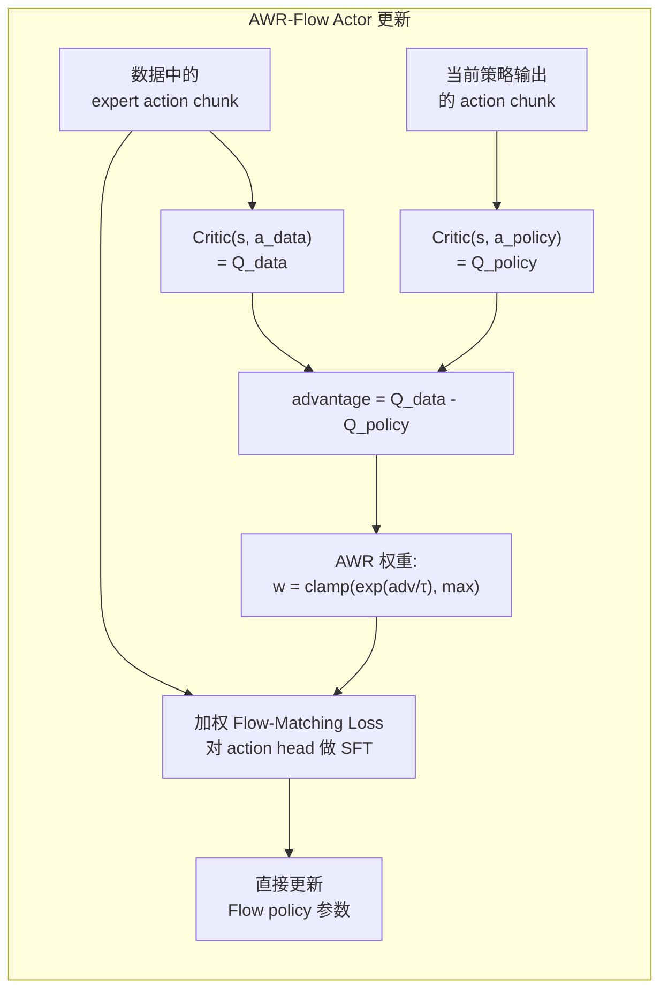
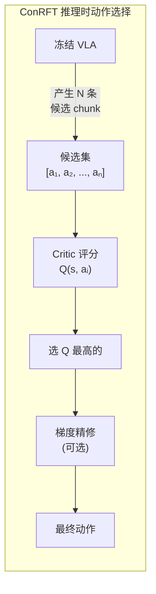
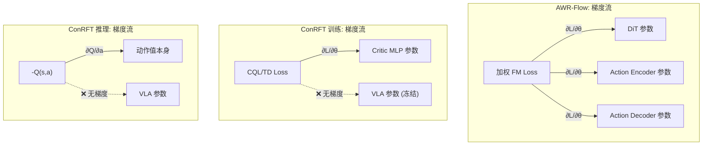
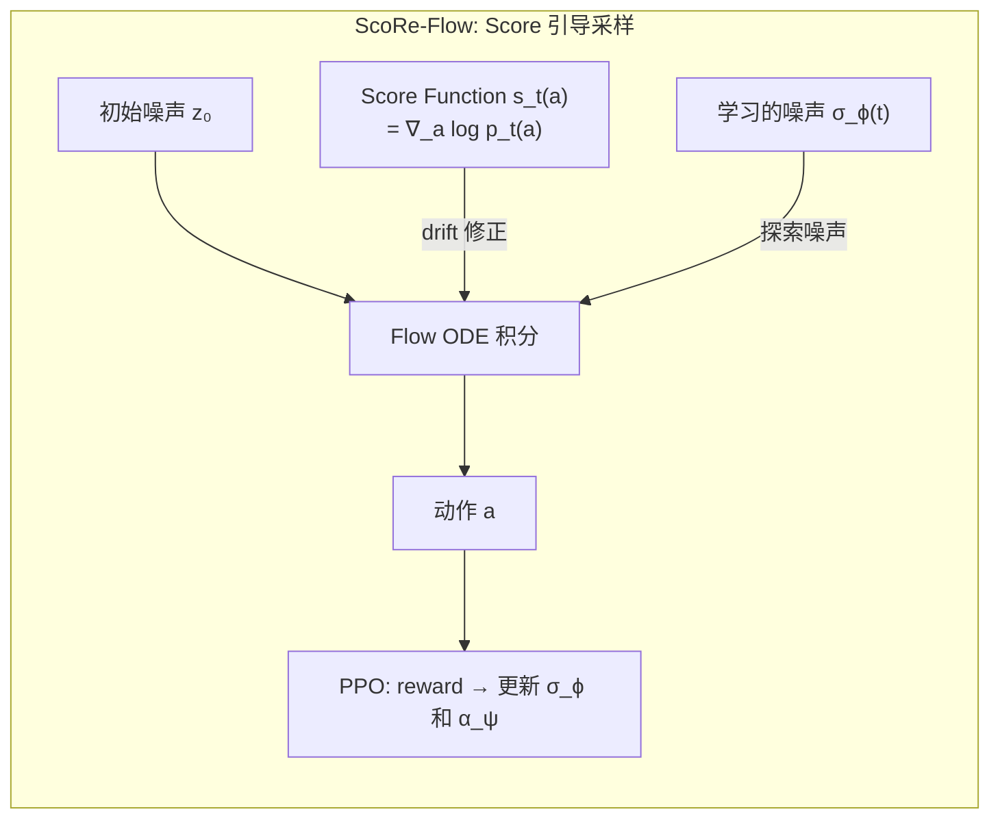

# AWR-Flow Handoff 与 ConRFT 与 ScoRe-Flow 与 ReinFlow 的 Actor 更新机制对比

## 相关阅读

- [RLinf：BC 到 RL 的 ACT 后训练架构](./RLinf_BC到RL的ACT后训练架构)
- [LeRobot-VLARL 全面拆解](/系列/lerobot_vlarl_deep_dive/)
- [SAC Soft Actor-Critic 基础](/前置知识/000k_前置知识_SAC_Soft_Actor_Critic)
- [Flow Matching 基础](/前置知识/0013_前置知识_FlowMatching基础)
- [GR00T 强化学习深度解析](/系列/groot_rl_deep_dive/)
- [ReinFlow：Flow 策略的噪声注入 RL 微调](/前置知识/001u_前置知识_ReinFlow_Flow策略的噪声注入RL微调)
- [ScoRe-Flow 精读](/论文综述/080_ScoRe_Flow_Score引导的Flow策略RL微调)

---

## 一、问题背景：VLA 策略如何用 RL 改进？

给定一个预训练的 GR00T VLA（用 Flow Matching 或 Consistency Policy 生成动作 chunk），RL 的目标是让它"做得更好"——用 Critic 信号引导策略朝高 Q 值方向调整。

核心矛盾是：**如何把 Critic 的标量信号传导到 Flow Matching action head 的参数上？**

两种实现给出了截然不同的答案：

| 系统 | 方案 | 核心思路 |
|------|------|---------|
| **RLinf（AWR-Flow Handoff）** | 直接修改 Flow policy 的参数分布 | Advantage 加权 Flow-Matching SFT |
| **ConRFT（dev_wq_temp_temp）** | 不动 Flow policy，用 Critic 选/修 action | 候选搜索 + Q 排序 + 梯度精修 |

这不是"哪个更好"的问题——它们是两种完全不同的设计哲学，适用于不同的约束条件。

---

## 二、AWR-Flow Handoff：Advantage 加权的 Flow-Matching SFT

### 2.1 核心目标

AWR-Flow 的本质是：**把好的动作当作"标签"，用 advantage 作为权重，对 Flow policy 做加权监督学习。**



### 2.2 具体步骤（RLinf 代码）

对应 `fsdp_groot_chunk_sac_policy_worker.py` 中 `actor_objective == "awr_flow"` 分支：

**第一步：计算 advantage**

```python
with torch.no_grad():
    # 当前策略产生动作
    policy = self.model(forward_type=ForwardType.SAC, forward_inputs=data)
    
    # 策略动作的 Q 值
    policy_q = self.model(forward_type=ForwardType.SAC_Q, 
                          forward_inputs=data, actions=policy["actions"]).min(dim=-1).values
    
    # 数据中专家动作的 Q 值
    data_q = self.model(forward_type=ForwardType.SAC_Q,
                        forward_inputs=data, actions=data["chunk_sac_action"]).min(dim=-1).values
    
    # Advantage = 数据动作比策略动作好多少
    advantage = data_q - policy_q
```

关键点：advantage 衡量的是"数据中这条 chunk 比我当前策略能产出的 chunk 好多少"。如果 advantage > 0，说明数据动作更好，值得学习。

**第二步：构造加权 SFT 目标**

```python
# 用数据动作作为 Flow-Matching 的 target
flow_data["qc_target_action"] = data["chunk_sac_action"]
flow_data["qc_action_mask"] = data["chunk_sac_valid"].unsqueeze(-1).expand_as(...)

# AWR 权重：advantage 经过 exp/τ 变换并 clip
awr_weights = data["chunk_sac_actor_weights"]  # 预计算的权重

# 执行加权 Flow-Matching SFT
loss = self.model(
    forward_type=ForwardType.SFT,
    data=flow_data,
    sample_weights=awr_weights,  # 权重直接乘在 FM loss 上
)
```

**第三步：质量过滤**

不是所有数据都用来更新 Actor。只有通过质量检查的 chunk 才参与：

```python
selected = _actor_quality_labels(
    data,
    data_filter="success_or_progress",  # 只用成功或有正进展的 episode
    positive_progress_threshold=0.0,
)
```

### 2.3 数学本质

AWR-Flow 的 Actor 目标可以写成：

$$
L_{\text{actor}}^{\text{AWR-Flow}} = \mathbb{E}_{(s, a_{\text{data}}) \sim \mathcal{D}_{\text{filtered}}} \left[ w(s, a_{\text{data}}) \cdot L_{\text{FM}}(\theta; s, a_{\text{data}}) \right]
$$

其中：
- $L_{\text{FM}}$ 是标准的 Flow-Matching MSE loss（预测速度场 vs 真值速度场）
- $w(s, a) = \min\left(\exp\left(\frac{Q(s, a_{\text{data}}) - Q(s, a_{\pi}))}{\tau}\right), w_{\max}\right)$ 是 AWR 权重
- $\mathcal{D}_{\text{filtered}}$ 是经过质量过滤的数据集（只有成功/进展的 episode）

**直觉**：这就是一个"加权的监督学习"。权重大（advantage 高）的数据点对 loss 贡献更大 → Flow policy 更用力地"模仿"这些高质量动作 → 策略分布逐渐朝好动作的方向移动。

---

## 三、ConRFT：候选搜索 + Critic 引导 + 梯度精修

### 3.1 核心目标

ConRFT 的哲学完全不同：**不改变 VLA 的参数分布，而是在推理时用 Critic 来"选"和"修"VLA 输出的动作。**



### 3.2 训练阶段做什么

ConRFT 的训练主要是**训练 Critic**（不是训练 Actor）：

| 阶段 | 训练目标 | Actor（VLA）状态 |
|------|---------|---------------|
| 离线 | CQL/CalQL Critic loss + BC loss | 完全冻结 |
| 在线 | TD Critic loss + BC 正则 | 完全冻结 |

Actor loss 在 ConRFT 中的角色非常有限——它主要是一个 BC 正则项（让 VLA 不要偏离太远），而不是像 AWR-Flow 那样直接驱动策略改变。

### 3.3 Advantage-Gradient Refinement（推理时）

ConRFT 中 advantage 的使用场景是在**推理时**对候选动作做梯度精修：

```python
def _advantage_gradient_refinement(self, actions, obs_batch, ...):
    """通过 Q 值梯度上升精修候选动作"""
    flat_actions = actions.clone().requires_grad_(True)
    optimizer = torch.optim.Adam([flat_actions], lr=grad_lr)
    
    for _ in range(grad_iters):  # 默认 3 步
        # 计算候选动作的 Q 值
        q_values = self.get_q_value(eval_batch, is_next=False, use_target=use_target)
        
        # 直接最大化 Q
        loss = -q_values.mean()
        loss.backward()
        optimizer.step()
        
        # 投影回信赖域（不偏离原始动作太远）
        refined = flat_actions.clamp(anchor - eps, anchor + eps)
    
    return refined
```

关键区别：
- 这里的梯度是**对动作本身求的**（不是对网络参数）
- 这是**推理时的优化**，不改变任何模型权重
- 有一个信赖域约束（`eps`），限制精修幅度

### 3.4 数学本质

ConRFT 的"Actor 改进"发生在推理时，本质是一个约束优化问题：

$$
a^* = \arg\max_{a} Q(s, a) \quad \text{s.t.} \quad \|a - a_{\text{VLA}}\|_\infty \leq \varepsilon
$$

这和训练 Flow policy 的参数完全是两回事——前者是在**动作空间**中搜索，后者是在**参数空间**中更新。

---

## 四、核心差异对照

### 4.1 "谁的参数被改变了？"

| 维度 | AWR-Flow Handoff | ConRFT |
|------|-----------------|--------|
| **Flow/CP action head** | ✅ 被训练更新 | ❌ 完全冻结 |
| **Critic 网络** | ✅ 被训练更新 | ✅ 被训练更新 |
| **Eagle backbone** | 通常冻结 | 完全冻结 |
| **推理时动作** | 直接从更新后的 Flow 采样 | 从冻结 VLA 采样 + Critic 选/修 |

这是最本质的区别。AWR-Flow 在训练中**永久改变了 VLA 的行为**（action distribution shift），而 ConRFT **不改变 VLA 本身**，只是在推理时用 Critic 做后处理。

### 4.2 梯度流向



### 4.3 训练数据要求

| 维度 | AWR-Flow | ConRFT |
|------|---------|--------|
| **数据质量要求** | 高：需要"成功或有进展"的 chunk | 低：任何数据都能训练 Critic |
| **数据过滤** | 显式质量过滤（`success_or_progress`） | 无过滤，CQL 自动处理 OOD |
| **对 expert 数据依赖** | 强：Actor 更新只学习好动作 | 弱：Critic 从所有动作学评分 |
| **离线数据利用** | 通过加权 SFT | 通过 CQL/CalQL |

### 4.4 策略改变的"永久性"

| 维度 | AWR-Flow | ConRFT |
|------|---------|--------|
| **策略改变是否持久** | ✅ 参数更新后永久生效 | ❌ 每次推理都要跑选择/精修 |
| **推理开销** | 低：单次 VLA forward | 高：N 次 forward + Critic 评分 + 可选梯度精修 |
| **可回滚性** | 难（参数已变） | 容易（关掉 Critic 就回到原始 VLA） |
| **Catastrophic forgetting 风险** | 有（分布偏移可能损坏 VLA） | 无（VLA 参数不动） |

---

## 五、流程对比：一个 step 内发生了什么

### 5.1 AWR-Flow 的一个训练 step

```
输入: 一个 batch of (observation, expert_action_chunk)

1. 策略前向：VLA → policy_action_chunk     (有梯度)
2. Critic 评估策略动作：Q(s, a_policy)     (无梯度)
3. Critic 评估数据动作：Q(s, a_data)       (无梯度)
4. 计算 advantage = Q_data - Q_policy
5. 计算 AWR 权重 w = exp(advantage / τ)
6. 用数据动作作为 target，w 作为权重，训练 Flow-Matching
7. 反向传播 → 更新 DiT, ActionEncoder, ActionDecoder 参数
```

### 5.2 ConRFT 的一个训练 step

```
输入: 一个 batch of (observation, action_chunk, reward, next_obs, done)

1. VLA 冻结前向：VLA → action_chunk + vlm_embedding  (无梯度)
2. Critic 评估数据动作：Q(s, a_data)                  (有梯度)
3. Target Critic 计算 target：r + γ * min Q_target(s', a')  (无梯度)
4. CQL 正则：惩罚 OOD 动作的 Q 值
5. Total loss = TD_loss + α_CQL * CQL_loss + β * BC_loss
6. 反向传播 → 只更新 Critic MLP 参数
```

### 5.3 ConRFT 的推理时 step

```
输入: 一个 observation

1. VLA 前向 N 次（不同噪声）→ N 条候选 action chunk
2. Critic 对 N 条候选评分 → Q₁, Q₂, ..., Qₙ
3. (可选) 梯度精修：对 top-K 候选做 3 步 Q 梯度上升
4. 选 Q 最高的候选执行
```

---

## 六、优劣分析

### 6.1 AWR-Flow 的优势

1. **推理效率高**：训练后 VLA 直接产出好动作，不需要额外的 Critic 评估或搜索
2. **改变是持久的**：策略分布真正 shift 了，不依赖推理时的额外计算
3. **适合大规模在线训练**：策略持续改进，不需要"回头看"

### 6.2 AWR-Flow 的劣势

1. **可能损坏 VLA**：如果 advantage 估计不准或数据质量差，Flow policy 可能被带偏到不可恢复的状态
2. **需要高质量过滤数据**：Actor 更新强依赖 `success_or_progress` 过滤
3. **显存开销大**：需要对 VLA action head 做反向传播

### 6.3 ConRFT 的优势

1. **安全**：VLA 参数不动，任何时候关掉 Critic 就回到原始行为
2. **数据效率**：Critic 能从失败数据中学到"什么不好"
3. **显存省**：只训练几 M 参数的 Critic，不需要 VLA backward
4. **灵活**：推理时可以调 N、调精修步数、调信赖域半径

### 6.4 ConRFT 的劣势

1. **推理慢**：N 次 VLA forward + Critic 评分，延迟翻 N 倍
2. **改善有上限**：受限于 VLA 采样的多样性——如果 VLA 输出的所有候选都不好，Critic 也帮不上忙
3. **Critic 精度依赖**：Best-of-N 的效果完全取决于 Critic 的评估准确性

---

## 七、本质区别一句话总结

> **AWR-Flow 是"教 VLA 画更好的画"——改变画家的技能本身。**
> **ConRFT 是"让 VLA 画多幅画，请评委选最好的那幅"——画家技能不变，靠评委眼光。**

| 维度 | AWR-Flow | ConRFT |
|------|---------|--------|
| **改变对象** | VLA action head 参数 | 动作空间中的搜索位置 |
| **Critic 角色** | 提供加权信号 | 提供选择/搜索方向 |
| **训练改变** | 永久性策略分布偏移 | 只改变 Critic 评估准确度 |
| **推理模式** | 一次 forward | N 次 forward + 选择 |
| **安全性** | 有 catastrophic forgetting 风险 | 完全安全（VLA 不动） |
| **适用场景** | 数据充足 + 需要高推理效率 | 数据稀缺 + 需要安全保守 |

---

## 八、第三条路线：ScoRe-Flow 的 Score 引导策略

除了 AWR-Flow 和 ConRFT，还有一条根本不同的技术路线——[ScoRe-Flow](/论文综述/080_ScoRe_Flow_Score引导的Flow策略RL微调)：**不修改 Flow 网络参数，不训练 Critic 选动作，而是在 Flow 的采样过程中注入方向引导。**

### 8.1 ScoRe-Flow 的 Actor 更新机制



ScoRe-Flow 的 SDE 在 ReinFlow 基础上加了一项 **score drift**：

$$
\mathrm{d}a_t = \Big[\underbrace{v_\theta(t, a_t, s)}_{\text{冻结的 Flow}} + \underbrace{(1-t) \cdot \alpha_\psi(t) \cdot s_t(a_t)}_{\text{Score 方向修正}}\Big]\mathrm{d}t + \underbrace{\sigma_\phi(t)}_{\text{学习的噪声}}\,\mathrm{d}W_t
$$

### 8.2 与 AWR-Flow / ConRFT 的本质区别

| 维度 | AWR-Flow | ConRFT | **ScoRe-Flow** |
|------|---------|--------|---------------|
| **改了什么** | Flow action head 参数 | 不改 VLA，训练外挂 Critic | 不改 $v_\theta$，只学 $\alpha_\psi$ 和 $\sigma_\phi$ |
| **Critic 角色** | 提供 advantage 权重 | 选/修候选动作 | **无 Critic**（纯 on-policy PPO） |
| **改变方式** | 参数空间梯度 | 动作空间搜索 | **采样路径偏移** |
| **策略改变持久性** | 永久（参数变了） | 推理时才生效 | 永久（$\alpha, \sigma$ 变了） |
| **RL 算法** | Off-policy（buffer） | Off-policy（CQL/TD） | **On-policy（PPO）** |
| **对 VLA 的修改** | 改 action head | 完全不改 | 完全不改 $v_\theta$ 结构和参数 |
| **额外参数量** | 整个 action head (~50M) | Critic MLP (~5M) | **~几千**（两个小 MLP） |
| **log π 可用性** | 不需要（SFT 目标） | 不需要（Q 选择） | ✅ 需要（PPO 的 ratio） |

### 8.3 三种方法的哲学对比

一句话概括三种思路：

- **AWR-Flow**：让画家学习"好客户"的画风 → 改变画家本身
- **ConRFT**：画家不变，请评委选画 → 训练评委
- **ScoRe-Flow**：画家不变，但在画的过程中有一个"方向感应器"轻推画笔 → 训练感应器

ScoRe-Flow 的独特之处在于：它**不需要 Critic**（纯 on-policy），**不改 Flow 网络**（$v_\theta$ 冻结），只训练两个极小的辅助组件（score scheduler + variance predictor）。代价是 on-policy 的样本效率较低——每次 PPO 更新后必须丢弃旧数据重新采集。

### 8.4 适用场景对比

| 场景 | AWR-Flow | ConRFT | ScoRe-Flow | ReinFlow |
|------|---------|--------|-----------|----------|
| 有大量 off-policy 数据 | ✅ 最佳 | ✅ 适合 | ❌ 不能用 | ❌ 不能用 |
| 只能在线交互、数据稀缺 | 一般 | ✅ 适合 | ❌ 效率低 | ❌ 效率低 |
| 有廉价仿真器 + 大量 rollout | ✅ | 一般 | ✅ 最佳 | ✅ 适合 |
| 绝对不能修改 VLA 参数 | ❌ | ✅ | ✅ | ❌（可选微调 v_θ） |
| 额外显存极其有限 | ❌ | 一般 | ✅ | ✅ |
| 需要精确的 log-prob | ❌ | ❌ | ✅ | ✅ |
| 需要引导策略分布的 mean | ❌ | ❌ | ✅ | ❌（只能控制 variance） |

---

## 九、第四条路线：ReinFlow 的噪声注入策略

[ReinFlow](/前置知识/001u_前置知识_ReinFlow_Flow策略的噪声注入RL微调) 是 ScoRe-Flow 的前身和 baseline。它的思路更简单：**只给 Flow ODE 加噪声，不加 score drift。**

### 9.1 ReinFlow 的 SDE

$$
\mathrm{d}a_t = \underbrace{v_\theta(t, a_t, s)}_{\text{预训练速度场（可选冻结/微调）}}\,\mathrm{d}t + \underbrace{\sigma_\phi(t, a_t, s)}_{\text{学习的噪声}}\,\mathrm{d}W_t
$$

对比 ScoRe-Flow 的 SDE，ReinFlow **没有** score drift 项 $\alpha_\psi \cdot s_t$。

### 9.2 ReinFlow 做了什么 / 没做什么

| 维度 | ReinFlow | ScoRe-Flow |
|------|---------|-----------|
| 噪声注入 | ✅ 学习 σ_ϕ | ✅ 学习 σ_ϕ |
| 方向引导 | ❌ 无 | ✅ 学习 α_ψ · s_t |
| 能控制的 | 只有 **variance**（探索幅度） | **mean + variance** |
| 收敛速度 | 较慢（靠随机碰撞） | 快 2.4 倍（有方向引导） |
| 最终性能 | 较低 | 更高（+5-7% 绝对值） |

### 9.3 核心直觉

ReinFlow 就像"在铁轨上随机抖动"——你沿着预训练的 flow 路径走，但每步随机偏左偏右一点（噪声 σ）。如果你运气好偏对了方向，PPO 会记住这个好结果。但你**不能主动调整铁轨方向**。

ScoRe-Flow 在此基础上加了一个"指南针"（score drift）——不仅随机抖动，还能每步朝高概率方向主动偏移。

### 9.4 四种方法的完整对比

| 维度 | AWR-Flow | ConRFT | ScoRe-Flow | **ReinFlow** |
|------|---------|--------|-----------|------------|
| **改了什么** | Flow action head 参数 | 不改 VLA，训练 Critic | 加 score drift + 噪声 | **只加噪声** |
| **Critic 角色** | 提供 advantage 权重 | 选/修候选动作 | 无 Critic | **无 Critic** |
| **RL 算法** | Off-policy（buffer） | Off-policy（CQL/TD） | On-policy PPO | **On-policy PPO** |
| **对 v_θ 的修改** | ✅ 改参数 | ❌ 冻结 | ❌ 冻结 | **可选（冻结或微调）** |
| **额外参数量** | ~50M（action head） | ~5M（Critic MLP） | ~几千（α_ψ + σ_ϕ） | **~几千（仅 σ_ϕ）** |
| **能控制策略的** | 全部（直接改参数） | 动作选择 | mean + variance | **仅 variance** |
| **log π 可用** | 不需要 | 不需要 | ✅ | **✅** |
| **收敛速度** | 取决于数据质量 | 取决于 Critic 精度 | 快 | **慢（无方向引导）** |

---

## 十、工程选择建议

| 你的场景 | 推荐方案 | 原因 |
|----------|---------|------|
| 有大量高质量 rollout + 推理延迟敏感 | AWR-Flow | 训练后推理开销为零 |
| 数据量有限 + 不能承受 VLA 崩坏的风险 | ConRFT | 安全 + 数据高效 |
| 有廉价仿真器 + 不想改模型结构 | ScoRe-Flow | 极轻量 + 有方向引导 |
| 有廉价仿真器 + 实现最简单 | **ReinFlow** | 只需加噪声，代码改动最少 |
| 需要精确 log-prob + 快速验证 RL 能否 work | **ReinFlow** | 最简单的 Flow RL baseline |
| 需要精确 log-prob + 要求最终性能高 | ScoRe-Flow | ReinFlow + score drift |
| 多任务/多机器人同时 finetune | AWR-Flow | 一次训练永久提升所有任务 |
| 推理时有额外 GPU 预算 | ConRFT (N>1) | 用计算换精度 |
