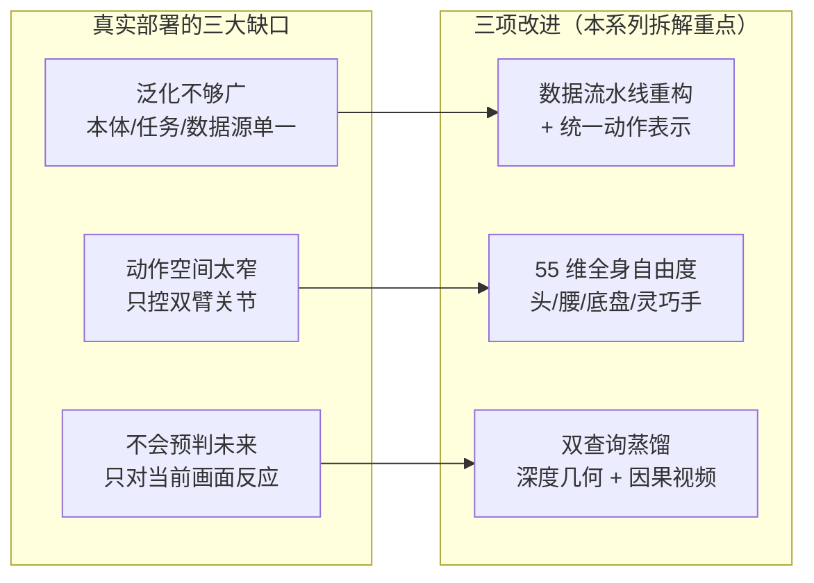
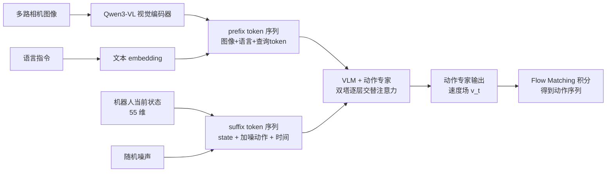
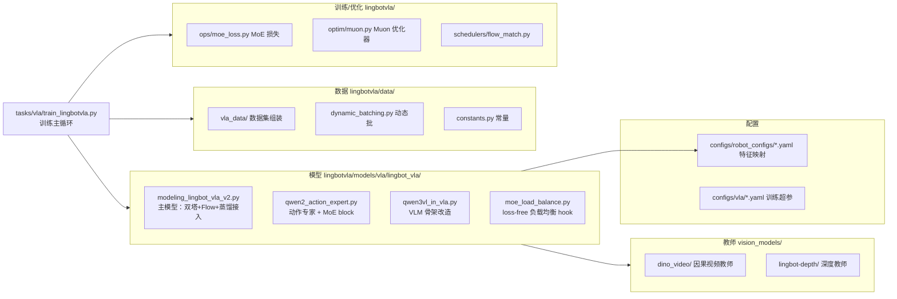

# 第 01 章 全景图：LingBot-VLA 2.0 在解决什么问题

> 本章是全系列的入口。我们先不看任何代码，而是把 LingBot-VLA 2.0 想解决的问题、它的整体设计选择、以及代码仓库的组织方式讲清楚，让你在后面读每一段代码时都知道"这块在整张图的哪个位置"。

## 一、一句话定位

LingBot-VLA 2.0 是一个 6B 参数的视觉-语言-动作（Vision-Language-Action, VLA）基础模型：输入是几路相机图像加一句自然语言指令，输出是一段连续的机器人动作序列。它和 π₀、GR00T 属于同一范式——**用一个视觉语言模型（VLM）理解场景和指令，再用一个基于 Flow Matching 的动作模块把理解转成动作**。

它的特别之处不在于某个全新的模块，而在于把三件"让 VLA 真正能落地"的事一起做扎实了。这三件事，正好对应它相对前代（LingBot-VLA 1.0）的三项改进：

| 改进 | 解决的问题 | 落到代码/数据的抓手 |
|------|-----------|--------------------|
| 重构数据流水线（6 万小时、20 本体、含人类视频） | 泛化不够广 | robot config 特征映射 + 归一化统计（第 03、04 章） |
| 55 维统一动作表示（含头/腰/底盘/灵巧手） | 动作空间太窄 | `constants.py` 与 robot config 的槽位映射（第 03 章） |
| 双查询蒸馏（几何 + 时序预判） | 只会对当前画面反应 | prefix 里插查询 token + 两个教师（第 06 章） |

如果你想从"论文视角"理解这三项改进的动机和实验结论，可以先读 [LingBot-VLA 2.0 论文精读](/论文综述/139_LingBotVLA2_从基础到应用的实用VLA)。本系列的定位是**代码视角**——每一项改进具体怎么写的。

## 二、三大缺口与三项改进

真实机器人部署和实验室 benchmark 之间的落差，LingBot-VLA 2.0 归结为三个缺口。下面这张图是理解整个系列的地图。

> 三项改进是一一对应地补三个缺口。数据侧（第 03、04 章）补前两个缺口，模型侧的双查询蒸馏（第 06 章）补第三个缺口。

## 三、整体数据流：从图像指令到动作

抛开所有工程细节，LingBot-VLA 2.0 一次前向要做的事可以概括成一条链路：

> 关键点：图像和语言构成 prefix（前缀），机器人状态和"待去噪的动作"构成 suffix（后缀）；两段拼在一起，喂进一个由 VLM 和动作专家组成的双塔结构；动作专家输出速度场，再由 Flow Matching 积分出最终动作。这条链路的每一个环节都是后面若干章的主题。

这里有两个术语先点明，后面会反复出现：

- **prefix / suffix**：借用语言模型的说法。prefix 是"条件"（看到了什么、要做什么任务），在推理时可以算一次就用 KV-Cache 缓存起来；suffix 是"要生成的东西"（动作），在 Flow Matching 的每一步积分里反复更新。这个划分是第 07 章 KV-Cache 复用的基础。
- **速度场（velocity field）**：Flow Matching 不直接预测动作，而是预测"从噪声到动作这条路径上，当前该往哪个方向走"。这个方向就是速度场 $v_t$。细节在第 07 章。

## 四、几个关键设计选择（本系列会逐一拆解）

在进入代码之前，先把 LingBot-VLA 2.0 几个最有代表性的设计选择列出来，让你对"后面要讲什么"有个预期。

**1. VLM 和动作专家双塔逐层交替。** 很多 VLA 是"VLM 算完所有层，把最后的隐藏状态交给动作头"。LingBot-VLA 2.0 不是——它让 VLM（Qwen3-VL-4B 的文本塔）和动作专家（一个 36 层的 Qwen2）**层数严格相等**，每一层都把两边的 Q/K/V 拼起来做一次联合注意力，然后各自过各自的 FFN。这意味着图像/语言信息和动作信息在**每一层**都在交流，而不是只在最后交一次。第 02 章会把这个结构讲透。

**2. 动作专家里塞 MoE。** 动作专家的部分层，把标准 FFN 换成了 token-level 稀疏 [MoE](/前置知识/005n_前置知识_MoE稀疏专家混合)。为什么是动作专家而不是 VLM？因为跨 20 种本体的动作数据高度异构，MoE 的"稀疏专精"正好用来吸收这种异构性。第 05 章逐行拆 `Qwen2TokenMoeBlock`。

**3. 双查询蒸馏而不是直接预测深度/视频。** 模型不是多长出一个"深度预测头"去输出深度图，而是在输入序列里插几个可学习的**查询 token**，训练时让这些查询去对齐两个教师（深度教师、视频教师）的特征。这样几何和时序预判的能力被"蒸"进了主干，推理时甚至不需要教师在场。第 06 章详解。

**4. Flow Matching + KV-Cache 复用。** 动作生成用 Flow Matching（直线插值、速度场回归），推理时欧拉法几步积分即可。因为 prefix（图像+语言）在积分的每一步都不变，代码把 prefix 的注意力 KV 缓存下来，每步只重算 suffix，这是推理提速的关键。第 07 章讲。

## 五、代码仓库地图

最后给出仓库的组织方式，方便你对照阅读源码。核心代码都在 `lingbotvla/` 下。

> 这张图不需要现在记住，但当你读到某一章时，可以回来看它讲的文件在整张图的什么位置。后续章节和文件的对应关系：第 02 章→`modeling_lingbot_vla_v2.py` + `qwen3vl_in_vla.py`；第 03、04 章→`data/` + `configs/robot_configs/`；第 05 章→`qwen2_action_expert.py` + `ops/`；第 06 章→`vision_models/` + 主模型的蒸馏部分；第 07 章→`schedulers/flow_match.py` + 主模型采样；第 08 章→`train_lingbotvla.py` + `moe_load_balance.py` + `optim/`。

## 下章预告

下一章我们进入架构核心：**VLM 和动作专家如何逐层交替做注意力**。我们会跟着 `QwenvlWithExpertV2Model.forward` 一行一行看，两个 Transformer 的 Q/K/V 是怎么拼起来、注意力算完又怎么分开各走各的 FFN 的——这是理解 LingBot-VLA 2.0 所有后续机制的骨架。
