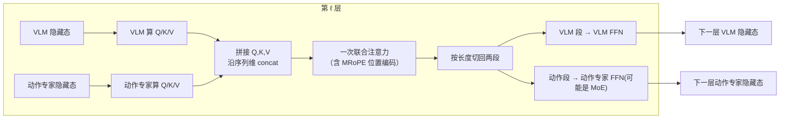
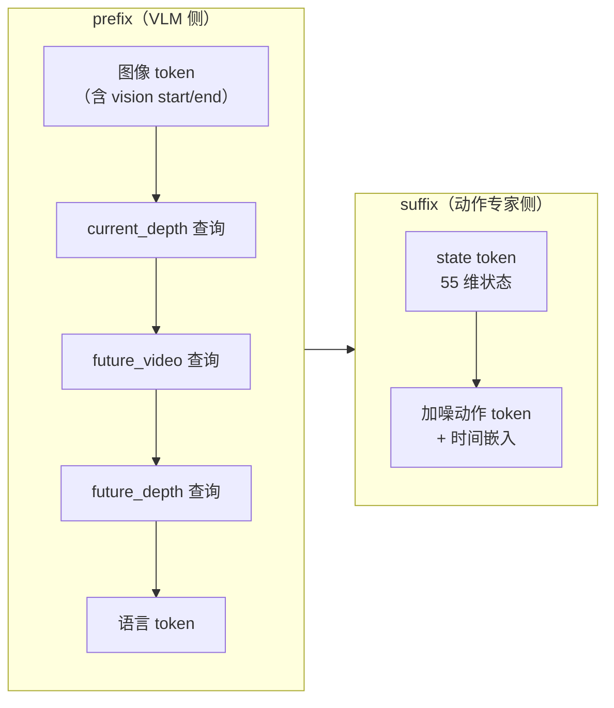

# 第 02 章 双塔架构总览：VLM + 动作专家逐层交替注意力

> 上一章我们知道了 LingBot-VLA 2.0 由一个 VLM 和一个动作专家组成。本章把这个"双塔"结构讲透：两个 Transformer 到底怎么协同——不是接力，而是**每一层都拼在一起做一次联合注意力，再各走各的前馈网络**。这是全系列的骨架，理解了它，后面的 MoE、蒸馏、Flow Matching 才有安放的位置。

## 一、先看两座塔各是什么

LingBot-VLA 2.0 的主体是 `QwenvlWithExpertV2Model`（在 `modeling_lingbot_vla_v2.py`）。它内部持有两个模型：

- `self.qwenvl`：一个 Qwen3-VL-4B。它又分两部分——视觉编码器（把图像变成一串视觉 token）和文本塔（`language_model`，一个标准的 Transformer decoder）。
- `self.qwen_expert`：一个 36 层的 Qwen2 结构，叫"动作专家"。它的隐藏维度比 VLM 小（默认 768），专门负责把"理解"转成"动作"。

代码里有一句关键的断言，点破了双塔协同的前提：

```python
assert action_num_layers == num_layers, (
    "Action expert and VLM must have the same number of layers "
    f"(got action={action_num_layers}, vlm={num_layers})."
)
```

**两座塔的层数必须严格相等。** 这不是巧合——正因为层数相等，才能让它们"逐层配对、层层交流"。如果 VLM 有 36 层、动作专家有 20 层，就没法在每一层配对做联合注意力了。

## 二、核心机制：逐层交替注意力

传统的"VLM → 动作头"是接力式的：VLM 把 36 层全跑完，输出最终隐藏状态，再交给动作头。LingBot-VLA 2.0 换了一种协同方式——**两座塔并排前进，在每一层的注意力处汇合一次**。

一层里发生的事分三步：

1. **各自算 Q/K/V**：VLM 用自己这一层的权重、对自己的 token（图像+语言+查询）算出 Q/K/V；动作专家用自己这一层的权重、对自己的 token（state+动作+时间）算出 Q/K/V。
2. **拼起来做一次联合注意力**：把两边的 Q 拼成一个大 Q、K 拼成大 K、V 拼成大 V，做**一次**注意力。这样动作 token 能"看到"图像/语言 token，反之亦然——信息在这一步交流。
3. **切开、各走各的 FFN**：注意力的输出按原来的长度切回两段，VLM 那段过 VLM 这一层的 FFN，动作专家那段过动作专家这一层的 FFN（这里就是第 05 章 MoE 出场的地方）。

下面这张图画出一层的数据流：



> 注意"拼接—注意力—切开"这个循环：Q/K/V 拼在一起保证了两塔在注意力里充分交流；切开后各走各的 FFN 保证了两塔仍保有各自的专精参数。信息交流发生在**每一层**，不是只在最后一层。

## 三、跟着代码走一遍

现在看 `QwenvlWithExpertV2Model.forward` 的核心循环。它对 `range(num_layers)` 逐层迭代，`inputs_embeds` 是一个长度为 2 的列表——`[VLM 的 token, 动作专家的 token]`。

第一步，各塔算各自的 Q/K/V。代码用同一个 decoder layer 的 `compute_kqv=True` 模式（第 04 章会看到 VLM 和动作专家的 DecoderLayer 都被改造成支持这个模式）：

```python
for i, hidden_states in enumerate(inputs_embeds):
    if hidden_states is None:
        continue
    if i == 1:  # i==1 是动作专家，可能带时间条件 ada_cond
        q, k, v = models[i].layers[layer_idx](
            hidden_states, compute_kqv=True, ada_cond=ada_cond
        )
    else:       # i==0 是 VLM
        q, k, v = models[i].layers[layer_idx](hidden_states, compute_kqv=True)
    query_states.append(q.float())
    key_states.append(k.float())
    value_states.append(v.float())
```

这里 `models = [self.qwenvl.model.language_model, self.qwen_expert.model]`，所以 `i==0` 是 VLM 文本塔、`i==1` 是动作专家。`ada_cond` 是时间步条件（Flow Matching 的时间 $t$），只喂给动作专家——因为只有动作那一侧需要知道"现在去噪到第几步了"。

第二步，把两塔的 Q/K/V 沿序列维拼起来，加上 MRoPE 位置编码，再（推理时）处理 KV 缓存：

```python
query_states = torch.cat(query_states, dim=1)
key_states = torch.cat(key_states, dim=1)
value_states = torch.cat(value_states, dim=1)
query_states, key_states = self.apply_mrope(query_states, key_states, position_ids)
key_states, value_states, past_key_values = self.handle_kv_cache(
    key_states, value_states, layer_idx,
    past_key_values=past_key_values, use_cache=use_cache, fill_kv_cache=fill_kv_cache,
)
```

`torch.cat(..., dim=1)` 沿序列长度拼接——这就是"两塔的 token 排成一条长序列"。`apply_mrope` 用的是 VLM 的旋转位置编码（Multimodal RoPE，支持图像的二维位置），因此**动作 token 也被纳入了 VLM 的位置编码体系**，位置上和图像/语言是连续的。`handle_kv_cache` 在推理时把 K/V 存起来，这是第 07 章 KV-Cache 复用的实现。

第三步，做一次联合注意力。默认用 `flex_cached`（基于 FlexAttention 的带 block mask 的实现），注意力掩码 `attention_mask` 决定了谁能看谁（第 06、07 章会讲到用掩码屏蔽某些查询 token 对动作的影响）：

```python
if self.config.attention_implementation == "flex_cached":
    if layer_idx == 0:
        _full_block_mask = build_block_mask(attention_mask, ...)
    att_output = flex_attention_with_block_mask(
        query_states, key_states, value_states, _full_block_mask, query_states.shape[1]
    )
```

`block_mask` 只在第 0 层构造一次（`if layer_idx == 0`），后面各层复用——因为掩码结构逐层不变，省去重复构造。

第四步（在循环后半段，这里未全部贴出），把注意力输出 `att_output` 按两塔原来的长度切开，各自用 `output_atten=True` 模式过各自的 o_proj、残差和 FFN。VLM 段走 VLM 的 FFN，动作段走动作专家的 FFN——如果这一层被配置成 MoE 层，动作段走的就是 `Qwen2TokenMoeBlock`（第 05 章）。

## 四、为什么这样设计

理解了"怎么做"，再问"为什么这么做"。这里对比一下"接力式"和"逐层交替式"两种方案的差别。

| | 接力式（VLM→动作头） | 逐层交替（LingBot-VLA 2.0） |
|---|---|---|
| 信息交流时机 | 只在 VLM 最后一层输出时交一次 | 每一层都交流 |
| 动作能否影响视觉理解 | 不能（VLM 先算完） | 能（联合注意力双向） |
| 参数是否分离 | 分离（两个独立模块） | 注意力后 FFN 分离，注意力共享 |
| 位置编码 | 动作 token 另起一套 | 动作 token 纳入 VLM 的 MRoPE |

逐层交替的核心好处是：**动作生成的每一层，都能重新"看一眼"图像和语言**，而不是只依赖 VLM 压缩过一次的最终表示。对于需要精细视觉定位的操作任务（比如"对准杯子边缘倒水"），这种层层重新对齐视觉的能力很关键——这也呼应了论文里"在需要精确物体定位的任务上提升最明显"的实验现象（见 [论文精读](/论文综述/139_LingBotVLA2_从基础到应用的实用VLA)）。

代价是实现更复杂：两塔必须层数相等、必须每层都做拼接和切分、注意力掩码要同时管两塔的 token。这些复杂度就是后面几章要拆解的工程细节。

## 五、token 序列长什么样

最后预览一下拼进注意力的这条长序列的构成，为第 03、06、07 章铺垫。完整序列 = prefix + suffix：



> prefix 里除了图像和语言，还插入了三类"查询 token"——这就是双查询蒸馏的接入点（第 06 章）。suffix 由机器人状态和加噪动作构成（第 07 章）。这些 token 的顺序、掩码关系，是后面几章反复要回到的地方。（注：查询 token 的具体种类和顺序由配置开关控制，图中是同时开启时的典型排布。）

## 下章预告

下一章进入数据侧的第一个创新：**55 维统一动作表示**。20 种形态各异的机器人——从 8 自由度的单臂到 32 自由度的人形——是怎么被塞进同一个 55 维向量的？robot config 的 feature mapping 又是怎么把原始数据集的列切片、拼接、映射到统一槽位的？我们会对着 `constants.py` 和 `robotwin.yaml` 一起看。
