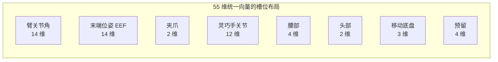
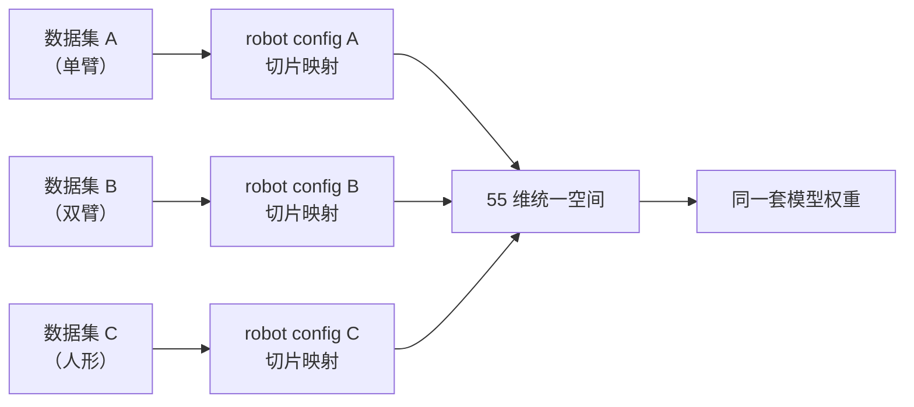

# 第 03 章 55 维统一动作表示与 Robot Config 特征映射

> 这是数据侧的第一个核心创新，也是"跨具身泛化"这项改进的载体。本章回答一个具体问题：从 8 自由度的单臂 Franka，到 32 自由度的人形机器人，20 种形态各异的机器人，是怎么被塞进**同一个 55 维向量**、用**同一套模型权重**训练的？答案藏在两个地方——`constants.py` 定义的槽位布局，和 robot config 里的 feature mapping。

## 一、问题：异构机器人没法直接混训

先想清楚不统一会怎样。假设你手上有三种机器人的数据：

- Franka 单臂：7 个关节角 + 1 个夹爪，共 8 维
- AgileX 双臂：12 个关节角 + 2 个夹爪，共 14 维
- 人形机器人：14 个臂关节 + 12 个灵巧手关节 + 腰 + 头，共 30+ 维

如果直接用各自的原始维度喂模型，模型的动作输出层就得为每种机器人准备一套不同大小的权重——训练时它们无法共享，等于三个独立模型，"跨具身泛化"无从谈起。更麻烦的是，即便都叫"关节角"，Franka 的第 1 维和双臂左臂的第 1 维语义完全不同，硬拼在一起会互相干扰。

## 二、解法：一个 55 维的"标准槽位"向量

LingBot-VLA 2.0 的做法是设计一个固定的 55 维向量，把所有机器人的控制信号都往这些**语义固定的槽位**里填，用不到的槽位补零。槽位布局如下：



> 14+14+2+12+4+2+3+4 = 55。臂关节和末端位姿都按"双臂"留满：双臂各 7 个关节角共 14 维；末端位姿每臂用 XYZ 坐标 + 旋转四元数 = 7 维，双臂共 14 维。这套布局按"最大化的双臂本体"设计上限，遇到更小的本体就在对应槽位补零。

槽位语义固定带来一个关键好处：**同一个槽位在所有机器人里含义相同**。第 3 维永远是"某个特定臂关节"，无论数据来自单臂还是双臂。这样模型学到的"第 3 维怎么动"这条知识，就能在不同机器人间迁移。用不到的槽位（比如单臂机器人没有右臂、没有腰）补零，模型会学会"这些位置恒为零、忽略即可"。

回到 [第 01 章](./01_全景图_LingBotVLA2在解决什么问题) 的"收物进冰箱"例子：那个带移动底盘的机器人，"走到冰箱前"用的是底盘那 3 维，"抬头看冰箱上层"用的是头部那 2 维——正因为向量里专门留了这些槽位，全身协同动作才第一次能被表达出来。

## 三、Robot Config：把原始数据的列切片映射到统一槽位

统一向量定义好了，还差一步：怎么把每个数据集**原始的、五花八门的**列，填进这些统一槽位？这就是 robot config（`configs/robot_configs/<name>.yaml`）的职责——它是一张"接线图"，声明"原始数据的哪几列，接到统一特征的哪个槽位"。

以 RoboTwin 的配置 `robotwin.yaml` 为例。RoboTwin 的原始 `observation.state` 是一个 14 维张量，布局是 `[左臂6关节, 左夹爪1, 右臂6关节, 右夹爪1]`。要把它拆开重组到统一的"臂关节"和"夹爪"槽位，配置这样写：

```yaml
states:
  - observation.state.arm.position:
      origin_keys:
        - observation.state:       # 左臂关节 [0:6)
            start: 0
            end: 6
        - observation.state:       # 右臂关节 [7:13)
            start: 7
            end: 13
  - observation.state.effector.position:
      origin_keys:
        - observation.state:       # 左夹爪 [6:7)
            start: 6
            end: 7
        - observation.state:       # 右夹爪 [13:14)
            start: 13
            end: 14
```

**这段配置在做什么**：把原始 14 维 state 里散落的关节列（[0,6) 和 [7,13)）抽出来拼成统一的 12 维"臂关节"特征，把两个夹爪列（[6,7) 和 [13,14)）拼成 2 维"夹爪"特征。`origin_keys` 是一个列表，列表里的多个切片会**按顺序拼接**。

这样映射后，统一特征和原始切片的对应关系是：

| 统一状态特征 | 原始切片 | 维度 |
|---|---|---|
| `observation.state.arm.position` | `[0:6)` + `[7:13)` | 12 |
| `observation.state.effector.position` | `[6:7)` + `[13:14)` | 2 |

注意这里拼出来是 12 维臂关节，但统一槽位留了 14 维——剩下 2 维补零。这正是"槽位留足上限、小本体补零"的体现。训练配置里也会声明每类关节的槽位大小（`joints: arm.position: 14`），要求它 ≥ 拼接后的实际维度，多出来的部分作为 padding。

## 四、绝对动作还是相对动作：subtract_state

`actions` 部分的结构和 `states` 完全一样，但多了一个关键开关 `subtract_state`。它决定模型学的是**绝对动作**还是**相对动作**。

```yaml
actions:
  - action.arm.position:
      origin_keys:
        - action: {start: 0, end: 6}
        - action: {start: 7, end: 13}
      subtract_state: False   # 学绝对动作
  - action.effector.position:
      origin_keys:
        - action: {start: 6, end: 7}
        - action: {start: 13, end: 14}
      subtract_state: False
```

`subtract_state: False` 表示模型直接学"目标关节角是多少"（绝对动作）。如果设为 `True`，则会用"目标关节角 − 当前关节角"作为学习目标（相对动作，即增量）。

这个开关为什么重要？因为它直接影响学习目标的分布。绝对关节角散布在整个关节配置空间里，方差大、每个任务的分布还各不相同；而相对动作大多是零附近的小幅修正，方差小、分布集中。论文的消融实验证实（见 [论文精读的动作空间消融](/论文综述/139_LingBotVLA2_从基础到应用的实用VLA#五-实验-它到底比前代和-π₀.₅-强在哪)）：相对关节动作把平均成功率从 33.7 提到了 55.0，因为它把"全局关节配置回归"变成了"局部运动回归"，目标更集中更好学。

代码仓库因此给了一条实操建议：真实机器人训练时，把 `action.arm.position` 的 `subtract_state` 设为 `True`（相对臂动作），而 `action.effector.position`（夹爪）保持 `False`（夹爪的开/合是绝对语义，不宜做增量）。`agilex_cobot_magic.yaml` 就是这么配的：

```yaml
actions:
  - action.arm.position:
      origin_keys: action.arm.position
      subtract_state: true    # 相对臂动作
  - action.effector.position:
      origin_keys: action.effector.position
      subtract_state: false   # 绝对夹爪
```

> 注意这里 `origin_keys` 用的是短形式（直接一个字符串），因为 AgileX 数据集的原始列名已经和统一特征名一致，不需要切片重组。当原始名就对得上时，配置可以简写。

## 五、图像也要映射

除了状态和动作，相机也要映射。不同数据集的相机命名各不相同（`cam_high` / `cam_left_wrist`…），robot config 把它们统一到模型期望的相机名：

```yaml
images:
  - observation.images.camera_top:
      origin_keys: observation.images.cam_high
  - observation.images.camera_wrist_left:
      origin_keys: observation.images.cam_left_wrist
  - observation.images.camera_wrist_right:
      origin_keys: observation.images.cam_right_wrist
```

统一相机名（`camera_top` / `camera_wrist_left` / `camera_wrist_right`）必须和 VLA 训练配置里声明的 `cameras` 列表一致，否则加载时对不上。

## 六、多数据集怎么混：MultiVLADataset

要同时训多个数据集（甚至多种机器人），把 `data.data_name` 设成 `multi`，再用一个文本文件列出所有数据集，每行两列 `<robot_config_name> <数据集路径>`：

```text
robotwin /path/to/lerobot_task_a
robotwin /path/to/lerobot_task_b
robotwin /path/to/lerobot_task_c
```

`MultiVLADataset` 会为每一行实例化一个 `VLADataset`，运行时拼接起来。每个数据集用自己那行指定的 robot config 做映射——这意味着**不同机器人的数据可以用各自的接线图，最终都汇入同一个 55 维空间**。这就是跨具身混训在数据加载层面的落地方式：接线图各不相同，出口统一。



> 每种机器人有自己的"接线图"（robot config），负责把它特有的原始列接到统一槽位；接完之后大家都变成 55 维，就能被同一套权重训练——这是"20 种本体、一个模型"能成立的数据基础。

## 下章预告

统一到 55 维之后，还有一个绕不开的问题：这些数值的量纲天差地别（关节角是弧度、坐标是米、夹爪是 0/1），不做归一化模型很难学。下一章讲**归一化与数据管线**——三种归一化方式（MeanStd / MinMax / Q01-Q99）怎么算、`compute_norm_stats.py` 怎么用在线算法遍历整个数据集统计出这些量、以及按 token 预算的动态 batching 是怎么工作的。
