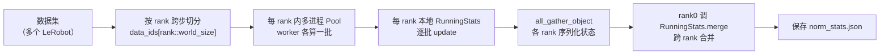

# 第 04 章 归一化与数据管线：RunningStats、动态 batching、指令构造

> 上一章把异构机器人统一到了 55 维。但这些数值量纲天差地别——关节角是弧度（几个单位）、末端坐标是米（零点几）、夹爪是 0/1。不归一化，模型会被大量纲的维度主导。本章讲三件事：三种归一化方式怎么算、`compute_norm_stats.py` 怎么用**在线算法**遍历整个数据集统计出这些量、以及按 token 预算的**动态 batching** 是怎么工作的。

## 一、为什么必须归一化

Flow Matching 的学习目标是回归一个速度场（第 07 章），本质是回归问题。回归对目标的量纲很敏感：如果动作向量里第 1 维（关节角）的典型幅度是 2.0，第 30 维（某个坐标）的典型幅度是 0.05，那 MSE loss 会被第 1 维主导，第 30 维几乎学不动。归一化就是把每一维都拉到相近的尺度，让模型对每一维一视同仁。

论文的消融给了很实在的结论（见 [论文精读](/论文综述/139_LingBotVLA2_从基础到应用的实用VLA#五-实验-它到底比前代和-π₀.₅-强在哪)）：归一化方式直接影响成功率，MeanStd（55.0）> Q01-Q99（47.4）> MinMax（47.5）。差别来自"保留了多大的有效动态范围"——压得越窄，动作分辨率损失越大。

## 二、三种归一化方式

代码里每个特征都会算出一整套统计量（`NormStats` 数据类）：`mean`、`std`、分位数 `q01/q99/q02/q98`、以及 `min/max`。有了这些，三种归一化方式就是三种不同的"减去中心、除以尺度"：

| 方式 | 公式 | 中心 | 尺度 | 特点 |
|---|---|---|---|---|
| MeanStd | $(x-\text{mean})/\text{std}$ | 均值 | 标准差 | 动态范围最大，长尾也保留，效果最好 |
| MinMax | $2(x-\min)/(\max-\min)-1$ | 中点 | 半幅 | 压到 [-1,1]，异常值会把中间挤窄 |
| Q01-Q99 | 用 1%/99% 分位当边界 | 分位中点 | 分位半幅 | 抗异常值，但中间仍比 MeanStd 窄 |

三者都是线性变换，训练时把动作/状态归一化后喂模型，推理时把模型输出反归一化回真实量纲。选哪种由配置决定，默认推荐 MeanStd。

## 三、在线统计：RunningStats 怎么不爆内存地算分位数

难点在于：数据集可能有几万小时、上亿帧，不可能把所有动作载入内存再算 mean/std/分位数。`RunningStats`（`lingbotvla/utils/normalize.py`）用**在线（流式）算法**，一批一批地更新统计量，内存占用恒定。

均值和"平方的均值"用增量更新——每来一批就按样本数加权融合：

```python
self._mean += (batch_mean - self._mean) * (num_elements / self._count)
self._mean_of_squares += (batch_mean_of_squares - self._mean_of_squares) * (num_elements / self._count)
```

**这段代码在做什么**：把新一批的均值，按"新样本占总样本的比例"混进已有的运行均值里，等价于对目前见过的所有样本求均值，但不需要保留历史数据。

有了 `mean` 和 `mean_of_squares`，方差直接由 $\text{Var} = E[x^2] - (E[x])^2$ 得到：

```python
variance = self._mean_of_squares - self._mean**2
stddev = np.sqrt(np.maximum(0, variance))
```

分位数（q01/q99 等）没法用一个标量增量算，`RunningStats` 的办法是**维护直方图**：为每一维开一个 5000 bin 的直方图，每来一批就把样本累加到对应 bin：

```python
self._num_quantile_bins = 5000  # 用来在线估计分位数
# 每批更新：
hist, _ = np.histogram(batch[:, i], bins=self._bin_edges[i])
self._histograms[i] += hist
```

算分位数时，对直方图求累积和，找到累积计数达到目标比例（如 1%）的那个 bin 的边界值：

```python
def _compute_quantiles(self, quantiles):
    for q in quantiles:
        target_count = q * self._count
        for hist, edges in zip(self._histograms, self._bin_edges):
            cumsum = np.cumsum(hist)
            idx = np.searchsorted(cumsum, target_count)   # 找累积达到 target 的 bin
            q_values.append(edges[idx])
```

**为什么用直方图估分位数**：真分位数需要排序全部数据，内存无法承受；用 5000 个 bin 的直方图近似，把连续值离散成计数，累积和 + 二分查找就能定位分位数，内存只和 bin 数有关、和数据量无关。5000 bin 的分辨率对归一化边界来说足够精确。这里还有个细节：当遇到比历史更大/更小的值时，`_adjust_histograms` 会把直方图重新分箱到新的 min/max 范围，保证边界始终覆盖全部数据。

## 四、compute_norm_stats.py：多进程 + 多 rank 遍历数据集

`scripts/compute_norm_stats.py` 把 `RunningStats` 用起来，遍历整个（或按比例采样的）数据集算出所有特征的统计量。它有两层并行：



> 两层并行：多机多卡（rank）之间按跨步切分数据、各算各的；每个 rank 内部再用多进程 Pool 并行读批。最后各 rank 把本地统计量 `all_gather_object` 汇总，由 rank0 合并成全局统计量。

跨 rank 合并靠 `RunningStats.merge`，它按每个分片的样本数加权合并 mean/mean_of_squares，min/max 取逐元素极值，直方图则重新分箱到统一边界后相加——保证合并结果和"单机遍历全部数据"在数学上等价。

关键代码（主流程）：

```python
# 每个特征一个 RunningStats
stats = {key: normalize.RunningStats() for key in acton_norm_keys + state_norm_keys}
# 遍历数据集更新（多进程）
compute_norm(dataset, ..., ratio=ratio, rank=rank, world_size=world_size)
# 跨 rank 合并
dist.all_gather_object(gathered, local_state)
if rank == 0:
    merged[key] = RunningStats.merge(objs)
    norm_stats = get_norm_stats(stats, delta_norm, chunk_size, ...)
    normalize.save(output_path, norm_stats, count)
```

有一个和上一章 `subtract_state` 呼应的细节：如果某个动作特征用了相对动作（`delta_norm[key]==True`），它的统计量会按 chunk（动作块的每个时间步）分别算，因为相对动作在动作块内不同位置的分布不同。这由 `get_statistics(chunk_size=...)` 的 reshape 控制。

算出来的 json 长这样（截取 RoboTwin 的臂动作）——每个特征一套 mean/std/分位数，维度和统一特征一致：

```json
"action.arm.position": {
  "mean": [-0.239, 1.135, 0.811, ...],   // 12 维臂动作各自的均值
  "std":  [0.416, 1.004, 0.777, ...],
  "q01":  [-1.019, -0.001, -0.004, ...],
  "q99":  [0.172, 2.602, 2.451, ...]
}
```

这个 json 由 robot config 的 `norm_stats:` 字段指向，训练时加载、用来归一化。

## 五、动态 batching：按 token 预算而不是固定条数组批

VLA 数据的一个麻烦是**样本长度不齐**：不同任务图像数、指令长度不同，拼进注意力的序列长度也不同。如果按"固定条数"组 batch（比如恒定 32 条），长样本多的 batch 会爆显存、短样本多的 batch 又浪费算力。

`DynamicBatchSizeDataLoader`（`lingbotvla/data/dynamic_batching.py`）改为**按预算动态组批**：不断从数据流里取样本塞进一个"装配区"（batching strategy），直到装配区"满了"（达到 token 预算），才吐出一个 micro-batch。核心循环：

```python
def batch_data_generator(self):
    batch = []
    while True:
        if self.batching_strategy.is_full_filled():        # 装配区满了
            micro_batch = self.batching_strategy.get_micro_batch(self.step)
            if self._collate_fn:
                micro_batch = self._collate_fn(micro_batch)
            batch.append(micro_batch)
            if len(batch) == self.num_micro_batch:          # 凑够梯度累积所需的微批数
                yield batch
                self.step += 1
                batch = []
        # 否则继续从数据流取样本塞进装配区
        processing_item = next(self._data_iter)
        for item in processing_item:
            self.batching_strategy.put_item(item)
```

**这段代码在做什么**：像装货一样，不断往装配区塞样本，装满（按 token 预算）就打包成一个微批；凑够 `num_micro_batch` 个微批（梯度累积的粒度）就一起吐出去。

这样每个 batch 的**总 token 数大致恒定**，而不是条数恒定——显存利用更平稳，长短样本自动配平。它还支持 `state_dict/load_state_dict` 断点续训，把装配区和数据迭代器的状态一起存下来。

## 六、指令构造

数据加载还包括把语言指令转成 token。`chat_template.py` 负责按对话模板拼装指令（把任务描述包成模型期望的对话格式再 tokenize）。这些 token 就是 [第 02 章](./02_双塔架构总览_VLM与动作专家逐层交替) 里 prefix 序列的"语言 token"部分。图像则由 Qwen3-VL 的图像处理器切成 patch、给出 `image_grid_thw`（图像的时空网格尺寸），供视觉编码器和 MRoPE 使用。

至此，一个训练样本从磁盘到"可喂进双塔"的完整链路就通了：LeRobot 数据 → robot config 映射到 55 维 → 归一化 → 图像 patch 化 + 指令 token 化 → 动态组批。

## 下章预告

数据准备好了，下一章进入模型的第一个核心组件：**MoE 动作专家**。我们会逐行拆 `Qwen2TokenMoeBlock`——token 怎么被路由器打分、sigmoid 路由和 softmax 路由在代码里怎么切换、共享专家和路由专家怎么分工、以及 fused kernel 和 eager 两种实现的差别。MoE 的通用原理可以先看 [MoE 前置知识](/前置知识/005n_前置知识_MoE稀疏专家混合)，本系列只讲 LingBot 的具体实现。
