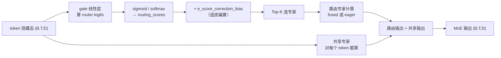

# 第 05 章 MoE 动作专家：token 路由、共享/路由专家与融合 kernel

> [第 02 章](./02_双塔架构总览_VLM与动作专家逐层交替) 讲过，双塔在每层注意力后各走各的 FFN。动作专家的部分层，这个 FFN 被换成了 token-level 稀疏 MoE。本章逐行拆 `Qwen2TokenMoeBlock`（`qwen2_action_expert.py`）：token 怎么被打分、sigmoid/softmax 路由怎么切换、共享/路由专家怎么分工、fused 和 eager 两种实现差在哪。MoE 的通用原理见 [MoE 前置知识](/前置知识/005n_前置知识_MoE稀疏专家混合)，这里只讲 LingBot 的落地。

## 一、MoE 装在哪些层

不是所有层都用 MoE。`_install_moe_blocks`（在 `QwenvlWithExpertV2Model`）根据配置 `token_moe_layers`（一个层号列表）把指定层的 `mlp` 替换成 `Qwen2TokenMoeBlock`：

```python
for idx in token_moe_layers:
    self.qwen_expert.model.layers[idx].mlp = Qwen2TokenMoeBlock(token_config)
```

**这段代码在做什么**：只对配置里列出的那些层，把动作专家原本的稠密 FFN 换成 MoE block，其余层保持稠密。

替换时从配置读的关键参数：`token_num_experts`（路由专家数，默认 32）、`token_top_k`（每 token 激活几个，默认 1）、`token_moe_intermediate_size`（路由专家中间宽度，默认 256）、`token_shared_intermediate_size`（共享专家中间宽度）、`router_activation`（sigmoid 或 softmax）、`bias_update_speed`（负载均衡偏置更新速度，第 08 章用）。

## 二、Qwen2TokenMoeBlock 的组成

一个 MoE block 里有这么几个部件：



> 三个核心部件：`gate`（打分的线性层）、`experts`（一批路由专家，fused 存成 3D 权重或 eager 存成 ModuleList）、`shared_expert`（对每个 token 都算的共享专家）。此外还有一个 `e_score_correction_bias` 缓冲区，用于第 08 章的无辅助损失负载均衡。

## 三、路由：打分、选拔、加权

`forward` 的前半段是路由。先把 token 展平成 `(B*T, D)`，然后**在真正的 fp32 下**算 router logits——这是一个容易被忽略但很关键的细节：

```python
with torch.amp.autocast(hidden_flat.device.type, enabled=False):
    router_logits = F.linear(hidden_flat.float(), self.gate.weight.float())
```

**为什么强制 fp32**：在 bf16 下，两个非常接近的 router logit 可能因为精度不足而翻转 Top-K 的选择结果，导致路由抖动、专家"轮流死亡"。关掉 autocast、用 fp32 算 gate，保证选择稳定。注释里明确写了这一点。

接着按配置选 sigmoid 或 softmax 把 logit 变成 routing scores：

```python
if self._router_activation == 'sigmoid':
    routing_scores = router_logits.sigmoid()
else:
    routing_scores = F.softmax(router_logits, dim=1, dtype=torch.float)
```

LingBot 默认用 sigmoid（逐专家独立打分），原因见 [MoE 前置知识](/前置知识/005n_前置知识_MoE稀疏专家混合#二-路由器-怎么决定-token-交给谁)：避免 softmax 的零和竞争导致路由坍塌。

然后是本文最有代表性的一步——**选拔用带偏置的分，加权用不带偏置的分**：

```python
scores_for_choice = routing_scores + self.e_score_correction_bias.unsqueeze(0)
_, selected_experts = torch.topk(scores_for_choice, self.top_k, dim=-1)   # 选：带偏置
routing_weights = routing_scores.gather(1, selected_experts)              # 权重：不带偏置
```

**这段代码在做什么**：挑哪 K 个专家时，用"真实亲和度 + 选拔偏置"排序（偏置让冷门专家更容易入选，均衡负载）；但被选中之后，加权用的是**原始的**亲和度（不含偏置），保证输出不被偏置扭曲。这正是无辅助损失负载均衡的精髓——把"均衡"和"信任度"解耦。偏置 `e_score_correction_bias` 怎么更新，是第 08 章的内容；这里只要知道 forward 里它被这样用。

如果配置了 `norm_topk_prob`，再对入选的 K 个权重归一化到和为 1：

```python
if self.norm_topk_prob:
    routing_weights = routing_weights / (routing_weights.sum(dim=-1, keepdim=True) + 1e-20)
```

训练时还会顺手记录每个专家被分到多少 token（`_update_moe_runtime_stats`），累加进 `tokens_per_expert` 缓冲区——这是第 08 章负载均衡 hook 的数据来源。

## 四、路由专家计算：fused 还是 eager

选好了专家、算好了权重，接下来真正让专家处理 token。这里有两条路径。

**eager 路径**（简单但慢）：让**每个**专家都处理**所有** token，再用一个 mask 把"这个 token 该用哪些专家的输出"选出来加权：

```python
expert_outputs = torch.stack([expert(hidden_flat) for expert in self.experts], dim=0)  # (E, B*T, D)
expert_mask = F.one_hot(selected_experts, num_classes=self.num_experts).float()
weights = (expert_mask * routing_weights.unsqueeze(-1).float()).sum(dim=1)
final_hidden_states = torch.einsum('ebd,be->bd', expert_outputs, weights)
```

**这段代码在做什么**：所有专家都对所有 token 算一遍（浪费，但 torch.compile 友好、实现简单），然后用 one-hot mask 只保留每个 token 实际选中的专家输出，按权重加权求和。它的计算量是稠密的（没有真正省算力），但对 `torch.compile` 和分布式很友好，适合小专家数或调试。

**fused 路径**（真正省算力）：把 E 个专家的权重存成 3D 张量（`Qwen2FusedExperts`），用 group GEMM（分组矩阵乘）只对每个专家实际分到的 token 做计算：

```python
if self._moe_implementation == 'fused':
    final_hidden_states = self.experts(
        module=self, num_experts=self.num_experts,
        routing_weights=routing_weights, selected_experts=selected_experts,
        hidden_states=hidden_flat,
    )
```

`Qwen2FusedExperts` 把 gate/up/down 三个投影都存成 `[E, ...]` 的 3D 参数，forward 里调 `fused_moe_forward`（底层 group GEMM kernel）。推理时如果在 CUDA 上且非训练态，还会走更快的 `robby_moe_forward`（带预分配 workspace 的定制 kernel），失败则回退到 `fused_moe_forward`：

```python
use_robby_moe = (robby_moe_forward is not None and hidden_flat.is_cuda
                 and not self.training and not torch.is_grad_enabled())
```

**为什么要两条路径**：eager 实现简单、编译友好，适合训练和调试；fused/robby 用 group GEMM 只算被激活的专家，是真正实现"稀疏省算力"的推理路径。这解释了为什么 MoE 能"参数多但推理不慢"——省算力发生在 fused kernel 里。

## 五、共享专家：每个 token 都过

路由专家算完，还要加上**共享专家**的贡献。共享专家对每个 token 都算（不参与路由），承载所有本体共通的通用控制先验：

```python
shared_expert_output = self.shared_expert(hidden_flat)
if self._use_shared_expert_gate:
    shared_expert_output = F.sigmoid(self.shared_expert_gate(hidden_flat)) * shared_expert_output
final_hidden_states = final_hidden_states + shared_expert_output
```

**这段代码在做什么**：共享专家对每个 token 算一份"通用底座"，可选地再乘一个 sigmoid 门控（`shared_expert_gate`，一个输出标量的线性层）来动态调节共享分量的强度，最后加到路由专家的输出上。

这里的 `shared_expert_gate` 是 LingBot 的一个细节：它让模型能**逐 token 决定**"这个 token 要多依赖通用底座、多依赖专精专家"。比如一个很常规的动作 token 可能主要靠共享专家，而一个本体特有的复杂动作 token 更依赖路由专家。

每个专家（无论共享还是路由）内部是标准的 SwiGLU MLP：

```python
def forward(self, x):
    return self.down_proj(self.act_fn(self.gate_proj(x)) * self.up_proj(x))
```

即"门控通路（过 SiLU）逐元素乘内容通路，再降维"，和 [MoE 前置知识里讲的专家结构](/前置知识/005n_前置知识_MoE稀疏专家混合#四-共享专家-+-路由专家-既要通用又要专精) 一致。

## 六、MoE 层输出如何回到双塔

`Qwen2TokenMoeBlock.forward` 返回 `(final_hidden_states, router_logits)`——除了隐藏态，还返回 router logits。这个 router logits 会被 [第 02 章](./02_双塔架构总览_VLM与动作专家逐层交替) 提到的 DecoderLayer 收集起来，一路传到主模型的 `_moe_losses_and_metrics`，用于第 08 章的 MoE 辅助损失和监控指标。

回到双塔视角：动作专家的某一层，注意力算完后，如果是 MoE 层，隐藏态就走这个 `Qwen2TokenMoeBlock` 而不是稠密 FFN，输出再加残差、传给下一层。整个替换对双塔的其余部分是透明的——这也是为什么 MoE 能"即插即用"地装进动作专家。

## 为什么 MoE 装在动作专家而不是 VLM

最后回答 [第 01 章](./01_全景图_LingBotVLA2在解决什么问题) 留的问题：为什么 MoE 装在动作专家、而不是 VLM？

因为跨 20 种本体的**动作**数据是高度异构的——不同机器人的关节数、动力学、控制频率都不同，动作分布差异极大。这种异构性正好是 MoE"稀疏专精"的用武之地：让不同 token 自适应地选不同专家，通用规律进共享专家、本体特有模式进路由专家。而 VLM 处理的是图像和语言，这部分的知识相对同质（都是"理解场景"），用现成的 Qwen3-VL 稠密结构就够了，没必要也 MoE 化。这个"在动作侧而非理解侧引入稀疏容量"的选择，是 LingBot 针对 VLA 数据特点做的针对性设计。

## 下章预告

下一章讲另一个模型核心——**双查询蒸馏**。我们会看 `embed_prefix` 里那三类查询 token（当前深度 / 未来深度 / 未来视频）是怎么插进序列的、两个教师（LingBot-Depth 和 DINO-Video）怎么提供监督、蒸馏 loss 怎么算、以及用注意力掩码屏蔽"未来查询影响当前动作"的工程细节。
