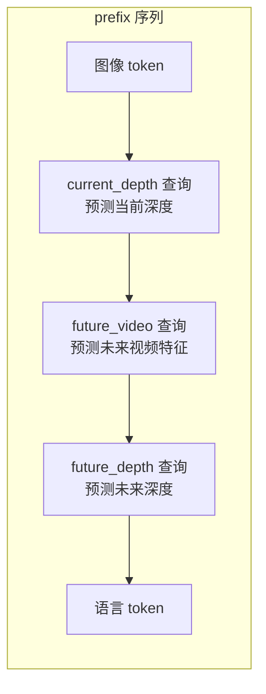
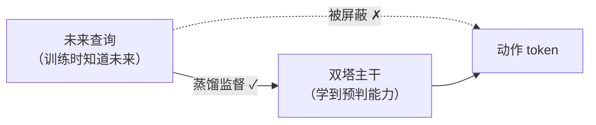

# 第 06 章 双查询蒸馏：三类查询 token、两个教师与蒸馏 loss

> 这是 LingBot-VLA 2.0 补"不会预判未来"这个缺口的核心机制，也是模型侧最有特色的设计。本章讲清楚：在 [第 02 章](./02_双塔架构总览_VLM与动作专家逐层交替) 那条 prefix 序列里插入的**查询 token** 到底是什么、两个教师（LingBot-Depth 和 DINO-Video）怎么提供监督、蒸馏 loss 怎么算、以及用注意力掩码屏蔽"未来查询干扰动作"的工程细节。蒸馏的通用原理见 [知识蒸馏基础](/前置知识/000v_前置知识_知识蒸馏基础)。

## 一、它在系统里的位置、什么时候用、为什么需要

先建立连接，这是理解一切的前提：

- **位置**：在 VLM 的 prefix 序列里（图像 token 和语言 token 之间/之后）插入几个**可学习的查询 token**。它们和普通 token 一样过双塔的每一层注意力，最后拿到各自的输出表示。
- **什么时候用**：主要在**训练时**。训练时用两个"教师模型"去监督这些查询 token，逼它们学会预测当前和未来的几何/时序特征——这是一个**辅助代理任务**，本身不直接产出动作，但通过反向传播把"预判能力"灌进整个双塔主干。推理时这些查询可以顺带输出感知结果（深度图、视频特征）用于可视化，但对动作生成不是必需的。
- **为什么需要**：只对当前画面做动作回归的模型没有"未来观念"。让一个查询去预测**未来帧**的表示，等于强迫模型在决策时就想清楚"我这串动作会把场景变成什么样"——这正是长程、接触丰富任务所需的时序推理。

## 二、三类查询 token

代码里（`embed_prefix`，`modeling_lingbot_vla_v2.py`）最多会插入三类查询 token，由配置开关控制是否启用：



> 三类查询各司其职：`current_depth`（当前深度，几何）、`future_depth`（未来深度，几何 + 预判）、`future_video`（未来视频特征，时序 + 预判）。它们都是可学习向量（`nn.Embedding` 或参数），插进序列后随双塔一起前向。图中是同时开启时的排布；具体启用哪些、顺序如何，由 `prefix_query_segments` 根据配置动态决定。

代码里用一个 `_append` 辅助函数把这些查询按 `prefix_query_segments` 返回的顺序拼进序列：

```python
for segment_name in prefix_query_segments(use_depth_align=True, use_future_depth=..., use_future_video=...):
    if segment_name == "language":
        _append(lang_emb, lang_masks, lang_tokens.to(device))
    elif segment_name == "current_depth":
        _append(align_embs, align_pad_masks, fake_align_ids)
    elif segment_name == "future_video":
        _append(future_video_align_embs, align_pad_masks, fake_align_ids)
    elif segment_name == "future_depth":
        _append(future_align_embs, align_pad_masks, fake_align_ids)
```

**这段代码在做什么**：按配置决定的顺序，依次把语言 token 和各类查询 token 追加进 prefix。每个查询 token 都配了假的 `input_ids`（用 eos_token_id 占位，因为它们不是真的词），以便走完 embedding 和位置编码流程。

一个细节：`_get_align_tokens` 会把多个查询实例做平均池化得到一组代表向量，再复制到 batch 里。当同时启用未来深度和未来视频、且配置共享时，还会把两路查询拼起来过一个投影层融合——但核心思想不变：一组代表"当前/未来 × 几何/时序"的可学习查询。

## 三、两个教师

查询 token 要学的目标由两个教师提供。它们是冻结的、只在训练时前向、不回传梯度。

**深度教师 LingBot-Depth（几何监督）**：从一张图估出深度表示 $\mathbf{D}$（每像素离相机多远）。它给几何——当前和未来画面里物体在哪、多远。

**因果视频教师 DINO-Video（时序监督）**：一个"机器人感知版"的视频表示模型，建在 DINOv3 图像骨架上，额外加了**分块因果时序注意力**（每帧特征只能看当前和过去，不能偷看未来）和 3D 旋转位置编码。它给时序动态——东西怎么动、运动的因果。看 `DinoVideoTeacher.get_future_feature`（`vision_models/dino_video/teacher.py`）：

```python
@torch.no_grad()
def get_future_feature(self, video, return_cls=False, return_current=False, current_index=0, fps=None):
    outputs = self.adapter.get_intermediate_layers(video, n=self.n_blocks, ...)
    patches = patches.view(batch_size, frames, tokens_per_frame, -1)
    future_patches = patches[:, -1].detach()      # 最后一帧 = 未来
    if return_current:
        current_patches = patches[:, current_index].detach()   # 当前帧
```

**这段代码在做什么**：教师对一段视频片段（含当前帧和未来帧）做一次因果前向，取出最后一帧的 patch 特征作为"未来"目标、当前帧的 patch 特征作为"当前"目标。`@torch.no_grad()` 和 `.detach()` 保证教师不回传梯度。`attention_mode="flex_block_causal"` 强制因果——这很关键，如果教师能偷看未来，蒸出来的特征会泄露未来信息，真实部署时不可用。

## 四、蒸馏 loss

主模型 `forward` 里，双塔算完后，把查询 token 对应位置的输出表示取出来，各自投影到教师的特征空间，和教师目标算差。

深度蒸馏用 L1（深度图有硬边缘异常值，L1 更稳健）：

$$
\mathcal{L}_{depth} = \mathbb{E}\Big[\big\|\mathrm{Proj}_{depth}(\mathbf{Q}_t) - \mathbf{D}_t\big\|_1 + \big\|\mathrm{Proj}_{depth}(\mathbf{Q}_{t+T}) - \mathbf{D}_{t+T}\big\|_1\Big]
$$

**这个公式在做什么**：让当前查询 $\mathbf{Q}_t$ 猜准当前深度、未来查询 $\mathbf{Q}_{t+T}$ 猜准未来深度，两份偏差加起来当 loss。

::: details 📐 公式详解（点击展开）

| 子表达式 | 它是谁 | 它在干嘛 |
|---------|--------|---------|
| $\mathrm{Proj}_{depth}(\mathbf{Q}_t)$ | **当前几何的猜测** | 当前查询经投影头映到深度特征空间 |
| $\mathbf{D}_t$ | **当前几何真值** | 深度教师从当前帧提取的深度表示 |
| $\mathrm{Proj}_{depth}(\mathbf{Q}_{t+T})$ | **未来几何的猜测** | 未来查询映到深度空间，代表"预判未来空间结构" |
| $\mathbf{D}_{t+T}$ | **未来几何真值** | 教师从未来帧提取的深度 |
| $\|\cdot\|_1$ | **L1 偏差** | 逐元素绝对差，对异常值稳健 |

**用人话读**："当前查询要猜准当前深度、未来查询要猜准未来深度，两份差之和就是深度 loss。"

**为什么当前和未来都蒸**：只蒸当前，模型只懂"此刻的空间"；加上未来那一项，才逼模型学会"预判未来物体移到哪、离多远"，这是几何层面的时序预判。$T$ 就是动作块长度——预判的正是这一整块动作执行完后的场景。
:::

视频蒸馏用 L2（Frobenius 范数，DINO 特征是连续稠密语义向量，L2 更贴合）：

$$
\mathcal{L}_{video} = \mathbb{E}\Big[\big\|\mathrm{Proj}_{video}(\mathbf{Q}_t) - \mathbf{Z}_t\big\|_F^2 + \big\|\mathrm{Proj}_{video}(\mathbf{Q}_{t+T}) - \mathbf{Z}_{t+T}\big\|_F^2\Big]
$$

**这个公式在做什么**：让两个查询分别对齐视频教师给出的当前、未来运动特征，从而学到"运动感知"及其未来演化。

::: details 📐 公式详解（点击展开）

| 子表达式 | 它是谁 | 它在干嘛 |
|---------|--------|---------|
| $\mathrm{Proj}_{video}(\mathbf{Q}_t)$ | **当前运动特征猜测** | 当前查询映到 DINO-Video patch 特征空间 |
| $\mathbf{Z}_t$ | **当前运动特征真值** | DINO-Video 对当前帧的因果特征 |
| $\mathbf{Z}_{t+T}$ | **未来运动特征真值** | 教师对未来帧的特征，代表运动如何演化 |
| $\|\cdot\|_F^2$ | **Frobenius 范数平方** | 特征矩阵逐元素平方差之和，即高维 L2 |

**用人话读**："当前查询对齐当前运动特征、未来查询对齐未来运动特征，差多少就是视频 loss。"

**为什么视频用 L2 而深度用 L1**：深度图有硬边缘异常值，L1 稳健；DINO-Video 特征是连续稠密的语义向量，L2 更适合拟合这种高密度特征。两个 loss 各按权重（`depth_loss_weight` / `future_video_loss_weight`）加进总损失。
:::

代码里这两个 loss 由 `depth_emb_forward` 和 `video_emb_forward` 计算，各乘权重后返回，最终和 Flow Matching 的动作 loss、MoE 辅助损失一起构成总损失（第 08 章汇总）。

## 五、注意力屏蔽：别让未来查询"泄题"给动作

有一个很关键的工程细节：**未来查询（future_depth / future_video）不能被动作 token 看到**。

原因是：未来查询在训练时确实"知道"未来（它被未来帧的教师特征监督）。但动作 token 是要在推理时生成动作的，那时候未来还没发生。如果训练时允许动作 token 通过注意力去"看"未来查询，模型就会学到一条"作弊捷径"——直接从未来查询里抄未来信息来生成动作。这样训出来的模型一到真实推理（没有未来信息）就崩。

所以代码用注意力掩码把这条路堵死。主模型 `forward` 和 `predict_velocity` 里都有：

```python
if self.block_future_depth_to_action:
    att_2d_masks = block_suffix_to_fv_(att_2d_masks, suffix_row_start=prefix_len, ...)
att_2d_masks = self._block_suffix_to_future_video_if_enabled_(att_2d_masks, ...)
```

**这段代码在做什么**：修改二维注意力掩码，把"suffix（动作）行看向 future_video/future_depth 查询列"的位置置为不可见。这样动作生成完全不依赖未来查询——未来查询只用于被教师蒸馏、给主干灌预判能力，而不给动作开后门。



> 未来查询和动作之间的直接注意力被切断（虚线打叉），但未来查询通过蒸馏把预判能力灌进主干，主干再正常地影响动作。预判能力"绕道"进入动作生成，而不是"抄近路"。这是让蒸馏在推理时依然有效的关键设计。

## 下章预告

蒸馏讲完了，下一章讲动作到底怎么被生成出来——**Flow Matching**。我们会看训练目标 `x_t = t·noise + (1-t)·action` 和速度场 `u_t = noise - action` 是怎么来的、推理时欧拉法怎么几步从噪声积分出动作、以及为什么 prefix 的 KV-Cache 能在积分的每一步复用来提速。
