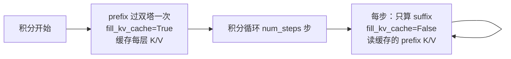

# 第 07 章 Flow Matching 动作生成：训练目标、欧拉采样与 KV-Cache 复用

> 前几章讲了模型怎么理解场景、怎么用 MoE 扩容量、怎么蒸入预判能力。本章讲最后一环：动作到底怎么被"生成"出来。LingBot-VLA 2.0 用 Flow Matching——在噪声和真实动作之间画一条直线，训练模型预测这条线上的"前进方向"（速度场），推理时从噪声出发、沿速度场几步积分就得到动作。我们会看训练目标、欧拉采样、以及 prefix 的 KV-Cache 怎么在每步积分里复用来提速。

## 一、直觉：把生成动作变成"沿直线走路"

直接让模型一步输出一整段动作很难（动作是高维连续序列，分布复杂）。Flow Matching 把它拆成"从噪声逐步走向动作"的过程：

- 在纯噪声 $\text{noise}$ 和真实动作 $\text{action}$ 之间连一条直线；
- 训练时随机停在直线上某一点，问模型"从这里该往哪个方向走才能到达真实动作"，模型学着指出这个方向（速度场）；
- 推理时从噪声出发，反复问模型方向、走一小步，几步就走到动作。

因为路径是直线，方向处处相同（就是"终点减起点"），所以只需要很少的积分步数。

## 二、训练目标：直线插值与速度场

主模型 `forward`（`modeling_lingbot_vla_v2.py`）里，训练目标的构造只有三行，但每一行都对应上面的直觉：

```python
time_expanded = time[:, None, None]
x_t = time_expanded * noise + (1 - time_expanded) * actions
u_t = noise - actions
```

第一行 `x_t` 是直线上的插值点。当时间 $t=1$ 时 $x_t=\text{noise}$（起点），$t=0$ 时 $x_t=\text{action}$（终点），中间是线性混合：

$$
x_t = t \cdot \text{noise} + (1-t)\cdot \text{action}
$$

**这个公式在做什么**：在噪声和真实动作之间取一个由 $t$ 决定的插值点——$t$ 越接近 1 越像噪声，越接近 0 越像真实动作。

::: details 📐 公式详解（点击展开）

| 子表达式 | 它是谁 | 它在干嘛 |
|---------|--------|---------|
| $\text{noise}$ | **起点** | 随机高斯噪声，$t=1$ 时的位置 |
| $\text{action}$ | **终点** | 归一化后的真实动作，$t=0$ 时的位置 |
| $t$ | **路上的位置** | 0~1 之间，标记走到直线的哪儿了 |
| $t\cdot\text{noise}+(1-t)\cdot\text{action}$ | **当前落脚点** | 起点和终点的线性混合 |

**用人话读**："在噪声到动作的直线上，按 $t$ 取一个点当作模型此刻站的位置。"

**为什么是这个约定（$t=1$ 是噪声）**：这样推理时时间从 1 走到 0，正好从噪声走到动作，和采样循环（下一节 `dt<0`）对应。注意这是本仓库主模型的约定，和调度器文件 `flow_match.py` 里 $x_t=(1-\sigma)\text{sample}+\sigma\text{noise}$ 的 $\sigma$ 约定方向相反，读代码时留意用的是哪套。
:::

第二行 `u_t = noise - actions` 是速度场目标——直线的方向（终点指向起点，因为时间从 1 到 0 是往噪声那头标记的）。模型的动作专家输出 $v_t$，训练就是让 $v_t$ 逼近 $u_t$：

```python
v_t = self.action_out_proj(suffix_out)   # 模型预测的速度场
if loss_type == "fm":
    losses = F.mse_loss(u_t, v_t, reduction="none")   # 默认 L2
elif loss_type == "L1_fm":
    losses = F.l1_loss(u_t, v_t, reduction="none")
```

**这段代码在做什么**：把动作专家在动作 token 位置的输出投影成速度场预测 $v_t$，和真实方向 $u_t=\text{noise}-\text{action}$ 算 MSE（或 L1）。默认用 L2——论文消融显示相对动作大多是零附近小修正，L2 更贴合高密度区（见 [论文精读](/论文综述/139_LingBotVLA2_从基础到应用的实用VLA#五-实验-它到底比前代和-π₀.₅-强在哪)）。

这里 `suffix_out` 只取动作那一段（`suffix_out[:, -n_action_steps:]`），因为 suffix 里还有 state token，只有动作 token 需要输出速度场。

## 三、推理：欧拉法几步积分

训练好之后，推理时从噪声出发，沿速度场积分。`sample_actions` 用最朴素的欧拉法：

```python
dt = torch.tensor(-1.0 / self.config.num_steps, ...)   # 每步时间增量，负的
x_t = noise
time = torch.tensor(1.0, ...)                           # 从 t=1 出发
while time >= -dt / 2:
    v_t = predict_velocity_fn(state, prefix_pad_masks, past_key_values, x_t, time.expand(bsize), ...)
    x_t += dt * v_t     # 沿速度场走一小步
    time += dt          # 时间递减
```

**这段代码在做什么**：从纯噪声（$t=1$）出发，每步问模型当前速度场 $v_t$、沿它走 `dt` 那么长的一步、时间递减，循环 `num_steps` 步后 $x_t$ 就从噪声变成了动作。`dt` 是负的（时间从 1 走到 0），`while time >= -dt/2` 控制走满 `num_steps` 步。

因为是直线，即使步数少（部署时约 10 步）也不会偏太多——这就是 Flow Matching 相比多步扩散的效率优势。README 里提到：RTX 4090D 上一次推理（10 步去噪）约 130ms。

## 四、KV-Cache 复用：为什么积分每步不用重算 prefix

采样循环要跑 `num_steps` 步，每步都要过一次双塔。如果每步都把图像、语言、查询 token（prefix）重新算一遍注意力，就太浪费了——因为**prefix 在整个积分过程中完全不变**（图像没变、指令没变），变的只有 suffix 里的加噪动作 $x_t$。

LingBot-VLA 2.0 的做法：积分开始前，先用 prefix 过一次双塔，把每一层的 K/V 缓存下来；之后每步只算 suffix，并让 suffix 的注意力去读缓存的 prefix K/V。



> prefix 只算一次并缓存（`fill_kv_cache=True`），之后每步积分只重算 suffix（`fill_kv_cache=False`），suffix 的注意力去读缓存里的 prefix K/V。省掉了 `num_steps-1` 次 prefix 前向。

对应代码。积分前，用 `inputs_embeds=[prefix_embs, None]`（第二塔为 None，只算 prefix）填充缓存：

```python
_, past_key_values, _ = self.qwenvl_with_expert.forward(
    ..., inputs_embeds=[prefix_embs, None],
    use_cache=self.config.use_cache, fill_kv_cache=True, ...
)
```

积分每一步，`predict_velocity` 用 `inputs_embeds=[None, suffix_embs]`（第一塔为 None，只算 suffix），并传入缓存的 `past_key_values`：

```python
outputs_embeds, _, _ = self.qwenvl_with_expert.forward(
    attention_mask=full_att_2d_masks, position_ids=position_ids,
    past_key_values=past_key_values,           # 复用缓存
    inputs_embeds=[None, suffix_embs],
    use_cache=self.config.use_cache, fill_kv_cache=False, ...
)
```

**这段代码在做什么**：`fill_kv_cache=True` 那次把 prefix 的 K/V 存进 `past_key_values`；之后每步 `fill_kv_cache=False`，只算 suffix 的 Q/K/V，注意力时把 suffix 的 K/V 和缓存的 prefix K/V 拼起来算——[第 02 章](./02_双塔架构总览_VLM与动作专家逐层交替) 讲的 `handle_kv_cache` 就是干这个的。这样每步的计算量从"整条序列"降到"只有 suffix"。

注意力掩码也相应处理：suffix 的每个动作 token 都能看到全部 prefix（`prefix_pad_2d_masks` 全 1），再叠加 suffix 内部的因果结构，以及 [第 06 章](./06_双查询蒸馏_查询token与两个教师) 那个"屏蔽未来查询"的掩码。

## 五、时间与状态怎么进模型：embed_suffix

最后补一个细节：suffix 是怎么构造的。`embed_suffix`（本章未贴全）把三样东西编码进 suffix：

- **state**：机器人当前的 55 维状态，过 `state_proj` 线性层投影到模型维度，成为 state token；
- **加噪动作 $x_t$**：过 `action_in_proj` 投影成动作 token；
- **时间 $t$**：编码成时间嵌入，和动作 token 结合（通过 `action_time_mlp_in/out` 两个 MLP），告诉模型"现在积分到第几步了"。

时间嵌入既可以拼进动作 token，也可以作为 `ada_cond`（自适应归一化的条件）喂给动作专家的每一层——取决于配置 `adanorm_time`。这就是 [第 02 章](./02_双塔架构总览_VLM与动作专家逐层交替) 里那个只喂给动作专家（`i==1`）的 `ada_cond` 的来源。

至此，一次完整的动作生成链路清晰了：state + 噪声 + 时间 → suffix；prefix（图像+语言+查询）缓存好 → 每步只算 suffix、读缓存、输出速度场 → 欧拉积分 → 反归一化 → 真实动作。

## 下章预告

模型的所有组件都讲完了。最后一章回到**训练方法**：一个训练 step 里，Flow Matching 动作 loss、深度/视频蒸馏 loss、MoE 辅助损失是怎么加权组合的；MoE 路由的三种训练模式（无辅助损失偏置 hook / sequence-wise 辅助损失 / router z-loss）分别怎么配、怎么切换；以及可选的 Muon 优化器和 FSDP2 分布式。
