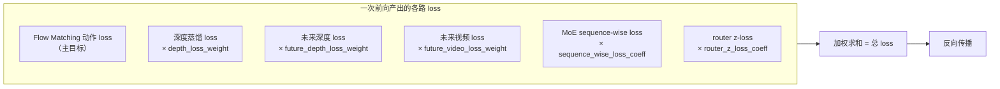

# 第 08 章 训练循环与 MoE 三种路由训练模式、Muon 优化器

> 模型的所有组件都讲完了，最后一章把它们串成训练。核心问题有三个：一个训练 step 里那么多路 loss 怎么加权组合？MoE 路由的负载均衡有三种可切换的训练模式，分别怎么配、什么关系？以及可选的 Muon 优化器和 FSDP2 分布式。本章对着 `train_lingbotvla.py`、`moe_load_balance.py`、`ops/moe_loss.py` 和 `robotwin.yaml` 一起看。

## 一、多路 loss 怎么组合

[第 06、07 章](./06_双查询蒸馏_查询token与两个教师) 已经见过各路 loss。主模型 `forward` 一次前向返回一整串：动作 loss、深度 loss、未来深度 loss、未来视频 loss、以及 MoE 的 sequence-wise loss 和 router z-loss。训练脚本把它们加权求和成总 loss：



> 主目标是 Flow Matching 动作 loss（学动作本身）；深度/视频蒸馏 loss 灌几何和时序预判；MoE 两路辅助 loss 管路由均衡。各路权重在 `robotwin.yaml` 的 `align_params` 和 MoE 配置里，蒸馏权重都很小（如 `depth_loss_weight: 0.004`），避免辅助任务盖过主目标。

从 `robotwin.yaml` 能读出具体权重：动作 loss 用 `loss_type: L1_fm`；深度/未来深度/未来视频权重都是 0.004；MoE 的 `sequence_wise_loss_coeff: 1e-3`、`router_z_loss_coeff: 1e-4`。可以看到辅助 loss 的系数都比主目标小两三个数量级——它们是"轻推"，不能喧宾夺主。

## 二、MoE 路由的三种训练模式

这是本章的重点。[第 05 章](./05_MoE动作专家_token路由与融合kernel) 讲过 MoE 会有"少数专家赢家通吃"的失衡倾向。LingBot-VLA 2.0 提供了**三种可组合的均衡手段**，可以单用也可以混用。理解它们的关系是配好 MoE 训练的关键。

### 模式一：无辅助损失偏置（loss-free，主打）

这是 [MoE 前置知识](/前置知识/005n_前置知识_MoE稀疏专家混合#五-负载均衡-别让少数专家累死-多数专家闲死) 详解的 DeepSeek-V3 方案，也是 LingBot 默认推崇的。它不往 loss 里加任何东西，而是给每个专家一个**选拔偏置** `e_score_correction_bias`，通过一个注册在优化器上的 pre-hook 来调整。

hook 在 `moe_load_balance.py`，它在每次 `optimizer.step()` 前执行：统计各专家累计负载 → 跨 rank all-reduce → 按"偏离均值的符号"调偏置：

```python
mean_load = tpe.float().mean()
deviation = (tpe.float() - mean_load).sign()
block.e_score_correction_bias.add_(-coeff * deviation)   # 比平均忙就降、闲就升
block.tokens_per_expert.zero_()                           # 重置累加器
```

**这段代码在做什么**：比平均忙的专家把偏置降一小步（下次更难被选）、比平均闲的升一小步（下次更易被选），只用符号 `sign` 保证平滑不震荡。`coeff` 就是配置里的 `bias_update_speed`。

hook 还有一个 `update_interval` 参数——每 N 步才更新一次偏置，中间持续累加负载。这是为了在 global batch 较小时，用更大的 token 样本让 `sign(load-mean)` 的方向更可靠，避免偏置在 0 附近随机游走：

```python
_state["step"] += 1
if _state["step"] % update_interval != 0:
    return   # 不更新，继续累加 tokens_per_expert
```

**要开启这个模式**：把 `bias_update_speed` 设为正数（如 `0.00025`），同时关掉下面两个辅助 loss。

### 模式二：sequence-wise 辅助损失

这是往主 loss 里加一个均衡惩罚项。`ops/moe_loss.py` 的 `sequence_wise_balance_loss` 对每个序列（每个样本的动作 token 集合）算"专家分配频率 × 平均路由概率"：

```python
P_i = torch.mean(probs, dim=0)          # 每个专家的平均路由概率
f_i = (E / top_k) * torch.mean(mask, dim=0)   # 每个专家的分配频率（归一化）
loss_per_seq.append(torch.sum(f_i.detach() * P_i))   # f_i 不回传梯度
```

**这段代码在做什么**：如果某专家既被频繁选中（`f_i` 大）又有高路由概率（`P_i` 大），乘积就大、loss 就大，从而惩罚"过度集中"。`f_i.detach()` 让梯度只流过 `P_i`——因为"选没选"这个离散操作不可导，只能通过压低热门专家的连续概率来均衡。

`sequence_wise_mode` 有两个取值：`per_sequence`（在每个样本的动作 token 内均衡，DeepSeek-V3 的本意）和 `global`（把整个 batch 当一个序列均衡）。

**要开启**：设 `sequence_wise_loss_coeff > 0`（如 `1e-3`）。

### 模式三：router z-loss

z-loss 不直接管均衡，而是防止 router logits 数值爆炸（数值稳定）。`_moe_losses_and_metrics` 里：

```python
router_z_layer_losses = [
    torch.logsumexp(logits.float(), dim=-1).pow(2).mean()
    for logits in router_logits_list
]
router_z_loss = router_z_loss_coeff * torch.stack(router_z_layer_losses).mean()
```

**这段代码在做什么**：惩罚 `logsumexp(logits)` 的平方，把 router logits 的整体幅度压住，防止它越训越大导致 softmax/sigmoid 饱和、路由僵化。

**要开启**：设 `router_z_loss_coeff > 0`（如 `1e-4`）。

### 三种模式怎么选

关键点：**loss-free（模式一）和辅助损失（模式二）通常二选一**——它们是两种不同哲学的均衡手段。z-loss（模式三）是数值稳定项，可以和任一种搭配。

`robotwin.yaml` 里的后训练配置示范了"模式二 + 模式三"的组合：

```yaml
bias_update_speed: 0          # 关掉 loss-free（模式一）
sequence_wise_loss_coeff: 1e-3  # 开启 sequence-wise 辅助损失（模式二）
router_z_loss_coeff: 1e-4       # 开启 z-loss（模式三）
```

README 里则说明了切到"纯 loss-free"的改法：注释掉 sequence-wise 和 z-loss，把 `bias_update_speed` 设为 `0.00025`。为什么后训练默认用辅助损失而不是 loss-free？因为下游数据量小时，loss-free 的偏置需要较大 token 样本才稳定，辅助损失在小数据上更直接可控；大规模预训练则更适合 loss-free（不干扰主目标）。这正呼应了论文里"预训练用 loss-free"的说法（见 [论文精读](/论文综述/139_LingBotVLA2_从基础到应用的实用VLA)）。

## 三、其余关键训练配置

对着 `robotwin.yaml` 快速过一遍其他重要开关，它们把前几章的组件都对应上了：

| 配置 | 值 | 对应章节 |
|---|---|---|
| `token_moe_layers` | 0~35 全部层 | 第 05 章：这里 36 层全用 MoE |
| `token_num_experts / token_top_k` | 32 / 4 | 第 05 章：32 个路由专家，每 token 选 4 |
| `router_activation` | sigmoid | 第 05 章：sigmoid 路由 |
| `use_future_image` / `align_params` | 开启 | 第 06 章：双查询蒸馏 |
| `adanorm_time` | true | 第 07 章：时间作为 AdaNorm 条件喂动作专家 |
| `loss_type` | L1_fm | 第 07 章：Flow Matching 用 L1 |
| `max_state_dim / max_action_dim` | 55 / 55 | 第 03 章：统一 55 维 |
| `data_parallel_mode` | fsdp2 | 本章下文：FSDP2 分布式 |
| `optimizer` | muon | 本章下文：Muon 优化器 |
| `micro_batch_size / global_batch_size` | 32 / 1024 | 32 卡，梯度累积凑 global |

## 四、Muon 优化器

`robotwin.yaml` 里 `optimizer: muon`。Muon 是一个对 2D 权重矩阵做"正交化动量"的优化器，它的原理和动机在 [Muon 精读](/论文综述/106_Muon_正交化动量优化器) 里讲透，这里只说 LingBot 的用法。

LingBot 用的是 `DistributedMuon`（`optim/muon.py`），针对两点做了适配：

- **FSDP2 分片的 2D 参数**：把同形状的参数"堆叠"起来，一次 NCCL 通信 gather、一次批量 Newton-Schulz 正交化、再散回本地，减少通信次数。
- **3D MoE 专家权重**：[第 05 章](./05_MoE动作专家_token路由与融合kernel) 的 `Qwen2FusedExperts` 把 E 个专家权重存成 3D 张量，Muon 对这种 3D 栈做批量正交化。

Muon 只作用于 2D/3D 权重矩阵，其余参数（如 LayerNorm、偏置、embedding）仍用 AdamW。README 提到 Muon 能让 loss 收敛更好，但会增加训练时间；不想用就注释掉 `optimizer: muon` 回退 AdamW。配置里还有 `use_moe_expert_lr: true`，表示给 MoE 专家用单独的学习率组。

## 五、分布式：FSDP2

`data_parallel_mode: fsdp2` 表示用 PyTorch 的 FSDP2（全分片数据并行）——把模型参数、梯度、优化器状态分片到各卡，降低单卡显存。`lingbotvla/distributed/` 下有 FSDP2 的封装（`fsdp2/`）、并行状态管理（`parallel_state.py`）、以及可选的序列并行（`sequence_parallel/`，配置里 `ulysses_parallel_size: 1` 表示未启用）。

[第 05 章](./05_MoE动作专家_token路由与融合kernel) 提到 `Qwen2FusedExperts.forward` 必须通过 `self.experts(...)` 调用——正是为了触发 FSDP2 的 forward pre-hook 在用到专家权重前先 unshard。MoE 的负载均衡 hook（本章模式一）里的 all-reduce 也要在正确的进程组上做，代码预留了 `group` 参数以支持专家并行（EP）。这些都是 MoE + FSDP2 协同的工程细节。

## 系列总结

到这里，LingBot-VLA 2.0 的代码全貌就拆完了。回顾整条链路：

- **数据侧创新**（第 03、04 章）：robot config 把 20 种机器人的原始列映射进 55 维统一空间，RunningStats 在线算归一化统计，动态 batching 按 token 预算组批——这是"跨具身泛化"的数据基础。
- **模型结构**（第 02、05、06、07 章）：VLM 和动作专家逐层交替注意力共享理解；动作专家用 token-level MoE 吸收动作数据的异构性；双查询蒸馏把几何和时序预判灌进主干；Flow Matching + KV-Cache 高效生成动作。
- **训练方法**（本章）：多路 loss 加权组合，三种可切换的 MoE 均衡模式（loss-free / sequence-wise / z-loss），Muon 优化器，FSDP2 分布式。

这些设计合在一起，让 LingBot-VLA 2.0 把"广泛本体支持 + 丰富动作空间 + 未来预判能力"三件落地难事都做扎实了——这正是它标题"从基础到应用"的含义。

想从论文视角回顾这些设计的动机和实验结论，可以再读 [LingBot-VLA 2.0 论文精读](/论文综述/139_LingBotVLA2_从基础到应用的实用VLA)。想复现或后训练，第 03、04、08 章覆盖了 robot config、归一化、训练配置的全部实操细节。
