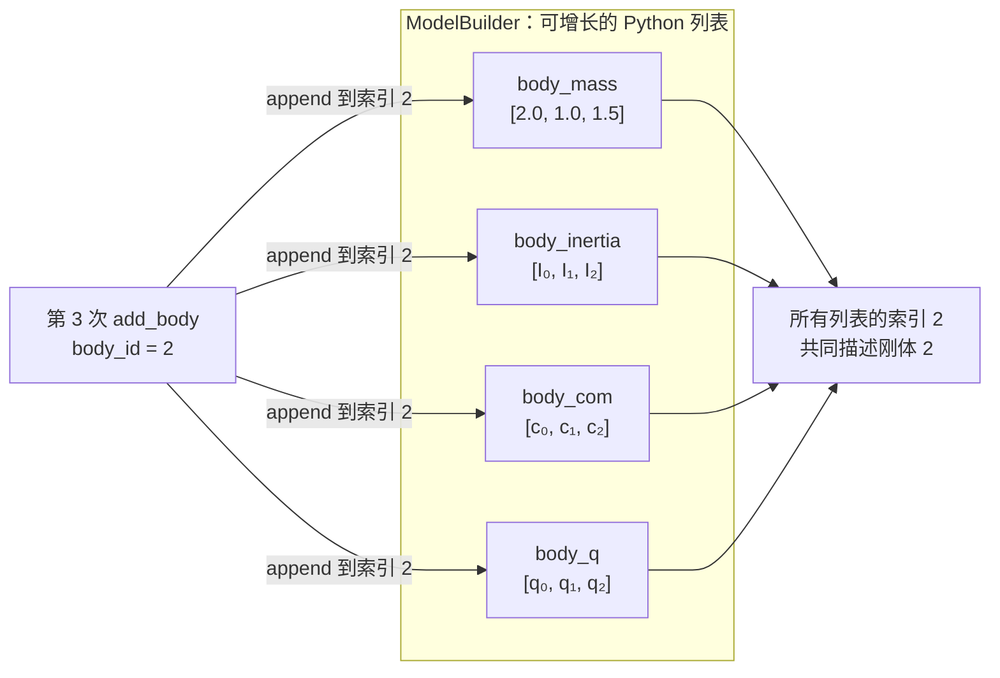
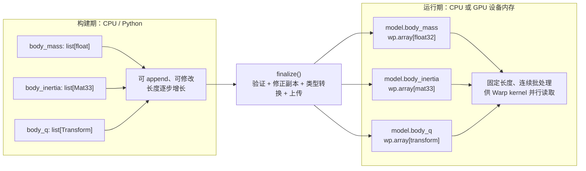
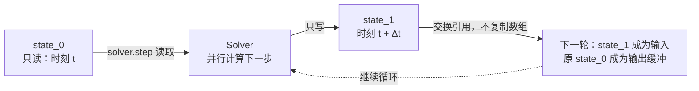
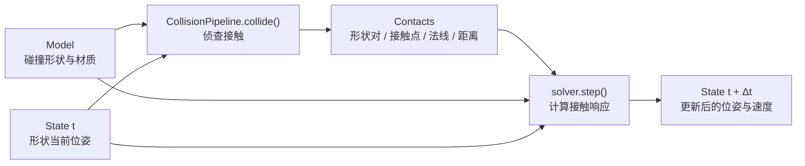
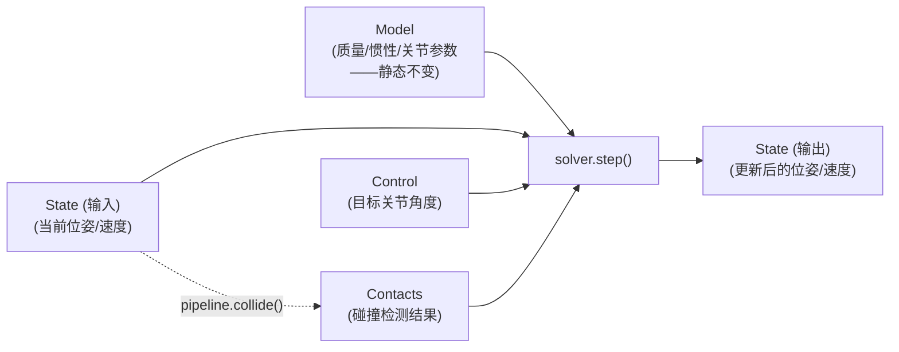
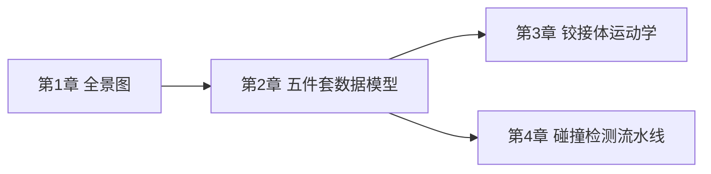

# 五件套核心数据模型：ModelBuilder、Model、State、Control、Contacts

> 系列第 2 章。上一章讲了 Newton 为什么存在，这一章讲它的地基——五个核心数据对象为什么要这样拆分，以及"扁平数组存储"这个贯穿全引擎的设计选择具体是怎么落地的。

**知识链接**：
- [全景图：为什么机器人学习需要一个新的物理引擎](./01_全景图_为什么机器人学习需要一个新的物理引擎) — 本章的"数据导向设计"来源于上一章讲的 Warp GPU 并行需求
- [刚体动力学：牛顿-欧拉方程与惯性张量](/前置知识/006b_前置知识_刚体动力学_牛顿欧拉方程与惯性张量) — 本章涉及的质量、惯性张量等物理量的定义

---

## 贯穿全文的例子

> **场景**：延续上一章的人形机器人行走任务。假设这个机器人有 20 个刚体连杆、19 个关节、40 个碰撞形状（手脚、躯干各带若干个碰撞几何体）。我们要在 Newton 里把这个机器人"搭"出来，然后跑一次仿真步——这个过程会依次用到本章要讲的全部五个对象，看它们各自在这个流程里负责什么。

---

## 一、为什么不能只用一个"Scene"对象装所有东西

### 1.1 传统面向对象仿真器的直觉设计

如果你熟悉一般的游戏物理引擎或者早期的机器人仿真库，直觉上的设计往往是这样：有一个 `World` 或 `Scene` 对象，里面装着一个 `bodies` 列表，每个 `body` 是一个类实例，自带 `position`、`velocity`、`apply_force()` 这类属性和方法。仿真每一步，遍历这个列表，对每个 body 调用它自己的更新方法。

这种设计对 CPU 上的中小规模仿真（几十到几百个物体）很自然，但放到"GPU 上并行处理几万个刚体、几千个并行环境"这个场景下会出现两个直接的问题：

1. **面向对象的"每个物体是一个独立实例"结构和 GPU 的 SIMT（单指令多线程）并行模型天然不匹配**——GPU 线程需要访问连续内存地址才能高效并行，而一堆分散的对象实例在内存里的布局是不可控的
2. **"构建阶段"（往场景里添加物体、设置参数）和"仿真运行阶段"（每一步只需要读写位置速度这些动态量）的性能需求完全不同**——构建阶段追求灵活、易用的 API，运行阶段追求最小化每一步的内存访问和计算开销，把两者混在一个对象里很难同时兼顾

### 1.2 Newton 的解法：把"构建"和"运行"彻底分离成不同对象

Newton 把整个"从零搭建一个仿真场景，到跑起来"的流程，拆成了五个职责清晰、互相解耦的对象：

```mermaid
flowchart LR
    A["ModelBuilder<br/>(构建期，灵活但慢)"] -->|finalize()| B["Model<br/>(静态，GPU扁平数组)"]
    B --> C["State<br/>(动态：位置/速度)"]
    B --> D["Control<br/>(动态：控制目标)"]
    B --> E["Contacts<br/>(动态：接触信息)"]
    C --> F["Solver.step()"]
    D --> F
    E --> F
    F --> C2["State (更新后)"]
```

每个对象只负责一件事，而且职责边界非常清晰：**`ModelBuilder` 负责"怎么搭"，`Model` 负责"搭好之后长什么样"（静态结构），`State`/`Control`/`Contacts` 负责"每一步仿真过程中变化的东西"（动态量）**。这个拆分的核心动机是把"构建期的灵活性需求"和"运行期的性能需求"彻底解耦——`ModelBuilder` 阶段可以用相对慢、相对面向对象的 Python 代码逐个添加物体，因为这个过程只发生一次；一旦调用 `finalize()`，所有数据被打包成 Warp 扁平数组存进 `Model`，后续的仿真循环只需要对这些数组做批量 GPU kernel 调用，不再有任何 Python 逐对象的开销。

---

## 二、ModelBuilder：构建期的"施工现场"

### 2.1 ModelBuilder 是什么

`ModelBuilder` 是用户实际写代码交互最多的对象——它提供了一整套 `add_xxx()` 方法（`add_body`、`add_link`、`add_joint_revolute`、`add_shape_box` 等），让用户可以像搭积木一样,一步步把机器人和场景描述出来。这个阶段的 API 设计追求的是"清晰、直观、不容易出错"，而不是性能——因为这些方法只在构建时调用一次,不在仿真循环里反复调用。

以本章例子里"给机器人加一个转动关节"为例：

```python
import warp as wp
import newton

builder = newton.ModelBuilder()

# 添加两个刚体连杆(link)，代表机器人的大腿和小腿
thigh = builder.add_link(mass=2.0)
builder.add_shape_capsule(thigh, radius=0.05, half_height=0.2)

shin = builder.add_link(mass=1.5)
builder.add_shape_capsule(shin, radius=0.04, half_height=0.18)

# 用一个转动关节(revolute)把两个连杆连起来，模拟膝关节
knee_joint = builder.add_joint_revolute(
    parent=thigh,
    child=shin,
    axis=wp.vec3(0.0, 1.0, 0.0),  # 绕Y轴转动
    limit_lower=-2.0,             # 关节角度下限(弧度)
    limit_upper=0.1,              # 关节角度上限(基本不能反向弯曲)
)

# 把这几个关节归组成一个"铰接体"(articulation)
builder.add_articulation([knee_joint], label="right_leg")
```

**代码里值得注意的细节**：`add_link` 返回的是一个整数索引（比如 `thigh` 可能就是数字 `3`），不是一个对象引用——这是"扁平数组存储"设计思路的第一个直接体现：Newton 内部用连续递增的整数索引管理所有实体（刚体、关节、形状等），后续所有引用这个刚体的地方（比如 `add_shape_capsule(thigh, ...)`）都是在传递这个索引，不是传递对象。这个设计从构建阶段就开始为后续 `finalize()` 打包成数组做铺垫。

### 2.2 ModelBuilder 的核心机制：内部维护的是"列表"，不是"数组"

先看最关键的一点：`ModelBuilder` 不是维护一个“刚体对象列表”，而是维护**多条互相平行的 Python 列表**。一次 `add_body` 会先用当前 `body_mass` 的长度确定 `body_id`，再把这个刚体的质量、惯性、质心、初始位姿等属性分别追加到各自列表的同一个位置。

下面假设前面已经添加了两个刚体，现在第三次调用 `add_body`。图中的索引 `2` 就是这次返回的 `body_id`：



> 读图时不要横着把一条列表当成“一个刚体”。真正代表刚体 2 的，是所有平行列表中索引同为 `2` 的那一组元素；整数 `body_id` 正是把这些分散属性重新对齐的键。

这种组织方式已经是**结构数组**（Structure of Arrays, SoA）的雏形，只是每一列暂时还是可增长、可修改的 Python `list`。构建期哪怕有几百个物体，逐项 `append` 的 Python 开销通常也只发生一次；此时方便添加和修改，比 GPU 计算效率更重要。

`finalize()` 才是构建期与运行期的边界。它会检查列表长度和引用关系、校验或修正质量与惯性等数据，然后在目标设备上创建固定长度的 Warp 数组。这个过程不会把 `ModelBuilder` 原地变成 `Model`；它读取 builder 中的列表，返回一个新的 `Model`，builder 自身仍然保留。



> 左边解决“场景还没搭完，数据要方便增长”的问题，右边解决“仿真开始后，同一种属性要让大量 GPU 线程连续访问”的问题。`finalize()` 的价值不是简单改个类型，而是把两种完全不同的性能需求隔开。

### 2.3 一个不那么直观但很重要的机制：add_articulation 之后才生效

细心观察上面的例子会发现，`add_joint_revolute` 调用完之后，紧接着还要调用一次 `add_articulation([knee_joint], label="right_leg")`——这是因为 Newton 把"关节怎么连接刚体"（拓扑结构）和"这些关节共同组成一个铰接体、可以整体做正逆运动学计算"（articulation 分组）当成两个独立的声明。这个设计和第 3 章要讲的"广义坐标"表示直接相关——只有明确声明了 articulation，Newton 才知道该把哪些关节的自由度打包成一组连续的广义坐标向量。

---

## 三、Model：finalize() 之后的"静态蓝图"

### 3.1 从 ModelBuilder 到 Model 的转变

调用 `builder.finalize()` 之后，`finalize()` 会读取 `ModelBuilder` 暂存的 Python 列表，在目标设备上创建 Warp 数组，并把它们装进一个新的 `Model` 对象。这个转换过程做了几件关键的事：

1. **把 Python 列表转换成目标设备上的连续内存数组**——比如所有刚体的质量，从 `builder.body_mass`（Python list）变成 `model.body_mass`（一个 `wp.array`）；目标设备设为 CUDA 时，它物理上就是 GPU 显存里一段连续的浮点数
2. **计算并填充派生量**——比如根据碰撞形状的密度和几何尺寸，自动推算出每个刚体的质量、质心、惯性张量（如果用户没有手动指定）
3. **执行有效性验证**——比如检查惯性张量是否满足三角不等式，负值或不合理的质量是否需要被修正（并可以选择性地发出警告）

`Model` 对象一旦生成，在整个仿真过程中通常**不再改变**——它代表的是"这个机器人有多少个连杆、每个连杆多重、关节怎么连接、碰撞几何是什么形状"这类**静态结构信息**。仿真循环反复读取 `Model` 里的数据（比如查询某个刚体的质量来计算重力），但不会去修改它（除非做一些特殊的模型编辑操作，比如动态改变摩擦系数）。

### 3.2 为什么"静态"这个属性很重要

`Model` 的数据不随每一步仿真变化，这个特性带来一个直接的工程好处：**Warp 可以针对固定不变的数据结构做编译期优化，比如把整个仿真步骤"捕获"成一个 CUDA Graph**（一种把一系列 GPU kernel 调用打包成单次提交、减少 CPU-GPU 通信开销的技术）。如果 `Model` 的结构（刚体数量、关节连接方式等）会在仿真过程中随意变化，这种图捕获优化就无法安全地进行——因为 CUDA Graph 要求每次重放时，kernel 调用的参数形状、内存布局都完全一致。

### 3.3 一个例子：World 分组信息也存在 Model 里

第 3、7 章会讲到 Newton 支持在同一个 `Model` 里容纳多个互相隔离的"World"（比如 1024 个并行的强化学习环境）。这些 World 的分组信息——每个刚体属于哪个 World、每个 World 从哪个索引开始——也是在 `finalize()` 时被计算并存进 `Model` 的（比如 `model.body_world` 数组记录每个刚体的 World 编号，`model.body_world_start` 记录每个 World 的起始索引）。这再次体现了"`Model` 是静态蓝图"这个设计——World 划分在构建期就已经确定，仿真运行时只是按这个划分并行处理，不会动态调整。

---

## 四、State：每一步仿真都在变化的"快照"

### 4.1 State 装的是什么

如果 `Model` 是"这个机器人长什么样"，`State` 就是"这个机器人现在在哪里、动得多快"——它装的是随仿真时间步不断变化的动态量：

- `state.body_q`：每个刚体当前的位姿（位置+朝向，即"最大坐标"表示，第 3 章详细讲）
- `state.body_qd`：每个刚体当前的速度（线速度+角速度，合称"twist"）
- `state.joint_q` / `state.joint_qd`：铰接体的关节角度和关节角速度（"广义坐标"表示）
- `state.body_f`：施加在每个刚体上的外力（比如用户手动加的推力）

一次典型的仿真步骤，本质上是"读取当前 `state_0`，结合 `Model` 里的静态参数和 `Control` 里的控制目标，算出下一步的 `state_1`"：

```python
model = builder.finalize()
solver = newton.solvers.SolverXPBD(model)

state_0 = model.state()
state_1 = model.state()
control = model.control()

dt = 1.0 / 60.0
for step in range(1000):
    state_0.clear_forces()          # 清空上一步残留的外力
    solver.step(state_0, state_1, control, contacts, dt)
    state_0, state_1 = state_1, state_0   # 交换：下一步的输入是这一步的输出
```

### 4.2 为什么要有两个 State（双缓冲）

上面代码里 `state_0` 和 `state_1` 是两个独立的 `State` 对象，每一步仿真结束后互相交换角色——这是图形学和物理仿真里常见的"双缓冲"（double buffering）模式。原因很直接：**`solver.step()` 在计算"下一步状态"的过程中,可能需要多次读取"当前状态"的某些值**（比如迭代式求解器在多轮迭代里反复引用初始速度），如果直接在原地修改 `state_0` 的数据，一旦某个 GPU 线程先完成了自己那部分的更新、另一个还在读旧值,就会读到"半新半旧"的错误中间状态——这在大规模并行计算里是一个经典的数据竞争（race condition）问题。用两个独立的缓冲区，明确保证"读的时候只读旧的，写的时候只写新的"，从根源上避免了这类竞争。



> 整个时间步内，输入缓冲只读、输出缓冲只写；步骤结束后交换的是两个 Python 引用，而不是把整块 GPU 数组复制一遍。因此它同时避免了“半新半旧”的数据竞争和额外的数据搬运。

### 4.3 广义坐标和最大坐标同时存在 State 里

注意到 `state.body_q`（最大坐标：每个刚体的位姿）和 `state.joint_q`（广义坐标：每个关节的角度）是**同时存在**的两套数据——这是 Newton 一个重要但初学者容易忽略的设计细节：不同求解器可能主要使用其中一套坐标作为"权威"表示，另一套需要通过正向/逆向运动学（`newton.eval_fk` / `newton.eval_ik`）显式同步。第 3 章会把这一点展开讲清楚,这里只需要记住：**`State` 里两套坐标数据都在，但哪一套是"当前真实值"、哪一套需要手动同步，取决于你用的是哪个求解器**。

---

## 五、Control：仿真的"输入接口"

### 5.1 Control 和 State 的区别

`Control` 对象装的是**用户/策略网络主动设定的控制目标**，比如：

- `control.joint_target_q`：每个关节的目标角度（比如"膝关节应该转到 -0.5 弧度"）
- `control.joint_target_qd`：每个关节的目标角速度
- `control.joint_f`：直接施加在每个关节上的力/力矩（feedforward，不经过任何 PD 控制律）

`State` 是"仿真系统内部演化出来的结果"，`Control` 是"外部输入进来的指令"——这个区分很重要，因为它明确划出了"哪些数据是策略网络应该去写的"和"哪些数据是仿真系统自己算出来、策略网络只应该读的"这条边界。在强化学习训练循环里，策略网络的输出（动作）通常直接映射到 `control.joint_target_q` 或类似字段,而不会去直接写 `state.joint_q`——直接写 `state.joint_q` 相当于"瞬间把关节角度设成目标值"，绕过了物理动力学（力、惯性、约束）的作用过程，这在大多数任务里是不符合物理真实性的。

### 5.2 一个具体的对照

回到本章开头的膝关节例子，如果我们想让这个关节按照一个 PD 控制律跟踪一个目标角度：

```python
control = model.control()
# 设置这个关节的目标角度为-0.3弧度(膝关节稍微弯曲)
# 具体是哪个数组下标对应这个关节的自由度,需要通过model.joint_qd_start[knee_joint]查询
control.joint_target_q.numpy()[dof_index] = -0.3
```

这一步只是"告诉仿真系统这个关节应该往哪个角度走"——真正让关节角度真的动起来、克服惯性和重力、达到（或没能达到）这个目标角度的，是求解器内部实现的 PD 控制律（读取 `model.joint_target_ke` / `model.joint_target_kd` 这两个刚度/阻尼系数,结合当前角度和目标角度算出应该施加的力矩)，这部分逻辑属于求解器，不属于 `Control` 对象本身——`Control` 只是"意图"的载体，不负责"怎么实现这个意图"。

---

## 六、Contacts：碰撞检测流水线的产出

### 6.1 Contacts 从哪里来

`Contacts` 对象和前面四个对象不太一样——它不是由 `ModelBuilder` 直接构建，也不是纯粹的用户输入，而是每一步仿真时由**碰撞检测流水线**（`CollisionPipeline`）根据当前 `State` 里各个形状的位置，实时计算出来的：

```python
pipeline = newton.CollisionPipeline(model)
contacts = pipeline.contacts()   # 预分配一块存储接触信息的Warp数组

# 每一步仿真前,先做碰撞检测,填充contacts
pipeline.collide(state_0, contacts)
solver.step(state_0, state_1, control, contacts, dt)
```

`Contacts` 里存的典型数据包括：哪两个形状发生了接触（`shape0`/`shape1` 索引）、接触法线方向、接触点在各自刚体局部坐标系下的位置、接触的穿透/分离距离。第 4 章会完整拆解这个流水线的内部机制——这里先建立一个直觉：`collide()` 是"侦查"（找出接触在哪），`solver.step()` 是"响应"（根据接触信息算出应该施加的接触力，防止穿透）,这两步在设计上是分离的，`CollisionPipeline` 本身不知道之后哪个求解器会用它算出的接触信息，`solver.step()` 也不关心这些接触信息具体怎么算出来的——这个解耦让 Newton 可以自由组合"任意求解器 + 任意碰撞检测配置"，而不需要每个求解器重新实现一遍碰撞检测。



> `Contacts` 是两段流水线之间的数据合同：碰撞检测只负责填它，求解器只负责消费它。正因为中间对象独立存在，碰撞检测与求解器才可以按兼容性自由组合。

### 6.2 一个例外：MuJoCo 求解器有自己的碰撞检测

需要提前说明一个例外（第 6 章会展开）：`SolverMuJoCo` 默认使用 MuJoCo Warp **自带的**碰撞检测流水线，而不是 Newton 通用的 `CollisionPipeline`——这是因为 MuJoCo 的碰撞算法和它内部的约束求解器是紧密耦合设计的，直接复用能获得更好的一致性和性能。用户可以通过设置 `use_mujoco_contacts=False`，改用 Newton 的通用碰撞检测流水线（代价是牺牲一部分和 MuJoCo 原生实现的一致性，但换来了 Newton 独有的一些能力，比如非凸网格的 SDF 接触和 Hydroelastic 接触模型，这些是 MuJoCo 自带碰撞检测不支持的）。

---

## 七、五个对象在一次仿真步骤里的完整协作

把前面几节串起来，一次典型仿真步骤（对应"膝关节 PD 控制 + 碰撞检测"）的完整数据流是：



理解这张图，就理解了 Newton 每一次 `solver.step()` 调用背后真正在发生什么——不是一个黑盒函数，而是"静态结构 + 当前状态 + 控制目标 + 接触信息"四路输入，共同决定"下一步状态"这一路输出。这个清晰的输入输出边界，也是 Newton 支持第 8 章要讲的可微仿真的结构基础——每一路输入输出都是明确的 Warp 数组，梯度可以沿着这些数组精确地流动。

---

## 八、总结

### 一句话

> Newton 把"构建一个仿真场景"和"运行这个仿真场景"彻底拆成两套不同性能特征的对象——`ModelBuilder` 追求构建期的灵活易用，`Model` 是 finalize 之后的静态 GPU 数组蓝图，`State`/`Control`/`Contacts` 是运行期反复读写的动态量，这套拆分是让 Newton 能在 GPU 上大规模并行、同时保持可微性的数据结构地基。

### 核心要点

1. 面向对象的"每个物体是一个类实例"结构和 GPU SIMT 并行模型不匹配，Newton 选择了扁平数组存储
2. `ModelBuilder` 是构建期的"施工现场"，用 Python 列表暂存数据，追求 API 易用性而非性能
3. `Model` 是 `finalize()` 之后打包成 Warp 数组的静态结构蓝图，仿真过程中通常不变
4. `State` 是每一步都在变化的动态快照，用双缓冲模式避免 GPU 并行计算里的数据竞争
5. `Control` 是外部输入的控制意图，和 `State`（系统内部演化结果）职责边界清晰
6. `Contacts` 由碰撞检测流水线实时计算产出，和求解器解耦，可以自由组合

### 知识链



---

## 延伸阅读

- [Newton 官方文档 Core Concepts](https://newton-physics.github.io/newton/latest/guide/overview.html#core-concepts)
- 上一章：[全景图：为什么机器人学习需要一个新的物理引擎](./01_全景图_为什么机器人学习需要一个新的物理引擎)
- 下一章：[铰接体运动学：广义坐标与最大坐标](./03_铰接体运动学_广义坐标与最大坐标)
