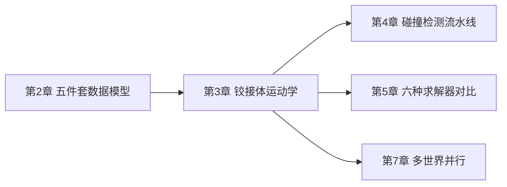

# 铰接体运动学：广义坐标与最大坐标

> 系列第 3 章。上一章提到 `State` 里同时存在 `joint_q`（广义坐标）和 `body_q`（最大坐标）两套数据，这一章把这两套表示的区别、转换方式，以及为什么不同求解器要选不同表示这几个问题讲透。

**知识链接**：
- [五件套核心数据模型](./02_五件套核心数据模型_ModelBuilder_Model_State_Control_Contacts) — 本章直接承接上一章 `State` 对象里的坐标数据
- [正运动学与 DH 参数](/前置知识/003a_前置知识_正运动学与DH参数) — 广义坐标到最大坐标的转换本质就是正运动学
- [雅可比矩阵与微分运动学](/前置知识/003b_前置知识_雅可比矩阵与微分运动学) — 理解速度层面的坐标转换需要用到雅可比矩阵

---

## 贯穿全文的例子

> **场景**：一个简化的双连杆机械臂——大臂通过一个转动关节连在世界（底座固定），小臂通过另一个转动关节连在大臂末端。这个系统只有 2 个自由度（两个关节角度），但如果直接描述"大臂和小臂各自在空间中的位置和朝向"，需要 2×7=14 个数（每个连杆位置 3 个数+朝向四元数 4 个数）。这一章要讲清楚：为什么会有两种描述方式，它们各自的 2 个数和 14 个数之间怎么转换,以及具体哪个求解器用哪套。

---

## 一、问题的起点：描述一个铰接体,有不止一种方式

### 1.1 直接描述"每个连杆在哪"——最大坐标

最直观的描述方式是：给系统里每一个刚体连杆，都记录它在世界坐标系下的完整位姿（3D 位置 + 朝向）。对于本章例子的双连杆机械臂，这意味着记录"大臂的位置和朝向"（7 个数：3 个位置 + 4 个四元数）以及"小臂的位置和朝向"（又 7 个数），总共 14 个数。这种描述方式叫**最大坐标**（maximal coordinates）——之所以叫"最大"，是因为它用了系统实际自由度（这里只有 2 个）之外远远更多的数字来描述状态。

多出来的这些数字并不是没有意义的——它们被关节约束（"小臂末端必须固定在大臂末端附近的某个转轴上转动"）隐式地限制着。最大坐标表示下，关节约束需要在每一步仿真里被主动求解、强制满足（否则两个连杆可能"断开"或"重叠穿透"）。

### 1.2 只描述"关节角度是多少"——广义坐标

另一种描述方式是：既然这个系统只有 2 个自由度（两个转动关节各自的角度），那就只记录这 2 个数——关节 1 的角度、关节 2 的角度。这种方式叫**广义坐标**（generalized coordinates，有时也称"reduced coordinates"，减约坐标）。给定这 2 个角度，配合系统的拓扑结构（谁连着谁、每个关节转轴在哪）,任意一个连杆在世界坐标系下的完整位姿都可以被**唯一确定**地算出来——这个"从广义坐标算出每个连杆位姿"的计算过程,正是[正运动学](/前置知识/003a_前置知识_正运动学与DH参数)。

广义坐标表示的关节约束是"自动满足"的——因为整个表示方式本身就是"沿着关节允许的运动方向参数化"，不存在"小臂断开大臂"这种状态,这类不合法的状态在广义坐标空间里根本无法表示出来。

### 1.3 两种表示的直观对比

| | 最大坐标 | 广义坐标 |
|---|---|---|
| 每个刚体的自由变量数 | 7（位置3+四元数4） | 关节自由度决定（转动关节1个，球关节3个，自由关节6个） |
| 本章例子需要的总变量数 | 14（2个连杆×7） | 2（2个转动关节各1个） |
| 关节约束怎么保证 | 每步需要主动求解约束 | 表示方式本身自动满足 |
| 计算每个连杆的世界位姿 | 直接就是状态本身 | 需要额外做一次正运动学 |
| 使用它的典型求解器 | XPBD、SemiImplicit、VBD | MuJoCo、Featherstone |

---

## 二、Newton 的选择：两套表示都支持，不强制统一

### 2.1 为什么不干脆只选一种

如果只从"哪种更优雅"的角度看，广义坐标似乎更好——变量数更少、约束自动满足、没有数值误差累积导致关节"松动"的问题。但现实中不同的求解算法各自更适配不同的表示：

- 像 XPBD、VBD 这类基于**位置约束投影**的求解器（[基于位置的动力学 PBD](/前置知识/006f_前置知识_基于位置的动力学PBD) 讲过这类方法的核心思路），天然是在"每个物体的位置"这个层面上工作的——用最大坐标实现更直接
- 像 MuJoCo、Featherstone 这类基于**递推动力学算法**（比如 Featherstone 算法本身就是一种高效计算铰接体动力学的经典算法）的求解器，天然是在关节空间（广义坐标）里递推计算的

Newton 的设计选择是：**不强迫所有求解器统一到一种表示，而是让 `State` 对象同时容纳两套数据，每个求解器声明自己"权威使用"哪一套**，需要另一套时通过显式的正逆运动学函数转换。这个设计尊重了不同算法的自然工作空间，避免了"强行统一表示"带来的额外转换开销或算法适配成本。

### 2.2 谁用哪套表示

根据 Newton 官方文档，六个内置求解器的坐标表示选择是：

| 求解器 | 主要坐标表示 |
|--------|-------------|
| `SolverMuJoCo` | 广义坐标 |
| `SolverFeatherstone` | 广义坐标 |
| `SolverXPBD` | 最大坐标 |
| `SolverSemiImplicit` | 最大坐标 |
| `SolverVBD` | 最大坐标 |
| `SolverKamino` | 最大坐标 |

需要特别记住的一点：**碰撞检测（`CollisionPipeline.collide()`）永远需要最大坐标是最新的**——因为碰撞检测的本质是"查询每个形状在世界空间的位置，看有没有重叠"，这个查询只能基于最大坐标（每个刚体的世界位姿）进行，不能直接基于关节角度。这意味着如果你用的是广义坐标求解器（比如 Featherstone），在需要做碰撞检测之前，必须先调用一次正运动学，把 `joint_q` 同步到 `body_q`。

---

## 三、正向运动学与逆向运动学：两套表示之间的桥梁

### 3.1 正向运动学：从关节角度算出连杆位姿

Newton 提供 `newton.eval_fk(model, joint_q, joint_qd, state)` 函数，把广义坐标（`joint_q`、`joint_qd`）转换成最大坐标（写入 `state.body_q`、`state.body_qd`）。这正是[正运动学](/前置知识/003a_前置知识_正运动学与DH参数)在 Newton 里的具体实现入口。

用本章开头的双连杆机械臂举例：

```python
builder = newton.ModelBuilder()

link0 = builder.add_link()
builder.add_shape_capsule(link0, radius=0.05, half_height=0.3)
joint0 = builder.add_joint_revolute(
    parent=-1, child=link0,  # parent=-1表示连接到世界(底座固定)
    axis=wp.vec3(0.0, 1.0, 0.0),
)

link1 = builder.add_link()
builder.add_shape_capsule(link1, radius=0.04, half_height=0.25)
joint1 = builder.add_joint_revolute(
    parent=link0, child=link1,
    axis=wp.vec3(0.0, 1.0, 0.0),
    parent_xform=wp.transform(p=wp.vec3(0.6, 0.0, 0.0)),
)

builder.add_articulation([joint0, joint1], label="arm")

# 直接在builder上设置初始关节角度(广义坐标)
builder.joint_q[-2:] = [0.5, -0.3]   # 关节0转0.5弧度,关节1转-0.3弧度

model = builder.finalize()
state = model.state()

# 此时state.body_q还是默认的单位变换,并不知道joint_q已经设置了非零角度
# 必须显式调用正运动学,才能把joint_q同步到body_q
newton.eval_fk(model, model.joint_q, model.joint_qd, state)

# 现在state.body_q[link1]才反映了两个关节角度共同决定的小臂真实世界位姿
print(state.body_q.numpy()[link1])
```

**代码里值得注意的细节**：即使 `builder.joint_q` 已经被设置成了非零值，`model.state()` 生成的初始 `state.body_q` 默认仍然是单位变换（每个连杆都在坐标原点、无旋转）——这是因为 `body_q` 的初始值来自 `add_link`/`add_body` 调用时传入的 `xform` 参数，而不是自动从 `joint_q` 推算出来的。**广义坐标和最大坐标不会自动保持同步，必须显式调用 `eval_fk`**——这是初学者最容易踩的坑之一,官方文档里也特别强调了这一点。

### 3.2 逆向运动学：从连杆位姿反推关节角度

反过来，`newton.eval_ik(model, state, joint_q, joint_qd)` 把最大坐标（`state.body_q`、`state.body_qd`）转换成广义坐标——这在"直接操纵连杆位姿之后，需要同步回关节角度供某些求解器使用"的场景下需要用到，比如用最大坐标求解器（XPBD）跑完一步仿真，某些下游逻辑（比如策略网络的观测）需要读取关节角度而不是连杆的绝对位姿。

### 3.3 什么时候需要手动调用 eval_fk/eval_ik——一个实用清单

根据官方示例代码的模式（第 2 章展示过的 `example_basic_pendulum.py`），下面是几个明确需要手动同步的场景：

1. **用最大坐标求解器（XPBD/VBD/SemiImplicit）跑仿真，但初始关节角度是通过 `builder.joint_q` 设置的** → 构建完 `model` 之后必须先调 `eval_fk`，否则 `state.body_q` 还是默认位姿，物理上是错的
2. **用广义坐标求解器（MuJoCo/Featherstone）跑仿真，但需要在每一步之外单独做碰撞检测或渲染** → MuJoCo 求解器内部会自动维护 `body_q` 同步（第 6 章细讲），但 Featherstone 等其他广义坐标求解器可能需要额外注意
3. **策略网络的动作直接写广义坐标（比如 RL 里常见的"直接设置关节角度目标"），但下游需要读最大坐标做碰撞检测** → 需要 `eval_fk`

---

## 四、关节类型：广义坐标的"维度"由关节类型决定

### 4.1 六种主要关节类型

Newton 支持的关节类型和每种类型对应的广义坐标/自由度维度：

| 关节类型 | 说明 | `joint_q` 维度 | `joint_qd` 维度(自由度) |
|---------|------|---------------|------------------------|
| `PRISMATIC` | 滑动关节，沿一个轴线性移动 | 1 | 1 |
| `REVOLUTE` | 转动关节，绕一个轴旋转 | 1 | 1 |
| `BALL` | 球关节，任意方向旋转（用四元数表示朝向） | 4 | 3 |
| `FIXED` | 固定关节，无自由度 | 0 | 0 |
| `FREE` | 自由关节，完全不受约束（6自由度浮动基座） | 7（3位置+4四元数） | 6 |
| `D6` | 通用6自由度关节，最多3个平移+3个旋转自由度 | 最多6 | 最多6 |

`D6` 关节值得特别说明：它是 Newton 里最通用的关节类型，`PRISMATIC`、`REVOLUTE` 等其他类型本质上都可以看成是 `D6` 关节在特定自由度组合下的特殊情况。如果你需要一个"某个方向能移动、某个方向能转动，但其他方向都锁死"的复杂约束（比如一个只能前后滑动+绕滑动轴转动的螺旋机构近似），用 `D6` 直接配置比拼凑多个简单关节更直接。

### 4.2 `BALL` 关节的坐标维度为什么是 4 和 3 不一致

注意到 `BALL` 关节的 `joint_q` 是 4 维（一个四元数），但 `joint_qd`（自由度/角速度）只有 3 维——这不是设计上的疏忽，而是**四元数表示三维旋转天然需要 4 个数（带 1 个单位长度约束），但三维旋转本身只有 3 个真实自由度**（[三维旋转表示](/前置知识/006a_前置知识_三维旋转表示_旋转矩阵四元数与角速度) 详细讲过这个"表示维度"和"自由度维度"不一致的现象）。`FREE` 关节的 7 维位置坐标和 6 维速度自由度也是同样的道理——位置部分（3 位置+4四元数=7）比速度部分（3线速度+3角速度=6）多出 1 维,正是四元数的单位长度约束贡献的那 1 维。

### 4.3 铰接体（Articulation）：把若干关节打包成一组

`builder.add_articulation([joint0, joint1], label="arm")` 这个调用把两个关节声明成同属一个铰接体——这个分组信息在 `Model` 里体现为几个"起始索引"数组（`model.joint_q_start`、`model.joint_qd_start`），标记每个铰接体的广义坐标在整个模型全局数组里从哪个位置开始、占多少个连续的元素。这个数据布局设计再次呼应了第 2 章讲过的"扁平数组+索引偏移"模式——不是每个铰接体单独一个数组，而是所有铰接体的关节坐标拼接成一个大数组，用起始索引区分不同铰接体各自的片段，方便 GPU kernel 用统一的方式批量遍历处理。

---

## 五、World：让"多个环境互相隔离"这件事变得简单

### 5.1 为什么需要 World 这个概念

第 7 章会详细讲多环境并行训练，这里先建立一个基础认知：Newton 允许在**同一个 `Model` 对象**里，容纳多个逻辑上完全独立的"世界"（World）——比如强化学习训练时，你可能需要同时跑 1024 个完全相同的机器人环境（每个环境互不干扰,各自独立地和自己的场景交互）。

如果没有 World 这个抽象，实现"1024 个并行环境"的直觉方式可能是"手动创建 1024 个独立的 `Model` 对象，每步分别调用 1024 次 `solver.step()`"——这在 GPU 并行的语境下效率极低，因为每次单独的 `step()` 调用都有固定的 CPU-GPU 通信开销，1024 次调用意味着 1024 倍的这个开销。

Newton 的解法是：**用同一个 `Model` 装下所有 1024 个环境的全部刚体、关节、形状，但给每个实体打上一个"属于哪个 World"的标记（`model.body_world`、`model.shape_world` 等数组）**，碰撞检测和约束求解都能利用这个标记，天然地保证"World 0 的机器人不会和 World 1 的机器人发生碰撞"，同时整个仿真步骤依然可以用一次 kernel 调用批量处理所有 1024 个环境的全部实体。

### 5.2 具体怎么创建多 World 场景

```python
# 先搭一个单机器人模板
robot_template = newton.ModelBuilder()
# ...(像本章前面的例子一样添加连杆、关节)

# 用replicate()一次性复制成1024个独立World
scene = newton.ModelBuilder()
scene.add_ground_plane()   # 地面是全局实体(World索引-1),被所有World共享
scene.replicate(robot_template, world_count=1024)

model = scene.finalize()
print(model.world_count)   # 1024
```

`replicate()` 内部做的事情，本质上是把 `robot_template` 这个子构建器的全部内容，重复添加 1024 次到 `scene` 里，同时自动给每一份拷贝打上对应的 World 索引标记。地面（`add_ground_plane()`）添加在 `replicate` 调用之外，World 索引默认为 `-1`，代表"全局实体"——被所有 World 共享，不需要 1024 份拷贝（一个地面平面本来也没有必要复制1024次）。

### 5.3 World 索引 -1 的双重身份

Newton 用 `-1` 这个特殊索引表示"全局实体"——既可以在所有局部 World 创建**之前**添加（比如地面），也可以在**之后**添加（比如场景里一个所有环境共享的固定摄像头标记点）。这两种情况在内存布局上分别对应数组的最前段和最后段——第 4 章讲碰撞过滤时会再次用到这个"全局实体和所有 World 都能碰撞"的规则。

---

## 六、总结

### 一句话

> 铰接体既可以用"每个连杆的绝对位姿"（最大坐标，直观但需要主动维持约束）描述，也可以用"每个关节的角度"（广义坐标，简洁但需要正运动学才能知道连杆在哪）描述——Newton 让两套表示在 `State` 对象里并存，通过 `eval_fk`/`eval_ik` 显式转换，不同求解器各自选择自己算法最natural的那一套。

### 核心要点

1. 最大坐标用远超实际自由度的变量数描述状态，关节约束需要每步主动求解
2. 广义坐标用刚好等于自由度数的变量描述状态，约束自动满足，但需要正运动学才能知道连杆的世界位姿
3. 碰撞检测永远需要最新的最大坐标，这是选择广义坐标求解器时最容易忽略的同步陷阱
4. 关节类型决定了广义坐标的维度（`D6` 是最通用的形式，其余类型都是它的特例）
5. World 机制让"多个并行环境"可以塞进同一个 `Model`，用索引标记实现隔离而不是创建多个独立对象

### 知识链



---

## 延伸阅读

- [Newton 官方文档 Articulations](https://newton-physics.github.io/newton/latest/concepts/articulations.html)
- [Newton 官方文档 Worlds](https://newton-physics.github.io/newton/latest/concepts/worlds.html)
- [正运动学与 DH 参数](/前置知识/003a_前置知识_正运动学与DH参数)
- [三维旋转表示：旋转矩阵、四元数与角速度](/前置知识/006a_前置知识_三维旋转表示_旋转矩阵四元数与角速度)
- 上一章：[五件套核心数据模型](./02_五件套核心数据模型_ModelBuilder_Model_State_Control_Contacts)
- 下一章：[碰撞检测流水线](./04_碰撞检测流水线_从粗筛到SDF与Hydroelastic接触)
