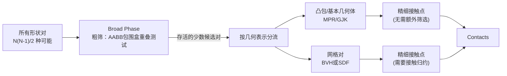

# 碰撞检测流水线：从粗筛到 SDF 与 Hydroelastic 精细接触

> 系列第 4 章。碰撞检测是每一步仿真里计算量占比通常最大的环节——上千个刚体、几万个碰撞形状，怎么在几毫秒内筛出真正需要计算接触力的那一小部分？这一章拆解 Newton 碰撞检测流水线的两阶段设计。

**知识链接**：
- [五件套核心数据模型](./02_五件套核心数据模型_ModelBuilder_Model_State_Control_Contacts) — 本章的 `Contacts` 对象来自这一章介绍的流水线
- [惩罚法接触模型：弹簧阻尼与摩擦锥](/前置知识/006d_前置知识_惩罚法接触模型_弹簧阻尼与摩擦锥) — 本章讲"怎么找到接触点"，这篇前置知识讲"找到接触点之后怎么算力"，两者是接续关系

---

## 贯穿全文的例子

> **场景**：一个仓库分拣场景——机械臂周围散落着 50 个不同形状的箱子和零件（球形、方形、圆柱形、不规则网格），机械臂末端的夹爪需要抓取其中一个不规则形状的零件。这个场景里，形状总数不算多（50+夹爪+机械臂各连杆约 60 个形状），但如果对每一对形状都做一次精细的几何相交测试，计算量是形状数的平方级——这一章要讲清楚碰撞检测流水线怎么避免这种"平方级浪费",以及面对不规则网格零件时该用哪种精细接触算法。

---

## 一、两阶段设计：先粗筛,再精算

### 1.1 为什么不能对每一对形状都做精细检测

如果场景里有 $N$ 个碰撞形状，"每一对形状都检测一遍是否碰撞"需要做 $N(N-1)/2$ 次检测——形状数量翻倍,检测次数变成 4 倍。对于本章例子的 60 个形状,这个数字是 1770 次；如果场景规模扩大到 500 个形状（比如仓库堆满了货物），检测次数会飙升到超过 12 万次。而绝大多数形状对（比如相距很远的两个箱子）显然不可能碰撞，精细几何检测算法（比如计算两个凸多面体之间的精确最近距离）对这些形状对而言纯属浪费。

### 1.2 Newton 的两阶段流水线

Newton 的碰撞检测流水线（`CollisionPipeline`）分成两个阶段：

**Broad phase（粗筛阶段）**：用一个便宜得多的近似测试——检查每个形状的**轴对齐包围盒**（AABB，Axis-Aligned Bounding Box，即包住这个形状的最小长方体）是否和另一个形状的 AABB 有重叠。AABB 重叠测试只需要比较 6 个数字（每个盒子的 xyz 最大最小值），比精确的几何相交测试快得多。绝大多数"明显不可能碰撞"的形状对（比如相距很远的两个箱子）在这一步就被过滤掉了，只有 AABB 重叠的"候选对"才会进入下一阶段。

**Narrow phase（精算阶段）**：对粗筛存活下来的少数候选对,才执行真正精确的几何计算,输出具体的接触点、法线方向、穿透深度等信息。

### 1.3 三种 Broad Phase 算法的取舍

Newton 提供三种粗筛算法，通过 `CollisionPipeline(model, broad_phase=...)` 参数选择：

| 模式 | 算法 | 复杂度 | 适用场景 |
|------|------|--------|---------|
| `NxN` | 全配对 AABB 测试 | $O(N^2)$ | 小场景（形状数<100） |
| `SAP` | 扫描剪枝（Sweep and Prune） | $O(N\log N)$ | 大场景，形状分布有空间局部性 |
| `EXPLICIT`（默认） | 预计算好的固定形状对列表 | 取决于预计算结果 | 结合静态场景效率和高级接触算法 |

`SAP`（Sweep and Prune）的核心思路是：把所有 AABB 沿某个坐标轴（比如 X 轴）排序，只有在这个轴上投影区间有重叠的形状对，才可能在三维空间里真正重叠——通过排序，可以用一次线性扫描就找出所有"投影区间重叠"的候选对，避免了 $N^2$ 的全配对比较。这是计算几何里一个经典的降维处理技巧：先在一维（排序后的坐标轴）上快速筛掉大部分不可能的候选，再对剩下的少数候选做完整维度的检测。

---

## 二、几何表示决定精算阶段用什么算法

### 2.1 三种几何表示路径

碰撞检测流水线在精算阶段，会根据每个形状的**几何表示方式**，走不同的处理路径：

**路径 1：凸包和基本几何体（球、盒子、胶囊体、圆柱、圆锥、椭球）**——这些形状都有明确的解析"支持函数"（support function，给定一个方向,能直接算出这个形状在该方向上最远的点），可以用 **MPR/GJK** 算法直接计算两个凸形状之间的最近距离和接触点，不需要额外的接触归约步骤（因为凸形状之间碰撞的接触点数量本身就很有限，通常几个点就能描述清楚接触区域）。

**路径 2：三角网格，没有预计算 SDF**——通过 Warp 的 BVH（Bounding Volume Hierarchy，包围体层级树）结构做实时的距离查询。这个路径"即插即用"（不需要额外预处理），但对高三角形数的复杂网格可能很慢——因为每次查询都要遍历 BVH 树，三角形越多树越深，查询开销越大。

**路径 3：预计算 SDF（Signed Distance Field，带符号距离场）**——提前对网格调用 `mesh.build_sdf(...)`，把网格转换成一个规则网格上的距离场（"空间中任意一点到这个网格表面的最短距离"，正值表示在外部、负值表示在内部）。有了 SDF,后续每次距离查询变成对这个预计算网格的 **O(1) 查表**，速度和三角形数量无关。这个路径还额外解锁了本章后面要讲的 **Hydroelastic 接触**模型。

### 2.2 回到仓库分拣的例子

本章开头的仓库场景里，那个**不规则形状的零件**（比如一个带凹槽的金属件）如果用三角网格表示，是选择路径 2 还是路径 3？取决于这个零件在整个仿真过程中会被查询碰撞多少次——如果只是这一个零件、仿真跑几千步，每步都要查询它和夹爪之间的接触,路径 3（预计算 SDF）几乎总是更好的选择,因为预计算的一次性开销，会被后续几千次 O(1) 查询摊薄。而场景里那些形状简单、只是"路过"、几乎不会被精细操作的箱子（球形、方形、圆柱形），本身就走路径 1，根本不涉及这个选择。

### 2.3 形状兼容性：并不是所有几何组合都天然支持

Newton 文档给出了一张完整的形状兼容性表格，结论可以概括为：**几乎所有几何类型两两之间都能产生碰撞检测结果**（球-球、球-网格、网格-网格、SDF-网格等等），但部分组合标注了"⚠️性能警告"——比如"网格-网格"（两个都没有预计算 SDF 的复杂三角网格）虽然理论上支持，但对高三角形数的网格可能很慢，文档明确建议这种情况优先给至少一方附加预计算 SDF。

---

## 三、接触几何：一个 Contact 到底存了什么

### 3.1 接触点的三个核心数据

碰撞检测流水线最终产出的每一个"接触"（Contact），本质上是一个轻量的几何描述符,包含三类信息：

- **接触法线**（world frame）：一个单位向量，从形状 A 指向形状 B
- **接触点**（body frame）：接触在两个形状各自所属刚体的局部坐标系下的位置（分别记为 `rigid_contact_point0`/`rigid_contact_point1`）
- **接触距离**：两个接触点沿法线方向的带符号间隔，负值表示穿透

这个设计让求解器完全不需要关心"这个接触点是怎么算出来的"（可能来自一个简单的球-球检测，也可能来自复杂的 SDF 网格查询），求解器只需要读取这几个统一格式的数值就能计算接触力——这正是第 2 章讲过的"碰撞检测和求解器解耦"设计原则在数据层面的具体体现。

### 3.2 Margin 和 Gap：接触检测的"提前量"

一个容易被忽略但很重要的细节：Newton（以及大多数物理引擎）不是"物体刚接触时才检测到接触"，而是引入了两个额外的距离参数——**margin**（余量）和 **gap**（间隙）,把"检测到接触"和"接触产生力"这两件事分开控制：

> 上图按带符号距离 $d$（负值表示穿透）划分了四个区域：**穿透区**（$d<0$，物体已经互相嵌入，接触力最大）；**margin 内的有效接触区**（$0 \le d \le \text{margin}$，形状表面之间还有微小间隙,但已经被判定为"活跃接触"、开始产生反力,这是为了在物体真正接触前提前施加一点缓冲力，避免高速碰撞时的硬穿透)；**gap 内的检测区**（$\text{margin} < d \le \text{margin}+\text{gap}$，碰撞检测流水线会报告这个接触对的存在，但不产生任何力——这个区域主要用于给求解器提前"预警"即将发生的接触，方便某些求解器提前准备约束）；**无接触区**（$d > \text{margin}+\text{gap}$，完全不检测）。

**为什么要分成这两层而不是一个简单的阈值**：一个纯粹的"距离小于某阈值就算接触"的设计,会让"检测到接触"和"接触开始起作用"这两个本该分离的概念绑死在一起。分开之后，margin 控制"接触力从多远开始起效"（影响物理行为和数值稳定性），gap 控制"碰撞检测流水线提前多远开始报告这个接触对"（主要是给求解器一个准备时间，不直接影响力的大小）——这给了求解器实现者更细粒度的控制空间,尤其是对第 6 章要讲的 MuJoCo 集成，这两个参数分别映射到 MuJoCo 原生的 `geom_margin` 和 `geom_gap`。

---

## 四、接触归约：为什么网格接触需要"减肥"

### 4.1 问题：SDF/网格路径可能产生海量原始候选接触

路径 1（凸包/基本几何体的 MPR/GJK）天生产生的接触点数量很少——两个凸形状之间的接触区域，用几个点就能完整描述（比如两个平面完全贴合的接触，理论上有无穷多个接触点，但工程上用 4-5 个角点就足够近似描述整个受力面）。

但路径 2/3（网格/SDF）的情况不同：一个高分辨率网格和另一个物体重叠的区域，可能对应成百上千个三角形，如果对每个重叠三角形都生成一个独立的接触点，产出的候选接触数量会爆炸式增长——远超求解器实际需要、也超过 GPU 显存里预分配的接触缓冲区容量。

### 4.2 接触归约：把成百上千个候选压缩成几十个代表点

Newton 引入**接触归约**（contact reduction）机制，把 SDF/网格路径产生的大量候选接触，压缩到一个固定的上限（文档里提到默认按 240 个槽位的布局归约）,同时尽量保留能代表整个接触区域受力分布特征的关键点（比如接触区域的边界点、法向力最大的点）。这个机制类似于"用少数几个代表点，近似整片接触区域的受力效果"——精度上有一定损失，但换来了求解器计算量和显存占用的可控性。而路径 1（凸包路径）产生的接触点数量本身就少，不需要这个归约步骤。

### 4.3 一个实用的性能直觉

理解了接触归约的存在,可以推导出一个实用的性能调优直觉：**如果场景里大量使用高分辨率网格作为碰撞几何，即使给它们都加上了预计算 SDF，接触归约这一步本身的计算量也不是免费的**。文档里的调参指南反复强调的一条建议——"优先用简单几何体（球/盒子/胶囊体）表示碰撞形状，只在真正需要精确非凸几何的地方才用网格"——本质上就是在尽量让更多形状对走路径 1（省去归约开销），只让真正必要的部分走路径 2/3。

---

## 五、Hydroelastic 接触：为什么"一个接触点"有时不够用

### 5.1 传统点接触模型的局限

前面讨论的接触表示——法线、接触点、穿透距离——本质上是**点接触模型**：不管接触区域实际有多大，最终都被抽象成有限个"点"，每个点承担一部分接触力。这个抽象在大多数场景下够用（球在地面上滚动、方块堆叠），但在某些**大面积接触**场景下会出现问题——比如一个平整的夹爪抓住一个平整的物体表面，真实物理上接触力应该分布在整个接触面上（越靠近夹爪施力中心，力越大），但如果只用少数几个离散点近似,可能导致力矩分布不准确（尤其是**扭矩方向**的摩擦，即物体绕接触法线扭转时受到的阻力），影响抓取稳定性的仿真精度。

### 5.2 Hydroelastic 接触：把接触面当成一个连续场来采样

**Hydroelastic 接触**模型的思路是：不再把接触简化成几个孤立的点，而是在两个形状实际重叠的整个接触表面上**采样出一片连续分布的接触点**，每个采样点根据局部的几何压缩程度（重叠深度）分配对应的力——这样整个接触面上的力分布更接近真实物理里"接触压力场"的样子，尤其能显著改善**扭矩方向摩擦**（torsional friction）的建模精度，这在精细操作任务（比如拧螭母、稳定抓取扁平物体）里很重要。

Hydroelastic 接触的前提是**两个形状都必须有预计算 SDF**——这也解释了为什么第 2 节反复强调 SDF 路径是"解锁高级接触模型"的关键前提。

### 5.3 什么时候该用 Hydroelastic

Hydroelastic 接触不是免费的——它比标准的点接触计算量更大（需要在整个重叠区域采样，而不是只算几个特征点）。文档给出的建议是：优先用在"接触面质量、力矩分布"确实对任务成败有直接影响的场景——比如需要精确控制夹爪抓取力矩的操作任务、非凸几何体之间的复杂接触。对于大多数不那么苛刻的场景（比如简单的碰撞反弹、粗粒度的抓取判断），标准点接触模型（配合接触归约）已经足够，没必要为每个接触都上 Hydroelastic 的额外开销。

---

## 六、碰撞过滤：不是所有几何重叠都应该产生接触

### 6.1 为什么需要过滤机制

不是所有 AABB 重叠、甚至几何真实重叠的形状对都应该产生实际的接触响应——最典型的例子是铰接体内部相邻连杆之间的关节连接处：本章第 3 节例子里的大臂和小臂通过一个转动关节连接，两者在关节附近的几何形状几乎必然会有轻微重叠（因为关节转轴处的几何体设计本身就会互相靠近），如果这种"预期内"的重叠也触发接触力计算，会和关节约束本身产生冲突，导致仿真行为异常。

### 6.2 三层过滤机制

Newton 提供三层递进的碰撞过滤控制：

**World 索引过滤**（第 3 章介绍过）：不同 World 之间的形状默认不会互相碰撞检测，全局实体（World 索引 -1）例外，与所有 World 都参与检测。

**Collision Group（碰撞组）**：每个形状可以标记一个整数碰撞组——组 0 表示完全禁用碰撞；正数组之间只有相同组号才互相碰撞（同时可以和任意负数组碰撞）；负数组之间除了自己，可以和任意其他组碰撞。这套规则允许灵活地把场景里的形状划分成"互相碰撞"和"互不碰撞"的若干簇。

**显式过滤对**（Collision Filter Pairs）：对特定的一对形状，无论碰撞组规则怎么判定，都强制排除在碰撞检测之外——这正是解决"关节相邻连杆几何重叠"问题的机制：Newton 默认会给每个关节的父子连杆自动加上这样一条过滤规则（`collision_filter_parent=True`），避免关节连接处的正常几何重叠被误判为碰撞。

### 6.3 自碰撞：铰接体内部的碰撞检测

对于像人形机器人这类复杂铰接体，除了"相邻连杆"这种局部重叠，还存在"手臂末端碰到自己躯干"这类**自碰撞**（self-collision）——是否需要检测这类碰撞取决于任务本身（比如人形机器人做大幅度的自由体操动作,手脚确实有可能碰到自己身体，这时候需要开启自碰撞检测；而多数简单的机械臂任务里手臂本身不会碰到自己,关闭自碰撞可以省下一部分不必要的计算）。这个开关通过 `enable_self_collisions` 参数在导入模型时（`add_urdf`/`add_mjcf`）统一控制。

---

## 七、总结

### 一句话

> Newton 的碰撞检测是一个两阶段流水线——AABB 粗筛快速排除绝大多数不可能碰撞的形状对，精算阶段根据几何表示（凸包/网格/SDF）选择不同算法计算真正的接触几何，margin/gap 两个参数把"检测到接触"和"接触开始产生力"分开控制，接触归约压缩海量网格候选点，Hydroelastic 接触在需要精确力矩分布的场景下提供比点接触更真实的连续接触面建模。

### 核心要点

1. Broad phase 用 AABB 重叠测试快速筛掉大部分不可能碰撞的形状对，避免 $O(N^2)$ 的全配对精细检测
2. Narrow phase 根据几何表示分三条路径：凸包用 MPR/GJK，无 SDF 网格走实时 BVH 查询，有预计算 SDF 的网格走 O(1) 查表
3. margin 控制接触力从多远开始起效，gap 控制流水线提前多远报告接触对的存在，两者语义不同
4. 网格/SDF 路径可能产生海量候选接触点，需要接触归约压缩到固定数量的代表点
5. Hydroelastic 接触在两个形状都有 SDF 的前提下，把接触区域当成连续场采样，改善力矩分布精度，代价是更高的计算量
6. World 索引、碰撞组、显式过滤对三层机制共同决定哪些形状对应该被排除在碰撞检测之外

### 知识链

---

## 延伸阅读

- [Newton 官方文档 Collisions](https://newton-physics.github.io/newton/latest/concepts/collisions.html)
- [惩罚法接触模型：弹簧阻尼与摩擦锥](/前置知识/006d_前置知识_惩罚法接触模型_弹簧阻尼与摩擦锥)
- 上一章：[铰接体运动学](./03_铰接体运动学_广义坐标与最大坐标)
- 下一章：[六种求解器全景对比](./05_六种求解器全景对比_怎么选)
