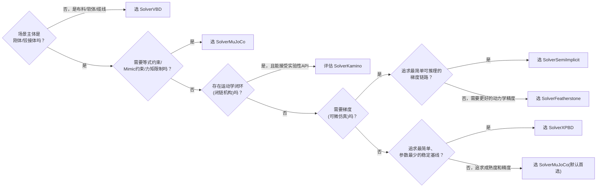
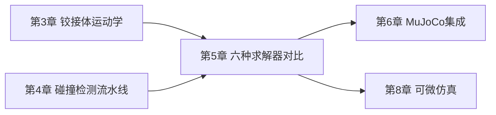

# 六种求解器全景对比：XPBD、VBD、Featherstone、SemiImplicit、MuJoCo、Kamino 怎么选

> 系列第 5 章。前面三章讲了 Newton 的数据模型、坐标表示、碰撞检测——这些都是"求解器要用的原材料"。这一章讲原材料交给谁来"烹饪"：六个内置求解器分别用什么算法思路，各自适合什么场景，遇到具体任务该怎么选。

**知识链接**：
- [铰接体运动学：广义坐标与最大坐标](./03_铰接体运动学_广义坐标与最大坐标) — 求解器的坐标表示选择是本章对比的第一个维度
- [基于位置的动力学 PBD](/前置知识/006f_前置知识_基于位置的动力学PBD) — XPBD 求解器的核心算法思想
- [物理仿真数值积分：辛积分与能量稳定性](/前置知识/006c_前置知识_物理仿真数值积分_辛积分与能量稳定性) — SemiImplicit/Featherstone 求解器依赖的积分方法

---

## 贯穿全文的例子

> **场景**：四个不同的仿真任务，分别对应到下面要讲的求解器选型：(a) 训练一个四足机器人的行走策略,需要几千个并行环境高速跑; (b) 精确复现一个双臂协作装配任务的力控行为,要求接触力和真机高度一致; (c) 仿真一根柔软的电缆被机器人缠绕操作; (d) 一个工业级多连杆机构，带有闭环运动链（比如四杆机构），需要精确求解硬接触约束。这一章讲完，回头看这四个场景该分别选哪个求解器,以及为什么。

---

## 一、先建立分类框架：三个关键维度

在逐个介绍六个求解器之前，先建立一个三维的分类框架，方便后面对比时有一致的参照坐标：

**维度一：坐标表示**（第 3 章讲过）——广义坐标 vs 最大坐标，直接决定了求解器的关节约束处理方式。

**维度二：积分方式**——是显式（explicit，直接用当前状态算下一步，简单但对刚性系统不稳定）、半隐式（semi-implicit，介于两者之间，是大多数实时仿真的选择）、还是隐式（implicit，需要求解一个方程组才能得到下一步状态，稳定性更好但计算量更大）。

**维度三：支持的物体类型**——是否支持刚体/铰接体、粒子、布料、软体，以及是否支持可微分（differentiable）。

---

## 二、逐一介绍：六个求解器的核心算法思路

### 2.1 SolverXPBD：位置约束投影，无条件稳定

**坐标表示**：最大坐标。**积分方式**：隐式（迭代式位置投影）。

XPBD（Extended Position Based Dynamics）直接继承 [基于位置的动力学 PBD](/前置知识/006f_前置知识_基于位置的动力学PBD) 一文讲过的核心思路——不通过"力"驱动约束满足,而是直接在位置层面迭代投影修正违反约束的点。Newton 的 `SolverXPBD` 把这套思路应用到刚体关节约束、接触约束、粒子/布料/软体约束的统一框架里。

它最大的优点是**无条件稳定**——不管约束多"硬"、时间步多大，迭代投影本身永远不会发散到无穷（可能收敛得慢，但不会爆炸）。这个特性让它成为 Newton 官方大量入门示例（比如第 2 章提到的 `example_basic_pendulum.py`）的默认求解器——对新手友好，不容易因为参数没调好就直接崩溃。

代价是：约束满足的精度取决于迭代次数（[PBD 前置知识](/前置知识/006f_前置知识_基于位置的动力学PBD) 第三节详细讨论过这个权衡），迭代次数不够时关节可能出现轻微的"软"感（约束没有被完全满足）。

### 2.2 SolverVBD：Vertex Block Descent，柔性体优先

**坐标表示**：最大坐标（刚体部分通过实验性的 AVBD 机制支持关节）。**积分方式**：隐式。

VBD（Vertex Block Descent）最初是面向布料、软体这类**高自由度可变形体**设计的求解算法，思路是把整个可变形体离散成大量顶点（vertex），用一种类似块坐标下降（block coordinate descent）的方式逐顶点求解隐式方程——每次只固定其他顶点、优化当前顶点的位置，遍历所有顶点若干轮直到收敛。这和 XPBD 的"逐约束迭代投影"是不同的迭代策略，但同样属于"用多轮局部迭代逼近全局解"这个大类。

`SolverVBD` 对刚体和铰接体的支持是通过 **AVBD**（Augmented VBD）扩展实现的，目前官方文档标注为"有限的关节支持"（`🟨 limited joint support`）——这意味着如果你的场景主体是刚体机器人，VBD 目前不是首选；但如果场景核心是**布料、软体、绳缆**（比如本章开头的电缆缠绕任务），VBD 的支持矩阵里对这些类型的支持是完整的（✅），是这类场景的合理默认选择。

### 2.3 SolverFeatherstone：经典递推算法，广义坐标下的高效动力学

**坐标表示**：广义坐标。**积分方式**：半隐式。

Featherstone 算法（[Roy Featherstone](https://en.wikipedia.org/wiki/Roy_Featherstone) 提出的经典铰接体动力学算法）是机器人学教科书里的标准内容——它用一种沿着运动学树"从末端向根部、再从根部向末端"两次递推的方式，高效计算出铰接体系统的加速度，不需要显式构造和求逆整个系统的质量矩阵（这个矩阵对高自由度系统可能很大，直接求逆代价很高）。

`SolverFeatherstone` 是 Newton 里少数几个原生支持**基本可微分**（🟨 basic diffsim）的刚体求解器之一——第 8 章会讲到，这和它基于清晰的递推公式（每一步都是明确的矩阵运算链）有关，比迭代式的约束投影方法（XPBD、VBD）更容易求梯度。

### 2.4 SolverSemiImplicit：最朴素的显式-隐式混合积分

**坐标表示**：最大坐标。**积分方式**：半隐式（无迭代参数）。

`SolverSemiImplicit` 是六个求解器里概念上最简单的一个——[数值积分](/前置知识/006c_前置知识_物理仿真数值积分_辛积分与能量稳定性)一文讲过的"半隐式 Euler"积分思路的直接刚体版本实现：用当前时刻的力算加速度，更新速度，再用**更新后的新速度**（而不是旧速度）更新位置——这个"用新速度更新位置"的小改动，正是它比纯显式 Euler 更稳定的原因所在。

它没有迭代次数这个概念（不像 XPBD/VBD 需要设置 `iterations` 参数）——遇到不稳定的情况，唯一的调参手段是缩小时间步 `dt`。这个"简单直接"的特性让它成为 Newton 官方 diffsim（可微仿真）示例里最常用的求解器（第 8 章会具体展示这一点）——因为它的计算链路最短、最容易求梯度，也最容易在教学/研究场景里推理"为什么梯度是这个值"。

### 2.5 SolverMuJoCo：集成 MuJoCo Warp，最成熟的通用选择

**坐标表示**：广义坐标。**积分方式**：显式/半隐式/隐式（用户可配置的 `integrator` 参数）。

`SolverMuJoCo` 包装了 [MuJoCo Warp](https://github.com/google-deepmind/mujoco_warp)（Google DeepMind 维护的 MuJoCo GPU 移植版），继承了 MuJoCo 在机器人学界十几年积累下来的算法成熟度和参数调校经验。它是 Newton 目前功能最完整、支持特性最全（等式约束、mimic 约束、tendon、丰富的关节属性）的求解器,详情第 6 章专门展开。

一个需要提前知道的限制：`SolverMuJoCo` 目前**不支持可微分**——这是选型时的一个硬约束,如果你的任务明确需要梯度（比如基于梯度的轨迹优化），MuJoCo 后端目前不是合适的选择,需要转向 SemiImplicit 或 Featherstone。

### 2.6 SolverKamino：面向闭环机构的实验性求解器

**坐标表示**：最大坐标。**积分方式**：半隐式（Euler / Moreau-Jean）。

`SolverKamino` 是六个求解器里唯一明确标注为"实验性"（experimental，BETA 1）的一个，专门面向"存在**运动学闭环**（kinematic loop，比如四杆机构、并联机构）、欠驱动或过驱动、需要精确求解硬接触约束和恢复系数（restitution）"这类特殊需求的**约束刚性多体系统**——本章开头例子 (d) 描述的场景正是它的目标应用。

Kamino 内部提供两种前向动力学后端可选：`"padmm"`（proximal ADMM，默认，把等式和不等式约束联立求解，更慢但更稳健）和 `"dvi"`（projected dual iterations，更快但对不等式约束的求解精度是近似的,官方文档明确提示"作为一般法则，DVI 求解不等式约束的精度不如 PADMM，尤其是活跃不等式数量增多时"）。文档明确建议：除非确实需要闭环机构支持且能接受实验性 API 的风险，否则优先用更成熟的其他求解器。

---

## 三、全景对比表

### 3.1 支持特性矩阵

| 求解器 | 坐标表示 | 积分方式 | 铰接体 | 粒子 | 布料 | 软体 | 可微分 |
|--------|---------|---------|--------|------|------|------|--------|
| `SolverXPBD` | 最大坐标 | 隐式(迭代) | ✅ | ✅ | 🟨无自碰撞 | 🟨实验性 | ❌ |
| `SolverVBD` | 最大坐标 | 隐式 | 🟨受限关节支持 | ✅ | ✅ | ✅ | ❌ |
| `SolverFeatherstone` | 广义坐标 | 半隐式 | ✅ | ✅ | 🟨无自碰撞 | ✅ | 🟨基本支持 |
| `SolverSemiImplicit` | 最大坐标 | 半隐式 | ✅ | ✅ | 🟨无自碰撞 | ✅ | 🟨基本支持 |
| `SolverMuJoCo` | 广义坐标 | 可配置 | ✅ | ❌ | ❌ | ❌ | ❌ |
| `SolverKamino` | 最大坐标 | 半隐式 | ✅（含闭环） | ❌ | ❌ | ❌ | ❌ |

### 3.2 关节功能支持差异（节选）

不同求解器对关节类型和关节属性的支持也有明显差异，这里摘录几个最常影响选型的差异点（完整表格见 Newton 官方文档）：

- **等式约束**（Equality constraints，比如两个远距离刚体之间的软连接）和 **Mimic 约束**（一个关节的运动跟随另一个关节按比例联动，常用于欠驱动机构如联动手指）：目前**只有 `SolverMuJoCo` 支持**。如果任务里用到了这两类约束，选型基本被限定在 MuJoCo。
- **`joint_effort_limit`**（关节输出力矩上限）：同样只有 `SolverMuJoCo` 支持——如果需要仿真真实电机的力矩饱和行为，这也是选 MuJoCo 的一个理由。
- **CABLE 关节**（专门表示柔性缆线的关节类型）：只有 `SolverVBD` 支持——本章开头例子 (c) 的电缆缠绕任务,选型直接指向 VBD。

---

## 四、选型决策树

结合前面的对比，给出一个可操作的选型顺序：

### 4.1 回到本章开头的四个场景

- **(a) 四足机器人行走策略,需要几千并行环境高速跑**——`SolverMuJoCo`。MuJoCo Warp 后端本身就是为大规模并行 RL 训练设计的，广义坐标下的关节动力学精度也是四足运动这类高动态任务需要的。
- **(b) 双臂协作装配，要求接触力和真机高度一致**——`SolverMuJoCo`，配合第 4 章讲的 SDF/Hydroelastic 接触模型（需要设置 `use_mujoco_contacts=False` 换用 Newton 通用碰撞流水线）。MuJoCo 的接触求解成熟度和这里的 Hydroelastic 精细力矩建模结合，是目前对精确力控仿真最有把握的组合。
- **(c) 柔软电缆被缠绕操作**——`SolverVBD`。唯一支持 CABLE 关节类型的求解器,没有第二个选择。
- **(d) 带闭环运动链的工业多连杆机构**——先评估 `SolverKamino`（专门设计用于闭环机构），如果对实验性 API 的风险接受度低，退而求其次考虑用 `SolverMuJoCo` 的等式约束机制近似模拟闭环（用一个等式约束"缝合"闭环的断点，这是经典机器人仿真里处理闭链机构的常见工程手段）。

---

## 五、混合与耦合：不止"选一个"这一种答案

### 5.1 耦合求解器：让不同求解器共同处理同一个场景

Newton 还提供了两种**实验性**的耦合求解器框架——`SolverCoupledProxy`（代理耦合）和 `SolverCoupledADMM`（ADMM 耦合），允许把一个场景拆分成若干"入口"（entry），每个入口分配给不同的求解器负责，求解器之间通过共享的 `Model` 交换力、位姿信息。

一个典型应用场景：机器人本体（刚体、铰接体，用 `SolverMuJoCo`）抓取一块布料或缠绕一根电缆（用 `SolverVBD`）——这正是本章场景 (c) 如果同时涉及一个刚体机器人手臂时的真实需求。耦合求解器让这两个各自擅长不同物理的求解器"合作"处理同一个仿真步骤，而不需要退化成"只能选一个,牺牲另一部分的精度"。

这类耦合机制目前明确标注为实验性，官方文档也提示"代理耦合的稳定性对调参敏感"——适合有余力做定制实验的团队，不建议作为生产系统的默认依赖。

---

## 六、总结

### 一句话

> 六个求解器沿着"坐标表示×积分方式×支持的物体类型×可微性"这几个维度分布在不同的位置——没有一个是"最好的"，选型的关键是先明确任务对这几个维度的硬性要求（尤其是"场景主体是不是刚体""需不需要梯度""需不需要等式约束"），排除掉不满足硬性要求的选项之后，再从剩下的候选里按成熟度和熟悉程度选择。

### 核心要点

1. XPBD 无条件稳定、参数简单，是刚体/铰接体场景的稳健入门选择，代价是精度受迭代次数限制
2. VBD 是布料/软体/CABLE 缆线场景唯一或最优的选择，对刚体关节的支持目前有限
3. Featherstone 和 SemiImplicit 是目前支持可微分的两个刚体/铰接体求解器，SemiImplicit 更简单，Featherstone 动力学精度更高
4. MuJoCo 是功能最全、成熟度最高的通用选择，但不支持可微分
5. Kamino 是专门面向闭环机构的实验性求解器，一般场景不必优先考虑
6. 耦合求解器框架允许不同求解器共同处理同一场景的不同部分，但目前仍是实验性功能

### 知识链

---

## 延伸阅读

- [Newton 官方文档 Solvers Overview](https://newton-physics.github.io/newton/latest/solvers/index.html)
- [基于位置的动力学 PBD](/前置知识/006f_前置知识_基于位置的动力学PBD)
- [物理仿真数值积分：辛积分与能量稳定性](/前置知识/006c_前置知识_物理仿真数值积分_辛积分与能量稳定性)
- 上一章：[碰撞检测流水线](./04_碰撞检测流水线_从粗筛到SDF与Hydroelastic接触)
- 下一章：[MuJoCo Warp 深度集成](./06_MuJoCo_Warp深度集成_状态同步与参数映射)
