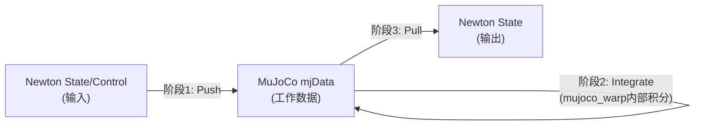
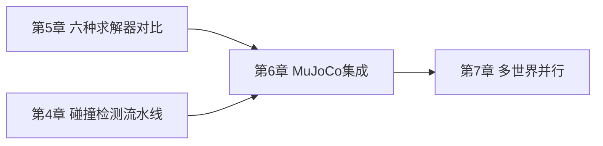

# MuJoCo Warp 深度集成：状态同步与参数映射

> 系列第 6 章。上一章说 `SolverMuJoCo` 是目前功能最全、最成熟的求解器——这一章专门拆开看它内部具体怎么工作：Newton 的数据怎么"翻译"成 MuJoCo 认识的格式，每一步仿真三个阶段怎么衔接，以及哪些参数的映射关系不是简单的"改个名字"那么直接。

**知识链接**：
- [六种求解器全景对比](./05_六种求解器全景对比_怎么选) — 本章深入展开上一章对 `SolverMuJoCo` 的概览
- [三维旋转表示：旋转矩阵、四元数与角速度](/前置知识/006a_前置知识_三维旋转表示_旋转矩阵四元数与角速度) — 理解本章的四元数分量顺序差异需要这篇背景

---

## 贯穿全文的例子

> **场景**：延续第 5 章场景 (b)——一个双臂协作装配任务，用 `SolverMuJoCo` 仿真。这个任务对接触力的精确程度要求很高（装配零件之间的公差是毫米级），同时因为项目历史原因，机器人模型最初是用 URDF 写的，后来又补充了一些 MJCF 格式定义的关节限位和驱动参数。这一章要讲清楚：这些跨格式的信息怎么被统一"翻译"进同一个 MuJoCo 模型,以及仿真每一步 Newton 和 MuJoCo 之间怎么交换数据。

---

## 一、为什么 MuJoCo 集成需要单独一章：两套"世界观"的差异

### 1.1 MuJoCo 不只是"另一个求解器"

前面五章讲的 Newton 核心概念——`Model`/`State`/`Control`/`Contacts`、关节类型、坐标表示——都是 Newton **自己**设计的一套通用抽象，理论上任何求解器接进来都要"适配"这套抽象。但 `SolverMuJoCo` 的特殊之处在于：它包装的是一个**本身就有完整独立生态**的成熟物理引擎（MuJoCo），这个引擎有自己的模型格式（`mjModel`）、自己的运行时数据结构（`mjData`）、自己的一整套参数命名和物理惯例——这些惯例很多和 Newton 自己的惯例并不完全一致（哪怕描述的是同一个物理量）。

这意味着 `SolverMuJoCo` 内部需要做大量"双向翻译"工作：Newton 侧的数据结构 → MuJoCo 侧的数据结构（每一步的输入），以及反过来（每一步的输出）。这一章要讲的正是这套翻译机制的关键细节。

### 1.2 一个具体的味道：关节类型映射

回到本章开头的双臂装配例子，机械臂的每个转动关节，在 Newton 里声明为 `JointType.REVOLUTE`，在 `SolverMuJoCo` 内部会被映射成 MuJoCo 原生的 `mjJNT_HINGE`（合页关节）——这个映射是直接的一一对应。但并不是所有映射都这么直接,比如 Newton 的 `D6` 关节（第 3 章讲过的通用 6 自由度关节）在 MuJoCo 里没有直接对应物,需要被拆解成最多 3 个 `mjJNT_SLIDE`（滑动）加 3 个 `mjJNT_HINGE`（转动）关节的组合——这种"一对多"的映射关系，正是本章要重点讲清楚的类型。

---

## 二、三阶段状态同步循环

### 2.1 每一步 solver.step() 内部的三个阶段

`SolverMuJoCo.step()` 调用背后，每一步都经历同样的三阶段循环：

**阶段 1（Push，Newton → MuJoCo）**：把输入的 Newton `State`（关节角度、速度）和 `Control`（目标位置、控制力）转换写入 MuJoCo 内部的工作数据结构。如果这一步用的不是 MuJoCo 自带的碰撞检测（`use_mujoco_contacts=False`），Newton 侧计算出的接触信息也要在这一阶段被转换成 MuJoCo 能理解的格式。

**阶段 2（Integrate）**：调用 `mujoco_warp` 的积分器，把 MuJoCo 模型按照配置的时间步 `dt` 向前推进一步——这一步完全在 MuJoCo 自己的内部表示里进行，Newton 不介入。

**阶段 3（Pull，MuJoCo → Newton）**：把积分后的 MuJoCo 状态转换写回 Newton 的输出 `State` 对象。

### 2.2 一个容易被忽略的细节：接触不会自动被拉回来

需要特别注意：**接触信息（Contacts）不会在阶段 3 自动被拉回 Newton 格式**——如果你的应用需要读取"这一步到底发生了哪些接触、接触力多大"（比如给策略网络提供接触力观测，或者用第 9 章要讲的 `SensorContact` 传感器），需要显式调用一次 `solver.update_contacts()`。这个设计选择的动机是性能——接触信息的转换本身有一定开销，如果每一步都自动做,即使用户根本不需要读取接触细节，也白白付出了这份转换成本。把它变成一个显式的、按需调用的方法,让不需要接触细节的场景（比如只关心机器人本体运动学的任务）避免这份开销。

---

## 三、参数映射：不是简单的改名字

### 3.1 关节限位刚度：一个需要重新推导的映射

Newton 的 `joint_limit_ke`/`joint_limit_kd`（关节限位的刚度/阻尼，力空间参数，单位类似 $N\cdot m/rad$）不能直接原样塞进 MuJoCo——MuJoCo 内部用一套叫 `solreflimit` 的参数（`(timeconst, dampratio)` 形式）描述限位响应，这套参数的物理含义和 Newton 的力空间刚度/阻尼不是同一种"语言"。`SolverMuJoCo` 需要先用 MuJoCo 编译后得到的 `dof_invweight0`（这个自由度的"逆有效质量"）做一次缩放，再把缩放后的等效刚度/阻尼转换成 MuJoCo 的 `(timeconst, dampratio)` 表示。

**为什么不能简单地"改个名字"就完事**：因为两边描述的物理量本身处于不同的参数空间——Newton 的 `ke`/`kd` 是直接的力空间弹簧-阻尼参数（类似惠更斯弹簧的物理直觉：力=刚度×偏移+阻尼×速度），而 MuJoCo 的 `(timeconst, dampratio)` 描述的是这个约束响应的**时间常数和阻尼比**（更接近控制理论里描述二阶系统响应的语言）。这两种参数化方式在数学上是等价可转换的，但转换公式依赖于这个自由度当时的有效惯性（`dof_invweight0`），所以不是一次性的常数转换，而是要在每次模型编译/更新之后重新计算。

### 3.2 接触刚度：类似的转换逻辑,但涉及两个形状

接触材质刚度/阻尼（`shape_material_ke`/`shape_material_kd`）的映射比关节限位更复杂一层——因为接触涉及**两个**形状，两者的刚度/阻尼需要先按照某种规则"混合"（比如取平均或者某种加权组合），再乘以两个刚体的转动惯量逆权重之和做缩放，最后转换成 MuJoCo 每个接触对独立的 `solref` 参数。这个转换只在 Newton 自己的碰撞流水线路径（`use_mujoco_contacts=False`）下才会按照这套"力空间语义"精确执行——如果直接用 MuJoCo 自带的碰撞检测（`use_mujoco_contacts=True`），MuJoCo 内部会用自己的 `solmix` 规则简单平均两个形状各自的 `solref`,不会做 Newton 侧这套基于逆质量权重的精确缩放。

### 3.3 一个实用提示：这些转换公式的细节不需要死记

上面两小节讲的具体转换公式（涉及 `dof_invweight0`、`solimp` 里的 `dmax` 参数等）本身相当技术化,日常使用 `SolverMuJoCo` 时**不需要**手动推导这些公式——它们是 `SolverMuJoCo` 内部自动完成的转换逻辑，用户只需要按 Newton 的力空间语义（`ke`/`kd`）设置参数即可。这里讲清楚这些细节的目的，是让读者理解**为什么不能想象"Newton 参数和 MuJoCo 参数是一一对应的同一个数字"**——如果你的项目需要跨引擎（比如从纯 MuJoCo 项目迁移到 Newton，或者反过来）对比调参结果，理解这层转换关系能帮你判断"数值不完全一样"是不是转换公式导致的正常现象，还是确实哪里配置错了。

---

## 四、坐标系惯例差异：四元数分量顺序和角速度参考点

### 4.1 四元数分量顺序不一致

第 3 章提到球关节、自由关节的姿态用四元数表示,这里有一个容易踩坑的细节：**Newton/Warp 内部用 `(x, y, z, w)` 顺序存储四元数（虚部在前、实部在后），而 MuJoCo 用 `(w, x, y, z)` 顺序（实部在前）**。这不是 bug，是两个生态各自独立发展出来的惯例差异——`SolverMuJoCo` 在阶段 1/3 的状态转换中，会自动处理这个顺序重排,用户不需要手动转换。但如果你需要绕开 `SolverMuJoCo` 直接和 MuJoCo 原生 API 交互（比如导出 MJCF 之后用原生 `mujoco` Python 包做一些自定义分析），一定要记住这个顺序差异，否则四元数分量对错位会导致姿态计算完全错误。

### 4.2 角速度的参考点差异

另一个更微妙的差异是**角速度和线速度的参考点约定**——[三维旋转表示](/前置知识/006a_前置知识_三维旋转表示_旋转矩阵四元数与角速度) 讲过刚体的完整运动状态需要线速度和角速度两部分。Newton 遵循的是 Isaac Lab 那套惯例——线速度是刚体**质心**在世界坐标系下的速度，角速度也在世界坐标系下表达。而 MuJoCo 对自由关节采用一种"混合坐标系"表示——线速度部分是刚体坐标系原点（不一定是质心）在世界坐标系下的速度，角速度部分却是在刚体自己的局部坐标系下表达。

`SolverMuJoCo` 在状态同步时会自动完成这两层转换（坐标系原点的偏移修正 + 角速度的坐标系旋转修正），但这也是为什么直接手写 MuJoCo 原生代码和用 Newton 的 `SolverMuJoCo` 包装层交互，读出来的"角速度""线速度"数值可能不直接一致——它们在描述同一个物理运动,只是参考点和参考坐标系选择不同。

---

## 五、碰撞流水线的选择：默认 vs Newton 通用流水线

### 5.1 默认：用 MuJoCo 自带的碰撞检测

`SolverMuJoCo` 默认使用 MuJoCo Warp **自带**的碰撞检测流水线，而不是第 4 章讲的 Newton 通用 `CollisionPipeline`。这个默认选择的理由是一致性和性能——MuJoCo 自带的碰撞检测和它内部的约束求解器是配套设计、联合调优过的，直接复用能获得最贴近"原生 MuJoCo 行为"的仿真结果，这对本章场景 (b) 这类"要求和真机高度一致"的任务尤其重要——因为很多机器人控制的经验参数、调参手感，都是基于原生 MuJoCo 的行为积累起来的。

### 5.2 什么时候要切换到 Newton 通用流水线

如果任务需要第 4 章讲过的**非凸网格 SDF 接触**或者**Hydroelastic 接触**——这两种高级接触模型是 MuJoCo 自带碰撞检测不支持的——需要显式设置 `use_mujoco_contacts=False`，让 `SolverMuJoCo` 改用 Newton 通用碰撞流水线的输出。本章开头例子 (b) 如果装配零件涉及复杂的非凸几何（比如带内部凹槽的连接件），这个切换基本是必须的。

需要留意的权衡：切换到 Newton 通用流水线之后，前面第 3 节提到的接触刚度精确力空间缩放才会生效；但同时也意味着放弃了"和 MuJoCo 原生碰撞行为完全一致"这个便利——如果项目里同时有一部分参数是基于原生 MuJoCo 经验调出来的，切换后可能需要重新校验。

---

## 六、多世界支持：MuJoCo 的"同构复制"限制

### 6.1 separate_worlds 机制

第 3、7 章讲的多 World 并行机制，在 `SolverMuJoCo` 这里有一个特别的实现方式：构造时设置 `separate_worlds=True`（GPU 模式下多 World 场景的默认值），`SolverMuJoCo` 只会用**第一个 World** 的结构构建一次 MuJoCo 模型，然后通过 `mujoco_warp` 的原生复制机制，把这一份结构复制到所有其他 World。

### 6.2 这个机制带来的硬性要求

这个实现方式直接决定了一条硬性限制：**所有 World 的结构必须完全一致**（相同数量的刚体、关节、形状），否则 `SolverMuJoCo` 会在构造时直接抛出 `ValueError`。这对第 7 章要讲的强化学习并行训练场景通常不是问题——RL 训练本来就习惯用 `replicate()` 复制出结构完全相同的多份环境。但如果你的场景需要"不同 World 用不同的机器人"（比如异构多智能体训练，每个 World 放一台不同型号的机器人），`separate_worlds=True` 这个优化路径就不适用了，需要评估其他求解器或者关闭这个优化（接受额外的性能开销）。

---

## 七、总结

### 一句话

> `SolverMuJoCo` 每一步仿真都经历"Push（Newton→MuJoCo）→ Integrate（MuJoCo内部）→ Pull（MuJoCo→Newton）"三阶段循环，参数映射不是简单改名字而是要经过基于有效质量/惯量的重新缩放，坐标惯例（四元数顺序、角速度参考点）的差异也在这个转换过程里被自动处理——理解这套翻译机制，才能在混合使用 Newton 抽象和 MuJoCo 原生工具时不踩坑。

### 核心要点

1. MuJoCo 集成的复杂度来源于它是一个有独立生态、独立惯例的成熟引擎，不是简单套进 Newton 抽象的新求解器
2. 每步仿真的三阶段循环里，接触信息默认不会自动拉回 Newton 格式，需要显式调用 `update_contacts()`
3. 关节限位刚度和接触刚度的映射都需要基于有效质量/惯量重新缩放，不是简单的参数改名
4. 四元数分量顺序（xyzw vs wxyz）和角速度参考点（Newton 用世界坐标系质心速度，MuJoCo 用混合坐标系）存在差异，`SolverMuJoCo` 自动处理但直接和 MuJoCo 原生 API 交互时要小心
5. 默认使用 MuJoCo 自带碰撞检测以保证一致性，需要 SDF/Hydroelastic 接触时才切换到 Newton 通用流水线
6. `separate_worlds=True` 优化要求所有 World 结构完全一致，异构多环境场景需要评估替代方案

### 知识链

---

## 延伸阅读

- [Newton 官方文档 MuJoCo Solver](https://newton-physics.github.io/newton/latest/solvers/mujoco.html)
- [MuJoCo Warp GitHub 仓库](https://github.com/google-deepmind/mujoco_warp)
- [三维旋转表示：旋转矩阵、四元数与角速度](/前置知识/006a_前置知识_三维旋转表示_旋转矩阵四元数与角速度)
- 上一章：[六种求解器全景对比](./05_六种求解器全景对比_怎么选)
- 下一章：[多世界并行与 RL 训练](./07_多世界并行与RL训练_Worlds机制)
