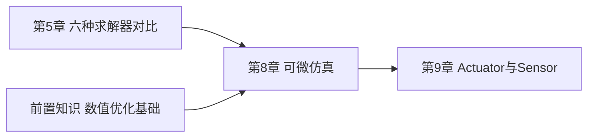

# 可微仿真：梯度怎么从仿真结果传回控制输入

> 系列第 8 章。第 1 章提到 Newton 的四个设计目标之一是"可微分"——这一章讲清楚这件事具体怎么实现：物理仿真本来是一个"给定输入算输出"的黑盒计算过程，为什么能求梯度，梯度的物理含义是什么，以及哪些求解器支持到什么程度。

**知识链接**：
- [数值优化基础：梯度下降与牛顿法](/前置知识/003c_前置知识_数值优化基础_梯度下降与牛顿法) — 本章讲的梯度最终要拿去做优化，这篇讲了梯度下降的基本原理
- [六种求解器全景对比](./05_六种求解器全景对比_怎么选) — 本章要回答"为什么只有部分求解器支持可微"这个第 5 章留下的问题

---

## 贯穿全文的例子

> **场景**：一个抛物任务——控制一个初始速度未知的粒子（或者简化为一个小球），希望它经过 1 秒后精确落在目标位置 $(0.25, 0, 0)$。传统做法可能是用强化学习训练一个策略网络反复试错。但如果整个物理仿真过程是可微的，可以直接用梯度下降——每次仿真跑一遍，看落点和目标差多少，直接算出"初始速度应该调整多少"的梯度，用几次迭代就能收敛到精确解,不需要成千上万次的试错采样。这一章要讲清楚这背后的机制。

---

## 一、为什么"仿真可以求梯度"这件事不是显而易见的

### 1.1 直觉上的疑问

物理仿真通常被想象成一个"黑盒"：给定初始状态和控制输入，经过若干步复杂的数值计算（力的合成、碰撞检测、约束求解），输出最终状态。直觉上,这个过程里"力怎么变成加速度""碰撞发生时穿透深度怎么变成反弹力"这些环节,很多都涉及分段函数、条件判断（"如果发生碰撞就……否则……"）——**这类计算通常被认为不适合直接求梯度**，因为条件分支处的梯度可能不存在或者是零（比如碰撞检测的"是否接触"这个判断本身是离散的 0/1，天然不可导）。

### 1.2 关键洞察：区分"离散判断"和"数值计算"

解开这个疑问的关键是：仿真过程里确实存在一些天然离散、不可导的环节（比如"这一步到底应不应该触发接触响应"这个二元判断），但**大多数计算——力的合成、位置和速度的积分更新、约束的具体数值求解——本身是普通的连续数学运算（加减乘除、矩阵运算、三角函数）**，这部分是完全可导的。只要整条计算链路里，从"离散判断"发生的那个环节开始往后的部分都被写成普通的、连续的数学表达式（比如已经判定了要产生接触力，之后"力的大小怎么根据穿透深度计算"这一步是一个连续函数），梯度依然可以顺畅地流过去。

对本章例子里的抛物任务而言（假设整个轨迹中不涉及和其他物体的碰撞，只有重力和初始速度决定轨迹），整个计算过程从头到尾都是连续的数学运算——没有任何离散判断介入，这是可微仿真最"干净"的应用场景。

---

## 二、Warp 的自动微分机制：Tape 是什么

### 2.1 复习第 1 章：Warp kernel 天生支持自动微分

第 1 章提到 Warp kernel 本身内建自动微分支持——这不是 Newton 自己额外加的能力，而是 Warp 这个底层框架的原生特性。使用方式遵循和 PyTorch 类似的"记录-回放"（tape-based）自动微分范式：

```python
import warp as wp
import newton

@wp.kernel
def loss_kernel(particle_q: wp.array(dtype=wp.vec3), target: wp.vec3, loss: wp.array(dtype=float)):
    delta = particle_q[0] - target
    loss[0] = wp.dot(delta, delta)   # 均方距离误差

builder = newton.ModelBuilder()
builder.add_particle(pos=wp.vec3(0.0, 0.0, 0.0), vel=wp.vec3(1.0, 0.0, 0.0), mass=1.0)
model = builder.finalize(requires_grad=True)   # 关键:开启梯度追踪

solver = newton.solvers.SolverSemiImplicit(model)
state_in = model.state(requires_grad=True)
state_out = model.state(requires_grad=True)
control = model.control()
loss = wp.zeros(1, dtype=float, requires_grad=True)
target = wp.vec3(0.25, 0.0, 0.0)

tape = wp.Tape()
with tape:
    state_in.clear_forces()
    solver.step(state_in, state_out, control, None, 1.0 / 60.0)
    wp.launch(loss_kernel, dim=1, inputs=[state_out.particle_q, target], outputs=[loss])

tape.backward(loss)   # 反向传播
initial_velocity_grad = state_in.particle_qd.grad.numpy()
```

**代码里值得注意的细节**：

1. `model.finalize(requires_grad=True)`——梯度追踪不是默认开启的,必须在构建 `Model` 时显式声明,这也是一个性能考量：追踪计算图有额外的内存和计算开销,不需要梯度的场景默认不承担这份成本。
2. `with tape:` 代码块——包在这个上下文管理器里的所有 Warp kernel 调用（包括 `solver.step()` 内部的全部 kernel），都会被 Warp 自动记录下计算依赖关系,这正是"Tape"（磁带,录音带）这个名字的来源——把整个计算过程"录"下来，供之后反向"回放"。
3. `tape.backward(loss)`——从最终的标量 `loss` 出发，沿着录制下来的计算图反向传播，把梯度一路传到所有标记了 `requires_grad=True` 的输入变量（这里是 `state_in.particle_qd`，也就是初始速度）。
4. `initial_velocity_grad = state_in.particle_qd.grad.numpy()`——反向传播完成后,梯度值存在原变量的 `.grad` 属性里，可以直接读取用于后续的优化步骤（比如手动做一步梯度下降：`initial_velocity -= learning_rate * initial_velocity_grad`)。

### 2.2 一个直觉验证：梯度的符号意味着什么

上面代码验证了一个结果——`initial_velocity_grad[0, 0] < 0.0`（初始速度 x 分量的梯度是负的）。这个符号本身就带有物理含义：如果初始速度的 x 分量增大，粒子会飞得更远（在 1 秒内落点的 x 坐标会更大）；而 loss 是"落点和目标距离的平方"，如果目标 $(0.25,0,0)$ 比当前的落点更近（需要初始速度稍微减小才能精确落在目标），那么"初始速度增大"应该导致"loss 增大"——按照梯度的定义（函数值增长最快的方向），"初始速度x分量"对"loss"的梯度为负，恰好意味着"要减小 loss，应该增大初始速度"——这和物理直觉是吻合的,是验证可微仿真链路正确性的一个简单交叉检查手段。

---

## 三、哪些求解器支持可微分,支持到什么程度

### 3.1 复习第 5 章的支持矩阵

第 5 章的对比表格里,"可微分"这一列，六个求解器分成三档：

- **完全不支持**（❌）：`SolverXPBD`、`SolverVBD`、`SolverMuJoCo`、`SolverKamino`
- **基本支持**（🟨 basic）：`SolverFeatherstone`、`SolverSemiImplicit`

没有任何一个求解器被标注为"完全支持"（✅）——这个现状本身就值得深入理解，而不只是记住结论。

### 3.2 为什么迭代式约束投影方法（XPBD、VBD）难以直接微分

回顾 [基于位置的动力学 PBD](/前置知识/006f_前置知识_基于位置的动力学PBD) 讲过的核心机制——XPBD/VBD 类求解器每一步都要做**若干轮迭代**，每轮迭代里逐个约束地"投影修正"违反约束的位置。这个迭代过程本身在数学上是可以求导的（每一轮迭代的具体运算都是连续函数），但问题在于：

1. **迭代次数是一个离散的循环，梯度需要穿过每一轮迭代**——反向传播需要为每一轮迭代都保留中间状态（用于反向计算），迭代次数越多，需要保留的中间状态越多，内存开销随迭代次数线性增长
2. **迭代式方法的收敛行为本身对参数变化可能不连续或者数值不稳定**——尤其是涉及碰撞、接触的迭代修正,某个约束"是否活跃"（比如两个物体是否真的发生了穿透需要修正）这类判断本身带有离散性质,即使数值上可以硬算出一个梯度值，这个梯度是否有实际优化意义（能不能引导优化朝着正确方向走）也是存疑的

这两个因素叠加，导致虽然技术上不是完全不可能给 XPBD/VBD 求梯度，但 Newton 团队目前没有把它作为官方支持的功能——这是一个工程上"支持成本 vs 实际收益"的权衡结果，而不是理论上绝对不可能。

### 3.3 为什么 MuJoCo 求解器目前不支持

`SolverMuJoCo` 包装的 MuJoCo Warp 是一个独立维护的外部项目——它自己的内部实现（第 6 章讲过的复杂状态转换、参数映射逻辑）本身并不是全程用 Warp 的可微算子写的（很多部分是编译好的 CUDA kernel,不经过 Warp 的 Tape 记录机制）。要让 `SolverMuJoCo` 支持可微,需要 mujoco_warp 项目本身原生支持自动微分,这不完全在 Newton 团队的控制范围内。这也解释了为什么"选择支持可微分的任务"和"选择精度最高、生态最成熟的 MuJoCo"目前是互斥的选型决策（第 5 章选型决策树里已经体现了这一点）。

### 3.4 为什么 Featherstone 和 SemiImplicit 相对更容易支持

这两个求解器的共同特点是：**每一步仿真是一条清晰的、无迭代循环的计算链**——SemiImplicit 是最简单的显式-隐式混合积分,每一步就是"算力→算加速度→更新速度→更新位置"这一条直线式的计算链;Featherstone 是经典的两次递推算法（第 5 章介绍过），虽然涉及沿运动学树的递推，但递推的"深度"（树的层数）是模型结构决定的固定值，不像 XPBD/VBD 的迭代次数是一个可以任意调节、可能很大的超参数。这种"计算深度固定、计算路径清晰"的特点,让整条计算链的反向传播开销可预测、数值行为相对稳定——这正是它们被标注为"basic diffsim"支持的技术原因。

即使如此,"basic" 这个限定词也提示了现实：这两个求解器的可微支持目前主要体现在官方仓库的一批 diffsim 示例代码上（比如仿真一个球的轨迹、一块布料的变形、一个无人机的姿态控制），代表的是"这条路径被验证过可以工作"，不代表所有可能的使用方式和所有参数组合都保证梯度数值稳定或者有意义。

---

## 四、可微仿真能用来做什么：三类典型应用

### 4.1 基于梯度的轨迹优化

本章开头的抛物例子就是这一类应用的最简形式——如果已知目标状态，想要找出能达成这个目标的控制输入（初始速度、施加的力序列等），传统做法是黑盒优化（比如遗传算法、贝叶斯优化，不需要梯度但收敛慢）或者强化学习（需要大量采样交互）。如果仿真本身可微，可以直接把"控制输入"当成待优化变量，用梯度下降/L-BFGS 等基于梯度的优化算法直接优化——收敛速度通常远快于无梯度方法，因为每次迭代都利用了"具体往哪个方向调整能改善结果"这个精确信息，而不是靠采样试探。

### 4.2 系统辨识（System Identification）

如果仿真模型里的某些物理参数（质量、摩擦系数、关节刚度）不确定,但有一批真实机器人采集的运动轨迹数据，可以把"仿真参数"当成待优化变量,用梯度下降调整这些参数，让仿真轨迹尽量匹配真实轨迹——这正是很多 sim-to-real（仿真到真实）流程里"参数校准"环节能够自动化、精确化的技术基础，不需要人工反复试凑物理参数。

### 4.3 部分强化学习算法的训练加速

某些强化学习算法（比如需要计算策略梯度中"环境动力学对动作的敏感度"这一项的算法变体）如果能直接从可微仿真里拿到这个敏感度信息（而不是靠采样估计），理论上可以降低方差、加速收敛。这类方法目前还是研究前沿而非工业标准做法，但可微仿真是这条研究方向能够展开的前提。

---

## 五、可微仿真的现实限制：不要过度乐观

### 5.1 梯度存在不代表梯度"有用"

碰撞、接触这类涉及离散判断的环节，即使技术上能算出一个数值上的梯度，这个梯度在物理意义上可能是**不连续**或者**病态**的——比如"一个球刚好擦边碰到障碍物边缘"这种情况，位置稍微一点扰动就可能导致"碰到"和"没碰到"两种完全不同的后续轨迹，梯度在这个点附近可能剧烈震荡甚至没有意义。这是可微物理仿真领域一个公认的开放难题,不是 Newton 特有的局限——各类可微仿真研究项目（不管是 Brax、Nimble、还是 Newton）都需要面对接触/碰撞环节梯度质量的挑战。

### 5.2 长时间序列的梯度可能爆炸或消失

如果仿真跑了很多步（比如几百步的完整轨迹），反向传播需要让梯度一路穿过所有这些步骤——这和训练深层循环神经网络时遇到的[梯度消失与梯度爆炸](/前置知识/005m_前置知识_梯度消失与梯度爆炸_雅可比连乘效应)问题在数学结构上是同源的（都是雅可比矩阵的连乘）。物理仿真本身如果存在某种放大效应（比如高速碰撞、刚性系统），这个问题会更突出。实践中，可微仿真的应用通常会限制在相对较短的时间窗口内（比如几十步），或者结合截断反向传播（truncated backpropagation）等工程手段来控制这个风险。

### 5.3 实用建议

如果你的任务涉及大量接触和碰撞（大多数机器人操作任务都是这样），在依赖可微仿真做优化之前，先用一个不涉及碰撞的简化子问题（比如本章的抛物例子）验证梯度链路本身是否正确、数值是否稳定，再逐步引入接触环节,观察梯度质量的变化——不要一开始就在最复杂的完整任务上直接套用可微仿真,期望它自动work。

---

## 六、总结

### 一句话

> Newton 的可微仿真建立在 Warp 原生的 Tape 式自动微分机制上——只要仿真的计算链路是"清晰、无迭代循环、天然连续"的（如 SemiImplicit、Featherstone），梯度就能顺畅地从最终状态一路传回初始控制输入；而迭代式约束投影方法（XPBD/VBD）和外部集成的 MuJoCo 目前出于工程和生态原因还没有官方可微支持,接触/碰撞环节的梯度质量本身也是整个领域仍在探索的开放问题。

### 核心要点

1. 仿真里"离散判断"部分天然难以求梯度，但"数值计算"部分本身是连续可导的——区分这两类环节是理解可微仿真边界的关键
2. Warp 的 `Tape` 记录整个计算图，`backward()` 一次性把梯度传回所有标记了 `requires_grad=True` 的输入
3. 计算链路清晰、深度固定的求解器（SemiImplicit、Featherstone）目前提供基本的可微支持
4. 迭代式约束投影方法（XPBD/VBD）和外部集成的 MuJoCo 目前不支持可微，主要是工程成本和生态限制，不是理论上绝对不可能
5. 可微仿真主要应用在轨迹优化、系统辨识、部分强化学习算法加速这三类场景
6. 接触/碰撞环节的梯度质量、长序列反向传播的数值稳定性是整个可微仿真领域（不限于 Newton）共同面对的开放挑战

### 知识链



---

## 延伸阅读

- [Newton 官方文档 Differentiability](https://newton-physics.github.io/newton/latest/solvers/index.html#differentiability)
- [Newton DiffSim 示例集](https://github.com/newton-physics/newton/tree/main/newton/examples/diffsim)
- [数值优化基础：梯度下降与牛顿法](/前置知识/003c_前置知识_数值优化基础_梯度下降与牛顿法)
- [梯度消失与梯度爆炸：雅可比连乘效应](/前置知识/005m_前置知识_梯度消失与梯度爆炸_雅可比连乘效应)
- 上一章：[多世界并行与 RL 训练](./07_多世界并行与RL训练_Worlds机制)
- 下一章：[Actuator 与 Sensor](./09_Actuator与Sensor_从PD控制到传感器读出)
