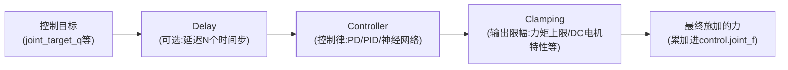
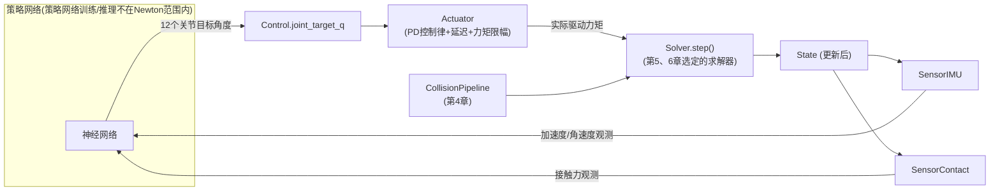

# Actuator 与 Sensor：从 PD 控制到 IMU、接触力读出

> 系列第 9 章，全系列最后一章。前面八章讲的都是仿真内部怎么运转，这一章讲仿真的"接口"——控制信号怎么从策略网络进入仿真循环（Actuator），仿真结果怎么变成策略网络能用的观测（Sensor）。讲完这一章，"感知-决策-执行"这个闭环就完整了。

**知识链接**：
- [五件套核心数据模型](./02_五件套核心数据模型_ModelBuilder_Model_State_Control_Contacts) — 本章的 Actuator 直接对接第 2 章讲过的 `Control` 对象
- [碰撞检测流水线](./04_碰撞检测流水线_从粗筛到SDF与Hydroelastic接触) — 本章的 `SensorContact` 依赖第 4 章讲的 `Contacts` 数据结构

---

## 贯穿全文的例子

> **场景**：一个四足机器人的行走策略部署闭环——策略网络输出 12 个关节的目标角度（四条腿，每条腿 3 个关节），这些目标角度需要被转换成实际的关节驱动力矩（不能瞬间把关节"瞬移"到目标角度，现实电机做不到）；同时策略网络需要读取机器人身上的 IMU（惯性测量单元，测量姿态和角速度的传感器）数据和脚底接触力，作为下一步决策的观测输入。这一章讲清楚 Actuator 怎么完成"目标角度→驱动力矩"这一步，Sensor 怎么完成"仿真内部状态→观测数据"这一步。

---

## 一、Actuator：把"意图"变成"力"

### 1.1 复习第 2 章：Control 只是意图，不负责怎么实现

第 2 章讲过 `Control` 对象（比如 `control.joint_target_q`）装的是"意图"——告诉仿真"这个关节应该往哪个角度走"，但**真正让关节角度往那个方向移动、施加多大力**，这件事在第 2 章里被简单归纳成"求解器内部实现的 PD 控制律"。这一章要展开的是：Newton 实际上提供了一套独立的、可组合的 **Actuator（执行器）** 框架，比"求解器内部一个简单的固定 PD 公式"更灵活。

### 1.2 Actuator 的三段式架构

Newton 的 Actuator 框架把"从控制目标到最终施加的力"这个过程拆成三个可独立替换的组件，按顺序串联：



**Delay（延迟）**：真实电机和控制系统之间存在通信延迟——控制指令不会瞬间到达执行器。这个可选组件模拟"控制目标延迟 $N$ 个时间步才生效"这个真实世界的效应，这在 Sim2Real（仿真到真实）迁移场景里很重要——如果仿真完全忽略延迟，训练出来的策略在真机上可能因为无法应对真实存在的通信延迟而表现变差。

**Controller（控制律）**：真正决定"根据当前状态和目标，应该输出多大的力"这个核心逻辑，Newton 提供多种内置控制律：

| 控制律 | 说明 | 是否有内部状态 |
|--------|------|---------------|
| `ControllerPD` | 比例-微分控制，最常用的简单反馈控制 | 无状态 |
| `ControllerPID` | 比例-积分-微分控制，额外引入积分项消除稳态误差 | 有状态(积分累积器) |
| `ControllerNeuralMLP` | 用一个多层感知机(MLP)直接充当控制器 | 有状态(历史缓冲区) |
| `ControllerNeuralLSTM` | 用 LSTM 充当控制器，能利用更长的历史信息 | 有状态(隐藏/细胞状态) |

**Clamping（限幅）**：对控制律算出的原始力做后处理限制,模拟真实电机的物理约束——`ClampingMaxEffort`（简单的对称力矩上限）、`ClampingDCMotor`（模拟真实直流电机"转速越快、能输出的最大力矩越小"这个速度-力矩特性曲线）、`ClampingPositionBased`（针对连杆驱动机构，力矩上限随关节位置变化的插值表）。

### 1.3 一个具体的组装示例

回到本章开头四足机器人的例子，给一个膝关节配置带延迟、带力矩上限的 PD 控制器：

```python
builder.add_actuator(
    ControllerPD,
    index=dof_index,           # 这个actuator控制哪个自由度
    kp=100.0,                  # 比例增益
    kd=10.0,                   # 微分增益
    delay_steps=5,              # 模拟5个仿真步的控制延迟
    clamping=[(ClampingMaxEffort, {"max_effort": 50.0})],   # 最大力矩限制在50 N·m
)
```

**代码里值得注意的细节**：`delay_steps=5` 和 `max_effort=50.0` 这两个参数,分别对应上面架构图里的 Delay 和 Clamping 两个组件——这个 API 设计让用户不需要理解 Actuator 内部实现，只需要在声明时按需"插入"需要的组件，就能组合出复杂的、贴近真实电机行为的执行器模型，而不需要为每一种组合手写一个专门的控制函数。

### 1.4 为什么要拆成三段而不是一个大函数

这个三段式设计遵循的是软件工程里常见的"关注点分离"原则——延迟、控制律、限幅本质上是三个独立的物理/工程概念，各自可以独立变化（比如同一个 PD 控制律,配合不同的延迟设置,可以模拟不同通信质量的执行系统；同一个延迟设置,配合不同的控制律，可以对比 PD 和神经网络控制器的表现）。拆开之后,这些维度可以自由组合、独立替换，而不需要为每一种组合都重写一遍完整的控制逻辑。

### 1.5 状态管理：有状态的 Actuator 需要双缓冲

第 2 章讲过 `State` 对象为什么需要双缓冲（`state_0`/`state_1` 交替）——`ControllerPID`（有积分累积器）、`ControllerNeuralLSTM`（有隐藏状态）这类有内部状态的 Actuator，同样需要类似的双缓冲管理：

```python
state_0 = model.actuators[0].state()
state_1 = model.actuators[0].state()

for step in range(1000):
    control.joint_f.zero_()   # 每步开始前清零累加输出
    model.actuators[0].step(state, control, state_0, state_1, dt=0.01)
    state_0, state_1 = state_1, state_0   # 交换缓冲区
```

无状态的 Actuator（比如纯 `ControllerPD`、无延迟）则不需要这套双缓冲机制,可以直接省略状态对象的创建——这正是"三段式组合"设计的另一个好处：状态管理的复杂度会随着你实际用到的组件自动增减,不会因为框架本身的设计而被迫承担不需要的开销。

---

## 二、Sensor：把仿真内部状态变成"观测"

### 2.1 Sensor 解决的问题:不是所有仿真数据都能直接拿来当观测

`State` 对象里的 `body_q`、`body_qd` 等原始数据,理论上已经包含了机器人全部的运动状态信息，但直接把这些原始数据喂给策略网络往往不是最合适的形式——策略网络通常需要的是**符合物理传感器语义**的观测（比如"这个 IMU 测到的线加速度是多少"，而不是"这个刚体在世界坐标系下的绝对位置"），这样训练出来的策略才能直接迁移到装有真实传感器的机器人上。

Sensor 系统正是负责这个"从内部状态计算出符合真实传感器语义的观测量"的转换层。

### 2.2 四类内置 Sensor

| Sensor | 测量内容 | 典型用途 |
|--------|---------|---------|
| `SensorIMU` | 站点(site)处的线加速度和角速度 | 姿态估计、平衡控制的观测输入 |
| `SensorContact` | 刚体/形状之间的接触力，可分解摩擦分量 | 抓取力反馈、足端触地检测 |
| `SensorFrameTransform` | 形状/站点相对参考站点的相对位姿 | 手眼标定式的相对位置观测 |
| `SensorTiledCamera` | 多环境并行的光线追踪彩色/深度渲染 | 视觉策略的图像输入 |

### 2.3 Sensor 使用的标准三步模式

所有 Sensor 遵循相同的使用模式——初始化时声明测什么，每步仿真后调用 `update()`，从属性读结果：

```python
from newton.sensors import SensorIMU

imu = SensorIMU(model, sites="imu_*")   # 1. 声明:测量所有名字匹配"imu_*"的站点

for step in range(100):
    state.clear_forces()
    solver.step(state, state, None, None, dt=1.0/60.0)

    imu.update(state)   # 2. 每步更新
    acc = imu.accelerometer.numpy()   # 3. 读取结果:(n_sensors, 3) 线加速度
    gyro = imu.gyroscope.numpy()      # (n_sensors, 3) 角速度
```

**代码里值得注意的细节**：`sites="imu_*"` 用了通配符模式匹配——Newton 的传感器 API 广泛支持这种"用名字模式批量选中一批实体"的写法（内部基于 `fnmatch` 通配符或正则表达式），这在第 7 章讲过的多 World 并行场景下特别实用：如果机器人模板上的 IMU 站点统一命名为 `imu_0`，复制成 4096 个 World 之后,可以用同一个 `sites="imu_*"` 模式一次性选中所有 4096 个副本各自的 IMU 站点，不需要手动枚举 4096 个具体索引。

### 2.4 站点(Site)：传感器的"挂载点"

上面例子里的"站点"（Site）是 Newton 一个专门为传感器设计的轻量级实体——**不参与碰撞检测、不贡献任何质量**，纯粹是一个附着在某个刚体上的、带位置和朝向的空坐标标记。这个设计的动机很直接：IMU、相机这类传感器在真实机器人上通常是安装在机身某个特定位置的物理器件,但这个器件本身的形状、质量对整体动力学的影响往往可以忽略（相对整个机器人的质量而言）；同时你确实需要一个明确的"坐标系"来定义"这个传感器测到的量是相对哪个位置、哪个朝向而言的"。Site 恰好提供了这样一个"只要坐标系,不要物理属性"的轻量级挂载点。

```python
body = builder.add_body(mass=1.0)
imu_site = builder.add_site(body=body, label="imu_0")
```

### 2.5 Extended Attributes：为什么 Sensor 需要"预先申请"额外的数据

`SensorIMU` 需要读取刚体的**加速度**（`body_qdd`）——但第 2 章讲过的标准 `State` 对象默认**不包含**加速度这个字段（因为大多数任务不需要它，默认不分配能省一部分内存和计算）。这类"默认不分配、按需申请"的字段被称为**Extended Attributes**（扩展属性），`SensorIMU` 在构造时会自动向 `Model` 申请这个扩展属性,后续创建的 `State` 对象就会包含它:

```python
builder.request_state_attributes("body_qdd")   # 手动申请(或者让SensorIMU自动申请)
model = builder.finalize()
state = model.state()
print(state.body_qdd is not None)   # True
```

**这个机制的设计动机**：如果每个 `State` 对象默认包含所有可能用到的字段（加速度、接触力等），对不需要这些字段的大多数简单场景（比如本系列前面章节的很多例子）,会造成不必要的内存浪费和计算开销（比如 `SolverMuJoCo` 计算加速度本身需要额外的一次计算，如果默认总是算,即使没人读取这个值也白白花费了这份算力）。让需要这些字段的组件（比如 `SensorIMU`）显式声明需求，是"按需付费"这个设计哲学在 Newton 数据模型里的又一次体现——这条设计线索从第 2 章的核心五件套开始,一直延续到这里的 Sensor 系统,是贯穿整个 Newton 架构的一个统一原则。

### 2.6 SensorContact 和第 4、6 章的联系

`SensorContact` 需要读取的是 `Contacts` 对象里的力信息——这里有一个和第 6 章讲过的细节直接相关的坑：如果你用的是 `SolverMuJoCo` 且默认没有调用 `update_contacts()`（第 6 章第二节提到过，接触信息默认不会自动拉回 Newton 格式），`SensorContact` 就读不到任何有效数据。正确的调用顺序应该是：

```python
solver.step(state_0, state_1, control, contacts, dt)
solver.update_contacts()          # 第6章提到的显式拉取步骤
sensor_contact.update(state_1)    # 现在才能正确读到接触力
```

这个细节再次说明了本系列反复强调的一点——Newton 的各个子系统之间职责边界清晰、耦合松散，但也意味着某些"看起来应该自动发生"的数据流转，实际上需要用户显式触发；理解每个对象具体的职责边界（第 2 章的核心内容），是避免这类隐性 bug 的关键。

---

## 三、闭环完整图：从本章开头的四足机器人例子回望整个系列

把这一章的 Actuator/Sensor，和前面八章讲的内容拼在一起，本章开头四足机器人行走任务的完整技术栈现在应该是完整的了：



这张图，本质上是第 2 章那张"五件套数据流"图的完整扩展版本——中间的 `Model`/`State`/`Control`/`Contacts` 核心不变，但两端多了 Actuator（把外部意图转换成真实驱动力）和 Sensor（把内部状态转换成外部可用的观测）这两层适配器，让 Newton 能够无缝对接一个完整的强化学习训练/部署闭环。

---

## 四、系列总结：九章讲了什么

回顾整个系列的知识脉络：

1. **第 1 章**建立了 Newton 存在的理由——统一 GPU 并行、可微分、可扩展、多格式生态这四个此前互相制约的维度
2. **第 2 章**讲了地基性的五件套数据模型，"构建期灵活、运行期高效"这个设计原则贯穿全系列
3. **第 3 章**讲了铰接体的两套坐标表示，为后面"为什么不同求解器要用不同表示"埋下依据
4. **第 4 章**讲了碰撞检测的两阶段流水线,以及从简单点接触到 Hydroelastic 精细接触的技术演进
5. **第 5 章**系统对比了六种求解器，给出了一套可操作的选型决策树
6. **第 6 章**深入 MuJoCo 集成的具体细节，讲清楚跨引擎参数映射为什么不是简单改名字
7. **第 7 章**讲了 World 并行机制，这是大规模 RL 训练能落地的数据结构基础
8. **第 8 章**讲了可微仿真的原理、支持范围和现实限制
9. **第 9 章**（本章）讲了 Actuator/Sensor 这两层外围适配器，把整个"决策-执行-感知"闭环补齐

如果只能记住一句话：**Newton 的整套架构设计,都在贯彻"把不同关注点拆成职责清晰、可独立替换的组件"这一条原则**——数据构建和运行时分离、坐标表示和求解算法分离、碰撞检测和接触响应分离、控制意图和执行细节分离、内部状态和外部观测分离。理解了这条贯穿全系列的设计哲学，面对 Newton 后续版本可能新增的功能或者其他类似定位的物理引擎，也能用同样的框架快速建立认知。

---

## 延伸阅读

- [Newton 官方文档 Actuators](https://newton-physics.github.io/newton/latest/concepts/actuators.html)
- [Newton 官方文档 Sensors](https://newton-physics.github.io/newton/latest/concepts/sensors.html)
- [Newton 官方文档 Sites](https://newton-physics.github.io/newton/latest/concepts/sites.html)
- [Newton 官方文档 Extended Attributes](https://newton-physics.github.io/newton/latest/concepts/extended_attributes.html)
- 上一章：[可微仿真：梯度怎么从仿真结果传回控制输入](./08_可微仿真_梯度怎么传回控制输入)
- 返回系列首页：[Newton 引擎深度解析](./index)
