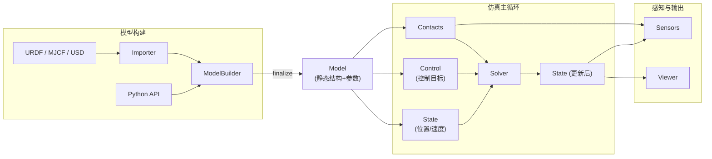

# Newton 引擎深度解析：英伟达开源物理引擎全拆解

> 从"为什么机器人学习需要一个新的物理引擎"，到"ModelBuilder 怎么把一堆形状拼成能跑的仿真"，到"碰撞检测流水线怎么在 GPU 上并行处理几万个接触点"，到"六种求解器该怎么选"，再到"怎么用它跑一个上千并行环境的强化学习训练"——完整拆解 NVIDIA、Google DeepMind 和 Disney Research 联合开源的机器人物理仿真引擎 **Newton**。

## 系列简介

**Newton** 是 2025 年由 NVIDIA、Google DeepMind、Disney Research 联合发起、现由 Linux Foundation 管理的开源物理仿真引擎（[GitHub: newton-physics/newton](https://github.com/newton-physics/newton)）。它的定位很明确：不是又一个通用游戏物理引擎，而是**专门为机器人学习和仿真研究设计**的、GPU 加速、可微分、可扩展的物理引擎。

Newton 建立在 [NVIDIA Warp](https://github.com/NVIDIA/warp)（一个用 Python 写 GPU kernel 的框架）之上，并把 [MuJoCo Warp](https://github.com/google-deepmind/mujoco_warp)（DeepMind 维护的 MuJoCo GPU 移植版）集成为主力求解器后端之一。它继承并取代了 Warp 项目里原来的 `warp.sim` 模块，同时原生支持 [OpenUSD](https://openusd.org/) 场景描述格式，能直接和 NVIDIA Isaac Lab、Isaac Sim 对接。

这个系列会像拆发动机一样，把 Newton 从"为什么要造一个新引擎"这个动机问题开始，逐层拆到"一次 `solver.step()` 调用背后到底发生了什么"这个实现细节。读完这个系列，你会理解：

如果你希望先从最小数学模型和可运行代码入手，再回到 Newton 的生产级实现，请从[物体解算器从零实现系列](/系列/newton_solver_from_zero/index)开始；本系列负责引擎全景与架构，本系列的新分支负责逐步实现解算器。

- Newton 的核心数据模型（`ModelBuilder` / `Model` / `State` / `Control` / `Contacts`）为什么要这样设计
- 铰接体（articulation）在"广义坐标"和"最大坐标"两种表示之间怎么转换，为什么不同求解器要用不同的表示
- 碰撞检测流水线怎么从几万个形状里筛出真正需要计算的接触点，SDF 和 Hydroelastic 接触模型解决了什么传统方法解决不了的问题
- Newton 自带的六种求解器（XPBD、VBD、Featherstone、SemiImplicit、MuJoCo、Kamino）分别适合什么场景，怎么根据任务需求选择
- Newton 怎么把一个模型"复制"成几千个并行的强化学习环境，GPU 线程怎么被组织起来同时计算这些环境
- 可微仿真是怎么一回事——梯度怎么从最终的仿真状态一路传回到最初的动作输入
- actuator 和 sensor 这两套外围系统怎么把"控制指令"接进仿真循环、把"仿真结果"读出来给策略网络用

## 章节目录

| 章节 | 标题 | 简介 |
|------|------|------|
| 01 | [全景图：为什么机器人学习需要一个新的物理引擎](./01_全景图_为什么机器人学习需要一个新的物理引擎) | Newton 的定位、诞生背景、和 MuJoCo/Isaac Gym/warp.sim 的关系 |
| 02 | [五件套核心数据模型：ModelBuilder、Model、State、Control、Contacts](./02_五件套核心数据模型_ModelBuilder_Model_State_Control_Contacts) | Newton 的数据流全景，为什么要把"构建"和"运行时状态"彻底分开 |
| 03 | [铰接体运动学：广义坐标与最大坐标，正向与逆向动力学](./03_铰接体运动学_广义坐标与最大坐标) | 两套坐标表示的区别、FK/IK、关节类型、World 多环境隔离机制 |
| 04 | [碰撞检测流水线：从粗筛到 SDF 与 Hydroelastic 精细接触](./04_碰撞检测流水线_从粗筛到SDF与Hydroelastic接触) | Broad phase、Narrow phase、接触几何、margin/gap 语义 |
| 05 | [六种求解器全景对比：XPBD、VBD、Featherstone、SemiImplicit、MuJoCo、Kamino 怎么选](./05_六种求解器全景对比_怎么选) | 每种求解器的坐标表示、适用场景、稳定性权衡 |
| 06 | [MuJoCo Warp 深度集成：状态同步与参数映射](./06_MuJoCo_Warp深度集成_状态同步与参数映射) | Newton 和 MuJoCo 两套惯例怎么互相转换，接触刚度怎么映射 |
| 07 | [多世界并行与 RL 训练：Worlds 机制与 GPU 线程划分](./07_多世界并行与RL训练_Worlds机制) | 一次性构建几千个并行环境的 API 与底层线程网格设计 |
| 08 | [可微仿真：梯度怎么从仿真结果传回控制输入](./08_可微仿真_梯度怎么传回控制输入) | `wp.Tape`、反向传播穿过整个物理仿真步骤的原理与限制 |
| 09 | [Actuator 与 Sensor：从 PD 控制到 IMU、接触力读出](./09_Actuator与Sensor_从PD控制到传感器读出) | 控制信号怎么进入仿真、仿真结果怎么变成策略能用的观测 |

## 核心架构总览图

## Newton 关键设计参数速查

| 维度 | 取值 | 说明 |
|------|------|------|
| 底层计算框架 | NVIDIA Warp | Python 写 kernel，编译到 CUDA/CPU |
| 主力求解器后端 | MuJoCo Warp（google-deepmind/mujoco_warp） | 广义坐标，隐式积分器默认 `implicitfast` |
| 内置求解器数量 | 6 种（+2 种实验性耦合求解器） | XPBD, VBD, Featherstone, SemiImplicit, MuJoCo, Kamino（+ CoupledADMM, CoupledProxy） |
| 场景描述格式 | URDF, MJCF, USD | USD 支持 schema resolver 做跨求解器属性映射 |
| 多环境并行单位 | World（世界） | 一个 `Model` 可以容纳任意多个相互隔离的 World |
| 坐标表示 | 广义坐标 + 最大坐标两种并存 | 不同求解器选择不同的主表示，`eval_fk`/`eval_ik` 互转 |
| 碰撞几何类型 | 11 种（Plane/Sphere/Box/Mesh/SDF 等） | 支持凸包、非凸网格、SDF、Hydroelastic 接触 |
| 可微性 | 支持（`requires_grad=True` + `wp.Tape`） | SemiImplicit / Featherstone 有 diffsim 示例，MuJoCo 后端目前不可微 |
| 许可证 | Apache-2.0（代码）/ CC-BY-4.0（文档） | Linux Foundation 托管，社区共建 |
| 发起单位 | NVIDIA、Google DeepMind、Disney Research | 2025 年发布 |

## 前置知识要求

阅读本系列前建议了解（系列中遇到时会链接到对应文章）：

- [三维旋转表示：旋转矩阵、四元数与角速度](/前置知识/006a_前置知识_三维旋转表示_旋转矩阵四元数与角速度)
- [刚体动力学：牛顿-欧拉方程与惯性张量](/前置知识/006b_前置知识_刚体动力学_牛顿欧拉方程与惯性张量)
- [物理仿真数值积分：辛积分与能量稳定性](/前置知识/006c_前置知识_物理仿真数值积分_辛积分与能量稳定性)
- [惩罚法接触模型：弹簧阻尼与摩擦锥](/前置知识/006d_前置知识_惩罚法接触模型_弹簧阻尼与摩擦锥)
- [基于位置的动力学 PBD](/前置知识/006f_前置知识_基于位置的动力学PBD)
- [正运动学与 DH 参数](/前置知识/003a_前置知识_正运动学与DH参数) / [雅可比矩阵与微分运动学](/前置知识/003b_前置知识_雅可比矩阵与微分运动学)

不熟悉这些概念也可以直接开始读——本系列会在需要时给出链接，边读边补。

## 阅读建议

1. **完全零基础，想系统了解 Newton 是什么**：从第 1 章顺序读到第 5 章，建立完整的架构认知
2. **只想知道该用哪个求解器**：直接跳到第 5 章，配合第 6 章的 MuJoCo 细节
3. **想把 Newton 用于强化学习训练**：重点读第 2、3、7 章，理解 Worlds 并行机制
4. **对可微仿真/优化控制感兴趣**：第 8 章是重点，建议先读第 2、3 章打底
5. **想知道怎么接自己的控制器和传感器**：第 9 章配合第 6 章一起读

## 相关系列

- [IsaacLab 仿真对齐与参数调优](/工程实践/IsaacLab仿真对齐与参数调优) — Isaac Lab 目前正在把 Newton 作为新的物理后端选项集成，两者的 PD 控制调参思路可以对照阅读
- [逆运动学深度解析](/系列/ik_deep_dive/) — Newton 内置的 IK 模块基于本系列讲的雅可比迭代思路
