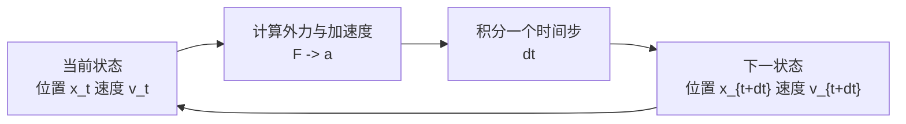
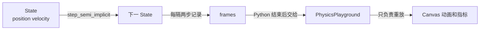
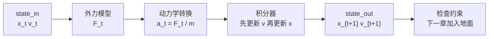

# 最小自由落体解算器

> 系列第 1 章。我们先不处理碰撞、摩擦、关节和旋转，只研究一个从高处落下的质点。目标不是做出一个“像物理引擎”的大框架，而是把解算器最核心的工作压缩到几行代码：读取状态，计算加速度，推进一个时间步，写出新状态。

## 前情提要

这是本系列的第一章，没有上一章需要回顾。全系列从一个最小问题开始：**给定小球当前的位置、速度和受到的重力，如何计算下一时刻的位置和速度**。后面所有复杂功能，最终都会回到这个“状态随时间推进”的骨架上。

## 相关阅读

- [刚体动力学：牛顿-欧拉方程与惯性张量](/前置知识/006b_前置知识_刚体动力学_牛顿欧拉方程与惯性张量) — 本文暂时只取其中最简单的平动部分
- [物理仿真数值积分：辛积分与能量稳定性](/前置知识/006c_前置知识_物理仿真数值积分_辛积分与能量稳定性) — 半隐式 Euler 的数值稳定性背景
- [Newton 引擎深度解析：五件套核心数据模型](../newton_engine_deep_dive/02_五件套核心数据模型_ModelBuilder_Model_State_Control_Contacts) — 了解 Newton 中 `Model`、`State` 和 `solver.step()` 的分工
- [Newton 引擎深度解析：六种求解器全景对比](../newton_engine_deep_dive/05_六种求解器全景对比_怎么选) — 先看 Newton 中不同求解器的全景位置
- 返回系列首页：[物体解算器从零实现](./index)

## 一 先把问题缩到最小

### 1.1 我们到底要解什么

场景只有一个小球。它的形状、碰撞体、材质和旋转都暂时删掉，只保留沿竖直方向运动的一个质点：

- 位置：小球现在有多高
- 速度：小球此刻向上还是向下运动，以及运动多快
- 质量：重力产生多大的加速度
- 外力：本章只有重力
- 时间步：每次向未来推进多少秒

这个简化非常有意。解算器不是“物体类里一个负责更新位置的函数”，而是一个时间推进器。它的输入是当前状态和作用在状态上的物理量，输出是下一时刻状态。只要这个输入输出关系没有理解，直接学习复杂的接触求解器只会变成记 API。

### 1.2 一个状态就是一组快照

把位置和速度放在一起，称为一个状态。假设初始高度是 $5\text{m}$、初速度是 $0\text{m/s}$，我们可以写成“状态从 $(5, 0)$ 开始”。这里的状态不是历史轨迹；它只描述一个时间点。历史轨迹只是把每个时间点的状态按顺序保存起来。

解算器每调用一次 `step`，只承诺完成一件事：把输入状态推进一个固定的 $\Delta t$。关于状态、力和加速度的完整定义见[刚体动力学前置知识](/前置知识/006b_前置知识_刚体动力学_牛顿欧拉方程与惯性张量)，本文只保留实现自由落体所需的最小接口。因此，仿真循环不是“让小球自己跑”，而是外部反复调用同一个确定的状态转移函数。



## 二 第一条物理规律

### 2.1 从力得到加速度

本章只需要牛顿第二定律的实现接口：把当前合力除以质量得到加速度。完整的物理直觉、单位分析和刚体版本请直接阅读[刚体动力学：牛顿-欧拉方程与惯性张量](/前置知识/006b_前置知识_刚体动力学_牛顿欧拉方程与惯性张量)。在自由落体这个特例中，重力是 $mg$，所以加速度就是 $g$；代码只需接收 `gravity`，不需要显式保存重力这一个力。

### 2.2 连续物理必须离散成时间步

真实世界中的位置和速度连续变化，而程序只能在一个个离散时刻执行。最简单的近似是把一个时间步内的加速度视为常量，然后更新速度和位置。

本系列采用半隐式 Euler（Semi-implicit Euler，也叫 Symplectic Euler）作为第一种积分器。完整的稳定性分析放在[物理仿真数值积分：辛积分与能量稳定性](/前置知识/006c_前置知识_物理仿真数值积分_辛积分与能量稳定性)，这里仅保留实现所需的更新顺序：**先用当前加速度更新速度，再用新速度更新位置**。

$$
 v_{t+1} = v_t + a_t\Delta t, \qquad x_{t+1} = x_t + v_{t+1}\Delta t
$$

**这个公式在做什么**：把一个连续时间的动力学过程变成程序可以执行的两步更新。第一步得到下一时刻的速度，第二步使用这个新速度计算下一时刻的位置。

::: details 📐 公式详解（点击展开）

| 子表达式 | 它是谁 | 它在干嘛 |
|---------|--------|---------|
| $v_t$ | **旧速度** | 时间步开始时的速度，是本次更新的起点 |
| $a_t\Delta t$ | **速度增量** | 加速度持续一小段时间后给速度带来的变化 |
| $v_{t+1}$ | **新速度** | 先计算出的结果，随后被同一步的位置更新复用 |
| $x_t$ | **旧位置** | 时间步开始时的位置 |
| $v_{t+1}\Delta t$ | **位移增量** | 用新速度估计这一小段时间走过的距离 |

**用人话读**：先把速度改好，再让物体按照改好后的速度走一步。

**为什么要使用新速度**：这是本章唯一需要记住的积分器实现细节；为什么这个顺序对弹簧、摆和关节等系统更稳，统一解释见[数值积分前置知识](/前置知识/006c_前置知识_物理仿真数值积分_辛积分与能量稳定性)。
:::

### 2.3 手算第一步

现在取：

- $x_0=5\text{m}$
- $v_0=0\text{m/s}$
- $a_0=g=-9.81\text{m/s}^2$
- $\Delta t=0.1\text{s}$

第一步先更新速度：$v_1=0+(-9.81)\times0.1=-0.981\text{m/s}$；再更新位置：$x_1=5+(-0.981)\times0.1=4.9019\text{m}$。注意这里得到的位移是 $-0.0981\text{m}$，而不是连续解析解在 $0.1\text{s}$ 内的 $-0.04905\text{m}$。这不是代码写错，而是因为我们把整步都当成了“使用末速度匀速运动”。

这也说明了时间步的含义：$\Delta t$ 不是“渲染一帧的时间”这样纯显示层的概念，而是数值方法允许自己观察并修正状态的频率。时间步越大，每一步近似跨过的物理变化越多，离散误差通常也越大；相关误差和稳定性比较见[数值积分前置知识](/前置知识/006c_前置知识_物理仿真数值积分_辛积分与能量稳定性)。

## 三 写出第一个解算器

### 3.1 先明确代码的边界

接下来的脚本只实现半隐式 Euler，不实现碰撞检测，也不依赖 Newton。这样做是为了把“求解器”与“物体”“显示器”分开：脚本中的 `State` 是动态状态，`step_semi_implicit` 是解算器，`simulate` 只是负责反复调用解算器并保存轨迹。等这层关系稳定后，下一步才能自然地把 `State` 替换为 Newton 的 `State`。

下面的代码可以直接运行：

```python
from dataclasses import dataclass


@dataclass
class State:
    position: float
    velocity: float


def step_semi_implicit(state: State, dt: float, gravity: float) -> State:
    """Advance one step with velocity-first Euler integration."""
    # 先更新速度；重力在本例中就是恒定加速度
    acceleration = gravity
    velocity_next = state.velocity + acceleration * dt

    # 再用新速度推进位置，这一顺序定义了半隐式 Euler
    position_next = state.position + velocity_next * dt
    return State(position_next, velocity_next)


def simulate(initial: State, dt: float, gravity: float, steps: int) -> list[State]:
    states = [initial]
    state = initial
    for _ in range(steps):
        # 每次只把上一步状态推进一个固定 dt
        state = step_semi_implicit(state, dt, gravity)
        states.append(state)
    return states


if __name__ == "__main__":
    dt = 0.01
    gravity = -9.81
    states = simulate(State(position=5.0, velocity=0.0), dt, gravity, steps=100)
    final = states[-1]
    time = dt * (len(states) - 1)
    exact_position = 5.0 + 0.5 * gravity * time**2
    exact_velocity = gravity * time
    print(f"t={time:.2f}s")
    print(f"semi-implicit position={final.position:.6f}, exact={exact_position:.6f}")
    print(f"semi-implicit velocity={final.velocity:.6f}, exact={exact_velocity:.6f}")
```

网页里的可运行版本在同一积分器外多包了一层“记录动画帧”的代码。它的职责边界如下：



> 真正的物理计算只有从 State 到下一 State 的箭头；`frames` 不会反过来影响运动。网页程序记录 $t=0$ 到 $t=1.0\text{s}$ 共 101 个状态，但只推进 100 次，末状态不会误走到 $1.01\text{s}$。

直接修改下面的 `dt`、`gravity` 或初始高度并运行，动画和末状态会使用修改后的结果重新生成。左侧源代码现已按“状态定义、单步积分、帧记录、结果交付”分区注释；右上角的 `t`、`y`、`v` 分别是当前物理时间、位置和速度。

<ClientOnly>
  <PhysicsPlayground preset="free-fall" title="自由落体 半隐式 Euler" />
</ClientOnly>

代码中最重要的不是 `dataclass`，而是 `step_semi_implicit` 的两行更新：`velocity_next` 必须先算出来，`position_next` 必须使用它。`simulate` 没有任何物理知识，它只维护时间顺序和状态列表；把这两个职责拆开后，替换积分器不会影响轨迹记录和输出逻辑。

### 3.2 运行与检查结果

仓库中已经保存了同一份脚本，运行：

```bash
python scripts/newton_solver_from_zero/01_free_fall.py
```

在 $\Delta t=0.01\text{s}$、总时长 $1\text{s}$ 的设置下，速度会得到 $-9.81\text{m/s}$，位置会得到约 $0.04595\text{m}$。连续解析解给出的末位置是 $0.095\text{m}$，两者的差异来自积分器在每个时间步使用新速度近似位移；当时间步缩小时，这个误差会按一阶方法的规律下降。

这里出现“物体落到地下”是正常的，因为我们还没有实现地面。当前解算器只知道外力，不知道任何几何和约束；它没有能力判断 $x<0$ 是否非法。**碰撞不是积分器自动拥有的能力，而是下一层要加入的约束信息。**

### 3.3 和显式 Euler 做一个对照

为了隔离“更新顺序”的影响，可以把位置更新改成使用旧速度：这只需要改变一行代码，却代表另一种积分器。下面的图使用相同的初始状态、重力和时间步，对照解析自由落体轨迹。


> 左图是小球高度随时间的变化，右图是相对解析解的绝对位置误差。两种方法的速度更新相同，差别集中在位置使用旧速度还是新速度；因此这张图把积分器的“更新顺序”单独暴露出来。

对于恒定重力，显式 Euler 和半隐式 Euler 的轨迹误差都很规则，并不会像弹簧系统那样立刻发散。真正需要记住的是：半隐式 Euler 的优势不是“每个简单例子都更接近解析解”，而是它在含有振荡、约束和能量交换的系统中通常具有更好的长期行为。不要把“单个时间点误差更小”误认成“整个积分器更适合物理仿真”。

## 四 把同一问题交给 Newton

### 4.1 Newton 在这里新增了什么

Newton 的 API 把前面手写的 `State`、外力和时间推进拆成了更完整的数据模型：`ModelBuilder` 在构建阶段声明物体，`Model` 保存编译后的静态数据，`State` 保存每个时刻的动态数组，`SolverSemiImplicit` 执行时间推进。这个分层与[Newton 五件套数据模型](/系列/newton_engine_deep_dive/02_五件套核心数据模型_ModelBuilder_Model_State_Control_Contacts)是一致的。

在本章场景中，使用的是粒子（particle）而不是带旋转的刚体（rigid body）。这不是偷换概念，而是为了让我们先观察平动解算器：粒子只有位置和线速度，刚体的姿态、角速度、质心和惯性张量会在第 08 章加入。

下面这段 Newton 代码做的事情与前面的标准库脚本完全相同，只是状态由 Warp 数组承载，计算由 GPU kernel 执行。代码前先强调输入输出关系：`state_0` 是本步只读的输入快照，`state_1` 是本步写入的输出快照，调用结束后交换两者。

```python
import warp as wp
import newton


builder = newton.ModelBuilder(gravity=(0.0, -9.81, 0.0), up_axis=newton.Axis.Y)
builder.add_particle(pos=wp.vec3(0.0, 5.0, 0.0), vel=wp.vec3(0.0, 0.0, 0.0), mass=1.0)

model = builder.finalize()
solver = newton.solvers.SolverSemiImplicit(model, angular_damping=0.0)
state_0 = model.state()
state_1 = model.state()

dt = 0.01
for _ in range(100):
    state_0.clear_forces()
    solver.step(state_0, state_1, None, None, dt)
    state_0, state_1 = state_1, state_0

print(state_0.particle_q.numpy()[0])
print(state_0.particle_qd.numpy()[0])
```

### 4.2 逐层对照 API

| 最小脚本 | Newton 对应物 | 作用 |
|---------|---------------|------|
| `State(position, velocity)` | `model.state()` | 分配当前动态状态 |
| `gravity` | `ModelBuilder(gravity=...)` 后的 `model.gravity` | 场景级外部加速度 |
| `step_semi_implicit` | `SolverSemiImplicit.step(...)` | 推进一个 $\Delta t$ |
| `states.append(...)` | `state_0`/`state_1` 双缓冲 | 保存和交换输入输出快照 |
| `position` | `state.particle_q` | 粒子位置数组 |
| `velocity` | `state.particle_qd` | 粒子速度数组 |

`SolverSemiImplicit.step` 远比本章的两行代码复杂，因为它要在积分前处理弹簧、三角形、四面体、关节和接触力。Newton 源码中的通用积分 kernel 仍然保留了同一骨架：粒子先计算 `v1`，再计算 `x1`；刚体则另外处理质心、角速度和四元数姿态。生产级代码的复杂性来自“需要处理的物理对象更多”，不是来自它改变了时间推进的基本含义。

### 4.3 为什么本章不直接使用 XPBD

XPBD（Extended Position Based Dynamics，扩展位置动力学）是一类通过反复修正位置来满足约束的隐式求解器。它非常适合下一步要处理的“不能穿过地面”“两个点必须保持距离”等问题，但自由落体本身没有约束，使用 XPBD 反而会隐藏本章要观察的积分过程。

Newton 文档把 `SolverSemiImplicit` 和 `SolverXPBD` 都列为最大坐标求解器，但两者的数值角色不同：`SolverSemiImplicit` 主要从力得到加速度并积分；`SolverXPBD` 还会在预测后进行多轮约束修正。第 04、05 章会从我们手写的地面约束开始，再回到 Newton 的 XPBD kernel，解释“位置修正”与“力积分”到底是什么关系。

## 五 本章建立的解算器心智模型

先把复杂的物理引擎压缩成下面这条链：



后面每增加一个功能，都应该能回答它插在这条链的哪一段：

| 新组件 | 它插入的位置 | 它解决的问题 |
|--------|--------------|--------------|
| 弹簧或执行器 | 外力模型 | 把相对位置、目标或控制输入变成力 |
| 碰撞检测 | 积分器前或预测后 | 找出哪些几何体可能违反接触条件 |
| 接触约束 | 积分器后的校正阶段 | 防止物体穿透，并产生接触反作用 |
| 摩擦模型 | 接触约束内部 | 限制接触面上的相对滑动 |
| 关节约束 | 外力模型或约束校正阶段 | 让多个刚体保持指定的相对运动 |
| 迭代求解器 | 校正阶段 | 同时处理相互耦合的多个约束 |

这张表是本系列后续章节的导航。每一章不是再引入一个孤立的 API，而是给这条数据流增加一个有明确职责的阶段。

## 六 总结

本章只得到一个非常小但完整的结论：

1. 解算器的最小输入是当前状态、加速度或力和时间步，最小输出是下一状态
2. 半隐式 Euler 的关键不是公式数量，而是“先更新速度，再用新速度更新位置”的顺序
3. 双缓冲把 `state_in` 和 `state_out` 分开，保证并行计算期间不会读到正在写入的中间状态
4. 自由落体落到负高度不是 bug，而是因为当前系统没有地面几何和接触约束
5. Newton 的 `SolverSemiImplicit.step` 把同一个骨架扩展到粒子、刚体、弹簧、关节和接触，但核心时间推进仍然可追溯到这两行更新

## 下一章预告

下一章会给小球添加一条地面。我们会先写一个最朴素的“如果预测位置低于地面，就把它拉回地面”的校正器，再解释这个看似简单的 `max` 操作为什么已经包含了约束求解的核心思想，以及它和真实接触冲量之间有什么差别。

## 延伸阅读

- 下一章：[预测与校正](./02_预测与校正)
- [Newton 官方 Solvers 文档](https://newton-physics.github.io/newton/latest/solvers/index.html)
- [Newton 官方自由落体验证测试](https://github.com/newton-physics/newton/blob/main/newton/tests/test_physics_verification.py)
- [Newton 官方可微小球示例](https://github.com/newton-physics/newton/blob/main/newton/examples/diffsim/example_diffsim_ball.py)
- [物体解算器从零实现系列首页](./index)
