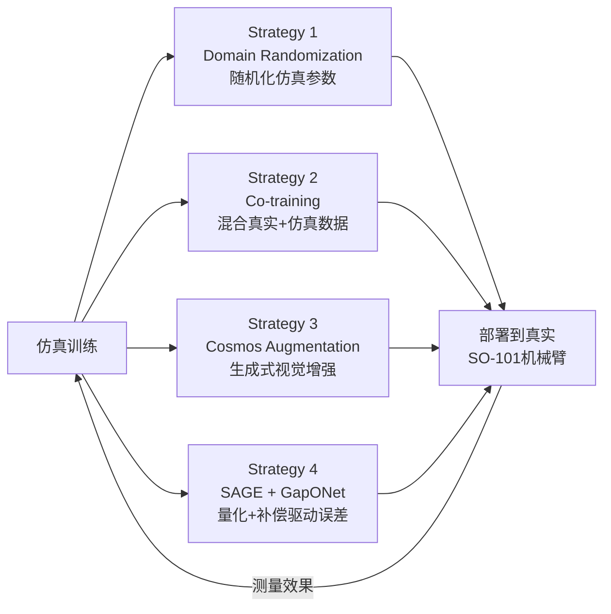
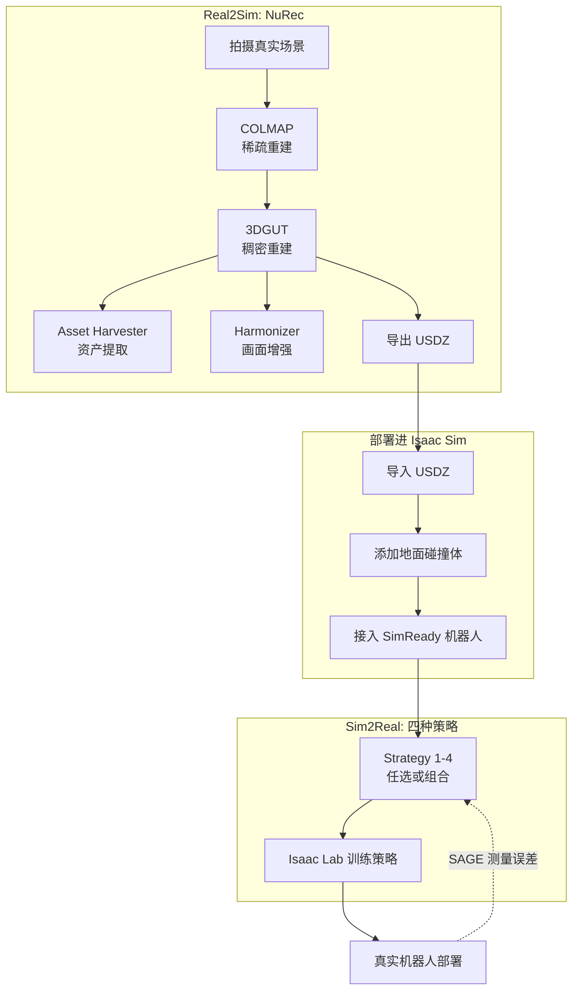

# 第一章：全景图——NVIDIA 官方 Real2Sim2Real 工作流总览

> 本章目标：把 NVIDIA 官方发布的 real2sim2real 工作流讲清楚——它不是一篇论文,而是一条**有产品名字、有官方文档、有可以直接跑的命令**的完整链路,由两部分组成：负责"真实到仿真"的 **Omniverse NuRec**，和负责"仿真到真实"的**四种命名 Sim-to-Real 策略**。

**知识链接**：
- [3D Gaussian Splatting：用一堆椭球把真实场景搬进电脑](/前置知识/007a_前置知识_3D_Gaussian_Splatting三维场景重建) — NuRec 底层重建技术 3DGUT 是 3DGS 的直接扩展，建议先读这篇
- [Sim-to-Real 迁移综述](/论文综述/S04_Sim_to_Real迁移综述) — 域随机化、系统辨识等基础方法论全景

---

## 一、先厘清一个容易混淆的问题：官方产品 vs 研究论文

在深入之前需要先说清楚一件事：NVIDIA 关于"real2sim"这个话题，公开信息里其实混杂着两类完全不同性质的东西：

1. **官方产品/教程**：`NVIDIA Omniverse NuRec`（场景重建产品，有正式文档站 `docs.nvidia.com/nurec`）和 `Train an SO-101 Robot From Sim-to-Real With NVIDIA Isaac`（官方学习路径课程，`docs.nvidia.com/learning/physical-ai`）——这两者是 NVIDIA 作为公司正式发布、持续维护、给开发者用的工具和教程。
2. **研究论文**：`SimFoundry`、`DreamGen`、`ACDC`（数字表亲）——这些是 NVIDIA GEAR 实验室（研究部门）发表的学术论文，代表前沿探索方向,但**不是**已经产品化、有官方文档支撑的工作流,它们的代码开源情况、成熟度和 NuRec 完全不是一个层级。

本系列聚焦第一类——**NuRec + 四种官方命名的 Sim-to-Real 策略**，这才是真正意义上"有一套工作流"的东西。研究论文（DreamGen、SimFoundry）会在需要时提及，用来对照说明"官方产品线"和"前沿研究方向"分别在做什么,但不会把它们混为一谈。

---

## 二、Real2Sim 部分：Omniverse NuRec

### 2.1 NuRec 是什么

[NVIDIA Omniverse NuRec](https://docs.nvidia.com/nurec/basics/how-nurec-works.html) 官方定义是——一套神经重建与渲染模型及服务,支持把真实世界的相机和 LiDAR 数据"无缝摄入"，转换成适合训练和测试物理 AI 智能体（机器人、自动驾驶系统）的仿真 3D 环境。

用一句话概括它做的事：**你拍一段视频/照片，NuRec 把它变成一个 Isaac Sim 能直接加载的、照片级真实的可交互场景**。

### 2.2 NuRec 内部的四个子组件

NuRec 不是单一模型，是四个子组件组成的流水线：

| 子组件 | 做什么 | 输入 | 输出 |
|--------|-------|------|------|
| 重建引擎（3DGUT） | 把真实拍摄数据训练成稠密 3D 表示 | COLMAP 稀疏重建结果 | 3D 高斯表示 + USDZ 文件 |
| Asset Harvester | 把场景里的具体物体转成独立 3D 资产 | 场景数据 | 逐物体的可编辑 3D 资产 |
| 渲染引擎（gsplat） | 用训好的高斯表示实时渲染新视角 | 3D 高斯表示 + 相机参数 | 实时渲染画面 |
| Harmonizer | 用扩散模型修正渲染细节，让画面更逼真 | 渲染结果 | 时序一致、更照片级真实的画面 |

这四个组件分别对应第二、三章要详细展开的内容。

### 2.3 NuRec 的输出格式：USDZ

NuRec 重建完成后输出一个 **USDZ** 文件（一个打包的 USD 场景），里面包含：

- **XODR 文件**：仿真里可行驶的地图（面向自动驾驶场景）
- **USDA 文件**：定义场景的 USD 文件，包括贴图、光照、物体轨迹等
- **Checkpoint**：真正的 AI 训练重建数据（高斯位置等）
- **JSON**：轨迹数据的另一种格式

这个 USDZ 文件可以直接拖进 Isaac Sim，或者导入 CARLA 仿真器。

---

## 三、Sim2Real 部分：四种命名策略

NVIDIA 官方教程《[Train an SO-101 Robot From Sim-to-Real With NVIDIA Isaac](https://docs.nvidia.com/learning/physical-ai/sim-to-real-so-101/latest/index.html)》用一个具体任务（SO-101 机械臂把离心管放进架子）为例，明确定义了四种**编号命名**的 sim-to-real 策略：

| 策略 | 一句话概括 | 解决的 Gap 类型 |
|------|-----------|-----------------|
| Strategy 1: Domain Randomization | 训练时随机化光照、相机位姿、物体位置 | 主要针对 Sensing Gap |
| Strategy 2: Co-training | 少量真实遥操作数据 + 大量仿真数据混合训练 | 综合性缓解，不针对单一 gap |
| Strategy 3: Cosmos Augmentation | 用 Cosmos 世界基础模型生成照片级多样化数据 | 主要针对 Sensing Gap（比 DR 更彻底） |
| Strategy 4: SAGE + GapONet | 系统性测量每个关节的仿真-真实误差，训练补偿模型 | 专门针对 Actuation Gap |

**这四种策略不是递进关系，而是针对不同 gap 来源的正交工具**——官方教程明确指出"combining strategies often works better than any single approach"（组合使用几种策略往往比单独用一种效果更好）。第五章会详细展开这四类 gap 的官方分类，第六到八章逐一拆解每种策略的具体实现。

---

## 四、完整链路：从视频到部署的闭环

这张图是本系列的主线——第二到四章讲 Real2Sim 部分（NuRec），第五到八章讲 Sim2Real 部分（四种策略），第九章把整条链路串起来跑一遍。

---

## 五、和研究论文方向的关系（一次性说清楚,后续不再赘述）

为了避免误导，这里明确说一下 NuRec 和之前提到的几篇研究论文的关系：

- **NuRec vs SimFoundry**：两者解决的都是"从视频/照片重建可交互仿真场景"这个问题，但 NuRec 是 NVIDIA 官方产品（3DGUT 重建引擎 + Asset Harvester + Harmonizer 的完整工具链，有正式维护的文档和开源代码库），[SimFoundry](/论文综述/132_SimFoundry_单视频重建可交互仿真场景) 是 NVIDIA GEAR 实验室的研究论文（提出"数字表亲"概念，用于生成场景变体）。两者的技术路线有相通之处（都用 3D Gaussian 类技术做重建），但 SimFoundry 的"数字表亲"批量生成能力目前不是 NuRec 产品线的一部分。
- **Cosmos Augmentation vs DreamGen**：官方 Strategy 3 使用的是 [Cosmos Transfer](/论文综述/133_CosmosTransfer_多模态可控世界生成与Sim2Real域随机化)（本系列第七章详细讲），这是已经产品化、教程里直接教你怎么用的技术。[DreamGen](/论文综述/131_DreamGen_视频世界模型生成机器人训练数据) 是另一个研究方向——用视频生成模型直接"造"全新行为的训练数据，思路上和 Cosmos Transfer 有交集（都用到视频生成模型），但 DreamGen 本身不是官方 Sim-to-Real 教程里的一环。

**简单记忆方式**：本系列后续章节讲的每一个具体技术（NuRec、COLMAP、3DGUT、Asset Harvester、Harmonizer、Domain Randomization、Co-training、Cosmos Transfer、SAGE、GapONet），都能在官方文档站上找到对应页面、能直接跑通对应命令——这是判断"是不是官方工作流的一部分"最直接的标准。

---

## 下章预告

第二章开始动手——从拍摄一段真实场景的照片开始,走完 COLMAP 稀疏重建 + 3DGUT 稠密重建的完整命令流程,最终产出一个 USDZ 文件。

---

## 延伸阅读

- [How NuRec Works（官方文档）](https://docs.nvidia.com/nurec/basics/how-nurec-works.html)
- [Train an SO-101 Robot From Sim-to-Real With NVIDIA Isaac（官方课程）](https://docs.nvidia.com/learning/physical-ai/sim-to-real-so-101/latest/index.html)
- [3D Gaussian Splatting：用一堆椭球把真实场景搬进电脑](/前置知识/007a_前置知识_3D_Gaussian_Splatting三维场景重建)
- [Sim-to-Real 迁移综述](/论文综述/S04_Sim_to_Real迁移综述)
