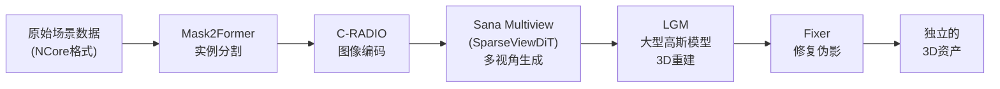
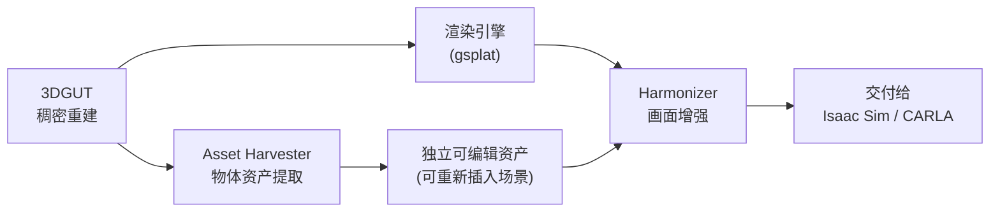

# 第三章：从高斯点到可用资产——Asset Harvester 与 Harmonizer

> **前情提要**：第二章走完了 COLMAP + 3DGUT 的重建流程，产出了一个 USDZ 文件——这个文件里的场景是一整块连续的高斯点云，视觉逼真但缺少两个东西：场景里的具体物体还不是独立可编辑的资产，渲染画面在细节上也还有提升空间。本章讲 NuRec 流水线里负责补上这两块的组件：**Asset Harvester** 和 **Harmonizer**。

**知识链接**：
- [第二章：场景采集与重建](./02_场景重建_COLMAP与3DGUT) — 本章承接第二章的 USDZ 输出
- [世界模型基础](/前置知识/000t_前置知识_世界模型基础) — Harmonizer 底层用到的 Cosmos-Predict2 属于视频/图像生成模型的范畴

---

## 一、Asset Harvester：把场景里的物体单独"捞"出来

### 1.1 要解决的问题

第二章的重建流程,产出的是**一整块**高斯点云——场景里的车辆、行人、道具全部混在同一个椭球集合里，没有物体级别的边界。如果想要"单独把这辆车拿出来放到另一个场景里"或者"给这个行人换个姿态"，这块混在一起的高斯点云做不到。

Asset Harvester 就是用来解决这个问题的系统——官方文档里的定义是：**从数据集中把场景中的actor和物体转换成独立的 3D 资产**。

### 1.2 一个重要的定位说明：Asset Harvester 主要面向自动驾驶场景

需要明确指出：Asset Harvester 目前公开的应用场景主要是**自动驾驶数据**——它的官方描述是"把真实世界驾驶日志转换成完整的、仿真就位的 3D 资产"，处理的对象是车辆、行人、骑行者等道路物体，即便在严重遮挡、标定噪声、极端视角偏差的情况下依然能工作。虽然它和本系列讲的机器人 real2sim2real 工作流同属 NuRec 产品线,但如果要用它处理机器人操作场景里的桌面物体（杯子、工具），需要留意它公开验证过的场景主要是自动驾驶物体类别，机器人操作场景的适配效果需要自行验证。

### 1.3 五个模型分别做什么

Asset Harvester 内部由 5 个模型组成的流水线：

| 模型 | 角色 | 具体做什么 |
|------|------|-----------|
| **Mask2Former** | 分割器 | 在解析输入视角时,对场景里的物体做实例分割（这是一个专门针对自动驾驶物体图像训练的 Mask2Former 变体） |
| **C-RADIO** | 编码器 | 把分割出的物体图像编码成视觉特征表示 |
| **Sana Multiview（SparseViewDiT）** | 多视角生成器 | 输入一组带位姿的图像，输出该物体从 16 个不同视角看到的样子——这一步是为了给"物体实际观测视角有限"这个问题补足更多视角信息 |
| **LGM（Large Gaussian Model）** | 3D 重建器 | 用生成的 16 个视角图像重建出物体的 3D 高斯表示 |
| **Fixer** | 修复器 | 一个单步图像扩散模型，专门修复渲染新视角时因为"三维表示里信息不足的区域"产生的伪影 |

### 1.4 为什么需要"多视角生成"这一步

这是整条流水线里最值得注意的设计——真实驾驶场景里，一辆车往往只能从一两个角度被摄像头拍到（不可能围着别人的车转一圈拍照）。直接用这一两个视角去重建完整的 3D 模型，背面和侧面会完全缺失。Sana Multiview 这一步的作用是：**用生成式 AI"想象"出物体在其他视角下应该长什么样**，把"实际只有 1-2 个观测视角"的稀疏问题，转换成"有 16 个视角"的更完整问题，再交给 LGM 做 3D 重建——这个思路和本系列前面讨论过的"用生成模型的先验知识补足信息缺口"是同一类工程哲学。

### 1.5 Fixer 的角色

即便有了 16 个视角的输入，3D 重建仍然会在某些"信息不足的区域"（比如物体被严重遮挡的部分）产生模糊或伪影。Fixer 是一个专门训练来修复这类问题的单步扩散模型——它不需要多步迭代去噪（这是它区别于普通扩散模型的关键设计，追求速度），输入渲染出的新视角，输出修复伪影后的结果。

---

## 二、Harmonizer：让渲染结果更逼真、更稳定

### 2.1 要解决的问题：神经重建的渲染结果还不够完美

即便 3DGUT 重建的质量已经很高，直接渲染出的画面仍然可能存在两个问题：

1. **单帧质量不够照片级真实**：某些角度/区域的渲染细节不如真实相机拍摄的效果。
2. **时序不一致**：连续帧之间可能出现闪烁、跳变（尤其是在插入新的动态物体，比如把 Asset Harvester 提取出的一个物体重新插入场景里的不同位置时）。

### 2.2 Harmonizer 的技术方案

Harmonizer 是官方文档明确推荐**替代旧模型（Difix 和 Fixer）**的新一代后处理方案——一个基于扩散模型的增强器，骨干网络是 **Cosmos-Predict2 0.6B**（NVIDIA 的世界基础模型系列），经过专门的数据整理流程微调，用于自动驾驶和大规模机器人仿真场景。

它在重建和渲染的**下游**工作,作为一个"仿真帧增强器"：

- **时序一致性**：训练和推理时都会参考前面的帧（temporal run mode），并用一个"时序总变差损失"（Temporal Total Variation Loss，一种惩罚帧间突变的正则化手段）来防止画面闪烁。
- **跨域外观匹配**：当把从别的采集场景提取出的动态物体（比如 Asset Harvester 生成的资产）重新插入当前场景时，修正它的外观让它和当前场景的光照/色调保持一致。
- **光照真实感**：修正阴影、做颜色协调，让整体画面看起来更统一、更真实。

**这个模型的一个工程亮点**：它把原本需要多步迭代的扩散增强过程，蒸馏成了一个"单步、带时序条件"的高效增强器——这意味着它可以在生产级别的仿真渲染管线里实时或近实时地跑,而不是只能用于离线后处理。

### 2.3 怎么启用

在 NuRec 的 gRPC 服务里，通过 `--enable-harmonizer` 参数启用。整体使用方式是：3DGUT 完成重建和渲染之后,渲染结果经过 Harmonizer 这一层增强，再交付给下游的仿真/训练环节使用。

---

## 三、这两个组件在整条 NuRec 流水线里的位置

**Asset Harvester** 解决的是"结构问题"——让场景里的物体变得独立可编辑；**Harmonizer** 解决的是"视觉问题"——让最终交付的画面更逼真、更稳定。两者的定位不同、可以独立使用，也可以组合使用（比如用 Asset Harvester 提取出一个物体、重新摆放到场景里的新位置，再用 Harmonizer 修正这次"重新插入"带来的外观不协调）。

---

## 四、本章小结

| 组件 | 核心能力 | 关键技术 |
|------|---------|---------|
| Asset Harvester | 从稀疏观测提取独立 3D 资产 | Mask2Former 分割 + C-RADIO 编码 + 多视角生成 + LGM 重建 + Fixer 修复 |
| Harmonizer | 提升渲染画面的照片级真实感和时序一致性 | 基于 Cosmos-Predict2 蒸馏出的单步扩散增强器 |

## 下章预告

第四章要把前两章产出的 USDZ 文件，真正导入 Isaac Sim——讲清楚怎么给纯视觉的高斯场景加上地面碰撞体、怎么用 Proxy Mesh 让阴影正确显示、怎么把 SimReady 机器人放进这个重建出的场景里，为后续训练做准备。

---

## 延伸阅读

- [How NuRec Works（官方文档）](https://docs.nvidia.com/nurec/basics/how-nurec-works.html)
- [nvidia/asset-harvester（HuggingFace 模型页）](https://huggingface.co/nvidia/asset-harvester)
- [Extracting 3D Assets from Autonomous Driving Logs for Simulation（研究页）](https://research.nvidia.com/labs/sil/projects/asset-harvester/)
- [Use Harmonizer for Post-Processing（官方文档）](https://docs.nvidia.com/nurec/nurec/harmonizer.html)
