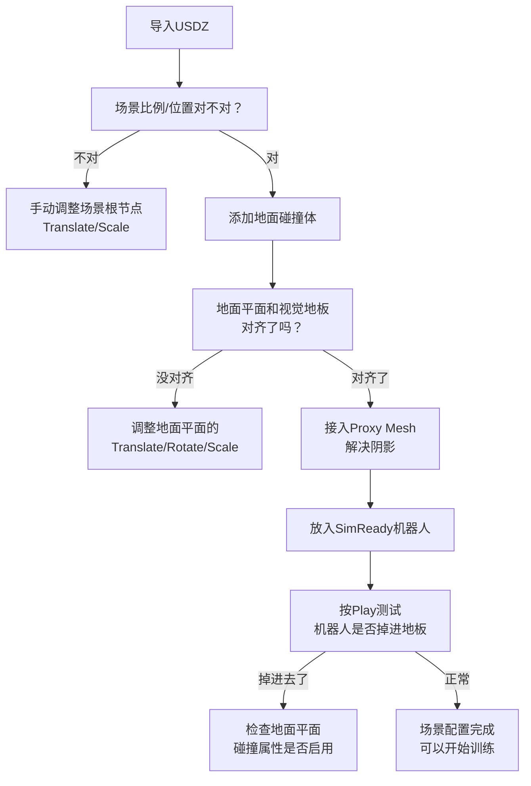

# 第四章：部署进 Isaac Sim——地面碰撞体、Proxy Mesh 与机器人接入

> **前情提要**：第二、三章走完了"拍摄 → COLMAP → 3DGUT → Asset Harvester/Harmonizer"的完整重建流程，产出了一个视觉逼真、结构清晰的场景。本章要解决最后一个问题：这个重建出的场景本质上还只是"视觉几何"——机器人放进去会直接穿模掉下去，因为它没有任何物理属性。本章讲怎么把它变成一个真正能让机器人交互的仿真环境。

**知识链接**：
- [第二章：场景采集与重建](./02_场景重建_COLMAP与3DGUT) — 本章承接第二章产出的 USDZ 文件
- [第三章：资产提取与画面增强](./03_资产提取与画面增强_AssetHarvester与Harmonizer)

---

## 一、一个关键认识：重建出的场景只是"视觉几何"

回顾第二章提到的 USDZ 文件内容——里面装的是高斯点的位置、颜色、透明度信息，这些信息只回答"从某个角度看，这个场景长什么样"，**不回答**"如果一个机械臂的夹爪碰到桌面会发生什么"。这正是本章标题强调的问题——重建出的场景**没有碰撞属性**，机器人如果直接放进去，会直接穿透地板掉下去。

这也是为什么本系列反复强调："看起来真实"和"物理上可交互"是两件独立的事——第二、三章解决的是前者，本章要解决后者。

---

## 二、导入 USDZ：两种方式

官方文档给出的操作步骤（来自 [How to Instantly Render Real-World Scenes in Interactive Simulation](https://developer.nvidia.com/blog/how-to-instantly-render-real-world-scenes-in-interactive-simulation/)）：

1. **启动 Isaac Sim**（版本 5.0 或更高，这是支持 NuRec/3DGUT 特性的最低版本要求）,从空场景开始（File → New）
2. **导入方式一**：File → Import，选中 `export_last.usdz` 文件
3. **导入方式二**：直接把 USDZ 文件从内容浏览器拖拽到视口里

导入成功后，重建出的环境会显示为"一堆彩色的高斯点"——这是一个几乎照片级真实的 3D 表示，可以用 WASD 键或者右键拖拽在场景里自由导航、从各个角度查看。

---

## 三、加地面碰撞体：让机器人有东西可以站

### 3.1 为什么必须手动加

前面强调过，重建出的场景是纯视觉几何，没有内置碰撞属性。要让机器人在这个场景里站稳，必须**手动添加**一个地面碰撞体：

1. Create → Physics → Ground Plane
2. 会出现一个平坦的地面（通常在 Z=0 位置）
3. 缩放这个平面（比如 X=100, Y=100）覆盖场景的地板区域
4. 调整平移/旋转/缩放属性，让它和重建出的地板视觉位置对齐

### 3.2 一个常见的坑：场景比例/位置不对

第二章提到，`apply_normalizing_transform` 选项会把场景居中缩放,但**不保证**地板正好在 z=0——这意味着导入后经常需要手动调整场景整体的位置，让加上去的物理地面平面和视觉上的地板重合。如果这一步没做好，会出现"机器人掉进地板里"或者"机器人悬空站在半空"这类明显的错位现象。

---

## 四、Proxy Mesh：解决阴影渲染问题

### 4.1 要解决的问题

高斯点云表示的场景，本身不参与传统的阴影计算——如果直接把一个机器人模型放进这个场景，机器人在真实光照下应该在地面上投出阴影，但高斯点云"不知道"怎么接收这个阴影，导致机器人看起来像"悬浮"在场景里，缺乏视觉上的落地感。

### 4.2 解决方式：接入一个 Proxy Mesh

Proxy Mesh 是一个专门用来"承接阴影"的辅助网格——它本身不需要精确匹配地板的视觉细节，只需要提供一个能正确参与传统阴影计算的几何表面：

1. 选中 NuRec prim（全局坐标变换节点下面的那个 volume prim）
2. 在 Raw USD Properties 面板里，找到 NuRec/Volume 属性区
3. 找到 Proxy 字段，点 + 添加你的代理网格 prim（通常就是第三节创建的地面平面）
4. 重新选中地面平面
5. 确保 Geometry → Matte Object 属性被启用（这个属性让这个网格只承接阴影,但自身不会被渲染出来遮挡下面的高斯点云画面）

---

## 五、放入机器人：SimReady 资产库

### 5.1 Isaac Sim 自带的机器人模型

Isaac Sim 内置了一批 SimReady（仿真就位）机器人模型，可以直接放进重建出的场景：

| 类别 | 示例 |
|------|------|
| 机械臂 | Franka Emika Panda、UR10 等 |
| 移动机器人 | LeatherBack、Carter、TurtleBot |
| 人形机器人 | 多种人形模型 |

操作方式：Create → Robots 菜单，选择机器人类型，会直接添加到场景，然后用移动/旋转工具把它放到想要的位置。

### 5.2 按下播放，测试交互

配置完成后点击播放按钮，机器人应该能正常和这个重建出的照片级场景交互——这时可以开始：动画机器人动作、跑强化学习训练、测试导航算法、生成合成数据。

---

## 六、完整检查清单

在开始正式训练之前，建议按这个清单确认场景配置正确：

---

## 七、本章小结

| 环节 | 要解决的问题 | 操作 |
|------|-------------|------|
| 导入 USDZ | 把重建结果加载进 Isaac Sim | File → Import 或拖拽 |
| 地面碰撞体 | 视觉场景没有物理属性,机器人会穿模 | Create → Physics → Ground Plane，手动对齐 |
| Proxy Mesh | 高斯点云不参与传统阴影计算 | NuRec Volume prim 的 Proxy 字段接入地面网格 |
| 机器人接入 | 需要一个可交互的智能体 | Create → Robots，选择 SimReady 模型 |

到这一步，第二到四章完整覆盖了 NuRec 这条 Real2Sim 产品线——从一段视频到一个 Isaac Sim 里能跑机器人的可交互场景。

## 下章预告

有了可交互的仿真场景，下一步是在里面训练策略、再部署到真实机器人上——这个过程会遇到"仿真里表现很好，真实世界表现打折"的经典问题。第五章开始进入本系列的 Sim2Real 部分,先讲清楚官方对这个"差距"的四类划分。

---

## 延伸阅读

- [How to Instantly Render Real-World Scenes in Interactive Simulation（官方博客，本章操作步骤来源）](https://developer.nvidia.com/blog/how-to-instantly-render-real-world-scenes-in-interactive-simulation/)
- [Reconstruct Scenes from Mono Camera Data（官方文档）](https://docs.nvidia.com/nurec/robotics/neural_reconstruction_mono.html)
