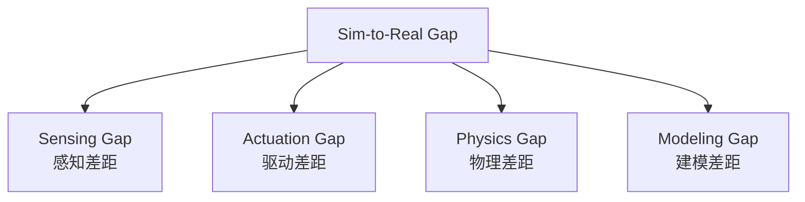
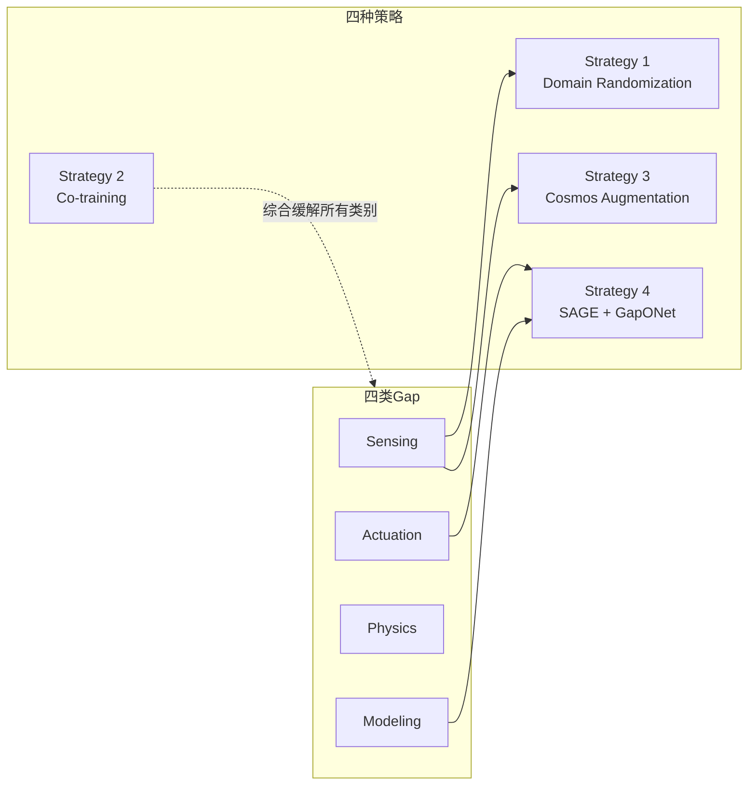

# 第五章：Sim-to-Real Gap 全景——四类差距与四种策略地图

> **前情提要**：第二到四章讲完了 Real2Sim 部分（NuRec 重建 + Isaac Sim 部署）。从本章开始转入 Sim2Real 部分——一个在这个重建场景里训练好的策略，部署到真实机器人时会遇到什么问题？本章讲清楚官方对这个问题的分类框架，为第六到八章逐一拆解四种策略打好基础。

**知识链接**：
- [Sim-to-Real 迁移综述](/论文综述/S04_Sim_to_Real迁移综述) — 域随机化、系统辨识等方法论的更全面背景
- [第一章：全景图](./01_全景图_NuRec与四大Sim2Real策略总览) — 四种策略的初步介绍

---

## 一、Sim-to-Real Gap 的官方定义

[官方课程](https://docs.nvidia.com/learning/physical-ai/sim-to-real-so-101/latest/03-sim-to-real.html)给出的定义很直白：**Sim-to-real gap 是仿真表现和真实表现之间的差距**——一个在仿真里达到高成功率的策略,部署到真实硬件上可能表现明显更差。

官方文档特别强调一点：**这个 gap 通常比预期的更大**，而且它不是单一的东西,而是几类完全不同性质的差距的组合——这正是为什么"不要假设一个策略不经系统测试和迭代就能'直接工作'"。

---

## 二、四类差距来源（官方分类）

官方课程把 Sim-to-Real Gap 的来源拆成四大类：

### 2.1 Sensing Gap（感知差距）

- 相机模型缺少真实传感器的噪声、模糊、畸变
- 深度传感器的测量是理想化的，没有真实伪影
- 仿真光照和真实光照条件不同

### 2.2 Actuation Gap（驱动差距）

- 电机模型缺少摩擦、齿轮反冲（backlash）、热效应
- 关节动力学被简化建模
- 仿真和真实硬件之间的控制回路时序不同

### 2.3 Physics Gap（物理差距）

- 接触动力学（摩擦、弹性恢复系数）是近似值
- 柔性体（可变形物体）难以精确仿真
- 流体力学和颗粒材料的仿真计算成本高昂

### 2.4 Modeling Gap（建模差距）

- CAD 模型和真实制造出来的硬件之间存在差异
- 质量和惯性参数是估计值，不是精确测量值

| 差距类别 | 典型表现 | 对应本系列后续章节的应对策略 |
|---------|---------|------------------------------|
| Sensing | 相机噪声/光照差异 | Strategy 1（域随机化）、Strategy 3（Cosmos 增强）|
| Actuation | 摩擦/齿轮反冲/控制时序 | Strategy 4（SAGE + GapONet）|
| Physics | 接触/柔性体建模误差 | 需要更精细的物理仿真器改进，本系列的策略工具箱里没有专门对应项 |
| Modeling | CAD 与实物的偏差 | 与 Actuation Gap 部分重叠，SAGE 分析里会一并暴露 |

---

## 三、为什么"仿真足够精确"也不能保证迁移成功

官方文档特别指出一点容易被忽视的认识——即便假设仿真已经做到极致精确,迁移依然困难,原因有四：

1. **分布偏移**（Distribution shift）：真实世界的条件会偏离训练时见过的分布
2. **误差累积**（Compounding errors）：小的感知误差会被逐步放大成大的动作误差
3. **未建模的动力学**（Unmodeled dynamics）：真实物理里有一些效应可能根本没有被仿真表示出来
4. **时序差异**（Temporal differences）：真实世界的实时性约束会影响行为表现

这四条提醒我们——四种命名策略要解决的不只是"仿真不够精确"这一个问题,还包括"即便精确了依然会遇到"的结构性挑战。

---

## 四、四种策略地图：谁对应解决什么

结合第一章的初步介绍，这里给出更完整的对照：

| 策略 | 直接针对 | 核心手段 | 需要的真实数据量 |
|------|---------|---------|-----------------|
| Strategy 1: Domain Randomization | Sensing Gap | 训练时随机化光照/相机位姿/物体位置等仿真参数 | 不需要 |
| Strategy 2: Co-training | 综合性 | 少量真实遥操作数据 + 大量仿真数据混合训练 | 少量（教程案例中约 5 条真实 episode） |
| Strategy 3: Cosmos Augmentation | Sensing Gap（更彻底） | 用世界基础模型生成照片级、多样化的合成视频 | 需要种子视频/prompt，不需要大量真实动作标签 |
| Strategy 4: SAGE + GapONet | Actuation Gap | 系统性测量仿真-真实的逐关节误差，训练补偿网络 | 需要（教程案例中收集了约 8 小时真实轨迹数据） |

**一个重要的官方结论**（第八章会再展开）：这四种策略**不是互斥选项**，官方教程的结论明确写着"combining strategies often works better than any single approach"（组合使用往往比单独使用任何一种都更好）。

---

## 五、和第一到四章的关系：为什么要先讲重建再讲策略

回顾一下，第二到四章讲的 NuRec 重建流程，本质上是在从源头上**缩小 Sensing Gap 和 Modeling Gap**——因为场景几何本身就来自真实拍摄，视觉分布天然更接近真实相机拍摄效果，比"通用仿真环境 + 域随机化"这条路线在几何层面的起点就更接近真实。但即便如此，后续训练出的策略，仍然需要面对本章讲的四类 gap（尤其是 Actuation Gap 和 Physics Gap，这两类和场景几何是否精确重建没有直接关系,而是和机器人本身的驱动特性、物理仿真器的接触建模能力有关）——这正是为什么即便用了 NuRec 重建了完美的场景，仍然需要第六到八章讲的四种策略。

---

## 六、本章小结

| 要点 | 内容 |
|------|------|
| Sim-to-Real Gap 官方四分类 | Sensing / Actuation / Physics / Modeling |
| 即便仿真精确也难以迁移的四个原因 | 分布偏移、误差累积、未建模动力学、时序差异 |
| 四种策略各自针对性 | DR→Sensing；Co-train→综合；Cosmos→Sensing(更彻底)；SAGE+GapONet→Actuation |
| 官方核心结论 | 策略之间应该组合使用，而非二选一 |

## 下章预告

第六章开始逐一拆解策略——先讲 Strategy 1（Domain Randomization）和 Strategy 2（Co-training），包括 Isaac Lab 里真实的 `EventTerm` 随机化代码，以及官方给出的 co-training 数据配比实测对比。

---

## 延伸阅读

- [What Is Sim-to-Real?（官方文档，本章内容来源）](https://docs.nvidia.com/learning/physical-ai/sim-to-real-so-101/latest/03-sim-to-real.html)
- [Sim-to-Real 迁移综述](/论文综述/S04_Sim_to_Real迁移综述)
