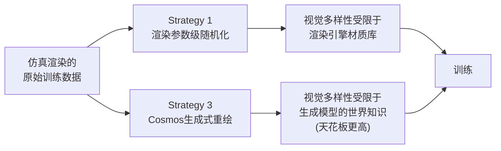

# 第七章：策略三——用 Cosmos Transfer 做生成式数据增强

> **前情提要**：第六章讲的 Strategy 1（域随机化）本质上是"在仿真渲染引擎内部随机贴材质/调光照"，能覆盖的视觉多样性受限于渲染引擎的表达能力。本章讲的 Strategy 3，走的是完全不同的技术路线——用一个在海量真实视频上预训练过的生成式世界基础模型,直接"重新画"出照片级真实的训练画面。

**知识链接**：
- [Cosmos-Transfer：多模态可控世界生成（精读）](/论文综述/133_CosmosTransfer_多模态可控世界生成与Sim2Real域随机化) — 本章使用技术的完整原理详解
- [第六章：策略一二](./06_策略一二_域随机化与Co_training) — Strategy 1 与本章 Strategy 3 的直接对比

---

## 一、为什么域随机化不够：官方教程的说法

[官方教程](https://docs.nvidia.com/learning/physical-ai/sim-to-real-so-101/latest/14-strategy3-cosmos.html)明确指出 Domain Randomization 的三个局限：

1. **只能随机化你明确设置的那些参数**——想不到的变化维度，覆盖不到
2. **仿真渲染看起来终究还是"合成的"**——不管怎么调材质参数，天花板受限于渲染引擎本身
3. **无法生成真正全新的场景**——只能在已有资产和参数范围内做排列组合

Cosmos 用生成式建模的方式来解决这三个局限。

---

## 二、Cosmos 是什么

官方定义：**Cosmos 是 NVIDIA 面向物理 AI 的世界基础模型（World Foundation Model）**。它能做的事情包括：

- 根据 prompt 或初始帧生成逼真的视频序列
- 模拟合理的物理交互
- 用多样化的合成场景增强机器人训练数据

### 2.1 官方给出的工作原理示意

```
输入：机器人示教视频 + prompt
     "相同任务，不同光照，不同离心管位置"

Cosmos生成：这个场景的多种变体
           保持物理一致性，视觉外观全新

输出：视觉条件多样化的增强训练数据
```

这个描述对应的正是[前置知识里](/论文综述/133_CosmosTransfer_多模态可控世界生成与Sim2Real域随机化#二自适应多模态控制这篇工作的核心创新)讲过的 Cosmos Transfer 技术——用分割图、深度图、边缘图等结构化信息作为约束条件，让生成模型在"保持结构不变"的前提下重新生成外观。

### 2.2 一个真实的官方 Prompt 样例

官方文档给出的实际使用样例（针对 SO-101 抓取离心管任务）：

```yaml
prompt: "Photorealistic first-person view from a robotic arm's orange claw-like
gripper. The prongs are visible at the bottom edge, hovering over a heavily
corroded, textured rusty steel plate showing oxidation and wear mat. To the left
is a yellow rectangular vial rack; to the right, two white opaque centrifuge
tubes with blue caps..."

{
  "name": "so101",
  "prompt_path": "prompt_test2.txt",
  "video_path": "ego_rgb_001.mp4",
  "guidance": 3,
  "depth": {"control_weight": 0.2, "control_path": "ego_depth_001.mp4"},
  "edge": {"control_weight": 1.0},
  "seg": {"control_weight": 0.3, "control_path": "ego_instance_id_segmentation_001.mp4"},
  "vis": {"control_weight": 0.1}
}
```

**这个配置的含义**：输入原始机器人视角视频（`ego_rgb_001.mp4`）连同它对应的深度图、边缘信息、分割图，每种模态给一个独立的 `control_weight`（控制权重）——这正是 [Cosmos-Transfer 精读里讲过](/论文综述/133_CosmosTransfer_多模态可控世界生成与Sim2Real域随机化#22-关键创新自适应的空间加权而不是全局固定权重)的"多模态自适应控制"机制的实际配置样式：`edge` 权重给到 1.0（完全信任边缘信息，保证物体轮廓精确），`depth` 权重只给 0.2（深度信息的可靠性打个折扣），`vis`（粗糙渲染帧）权重最低只给 0.1（只作为大致参考，把发挥空间更多留给生成模型自己的照片级真实"画法"）。

### 2.3 三个关键能力

官方文档总结了 Cosmos 增强能带来的三类多样性：

| 能力类别 | 具体内容 |
|---------|---------|
| 视觉多样性 | 照片级真实的渲染变化、自然光照变化、背景和纹理多样性 |
| 场景变化 | 物体位置变化、不同物体实例、环境改动 |
| 物理一致性 | 保持合理的物理规律、保留任务结构、物体交互连贯 |

**这三类能力和 Strategy 1（域随机化）能力的本质区别**：域随机化的"视觉多样性"局限于渲染引擎材质库；Cosmos 的"视觉多样性"来自生成模型在海量真实视频上学到的世界知识,理论上的天花板要高得多。

---

## 三、实测对比：Cosmos 增强数据训出的策略表现如何

### 3.1 官方给出的实测配置

教程提供了两个用 Cosmos 增强数据训练出的策略供实测对比：

| 配置 | 说明 |
|------|------|
| 75 条仿真 episode + 7 条 Cosmos 增强 episode | 少量增强数据的对照组 |
| 75 条仿真 episode + 70 条 Cosmos 增强 episode | 大量增强数据的实验组 |

### 3.2 部署方式（和第六章相同的服务器-客户端模式）

```bash
# 终端1：启动策略服务器（换成 Cosmos 增强训练出的checkpoint）
export MODEL=aravindhs-NV/so100-orig-groot-vials-rack-left-cosmos-70
python Isaac-GR00T/gr00t/eval/run_gr00t_server.py --model-path /workspace/models/$MODEL

# 终端2：真实机器人评测（命令结构和 Strategy 1/2 完全一致，只是换了模型）
python Isaac-GR00T/gr00t/eval/real_robot/SO100/so101_eval.py \
  --robot.type=so101_follower \
  --lang_instruction="Pick up the vial and place it in the yellow rack" \
  --rerun True
```

官方要点提示——观察 Cosmos 增强策略是否在光照和视觉变化上表现出**更强的鲁棒性**，和第六章的纯仿真/co-trained 策略做对比。

---

## 四、和第六章两种策略的关系



| 维度 | Strategy 1: 域随机化 | Strategy 3: Cosmos 增强 |
|------|----------------------|---------------------------|
| 实现方式 | 渲染引擎参数采样 | 生成模型条件重绘 |
| 视觉真实度上限 | 受限于渲染引擎材质库 | 受限于生成模型预训练数据（通常更高） |
| 计算成本 | 低（渲染实时） | 较高（需要跑生成模型推理） |
| 需要的输入 | 仿真环境本身 | 种子视频 + prompt + 结构化控制信号 |
| 官方教程的定位 | 打基础的默认方案 | "超越域随机化"的进阶方案 |

两者不是二选一——官方明确说"different approaches address different aspects of the sim-to-real gap"（不同方法针对 gap 的不同方面），Strategy 3 通常是在 Strategy 1/2 已经跑通的基础上，再叠加使用来进一步提升视觉鲁棒性。

---

## 五、本章小结

| 要点 | 内容 |
|------|------|
| Cosmos 的定位 | NVIDIA 面向物理 AI 的世界基础模型 |
| 核心机制 | 用结构化控制信号（深度/边缘/分割）约束生成，重绘出照片级真实的多样化画面 |
| 相比域随机化的优势 | 视觉真实度上限更高、能生成渲染引擎覆盖不到的多样性 |
| 官方实测配置 | 75仿真+7增强 vs 75仿真+70增强，对比视觉鲁棒性 |

## 下章预告

第八章讲最后一种、也是本系列里技术含量最高的策略——Strategy 4：SAGE + GapONet。这套方法不再满足于"随机化"或"混合数据"这类间接手段，而是直接**测量**每个关节的仿真-真实误差有多大，再用一个专门的神经网络去补偿它。

---

## 延伸阅读

- [Cosmos-Transfer：多模态可控世界生成（精读）](/论文综述/133_CosmosTransfer_多模态可控世界生成与Sim2Real域随机化)
- [Sim-to-Real Strategy 3: Augmenting Datasets With Cosmos（官方文档，本章来源）](https://docs.nvidia.com/learning/physical-ai/sim-to-real-so-101/latest/14-strategy3-cosmos.html)
- [Cosmos Cookbook（官方配方与示例）](https://nvidia-cosmos.github.io/cosmos-cookbook/)
