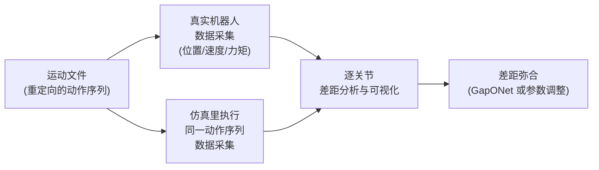

# 第八章：策略四——SAGE + GapONet 量化并修正驱动器误差

> **前情提要**：前三种策略（域随机化、Co-training、Cosmos 增强）都是围绕 Sensing Gap 做文章——让策略在训练时见过足够多样的视觉条件。但第五章提到的 **Actuation Gap**（驱动差距：摩擦、齿轮反冲、控制时序）,这三种策略都没有直接测量或修正它。本章讲的 Strategy 4——SAGE + GapONet——第一次把"测量误差"当作一个独立、系统性的步骤,而不是依赖随机化去"绕开"这个问题。

**知识链接**：
- [ASAP：对齐仿真与真实物理的 Delta 动作模型（精读）](/论文综述/116_ASAP_对齐仿真与真实物理的Delta动作模型) — 另一个独立研究方向提出的、思路上高度相似的动作空间残差建模方法，本章末尾会做对比
- [第五章：Sim-to-Real Gap 全景](./05_Sim2Real_Gap全景_四类差距与四种策略) — Actuation Gap 的定义

---

## 一、问题：驱动差距具体来自哪里

回顾官方文档给出的驱动差距来源清单——不准确或缺失的驱动器模型、物理建模缺口（接触细节、摩擦、闭环连杆结构）、随负载变化的动态效应（惯性行为随负载改变、摩擦力变化）、不准确的 URDF（缺失部件细节、缺失属性、人为输入错误）、CAD → URDF → USD 格式转换误差。

**SO-101 这个具体案例的挑战**：它的驱动器是业余爱好级伺服电机（hobby servo），会引入明显的**齿轮反冲**（backlash，齿轮啮合间隙导致的传动误差），而且这个误差会沿着机器人的运动链累积——末端执行器的实际位置误差,往往比单个关节的误差大得多。

要系统性地缩小这类差距，需要先回答三个问题：**差距具体在哪里？有多大？是什么原因造成的？**这正是 SAGE 要解决的问题。

---

## 二、SAGE：系统性测量 Sim-to-Real Gap

### 2.1 SAGE 是什么

**SAGE**（Sim-to-Real Actuation Gap Estimation，仿真-真实驱动差距估计）是同济大学（TJU）、北京大学（PKU）和 NVIDIA 三方合作的项目，目标是展示一套感知、测量、弥合 sim-to-real gap 的系统性方法。代码仓库：[isaac-sim2real/sage](https://github.com/isaac-sim2real/sage)。

### 2.2 SAGE 的核心工作流



SAGE 系统性地：

1. 收集针对同一组动作的成对真实和仿真数据
2. 对比位置、速度、力矩在两个域之间的差异
3. **逐关节**量化差距大小
4. 可视化差距最大的地方
5. 通过 GapONet 或参数调整，做针对性改进

**这个流程最关键的设计是"成对数据"**——同一个动作序列,一份在真实机器人上跑,一份在仿真里跑,两份数据在时间步上一一对应,这样才能精确算出"仿真在这个时刻这个关节上，和真实差了多少"，而不是笼统地比较两个域的整体统计特性。

### 2.3 SO-101 案例的具体数据规模

官方教程给出的案例中，SO-101 的 SAGE 流程收集了约 **8 小时**的真实轨迹数据用于训练差距弥合模型。

### 2.4 实际运行 SAGE 的命令

```bash
# 仿真数据采集
${ISAACSIM_PATH}/python.sh scripts/run_simulation.py \
    --robot-name so101 \
    --motion-source custom \
    --motion-files motion_files/so101/custom/pick_place.txt \
    --valid-joints-file configs/so101_valid_joints.txt \
    --output-folder output \
    --fix-root \
    --physics-freq 200 \
    --render-freq 200 \
    --control-freq 50 \
    --kp 100 \
    --kd 2

# 差距分析（对比成对的sim-real数据）
python scripts/run_analysis.py \
    --robot-name so101 \
    --motion-source custom \
    --motion-names "pick_place" \
    --output-folder output \
    --valid-joints-file configs/so101_valid_joints.txt
```

运行 `run_simulation.py` 会采集"命令关节位置""实际关节位置（来自仿真）""关节速度""关节力矩"这几组数据；真实机器人上执行同一个动作序列后（用真实硬件跑一遍相同的 `motion_files`），`run_analysis.py` 把两份数据对齐比较，产出逐关节、逐轴的误差分析图。

### 2.5 SAGE 分析结果长什么样

官方文档给出两种可视化 SAGE 分析结果的方式：

1. **视觉对比**：在 Isaac Sim 里同时叠加播放"真实机器人运动"和"仿真回放"，可以直接肉眼看出两者轨迹的偏差。
2. **量化的逐关节误差图**：对每个关节分别测量误差,用柱状图对比"补偿前"和"补偿后"（用 GapONet 修正后）的误差大小——这就是下一节要讲的内容。

---

## 三、GapONet：把测量出的误差变成一个可学习的补偿模型

### 3.1 GapONet 是什么

**GapONet** 由北京大学（PKU）开发，是 SAGE 生态里的一个组件——它学习一个驱动器行为的神经网络模型，捕捉那些**难以用解析方式建模**的效应（比如上面提到的齿轮反冲、随负载变化的动力学）。

### 3.2 训练和推理的核心逻辑

```
训练阶段：
  输入：  指令动作序列（来自运动文件）
  目标：  真实机器人上实际产生的运动
  学习：  从"指令"到"实际行为"的映射

推理阶段：
  输入：  策略想要执行的动作
  输出：  修正后的、能真正达到预期效果的动作
```

**这个逻辑和本项目已经写过的 [ASAP 精读](/论文综述/116_ASAP_对齐仿真与真实物理的Delta动作模型#22-阶段二用真实数据训练delta-action-model)里的 Delta Action Model 思路高度一致**——都是学一个"指令动作 → 真实执行效果"的补偿映射，而不是去改仿真的物理参数。第四节会具体对比两者的异同。

### 3.3 GapONet 有两种使用方式

官方文档明确指出这一点很重要——训好的差距弥合模型（gap-bridging model）可以用在两个地方：

1. **接入仿真环境内部**：让仿真环境本身更贴近真实驱动特性，这样在这个"被校准过的仿真"里训练出的策略,天然就更容易无缝迁移到真实部署。
2. **部署时用在真实机器人上**：策略输出的动作先经过 GapONet 修正，再发送给真实电机执行——这是"GapONet + GR00T 集成"这个未来方向的核心思路，官方文档明确写着这个集成还在积极开发中（"under active development"）。

### 3.4 效果对比：官方给出的量化数据

官方文档展示的实验结果——加入 GapONet 后：

- **视觉对比**：仿真回放轨迹和真实运动轨迹的重合度明显提升
- **量化误差**：逐关节误差柱状图显示，用了 GapONet 后（绿色柱）的误差明显低于没用 GapONet 的情况（橙色柱），尤其是在腕关节、夹爪这类误差本来就比较大的关节上改善更明显

### 3.5 GapONet 的实际训练命令（供参考）

```bash
python scripts/rsl_rl/train.py --task Isaac-Humanoid-Operator-Delta-Action \
  --num_envs=4080 --max_iterations 100000 --experiment_name Sim2Real \
  --letter amass --run_name delta_action_mlp_payload --device cuda env.mode=train --headless
```

训练完成后可以导出成轻量级的 JIT 格式，脱离 Isaac Sim 直接跑推理：

```bash
python scripts/rsl_rl/inference_jit.py \
    --export --checkpoint ./model/model_17950.pt \
    --task Isaac-Humanoid-Operator-Delta-Action \
    --output ./model/policy.pt --device cuda:0 --num_envs 20
```

---

## 四、和 ASAP 的对比：两个独立团队殊途同归的思路

有意思的是，本项目之前精读过的 [ASAP](/论文综述/116_ASAP_对齐仿真与真实物理的Delta动作模型)（CMU + NVIDIA 研究团队，面向人形机器人敏捷全身技能）和这里的 GapONet（同济+北大+NVIDIA，面向 SO-101 机械臂）,虽然是两个独立的研究方向，核心思路却高度收敛——都在**动作空间**（而不是状态空间或者物理参数空间）学一个补偿模型。

| 维度 | ASAP | GapONet |
|------|------|---------|
| 目标机器人 | 人形机器人全身运动 | 机械臂关节控制 |
| 校准依据 | 真实机器人 rollout 数据 | SAGE 系统性采集的成对 sim-real 数据 |
| 补偿位置 | 动作发出前叠加修正量 | 学习"指令→实际行为"的映射，用于修正 |
| 是否接回仿真训练 | 是（重新接回仿真微调策略） | 是（可选，接入仿真环境） |
| 是否用于真实部署时实时修正 | 论文未强调此用法 | 明确规划（GapONet + GR00T 集成） |
| 开发状态 | 已发表（RSS 2025） | 集成到 GR00T 部署流程仍在开发中 |

**为什么两个团队会独立收敛到同一个思路**：这正说明了第五章提到的 Actuation Gap 的本质——不管是人形机器人的全身动力学还是机械臂的关节驱动，"发出的指令"和"真实执行效果"之间的偏差，用传统的物理参数调整（改摩擦系数、改质量）表达能力有限，而"直接学一个动作层面的翻译函数"是一个更通用、更容易在不同机器人形态上复用的解法。

---

## 五、本章小结

| 组件 | 角色 | 关键产出 |
|------|------|---------|
| SAGE | 系统性测量仿真-真实的逐关节误差 | 成对数据采集流程 + 误差可视化分析 |
| GapONet | 学习一个"指令→实际行为"的补偿模型 | 可接入仿真训练或真实部署的神经网络 |
| 和 ASAP 的关系 | 独立团队、相同思路：动作空间残差建模 | 印证了这条思路在缓解 Actuation Gap 上的通用性 |

## 下章预告

第九章是全系列的收尾——把第二到八章讲过的所有环节（NuRec 重建 → Isaac Sim 部署 → 四种 Sim2Real 策略）串成一条完整的命令清单，走一遍从"拍视频"到"真实机器人自主运行"的端到端闭环，并回顾整体技术图谱。

---

## 延伸阅读

- [Sim-to-Real Strategy 4: SAGE + GapONet（官方文档，本章来源）](https://docs.nvidia.com/learning/physical-ai/sim-to-real-so-101/latest/15-strategy4-sage.html)
- [SAGE 代码仓库](https://github.com/isaac-sim2real/sage)
- [GapONet 代码仓库](https://github.com/jiemingcui/gaponet)
- [ASAP：对齐仿真与真实物理的 Delta 动作模型（精读）](/论文综述/116_ASAP_对齐仿真与真实物理的Delta动作模型)
