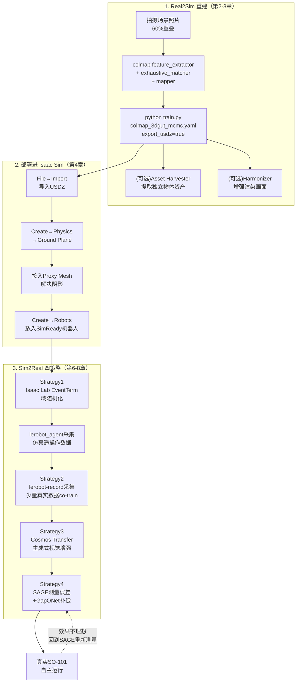

# 第九章：工程实战与全景总结

> **前情提要**：前八章分别讲了 NuRec 重建（第 2-4 章）、Sim-to-Real Gap 分类（第 5 章）、四种命名策略（第 6-8 章）。本章把整条链路串成一个端到端的命令清单，走一遍完整闭环，并做全系列的总结。

---

## 一、端到端闭环：从拍视频到真实机器人自主运行

把前八章的命令按顺序串起来，就是完整的 real2sim2real 闭环：



## 二、一份可以直接抄的命令清单

把散布在各章的关键命令汇总在一起：

```bash
# ===== 第2章：COLMAP 稀疏重建 =====
colmap feature_extractor --database_path ./colmap/database.db --image_path ./images/ \
    --ImageReader.single_camera 1 --ImageReader.camera_model PINHOLE
colmap exhaustive_matcher --database_path ./colmap/database.db --SiftMatching.use_gpu 1
colmap mapper --database_path ./colmap/database.db --image_path ./images/ --output_path ./colmap/sparse

# ===== 第2章：3DGUT 稠密重建与USDZ导出 =====
conda activate 3dgrut
python train.py --config-name apps/colmap_3dgut_mcmc.yaml \
    path=/path/to/colmap/ out_dir=/path/to/out/ experiment_name=3dgut_mcmc \
    export_usdz.enabled=true export_usdz.apply_normalizing_transform=true

# ===== 第6章：Isaac Lab 仿真遥操作数据采集（带域随机化） =====
lerobot_agent --task Lerobot-So101-Teleop-Vials-To-Rack-DR \
    --repo_id ${HF_USER}/so101_teleop_vials \
    --repo_root $(pwd)/datasets/so101_teleop_vials

# ===== 第6章：真实机器人少量数据采集（用于co-training） =====
lerobot-record --robot.type=so101_follower --dataset.num_episodes=5 \
    --dataset.single_task="Pick up the vial and place it in the yellow rack"

# ===== 第8章：SAGE 仿真-真实成对数据采集与分析 =====
${ISAACSIM_PATH}/python.sh scripts/run_simulation.py --robot-name so101 \
    --motion-files motion_files/so101/custom/pick_place.txt
python scripts/run_analysis.py --robot-name so101 --motion-names "pick_place"

# ===== 部署评测（策略无关，统一模式） =====
python Isaac-GR00T/gr00t/eval/run_gr00t_server.py --model-path /workspace/models/$MODEL
python Isaac-GR00T/gr00t/eval/real_robot/SO100/so101_eval.py \
    --robot.type=so101_follower --lang_instruction="..."
```

---

## 三、全景技术图谱回顾

| 环节 | 章节 | 解决的问题 | 关键产品/技术 |
|------|------|-----------|--------------|
| 场景重建 | 第2章 | 把真实场景变成 3D 数据 | COLMAP + 3DGUT |
| 资产提取与增强 | 第3章 | 物体独立化、画面更逼真 | Asset Harvester、Harmonizer |
| 仿真部署 | 第4章 | 让重建场景可物理交互 | Isaac Sim 地面碰撞体、Proxy Mesh、SimReady 机器人 |
| Gap 分类 | 第5章 | 明确差距的来源 | Sensing / Actuation / Physics / Modeling |
| 策略一 | 第6章 | 缓解 Sensing Gap | Isaac Lab `EventTerm` 域随机化 |
| 策略二 | 第6章 | 综合缓解 | 真实+仿真数据 Co-training |
| 策略三 | 第7章 | 更彻底地缓解 Sensing Gap | Cosmos Transfer 生成式增强 |
| 策略四 | 第8章 | 精确缓解 Actuation Gap | SAGE 测量 + GapONet 补偿 |

---

## 四、和研究前沿方向的关系（回顾第一章的说明）

本系列聚焦的是官方产品化工作流（NuRec + 四种命名策略），但这不意味着这是这个领域的技术天花板。第一章提到的几个研究方向,分别代表了官方工作流可能演进的方向：

- **[SimFoundry](/论文综述/132_SimFoundry_单视频重建可交互仿真场景) 的"数字表亲"概念**：目前 NuRec 产品线专注于精确重建单一场景（数字孪生），但 SimFoundry 展示的"批量生成场景变体来提升泛化"这个思路，如果被产品化，可能会成为 NuRec 未来的一个扩展方向。
- **[DreamGen](/论文综述/131_DreamGen_视频世界模型生成机器人训练数据) 的神经轨迹**：Strategy 3（Cosmos Augmentation）目前的定位是"给已有数据做视觉增强"，而 DreamGen 展示的是"完全不需要已有仿真轨迹、直接生成全新行为"的更激进思路——这提示 Cosmos 系列模型未来可能承担比"视觉增强"更多的角色。
- **[ASAP](/论文综述/116_ASAP_对齐仿真与真实物理的Delta动作模型) 与 GapONet 的殊途同归**：第八章已经详细对比过，这提示"动作空间残差建模"这个思路正在从多个独立团队收敛成一个共识性方案，值得关注它未来是否会被更广泛地产品化。

**给读者的建议**：如果你在实际项目中使用 NuRec 或这四种策略,遇到官方工具覆盖不到的场景（比如需要批量场景变体、需要完全生成式的新行为数据），可以关注这些研究论文的开源代码——它们代表的是"官方产品线明天可能会长成什么样子"。

---

## 五、系列总结

这个系列从"NVIDIA 到底有没有一套完整的 real2sim2real 工作流"这个问题出发，找到了答案——**有，而且是产品化、有文档、可以直接跑通的**：Real2Sim 部分是 `Omniverse NuRec`（COLMAP 做稀疏重建、3DGUT 做稠密重建、Asset Harvester 提取物体资产、Harmonizer 增强画面），Sim2Real 部分是官方教程明确定义的四种策略（域随机化、Co-training、Cosmos 增强、SAGE+GapONet）。

如果只能记住一句话：**这条工作流的核心价值不在于任何单一环节的技术突破,而在于把"从真实世界获取可用仿真数据"和"把仿真训练的策略部署回真实世界"这两大难题,拆解成了若干个各自可以独立测量、独立改进的具体步骤——每一步都有对应的工具、对应的命令、对应的验证方法，不再是一个只能凭经验调参的黑箱过程。**

---

## 延伸阅读

- [第一章：全景图](./01_全景图_NuRec与四大Sim2Real策略总览)
- [How NuRec Works（官方文档）](https://docs.nvidia.com/nurec/basics/how-nurec-works.html)
- [Train an SO-101 Robot From Sim-to-Real With NVIDIA Isaac（官方课程全文）](https://docs.nvidia.com/learning/physical-ai/sim-to-real-so-101/latest/index.html)
- [Sim-to-Real 迁移综述](/论文综述/S04_Sim_to_Real迁移综述)
