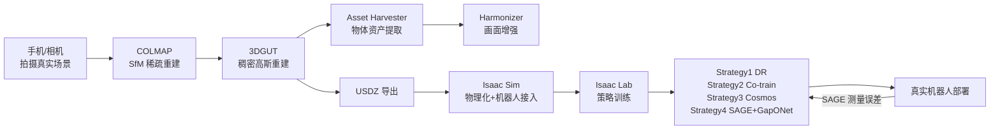

# NVIDIA Real2Sim2Real 工作流深度解析：NuRec 场景重建与四大 Sim-to-Real 策略

> 一段手机拍摄的视频，怎么变成 Isaac Sim 里能跑机器人的照片级仿真场景；一个仿真里训好的策略，又要闯过哪四类"坑"才能在真实机器人上跑起来——本系列完整拆解 NVIDIA **官方发布、有文档、有代码**的 Real2Sim2Real 工作流：`Omniverse NuRec` 场景重建产品线，以及 `Train an SO-101 Robot From Sim-to-Real` 教程里明确定义的四种 Sim-to-Real 策略。

## 系列简介

"Real2Sim2Real"不是一个抽象概念，NVIDIA 有一套**具体、可以照着跑一遍**的官方工作流，拆成两大部分：

**Real2Sim（重建部分）：NVIDIA Omniverse NuRec**
- 用手机/相机拍摄真实场景（Mono 或 Stereo 相机均支持）
- 用 [COLMAP](https://colmap.github.io/) 做 Structure-from-Motion，恢复相机位姿和稀疏点云
- 用 [3DGUT](https://research.nvidia.com/labs/toronto-ai/3DGUT/)（3D Gaussian Unscented Transform，NuRec 底层重建引擎）训练稠密的照片级 3D 重建
- 用 **Asset Harvester**（5 个模型组成的资产提取系统）把场景里的物体转换成独立的 3D 资产
- 用 **Harmonizer**（基于 Cosmos-Predict2 的扩散增强模型）把渲染结果修得更逼真
- 导出 USDZ 文件，直接拖进 Isaac Sim

**Sim2Real（部署部分）：四种命名策略**（源自官方教程 *Train an SO-101 Robot From Sim-to-Real*）
- **Strategy 1 – Domain Randomization**：Isaac Lab 里用 `EventTerm` 随机化光照/相机位姿/物体位置
- **Strategy 2 – Co-training**：少量真实遥操作数据 + 大量仿真数据混合训练
- **Strategy 3 – Cosmos Augmentation**：用 Cosmos Transfer 对已有数据做生成式视觉增强
- **Strategy 4 – SAGE + GapONet**：系统性测量每个关节的仿真-真实误差，训练补偿模型

这个系列会把这两部分连起来，形成一条从"拍视频"到"真实机器人自主运行"完整闭环的技术路径。

**适合读者**：
- 想知道 NVIDIA 官方 real2sim 产品（NuRec）具体怎么用、能拿到什么结果的工程师
- 正在用 GR00T/Isaac Lab 做 sim-to-real、想知道除了域随机化还有什么系统性方法的研究者
- 想理解"仿真-真实误差"能不能被量化、而不是只能凭感觉调参的人

**你将获得**：
- 一条可以直接照着跑的 NuRec 场景重建命令清单（COLMAP → 3DGUT → Isaac Sim）
- 对 Sim-to-Real Gap 官方四分类（Sensing/Actuation/Physics/Modeling）的清晰认知
- 对四种命名策略各自解决什么问题、怎么落地代码的完整理解
- 对 SAGE + GapONet 这套"量化-补偿"方法论的具体理解，这是本系列里最容易被忽视但最有工程价值的一环

## 章节目录

| 章节 | 标题 | 简介 |
|------|------|------|
| 01 | [全景图：NVIDIA 官方 Real2Sim2Real 工作流总览](./01_全景图_NuRec与四大Sim2Real策略总览) | NuRec 是什么、四种策略是什么，整条链路怎么串起来 |
| 02 | [场景采集与重建：COLMAP + 3DGUT](./02_场景重建_COLMAP与3DGUT) | 真实拍摄规范、COLMAP 命令、3DGUT 训练与 USDZ 导出 |
| 03 | [从高斯点到可用资产：Asset Harvester 与 Harmonizer](./03_资产提取与画面增强_AssetHarvester与Harmonizer) | 5 模型资产提取系统，以及基于 Cosmos-Predict2 的画面增强 |
| 04 | [部署进 Isaac Sim：地面碰撞体、Proxy Mesh 与机器人接入](./04_部署进IsaacSim_物理化与机器人接入) | USDZ 导入、物理化配置、SimReady 机器人放置 |
| 05 | [Sim-to-Real Gap 全景：四类差距与四种策略地图](./05_Sim2Real_Gap全景_四类差距与四种策略) | Sensing/Actuation/Physics/Modeling 四类 gap 的官方定义 |
| 06 | [策略一二：域随机化与 Co-training 的工程实现](./06_策略一二_域随机化与Co_training) | Isaac Lab `EventTerm` 真实代码，SO-101 co-train 实测对比 |
| 07 | [策略三：用 Cosmos Transfer 做生成式数据增强](./07_策略三_CosmosTransfer生成式数据增强) | Cosmos 世界基础模型如何生成多样化训练视频 |
| 08 | [策略四：SAGE + GapONet 量化并修正驱动器误差](./08_策略四_SAGE与GapONet驱动器误差补偿) | 逐关节 gap 测量方法论 + 神经网络补偿模型 |
| 09 | [工程实战与全景总结：跑一遍完整闭环](./09_工程实战与全景总结) | 串联全部命令走一遍端到端流程，回顾技术图谱 |

## 核心工作流图谱

## 前置知识要求

阅读本系列前建议了解：
- [3D Gaussian Splatting：用一堆椭球把真实场景搬进电脑](/前置知识/007a_前置知识_3D_Gaussian_Splatting三维场景重建) — 3DGUT 是 3DGS 的直接扩展，建议先读这篇
- [Sim-to-Real 迁移综述](/论文综述/S04_Sim_to_Real迁移综述) — 域随机化、系统辨识等基础方法论

## 配套论文精读

- [Cosmos-Transfer：多模态可控世界生成](/论文综述/133_CosmosTransfer_多模态可控世界生成与Sim2Real域随机化) — 本系列 Strategy 3 使用的核心技术
- [DreamGen：视频世界模型生成机器人训练数据](/论文综述/131_DreamGen_视频世界模型生成机器人训练数据) — NVIDIA GEAR 实验室的研究方向，与 NuRec 官方产品线并行但不同，第一章会说明两者的区别
- [SimFoundry：单视频重建可交互仿真场景](/论文综述/132_SimFoundry_单视频重建可交互仿真场景) — 同为 GEAR 研究方向，采用与 NuRec 不同的重建思路，可对比阅读
- [ASAP：对齐仿真与真实物理的 Delta 动作模型](/论文综述/116_ASAP_对齐仿真与真实物理的Delta动作模型) — 动作空间残差建模思路，和本系列 Strategy 4 的 GapONet 是同类思路的两种独立实现

## 相关系列

- [GR00T N1.7 深度解析](/系列/groot_n1d7_deep_dive/) — 本系列训练出的策略所使用的 VLA 模型架构
