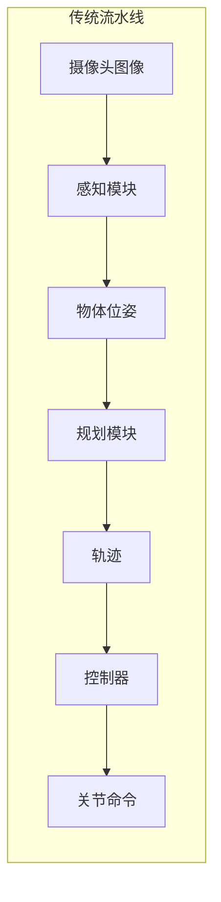
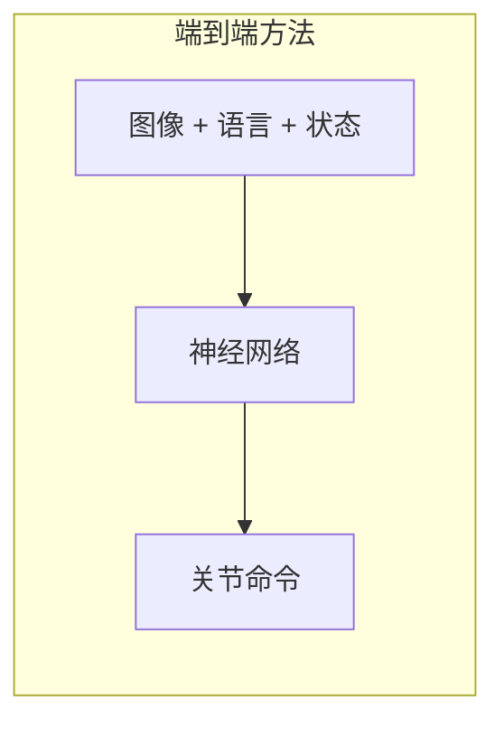
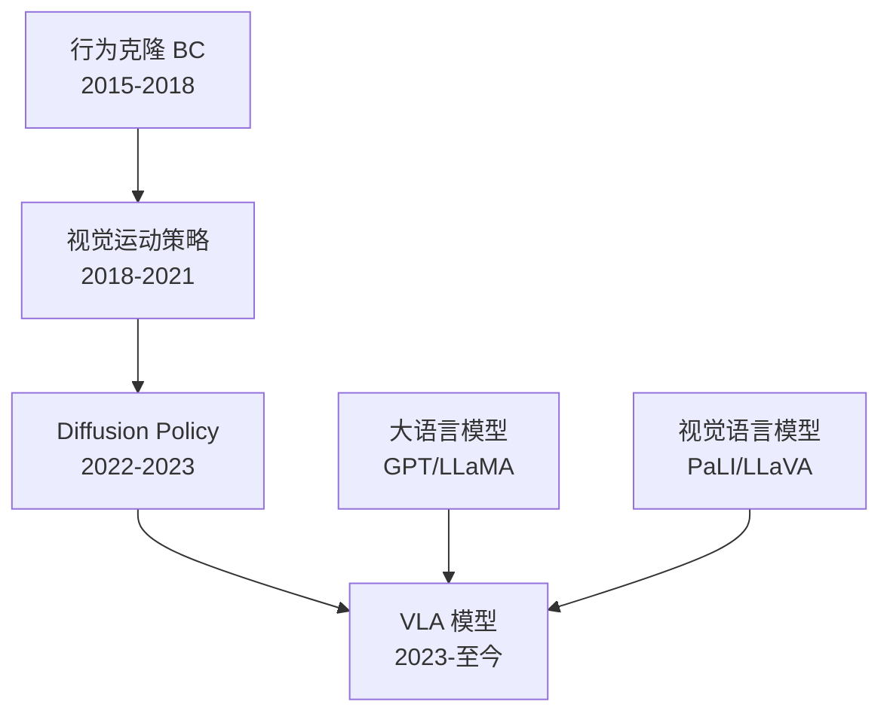
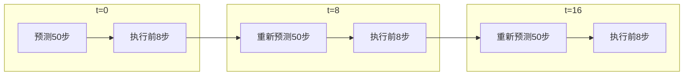
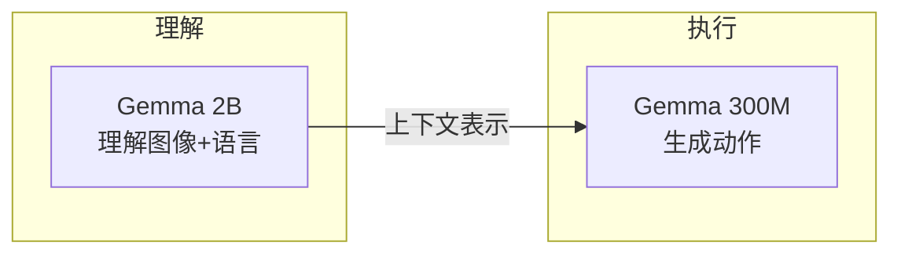
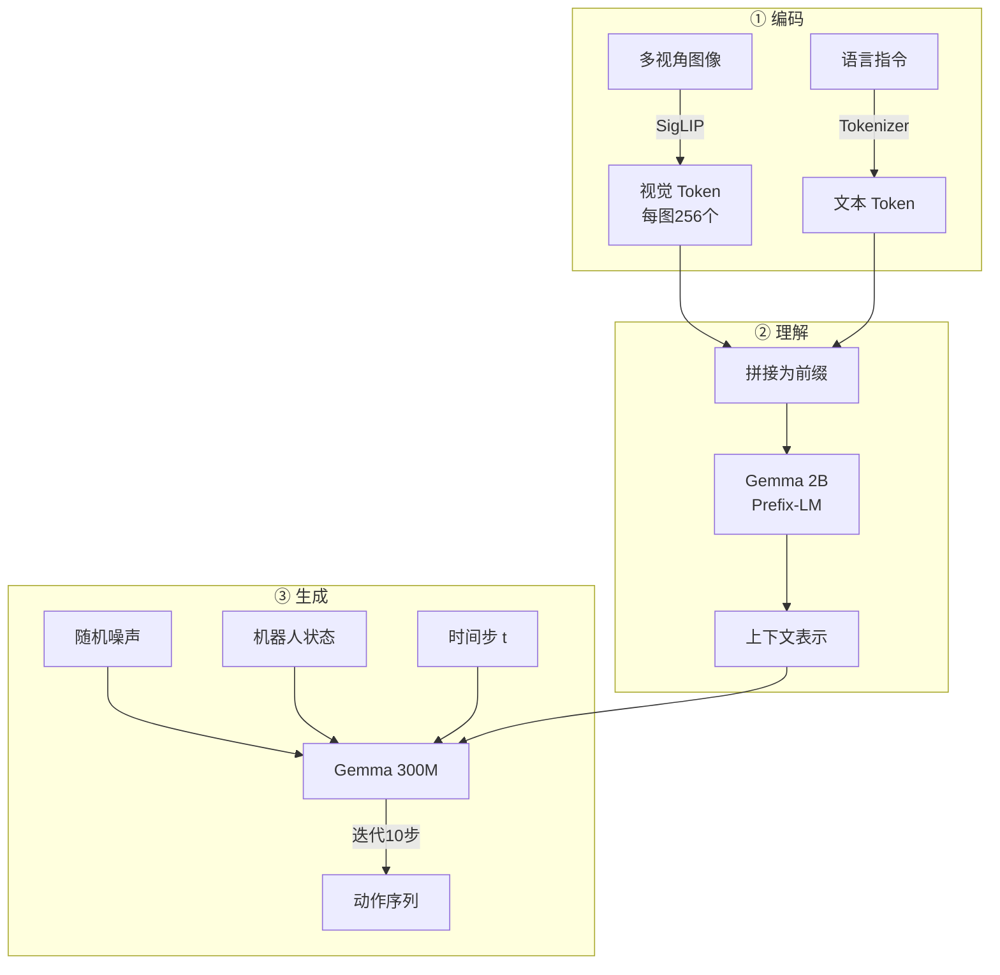

# 第一章：什么是 VLA？—— 一个模型同时看、听、动

> 本章目标：理解 VLA 模型诞生的背景和核心思想，明白为什么机器人学习领域需要一个统一的视觉-语言-动作模型，以及 π₀ 在这个方向上的独特定位。

**知识链接**：
- [行为克隆与 RL 微调范式](/前置知识/000d_前置知识_行为克隆与RL微调范式)
- [Diffusion Policy](/前置知识/000c_前置知识_Diffusion_Policy)

---

## 1.1 从一个具体场景开始

想象你面前有一个机械臂，桌上放着一个红色杯子和一个蓝色碗。你对机械臂说："把红色杯子放进蓝色碗里。"

对人类来说，这几乎不需要思考。但对机器人来说，这句话背后需要解决的问题是：

1. **看**：从摄像头画面中，找到红色杯子的位置、蓝色碗的位置、机械臂当前的姿态
2. **懂**：理解"放进"这个动词的含义——需要先抬起杯子，再移到碗的上方，再下放
3. **动**：把理解转化为关节角度的控制命令，精确到每一个时刻

传统的机器人系统把这三步拆成独立的子系统：

这套流水线看起来很合理，但有一个根本性的问题：**每个箭头都是一次信息压缩**。

- 摄像头捕捉的 640×480 像素画面（约 92 万个数值），被压缩为几个物体的 6DoF 位姿（每个只有 6 个数值）
- 杯子旁边有没有碍事的障碍物？桌面是否滑？这些场景上下文全部丢失了
- 如果感知模块漏检了一个物体，规划模块永远不会知道它的存在

**端到端学习**的核心思路是：让一个神经网络直接从原始输入映射到最终输出，中间不做人为的信息瓶颈设计。

网络自己决定该关注图像中的哪些区域、该提取什么中间表示——这些决策全部由数据驱动学习得到。

---

## 1.2 端到端学习的演进：从行为克隆到 VLA

端到端机器人学习经历了几个关键阶段，每一个阶段都解决了前一阶段的某个核心瓶颈：

### 阶段一：行为克隆（Behavior Cloning）

最直接的想法：收集人类操作机器人的数据（图像→动作的配对），训练网络去模仿。

**做法**：拿到一批数据 $\{(o_t, a_t)\}$（观测-动作对），训练网络最小化 $\|f_\theta(o_t) - a_t\|^2$。

**致命问题**：当存在多种合理动作时（比如绕过障碍物可以从左边绕也可以从右边绕），回归损失会预测所有合理动作的"平均值"——往往是一个不合理的动作（直接撞上障碍物）。

这就是**多模态动作分布**问题：对于同一个观测，可能有多个完全不同的正确动作。用均方误差回归只能学到一个"中间值"。

### 阶段二：Diffusion Policy

2023 年，Chi et al. 提出了 [Diffusion Policy](/前置知识/000c_前置知识_Diffusion_Policy)：把动作视为需要"生成"的东西，而不是简单"预测"的东西。

**核心思路**：使用去噪扩散模型，从随机噪声出发，逐步去噪得到一个合理的动作序列。因为生成模型天然能表达多模态分布（每次采样可能生成不同的动作），多模态问题得到了优雅的解决。

**新的问题**：Diffusion Policy 不理解语言。你没法告诉它"拿红色杯子而不是蓝色杯子"——它只从图像中学习，无法接受自然语言指令。

### 阶段三：VLA 的诞生

到了 2023-2024 年，研究者意识到：大语言模型（LLM）已经拥有了强大的语言理解能力，视觉语言模型（VLM）已经能理解图像并用语言描述——那为什么不把动作也加进来？

**VLA = Vision-Language-Action** 模型：在一个统一的模型里，同时处理视觉（看到什么）、语言（要做什么）和动作（怎么做）三种模态。

---

## 1.3 VLA 的核心定义

VLA 模型的本质是一个函数：

$$
\mathbf{a}_{1:H} = f_\theta(\mathbf{I}_1, \mathbf{I}_2, \ldots, \mathbf{I}_K, \; \text{prompt}, \; \mathbf{s})
$$

**一句话直觉**：给模型看几张摄像头图片、一句话指令、和机器人当前状态，它输出未来多步的动作序列。

**逐项拆解**：

| 符号 | 含义 | 具体例子 |
|------|------|----------|
| $\mathbf{I}_1, \ldots, \mathbf{I}_K$ | $K$ 个摄像头的当前画面 | 俯视图 224×224、左腕相机 224×224、右腕相机 224×224 |
| $\text{prompt}$ | 自然语言任务指令 | "把红色杯子放进蓝色碗里" |
| $\mathbf{s}$ | 机器人本体状态 | 7 个关节角度 + 1 个夹爪开合度 = 8 维向量 |
| $\mathbf{a}_{1:H}$ | 未来 $H$ 步的动作序列 | 50 步 × 7 维 = 一个 50×7 的矩阵 |
| $f_\theta$ | 参数为 $\theta$ 的 VLA 模型 | π₀ 的全部参数（约 3B） |

**代入数字**：假设用 ALOHA 双臂机器人，有 3 个摄像头、每臂 6 关节 + 1 夹爪：
- 输入图像：3 张 224×224×3 的 RGB 图片
- 输入状态：14 维向量（2 臂 × 7）
- 输入指令："fold the towel"
- 输出动作块：50 步 × 14 维 = 700 个数值

模型一次前向传播（对于 π₀ 实际是多步去噪）就产出了未来约 2 秒的完整动作计划。

---

## 1.4 VLA 与传统方法的四个本质差异

### 差异一：预训练+微调范式

VLA 不是从零训练的。它站在巨人的肩膀上——先用互联网规模的图文数据预训练一个视觉语言模型（学会理解世界），再用机器人数据微调（学会执行动作）。

**类比**：就像一个人先通过大量阅读和观察了解了世界常识（知道杯子是什么、碗是什么、"放进去"是什么意思），然后只需要少量的动手练习就能学会操作。

### 差异二：语言作为统一接口

通过语言指令灵活指定任务，不需要为每个新任务重新训练。"拿杯子"、"擦桌子"、"叠毛巾"——同一个模型通过不同指令完成不同任务。

### 差异三：动作块（Action Chunk）预测

VLA 不是逐步预测动作（每步 1 个），而是一次预测未来多步（比如 50 步）。这带来两个好处：

- **时间一致性**：连续的动作之间自然协调，不会出现"左右摇摆"
- **长远规划**：模型能"看到"更远的未来，规划更合理的路径

执行时采用**滚动预测（Receding Horizon）**：

### 差异四：多相机多视角融合

现实中的机器人通常配备多个摄像头。VLA 天然支持多视角输入——第三人称俯瞰提供全局空间关系，腕部相机提供局部精细信息。

---

## 1.5 VLA 的发展谱系：π₀ 的定位

2023-2024 年间涌现了多个 VLA 模型，π₀ 在其中有独特的定位：

| 特性 | RT-2 (Google) | Octo (UC Berkeley) | OpenVLA (Stanford) | π₀ (Physical Intelligence) |
|------|------|------|------|------|
| 视觉编码器 | ViT | ViT | SigLIP | SigLIP |
| 语言模型 | PaLM-E (55B) | 无独立 LLM | Llama 2 (7B) | Gemma (2B) |
| 动作生成方式 | 自回归 token | Diffusion | 自回归 token | **Flow Matching** |
| 独立动作专家 | 无 | 无 | 无 | **✅ Gemma 300M** |
| 预训练数据量 | 大 | 中 | 中 | **极大（10k+ 小时）** |
| 多相机支持 | 单相机 | 多相机 | 单相机 | **多相机（最多 3 路）** |
| 推理设备 | TPU 集群 | A100 | A100 | **RTX 4090 即可** |

π₀ 的三个核心创新让它在这个谱系中独树一帜：

### 创新一：Flow Matching 代替 Diffusion 和自回归

- **比 Diffusion 快**：Flow Matching 走直线路径，10 步去噪即可（Diffusion 通常需要 50-100 步）
- **比自回归精确**：不需要将连续动作离散化为 token，保留了动作的连续精度
- **动作更平滑**：直线路径天然产生平滑的动作序列

### 创新二：双 Gemma 架构

π₀ 不是用一个大模型做所有事。它有两个 Gemma 模型各司其职：

- **主 Gemma（2B 参数）**：负责理解"要做什么"——处理图像和语言，提取场景理解
- **动作专家 Gemma（300M 参数）**：负责"怎么做"——基于场景理解，生成具体动作

这种分工的好处：动作生成有自己独立的计算空间，不需要与语言理解竞争模型容量。而且动作专家更小，在推理时需要被反复调用（多步去噪），小模型意味着更低的延迟。

### 创新三：超大规模预训练

π₀ 的基础模型在 **10,000+ 小时** 的多平台机器人数据上预训练。这意味着模型见过大量不同机器人（ALOHA、DROID、Franka 等）、不同场景、不同任务的数据。当你拿到它做微调时，模型已经具备了对"机器人操控"的广泛先验知识。

---

## 1.6 π₀ 家族的三种变体

OpenPI 提供了三种模型变体，适用于不同场景：

### π₀（基础版）—— Flow Matching 生成动作

**工作方式**：从随机噪声开始，经过多步迭代（通常 10 步），逐渐"去噪"得到动作序列。每步去噪时，模型都参考当前的图像和语言指令来决定往哪个方向修正。

**适用场景**：需要高精度连续动作的任务（如精细抓取、接触操作）

**代价**：推理需要多步前向传播（10 步去噪 = 10 次前向传播）

### π₀-FAST（自回归版）—— Token 级别生成动作

**工作方式**：使用 FAST（Fourier Action Sequence Tokenization）分词器把动作离散化为 token，然后像生成文字一样逐 token 生成动作。

**适用场景**：需要强语言跟随能力的任务（动作和语言在同一个 token 空间中统一处理）

**代价**：动作离散化有精度损失

### π₀.₅（升级版）—— 改进的 Flow Matching

**改进点**：
- **AdaRMSNorm**：用自适应归一化注入时间步信息（比 MLP 拼接更优雅）
- **离散状态输入**：机器人状态量化为文本 token 放入前缀（统一表示）
- **Knowledge Insulation**：知识隔离训练策略，微调时保护预训练学到的世界知识

**适用场景**：开放世界泛化，需要模型在未见过的场景中也能工作

---

## 1.7 建立核心心智模型

在深入后续章节之前，用一张图固定 π₀ 的核心心智模型：

**三层总结**：

| 层次 | 职责 | 核心组件 | 输出 |
|------|------|----------|------|
| ① 编码 | 把原始图像和文字变为 token | SigLIP + Tokenizer | token 序列 |
| ② 理解 | 建立对场景和任务的完整理解 | Gemma 2B | 上下文表示 |
| ③ 生成 | 从噪声中提炼出动作 | Gemma 300M + Flow Matching | 动作块 |

这三层对应 OpenPI 代码中的三个核心组件：`siglip.py`（编码）、`gemma.py`（理解+生成）、`pi0.py`（组装+Flow Matching 逻辑）。后续每一章都会回到这个心智模型上定位当前讨论的内容。

---

## 1.8 训练与推理的直觉

### 训练：教模型"指出正确方向"

训练 π₀ 的核心思想可以用一个比喻理解：

> 想象你在一个迷雾中的公园里。你手里有一张藏宝图（正确动作），你的位置在"有些噪声"的中间状态。训练就是教模型"从任何中间位置，都能指出藏宝图的方向"。

具体流程：
1. 从训练数据中取出一条真实的动作序列 $\mathbf{a}$（正确答案）
2. 随机采样一个时间步 $t \in [0, 1]$
3. 将真实动作与随机噪声 $\epsilon$ 按 $t$ 的比例混合：$\mathbf{x}_t = (1-t)\epsilon + t \cdot \mathbf{a}$
4. 让模型从 $\mathbf{x}_t$ 预测流向真实动作的方向
5. 将预测方向与真实方向（$\mathbf{a} - \epsilon$）的误差作为 loss

### 推理：沿着学到的方向走到终点

推理时，模型从纯噪声出发，用训练时学到的"方向感"一步步走向合理动作：

1. 采样初始噪声 $\mathbf{x}_0 \sim \mathcal{N}(0, I)$
2. 用模型预测方向 $v_\theta(\mathbf{x}_0, t=0)$
3. 沿方向走一小步：$\mathbf{x}_{0.1} = \mathbf{x}_0 + 0.1 \cdot v_\theta$
4. 重复：预测方向 → 走一步 → 预测方向 → 走一步
5. 到达 $t=1$ 时，得到最终动作

每一步"预测方向"都需要一次完整的前向传播，所以 10 步去噪 = 10 次前向传播。这也是动作专家被设计为较小网络（300M）的原因——它需要被反复调用。

---

## 1.9 为什么选择 PaliGemma 作为骨干

π₀ 选择 Google 的 PaliGemma 作为视觉语言骨干，原因有三：

1. **SigLIP 视觉编码器已经很好**：在数亿图文对上训练，对视觉场景有强大的理解力
2. **Gemma 2B 够轻量**：机器人推理有严格的延迟要求（几十毫秒内响应），7B/13B 的模型太重
3. **PaliGemma 已学会"看图说话"**：它在预训练中已经对齐了视觉和语言两个模态。π₀ 只需在此基础上额外学会"动手"

换个角度理解：PaliGemma 就像一个已经理解了世界的大脑（能看图、能理解语言），π₀ 在它旁边接了一个"手"（动作专家），教这个大脑-手系统从观察直接映射到操作。

---

## 1.10 本章小结

| 知识点 | 核心理解 |
|--------|---------|
| 传统方法的问题 | 模块间信息压缩导致场景上下文丢失 |
| 端到端学习 | 一个网络从原始感知直接到动作 |
| 多模态动作问题 | 同一观测可能有多种合理动作，回归会取平均值 |
| VLA 的含义 | Vision + Language + Action 三模态统一模型 |
| π₀ 三大创新 | Flow Matching + 双 Gemma 架构 + 大规模预训练 |
| 三种变体 | π₀（流匹配）/ π₀-FAST（自回归）/ π₀.₅（改进版） |
| 心智模型 | 编码→理解→生成三层架构 |
| 动作块 | 一次预测未来多步，滚动执行 |

---

## 下一章预告

下一章我们将回答一个具体的问题：当一个观测输入到 π₀ 时，**从输入到输出，每一步到底发生了什么**？我们会追踪数据在系统中的完整流动路径，建立端到端的全景图。这将为后续深入每个子模块提供"地图"。
