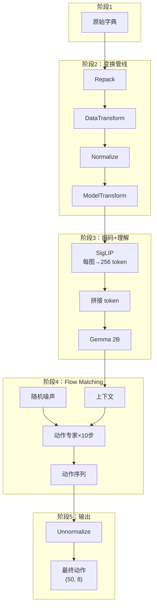
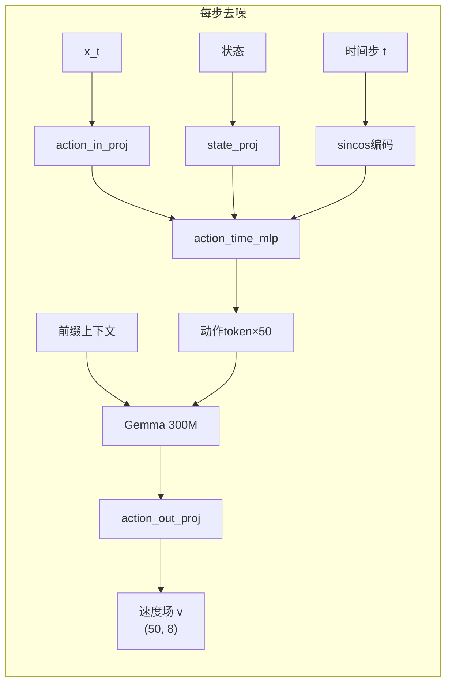
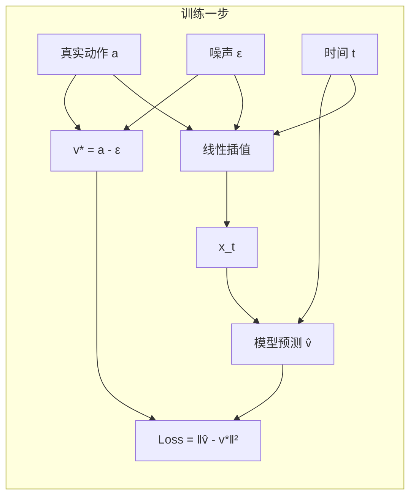
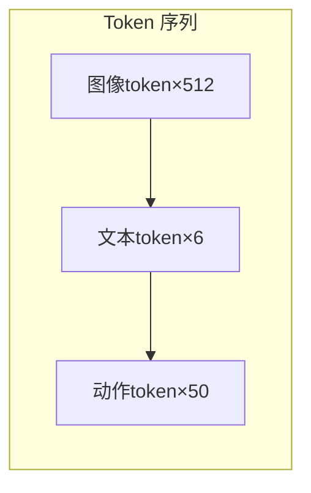

# 第二章：π₀ 一句话做了什么？—— 输入到输出的端到端全景图

> 本章目标：追踪一次完整的推理过程，从原始观测数据进入系统到最终动作序列输出给机器人，理解数据在每一步的形状变化和处理逻辑。

**前情提要**：上一章我们建立了 π₀ 的三层心智模型（编码→理解→生成），知道了它是一个通过 Flow Matching 从噪声中生成动作的 VLA 模型。本章将把这个心智模型具体化——追踪数据的完整流动路径。

**知识链接**：
- [第一章：什么是 VLA？](./01_什么是VLA)
- [Flow Matching 与连续归一化流](/前置知识/000g_前置知识_Flow_Matching与连续归一化流)

---

## 2.1 一个具体的推理场景

让我们设定一个贯穿全文的具体例子：

**场景**：一个 DROID 单臂机器人（Franka Panda，7 关节 + 1 夹爪），配备 2 个摄像头（外部相机 + 腕部相机）。用户下达指令："pick up the fork"。

此时系统拥有的原始数据：

| 数据 | 内容 | 原始形状 |
|------|------|----------|
| 外部相机图像 | 俯视角 RGB 画面 | (480, 640, 3) uint8 |
| 腕部相机图像 | 末端执行器视角 | (480, 640, 3) uint8 |
| 机器人状态 | 7 关节角 + 1 夹爪开合 | (8,) float32 |
| 语言指令 | "pick up the fork" | 字符串 |

现在，让我们追踪这些数据如何一步步变成 50 步的动作序列。

---

## 2.2 全景流程图

整个推理过程可以分为 5 个阶段。先看全局图，再逐个展开：



每个阶段产出的数据形状变化如下（以我们的 DROID 例子为准）：

| 阶段 | 核心操作 | 数据形状关键变化 |
|------|----------|------------------|
| 1 | 原始输入 | 图像 (480,640,3)，状态 (8,) |
| 2 | 变换管线 | 图像→(224,224,3)，状态→(8,) 归一化后，prompt→token ids (N,) |
| 3 | 模型编码 | 每图→256 token×1152 维，文本→M token×2048 维 |
| 4 | 迭代去噪 | 噪声 (50,8) → 去噪后 (50,8) |
| 5 | 输出还原 | (50,8) 归一化值 → (50,8) 原始关节角度 |

---

## 2.3 阶段 1：原始输入——用户侧看到的数据

在 OpenPI 中，用户（即机器人控制代码）提交给推理系统的是一个 Python 字典：

```python
example = {
    "observation/exterior_image_1_left": np.ndarray,  # (480, 640, 3) uint8
    "observation/wrist_image_left": np.ndarray,       # (480, 640, 3) uint8
    "observation/joint_position": np.ndarray,         # (7,) float32
    "observation/gripper_position": np.ndarray,       # (1,) float32
    "prompt": "pick up the fork",                     # 字符串
}
```

这个字典的 key 格式取决于具体的机器人平台。DROID 有 DROID 的 key 名，ALOHA 有 ALOHA 的 key 名。这就是为什么需要变换管线——把各种格式统一为模型可以消费的标准格式。

---

## 2.4 阶段 2：数据变换管线——从混乱到标准

变换管线是 OpenPI 设计中最精巧的部分之一。它由四个子阶段组成，每个子阶段有明确的职责：

### 子阶段 2a：RepackTransform —— 字段重命名

不同数据集/机器人的字段命名千差万别。Repack 把它们统一映射为 OpenPI 内部期望的标准名称。

```
输入：                              输出：
"observation/exterior_image_1_left"  →  "images/cam_high"
"observation/wrist_image_left"       →  "images/cam_wrist"
"observation/joint_position"         →  "state" 的一部分
"observation/gripper_position"       →  "state" 的一部分
"prompt"                             →  "prompt"
```

### 子阶段 2b：DataTransform —— 机器人特定处理

这里做的事情因机器人而异。典型操作包括：

- 把 joint_position 和 gripper_position 拼接成一个完整的 state 向量 `(8,)`
- 确保图像是 `(H, W, 3)` 的 uint8 格式（有些数据集存的是归一化浮点数或者通道在前）
- 构造 `image_mask`：告诉模型哪些相机有图像（有些配置只有 1 个相机）

### 子阶段 2c：Normalize —— 归一化到标准范围

不同机器人的状态和动作范围天差地别：

- Franka 的第一个关节角范围：$[-2.9, 2.9]$ 弧度
- ALOHA 的夹爪：$[0, 1]$
- 某些机器人的末端速度：$[-0.5, 0.5]$ m/s

如果不归一化，模型需要同时处理不同量级的数值，学习会很困难。

归一化将所有状态/动作映射到大约 $[-1, 1]$ 的标准范围：

$$
\hat{x} = \frac{x - \mu}{\sigma}
$$

其中 $\mu$ 和 $\sigma$ 是从训练数据中预计算好的均值和标准差（存储在 checkpoint 的 `assets/` 目录中）。

### 子阶段 2d：ModelTransform —— 为模型准备最终输入

这是进入模型之前的最后一步：

1. **ResizeImages**：把所有图像缩放到 224×224（SigLIP 的输入尺寸）
2. **TokenizePrompt**：用 PaliGemma 的 SentencePiece 分词器将"pick up the fork"转为 token id 序列
3. **PadStatesAndActions**：确保 state 和 action 维度对齐到 `action_dim`

经过这一步，数据被组装为一个 `Observation` 对象：

```python
Observation(
    images={
        "cam_high": array(1, 224, 224, 3),     # batch=1
        "cam_wrist": array(1, 224, 224, 3),
    },
    image_mask=array(1, 3),   # [True, True, False] 表示2个相机有效
    tokenized_prompt=array(1, 48),  # token ids，padding 到 max_token_len
    tokenized_prompt_mask=array(1, 48),  # 哪些位置是真实 token
    state=array(1, 8),        # 归一化后的状态
)
```

---

## 2.5 阶段 3：模型前向（编码+理解）

数据进入模型后的第一件事是"变为 token"并建立理解。

### 步骤 3a：SigLIP 编码图像

每张 224×224 的图像经过 SigLIP 视觉编码器：

```
输入：(224, 224, 3) 一张图像
  ↓ Patch Embedding：切割为 16×16 个 patch，每个 14×14 像素
  ↓ 加上位置编码
  ↓ 27 层 Transformer 编码
输出：(256, 1152) —— 256 个视觉 token，每个 1152 维
```

如果有 2 个有效相机：$2 \times 256 = 512$ 个视觉 token。

视觉 token 再通过一个线性投影层映射到 Gemma 的维度（2048 维）：
- 从 (512, 1152) → (512, 2048)

### 步骤 3b：文本 Token 嵌入

"pick up the fork" 经过 Tokenizer 后得到 token id 序列（假设 6 个 token）。通过 Gemma 的词嵌入表查表得到：
- (6, 2048) 的文本嵌入

### 步骤 3c：拼接为前缀

视觉 token 和文本 token 按顺序拼接为一个长序列：

```
前缀序列 = [视觉token_cam1 | 视觉token_cam2 | 文本token]
形状    = [  256 个        |   256 个        |  6 个   ] = 518 个 token
每个 token 维度 = 2048
```

### 步骤 3d：Gemma 2B 主模型处理

前缀序列通过 Gemma 2B（26 层 Transformer），建立所有 token 之间的关联：
- 图像 token 之间互相关注（双向注意力）
- 文本 token 可以关注所有在它之前的 token（prefix-LM 注意力）
- 输出：每个 token 位置都有了融合了图像和语言信息的上下文表示

---

## 2.6 阶段 4：Flow Matching 迭代去噪

这是 π₀ 最独特的部分——通过多步迭代从噪声中"提炼"出动作。

### 步骤 4a：初始化

```python
# 采样随机噪声作为初始动作
noisy_actions = random_normal(shape=(50, 8))  # (action_horizon, action_dim)

# 定义去噪的时间步列表（10步等间距）
timesteps = [0.0, 0.1, 0.2, ..., 0.9, 1.0]
```

### 步骤 4b：迭代去噪循环

对于每一步 $t_i \to t_{i+1}$：



然后用欧拉法更新：

$$
\mathbf{x}_{t_{i+1}} = \mathbf{x}_{t_i} + (t_{i+1} - t_i) \cdot v_\theta(\mathbf{x}_{t_i}, t_i)
$$

**一句话直觉**：模型告诉你"从当前位置往哪个方向走"，你就往那个方向走一小步，然后再问一次，再走一小步。10 步之后，你就从噪声走到了合理的动作。

**代入数字**：
- 第 1 步 ($t=0.0 \to 0.1$)：$\mathbf{x}_{0.1} = \mathbf{x}_0 + 0.1 \cdot v_\theta(\mathbf{x}_0, 0.0)$
- 第 2 步 ($t=0.1 \to 0.2$)：$\mathbf{x}_{0.2} = \mathbf{x}_{0.1} + 0.1 \cdot v_\theta(\mathbf{x}_{0.1}, 0.1)$
- ...
- 第 10 步 ($t=0.9 \to 1.0$)：$\mathbf{x}_{1.0} = \mathbf{x}_{0.9} + 0.1 \cdot v_\theta(\mathbf{x}_{0.9}, 0.9)$

最终 $\mathbf{x}_{1.0}$ 就是去噪后的动作序列，形状 $(50, 8)$。

### 关键细节：前缀只编码一次

注意：阶段 3 的编码（SigLIP + Gemma 2B 处理前缀）**只做一次**。在 10 步去噪循环中，每次只有动作专家（Gemma 300M）做前向传播。这也是为什么动作专家被设计为独立的小网络——它被调用 10 次，必须快。

---

## 2.7 阶段 5：输出变换——从归一化值到真实动作

去噪完成后，得到的动作值仍然是归一化后的（大约在 $[-1, 1]$ 范围内）。需要反归一化回真实的物理量：

$$
a = \hat{a} \cdot \sigma + \mu
$$

对于我们的 DROID 例子：
- 归一化动作第 1 维值：$0.3$
- 该维的 $\mu = 0.1$，$\sigma = 0.8$
- 真实动作：$0.3 \times 0.8 + 0.1 = 0.34$ 弧度

最终输出：

```python
{
    "actions": np.ndarray  # shape (50, 8)，50 步 × (7关节+1夹爪)的实际物理值
}
```

机器人控制循环取前几步执行，然后重新观测、重新推理。

---

## 2.8 训练时的数据流——与推理的对称性

训练的数据流与推理高度对称，只有在"阶段 4"有本质差异：

| 阶段 | 推理 | 训练 |
|------|------|------|
| 1-2 | 从实时传感器获取 → 变换 | 从数据集加载 → 变换 |
| 3 | 编码图像+文本 | 编码图像+文本（完全相同） |
| **4** | **从噪声迭代去噪 10 步** | **随机 $t$ → 一次前向 → 计算 Loss** |
| 5 | 反归一化输出动作 | 不需要（loss 在归一化空间计算） |

训练时的阶段 4 具体做法：

1. 取真实动作 $\mathbf{a}$（来自数据集中的人类示范）
2. 采样随机噪声 $\epsilon \sim \mathcal{N}(0, I)$
3. 随机选择时间步 $t \sim \text{Uniform}(0, 1)$
4. 计算插值：$\mathbf{x}_t = (1-t)\epsilon + t \cdot \mathbf{a}$（在噪声和真实动作之间插值）
5. 模型预测速度场：$\hat{v} = v_\theta(\mathbf{x}_t, t)$
6. 真实速度场就是：$v^* = \mathbf{a} - \epsilon$（从噪声指向真实动作的方向）
7. 损失函数：$\mathcal{L} = \|\hat{v} - v^*\|^2$



**为什么训练只需一次前向传播而推理需要 10 次？**

训练时，我们有"正确答案"（真实动作 $\mathbf{a}$），可以直接在任何随机时间点计算 loss。推理时没有正确答案，必须从噪声出发一步步走到终点，像解微分方程一样需要迭代。

---

## 2.9 各环节的计算开销分析

理解计算瓶颈有助于理解为什么 OpenPI 的架构是这样设计的：

| 环节 | 参数量 | 调用次数/推理 | 延迟估计 (RTX 4090) |
|------|--------|---------------|---------------------|
| SigLIP (2 图) | 400M | 1 次 | ~15ms |
| Gemma 2B (前缀) | 2B | 1 次 | ~30ms |
| Gemma 300M (动作专家) | 300M | **10 次** | ~5ms × 10 = 50ms |
| 数据变换 | — | 1 次 | ~2ms |
| **总计** | — | — | **~100ms** |

关键洞察：

1. **SigLIP 和 Gemma 2B 是一次性开销**——它们只在开头编码一次前缀
2. **动作专家是迭代开销**——10 步去噪意味着被调用 10 次
3. **动作专家被设计为 300M（而非 2B）正是为了控制迭代开销**

如果动作专家也是 2B，那推理延迟将是 $30\text{ms} \times 10 = 300\text{ms}$，加上编码开销总计约 350ms——对于需要 10Hz 控制频率（每 100ms 一个动作）的机器人来说太慢了。

---

## 2.10 注意力掩码的设计

在阶段 3-4 中，所有 token（前缀 + 动作 suffix）共享同一个 Transformer 的注意力计算，但不同位置的 token 有不同的注意力规则：



注意力掩码规则：

| Token 类型 | 可以关注 | 注意力类型 |
|------------|----------|------------|
| 图像 token | 所有图像 token（互相） | 双向注意力 |
| 文本 token | 所有图像 token + 之前的文本 token | Prefix-LM（前缀中双向） |
| 动作 token | 所有前缀 token + 之前的动作 token | Causal（因果注意力） |

**为什么这样设计？**

- 图像 token 之间需要互相交流空间信息（某个 patch 需要知道旁边的 patch 是什么）
- 文本 token 需要看到全部图像（理解指令依赖于视觉上下文）
- 动作 token 用因果注意力是因为：动作序列本身有时序性（第 5 步的动作应该基于第 1-4 步的动作来决定）

---

## 2.11 一个完整的代码视角

在 OpenPI 中，以上所有过程被封装在 `Policy.infer()` 方法中：

```python
# 用户代码
from openpi.policies import policy_config
from openpi.training import config as _config
from openpi.shared import download

# 加载配置和模型
config = _config.get_config("pi05_droid")
checkpoint_dir = download.maybe_download("gs://openpi-assets/checkpoints/pi05_droid")
policy = policy_config.create_trained_policy(config, checkpoint_dir)

# 构造观测（阶段1）
example = {
    "observation/exterior_image_1_left": image_array,
    "observation/wrist_image_left": wrist_array,
    "observation/joint_position": joint_pos,
    "observation/gripper_position": gripper_pos,
    "prompt": "pick up the fork",
}

# 一行代码完成阶段2-5
result = policy.infer(example)

# 获取输出动作
actions = result["actions"]  # shape (50, 8)
```

`policy.infer()` 内部的执行顺序：

```python
def infer(self, obs):
    # 阶段2：数据变换
    inputs = self._input_transform(obs)
    
    # 转为模型需要的格式（加batch维度、转JAX/PyTorch张量）
    inputs = to_model_input(inputs)
    
    # 阶段3-4：模型前向（编码 + 迭代去噪）
    raw_actions = self._sample_actions(inputs)
    
    # 阶段5：输出变换（反归一化等）
    outputs = self._output_transform(raw_actions)
    
    return outputs
```

---

## 2.12 各阶段对应的代码文件

为后续章节提供导航，每个阶段的核心逻辑对应以下代码文件：

| 阶段 | 核心文件 | 职责 |
|------|----------|------|
| 1 | 用户代码 | 构造输入字典 |
| 2a | `src/openpi/transforms.py` — `RepackTransform` | 字段重映射 |
| 2b | `src/openpi/policies/droid_policy.py` | 机器人特定变换 |
| 2c | `src/openpi/shared/normalize.py` | 归一化/反归一化 |
| 2d | `src/openpi/transforms.py` — `ResizeImages`, `TokenizePrompt` | 模型变换 |
| 3 | `src/openpi/models/siglip.py` + `src/openpi/models/gemma.py` | 视觉编码 + LLM |
| 4 | `src/openpi/models/pi0.py` — `sample_actions` | Flow Matching 去噪 |
| 5 | `src/openpi/transforms.py` — 输出变换 | 反归一化 |
| 调度 | `src/openpi/policies/policy.py` — `Policy.infer()` | 串联所有阶段 |

---

## 2.13 本章小结

本章追踪了一次完整推理的数据流动路径：

| 阶段 | 做了什么 | 输入形状 → 输出形状 |
|------|----------|---------------------|
| 原始输入 | 用户构造字典 | 图像 (480,640,3)、状态 (8,)、字符串 |
| 数据变换 | Repack → DataTransform → Normalize → ModelTransform | → 图像 (224,224,3)、token ids、归一化 state |
| 编码+理解 | SigLIP + Gemma 2B | → 518 个 2048 维 token 的上下文表示 |
| 迭代去噪 | 10 步 × 动作专家 | 噪声 (50,8) → 去噪 (50,8) |
| 输出还原 | 反归一化 | → 真实关节角度 (50,8) |

**核心设计洞察**：
1. 编码一次、生成多次——这决定了动作专家必须小
2. 变换管线是可插拔的——不同机器人只需换变换，不碰模型代码
3. 归一化是双向的——训练时 normalize，推理时 unnormalize，必须使用相同的统计量

---

## 下一章预告

下一章我们将打开 OpenPI 的代码仓库，建立一张完整的"项目地图"——每个目录负责什么、模块之间的依赖关系如何、配置对象如何将所有模块串联起来。这将为后续深入每个模块时提供全局定位。
