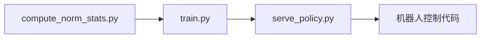
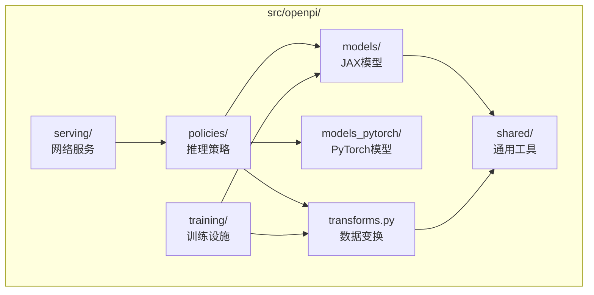
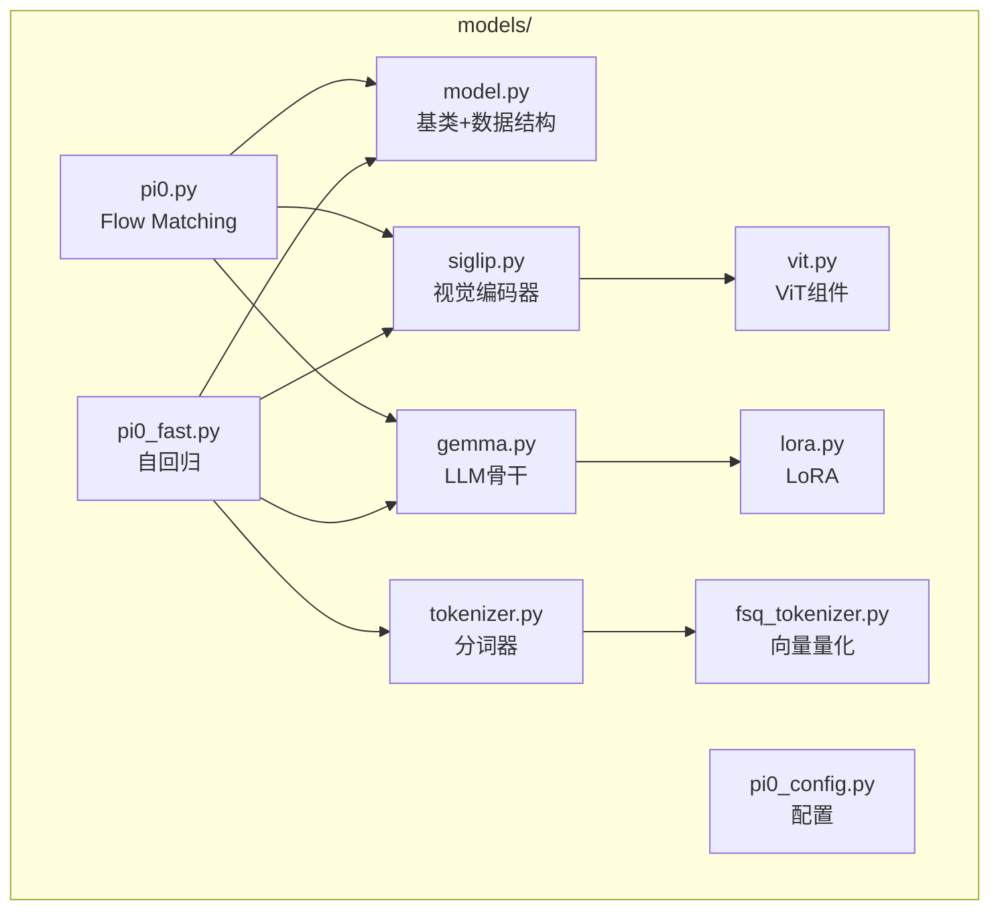
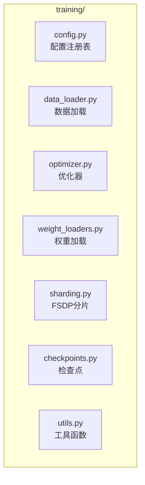
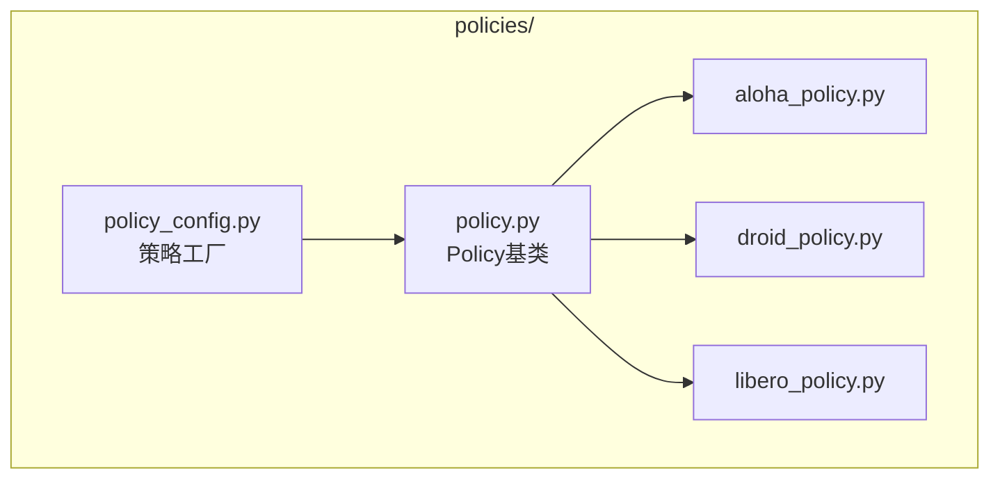
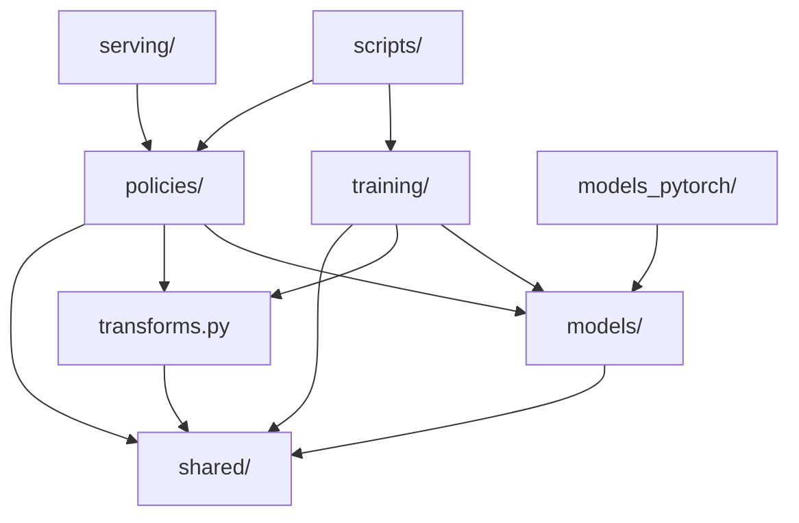
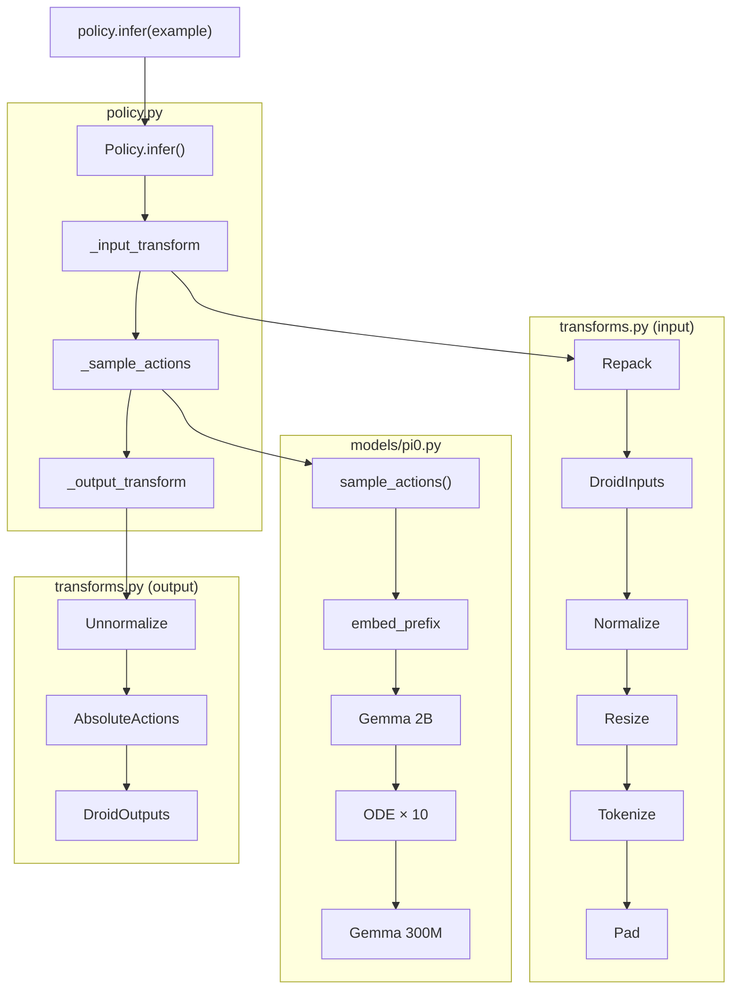
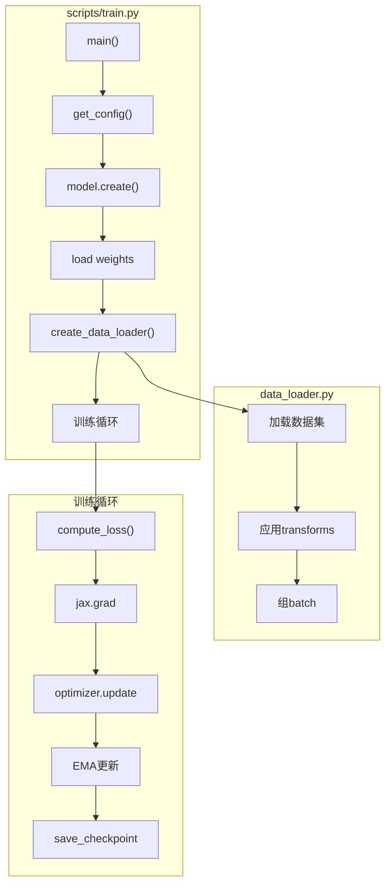
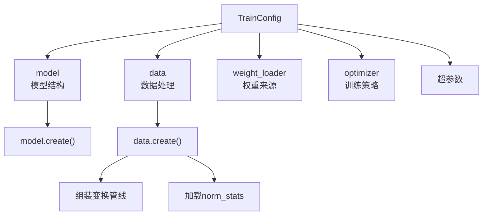

# 第三章：OpenPI 项目地图 —— 代码结构、模块职责与调用链

> 本章目标：建立对 OpenPI 代码仓库的全局认知，理解每个目录的职责、模块间的依赖关系，以及从入口脚本到核心逻辑的调用路径。

**前情提要**：上一章我们追踪了一次完整推理的数据流——从原始输入到最终动作输出经历了 5 个阶段。本章将把这些阶段对应到具体的代码文件和模块，建立一张"地图"，后续深入任何模块时都能用这张地图来定位。

**知识链接**：
- [第二章：π₀ 一句话做了什么？](./02_pi0一句话做了什么)

---

## 3.1 项目顶层结构

打开 OpenPI 仓库的根目录，你会看到这样的目录布局：

```
openpi/
├── src/openpi/           ← 核心源代码（所有业务逻辑）
├── scripts/              ← 入口脚本（训练、推理、计算统计）
├── examples/             ← 各机器人平台的使用示例
├── packages/             ← 独立发布的子包（如 openpi-client）
├── docs/                 ← 文档
├── third_party/          ← 第三方依赖（git submodule）
├── checkpoints/          ← 训练输出的检查点（运行时生成）
├── assets/               ← 归一化统计等数据资产
├── pyproject.toml        ← Python 项目配置
└── uv.lock               ← 依赖锁文件
```

**一个好的直觉**：从外到内、从粗到细。

- `scripts/` 是用户直接调用的入口——"按哪个按钮启动训练/推理"
- `src/openpi/` 是所有业务逻辑——"引擎内部如何工作"
- `examples/` 是各平台的具体使用方式——"不同机器人怎么接入"

---

## 3.2 入口脚本：用户直接交互的那一层

`scripts/` 目录下只有几个关键文件：

| 脚本 | 职责 | 使用场景 |
|------|------|----------|
| `train.py` | JAX 训练入口 | 微调模型（主要方式） |
| `train_pytorch.py` | PyTorch 训练入口 | 微调模型（PyTorch 版） |
| `serve_policy.py` | 启动推理服务 | 部署模型为 WebSocket 服务 |
| `compute_norm_stats.py` | 计算归一化统计 | 训练前的数据预处理 |

**使用流程的典型顺序**：



每个脚本的核心逻辑都非常薄——它们只是"入口"，真正的实现全部在 `src/openpi/` 里。以 `train.py` 为例，它的核心逻辑简化为：

```python
# scripts/train.py 的核心逻辑（简化）
config = get_config(config_name)         # 从注册表获取配置
model = config.model.create()            # 创建模型
weight_loader.load(model)                # 加载预训练权重
data_loader = create_data_loader(config) # 创建数据加载器

for step in range(config.num_train_steps):
    batch = next(data_loader)
    loss = train_step(model, batch)      # 一步训练
    if step % save_interval == 0:
        save_checkpoint(model, step)     # 保存检查点
```

---

## 3.3 核心源代码：`src/openpi/` 的六大子系统

`src/openpi/` 是整个项目的核心，它按功能域划分为六个子模块：



每个子系统的一句话职责：

| 子系统 | 目录/文件 | 一句话职责 | 核心文件 |
|--------|-----------|------------|----------|
| 模型层 (JAX) | `models/` | 定义神经网络的数学计算（SigLIP + Gemma + Pi0） | `pi0.py`, `gemma.py`, `siglip.py` |
| 模型层 (PyTorch) | `models_pytorch/` | 与 JAX 版等价的 PyTorch 实现 | `pi0_pytorch.py` |
| 训练层 | `training/` | 训练循环、数据加载、优化器、检查点、配置注册 | `config.py`, `data_loader.py` |
| 策略层 | `policies/` | 封装"模型 + 变换"为可推理的 Policy 对象 | `policy.py`, `policy_config.py` |
| 服务层 | `serving/` | 通过 WebSocket 暴露推理能力 | `websocket_policy_server.py` |
| 数据变换 | `transforms.py` | 定义所有数据变换操作（Repack、Resize、Normalize 等） | 单文件 |
| 共享工具 | `shared/` | 下载、归一化计算、类型标注 | `normalize.py`, `download.py` |

---

## 3.4 模型层详解：`models/` 的内部结构

这是整个项目的"心脏"——定义了 π₀ 的神经网络结构。



**关键文件的职责**：

**`model.py`** — 定义接口与数据结构：
- `BaseModel`：所有模型的基类，定义 `compute_loss()` 和 `sample_actions()` 接口
- `Observation`：标准化的模型输入数据结构（images、state、tokenized_prompt）
- `Actions`：标准化的模型输出数据结构
- `ModelType` 枚举：PI0 / PI0_FAST / PI05

**`pi0.py`** — π₀ 模型的核心实现：
- `Pi0` 类：组装 SigLIP + Gemma + 动作专家
- `compute_loss()`：训练时的 Flow Matching 损失计算
- `sample_actions()`：推理时的迭代去噪逻辑
- `make_attn_mask()`：注意力掩码的构造

**`gemma.py`** — Gemma 语言模型：
- `Module` 类：支持同时容纳多个配置（主模型 + 动作专家）
- 包含 GQA Attention、RMSNorm、GeGLU FFN 的实现
- LoRA 注入点

**`siglip.py`** — SigLIP 视觉编码器：
- 基于 ViT 的图像编码
- 输入 224×224 图像 → 输出 256×1152 的 token 序列
- `pool_type="none"` 保留所有空间 token

---

## 3.5 训练层详解：`training/` 的内部结构

训练层提供了训练模型所需的所有基础设施：



**`config.py` 是最核心的文件**（约 1200 行）。它做了三件事：

1. **定义 `TrainConfig` 数据类**：训练的所有配置项（模型、数据、优化器、超参数）
2. **定义各种 `DataConfigFactory`**：不同数据集的配置工厂（Libero、DROID、ALOHA 等）
3. **维护 `_CONFIGS` 列表**：所有预定义配置的注册表，通过 `get_config(name)` 查找

这个文件是整个项目的"总控制台"——修改任何实验配置都从这里开始。

---

## 3.6 策略层详解：`policies/` 的内部结构

策略层是训练和推理之间的桥梁——它把"裸模型"包装成一个可以直接使用的推理引擎：



**`policy.py`** 中的 `Policy` 类是推理时的核心：

```python
class Policy:
    def __init__(self, model, transforms, output_transforms, ...):
        self._model = model
        self._input_transform = compose(transforms)
        self._output_transform = compose(output_transforms)
    
    def infer(self, obs):
        inputs = self._input_transform(obs)     # 阶段2：数据变换
        raw_actions = self._sample_actions(inputs)  # 阶段3-4：模型前向
        outputs = self._output_transform(raw_actions)  # 阶段5：输出还原
        return outputs
```

**`policy_config.py`** 中的 `create_trained_policy()` 是一站式工厂函数：
- 根据配置创建模型
- 加载 checkpoint 权重
- 加载归一化统计
- 组装变换管线
- 返回一个可直接调用 `infer()` 的 Policy 对象

**各机器人的 policy 文件**（如 `droid_policy.py`）定义了两个核心类：
- `DroidInputs`（DataTransformFn）：把 DROID 特有的输入格式转为模型标准格式
- `DroidOutputs`（DataTransformFn）：把模型标准输出转回 DROID 格式

---

## 3.7 数据变换层：`transforms.py`

这个单文件（约 800 行）横跨训练和推理两个阶段，定义了所有数据变换操作：

| 变换类 | 阶段 | 作用 |
|--------|------|------|
| `RepackTransform` | Repack | 字段名重映射 |
| `ResizeImages` | ModelTransform | 图像缩放到 224×224 |
| `TokenizePrompt` | ModelTransform | 文本分词 |
| `PadStatesAndActions` | ModelTransform | 填充到 action_dim |
| `DeltaActions` | DataTransform | 绝对动作 → 相对动作 |
| `AbsoluteActions` | DataTransform | 相对动作 → 绝对动作（反向） |
| `InjectDefaultPrompt` | ModelTransform | 注入默认语言指令 |

**关键抽象**：

```python
class Group:
    """一组变换，分为输入变换和输出变换"""
    inputs: Sequence[DataTransformFn]   # 训练+推理时都用
    outputs: Sequence[DataTransformFn]  # 只在推理时用（反向还原）
```

`Group` 的 `push()` 方法支持链式组合——你可以在已有的变换组上追加新的变换，形成管线：

```python
base_transforms = Group(inputs=[DroidInputs()])
full_transforms = base_transforms.push(
    inputs=[DeltaActions(mask)],      # 追加到 inputs 末尾
    outputs=[AbsoluteActions(mask)],  # 追加到 outputs 开头
)
```

---

## 3.8 共享工具层：`shared/`

提供跨模块使用的通用工具：

| 文件 | 职责 |
|------|------|
| `normalize.py` | 归一化/反归一化的计算逻辑 |
| `download.py` | 从 GCS 下载模型权重和数据资产 |
| `image_tools.py` | 图像处理工具（解码、格式转换） |
| `array_typing.py` | JAX 数组的类型标注系统 |
| `nnx_utils.py` | Flax NNX 相关的辅助函数 |

---

## 3.9 模块间的依赖关系

理解模块间的依赖方向非常重要——它告诉你"改动一个模块会影响什么"：



**依赖方向的含义**：

- 箭头方向是"依赖于"
- `policies/` 依赖 `models/` 和 `transforms.py`——它组装两者来提供推理能力
- `training/` 也依赖 `models/` 和 `transforms.py`——训练需要模型和数据处理
- `shared/` 被几乎所有模块依赖——它是最底层的工具集
- `models/` **不依赖** `training/` 或 `policies/`——模型定义是纯粹的，不知道自己会被如何使用

**这意味着**：如果你想换一个新的视觉编码器，只需要改 `models/`；如果你想适配一个新机器人，只需要在 `policies/` 里加一个新文件并修改 `training/config.py`。

---

## 3.10 追踪一次完整推理的调用链

让我们沿着函数调用栈，追踪 `policy.infer(example)` 的完整执行路径：



**关键观察**：
1. `Policy` 是一个薄封装层——它只负责串联，不做实际计算
2. 所有"脏活"（格式转换、归一化）都在 `transforms.py` 中
3. 所有"重活"（神经网络计算）都在 `models/` 中
4. `policies/xxx_policy.py` 中的变换类是"适配器"——适配不同机器人的格式差异

---

## 3.11 追踪一次完整训练的调用链

训练的调用链与推理对称，但有几个额外步骤：



**训练与推理的关键差异**：

| 方面 | 推理 | 训练 |
|------|------|------|
| 数据来源 | 实时传感器 | 离线数据集 |
| 调用的模型方法 | `sample_actions()` | `compute_loss()` |
| 变换方向 | 只有 input → model | input → model（前向）+ output（不使用） |
| 梯度计算 | 无 | `jax.value_and_grad()` |
| Checkpoint | 加载 | 保存 |

---

## 3.12 `examples/` 目录：各平台的接入示例

`examples/` 下按机器人平台组织：

| 目录 | 机器人平台 | 内容 |
|------|-----------|------|
| `aloha_sim/` | ALOHA 仿真 | 仿真环境配置 + 数据转换 + 评估脚本 |
| `aloha_real/` | ALOHA 实机 | 实机部署 + 远程推理 |
| `droid/` | DROID (Franka) | DROID 数据训练 + 推理 |
| `libero/` | LIBERO 仿真 | 数据转换 + 训练 + Docker 化评估 |
| `ur5/` | UR5 机械臂 | UR5 适配示例 |
| `simple_client/` | 无机器人 | 用随机数据测试推理是否正常 |

每个目录通常包含：
- `README.md`：该平台的完整使用说明
- `convert_xxx_data_to_lerobot.py`：数据格式转换脚本
- 推理/评估脚本

---

## 3.13 `packages/` 目录：独立发布的子包

```
packages/
├── openpi-client/     ← 轻量级推理客户端 SDK
└── openpi-server/     ← 推理服务端依赖
```

`openpi-client` 是一个独立的 pip 包，只包含最小依赖（numpy、websockets、msgpack）。这样机器人端不需要安装完整的 openpi 环境——只需 `pip install openpi-client` 就能通过 WebSocket 调用远程推理服务。

---

## 3.14 配置如何串联一切

OpenPI 的设计哲学是**配置驱动**——你几乎不需要修改核心代码，只需要定义/修改配置。

所有模块都由 `TrainConfig` 串联：



一个典型的配置只需要约 20 行就能定义一个完整的训练任务：

```python
TrainConfig(
    name="pi05_libero",
    model=Pi0Config(pi05=True),
    data=LeRobotLiberoDataConfig(
        repo_id="physical-intelligence/libero",
        base_config=DataConfig(prompt_from_task=True),
    ),
    weight_loader=CheckpointWeightLoader("gs://openpi-assets/checkpoints/pi05_base/params"),
    num_train_steps=30_000,
)
```

这 20 行配置背后，框架会自动完成：
1. 创建 π₀.₅ 模型架构
2. 从 GCS 下载基础模型权重
3. 加载 LIBERO 数据集
4. 配置 LIBERO 特定的数据变换管线
5. 计算/加载归一化统计
6. 设置优化器和学习率调度
7. 运行 30,000 步训练

---

## 3.15 本章小结

| 模块 | 职责 | 关键文件 |
|------|------|----------|
| `scripts/` | 用户入口 | `train.py`, `serve_policy.py` |
| `models/` | 网络定义 | `pi0.py`, `gemma.py`, `siglip.py` |
| `training/` | 训练基础设施 | `config.py`, `data_loader.py` |
| `policies/` | 推理封装 | `policy.py`, `policy_config.py` |
| `serving/` | 网络服务 | `websocket_policy_server.py` |
| `transforms.py` | 数据变换 | 单文件，定义所有变换操作 |
| `shared/` | 通用工具 | `normalize.py`, `download.py` |

**核心设计原则**：
1. **配置驱动**：不改代码，改配置来定义新实验
2. **模块解耦**：模型不知道数据从哪来，变换不知道模型长什么样
3. **适配器模式**：新机器人只需写 `XxxInputs` / `XxxOutputs` 两个类
4. **对称设计**：输入变换和输出变换严格对称（normalize ↔ unnormalize，delta ↔ absolute）

---

## 下一章预告

下一章我们将深入 `training/config.py` —— OpenPI 的"总控制台"。我们会逐字段解析 `TrainConfig`、理解 `_CONFIGS` 注册表的工作机制，并学会如何为自己的机器人定义一个新配置。
