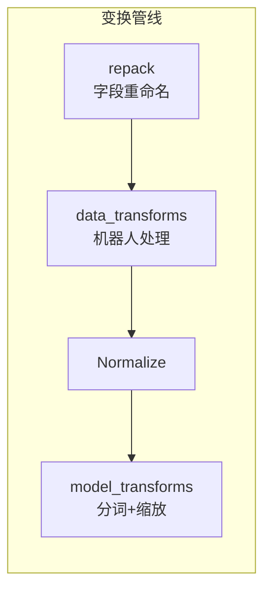
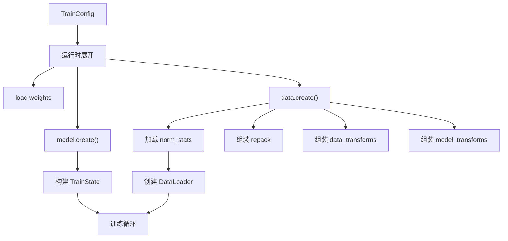

# 第四章：配置驱动设计 —— TrainConfig 如何串联一切

> 本章目标：深入理解 OpenPI 的配置系统——TrainConfig 的每个字段含义、配置注册表 _CONFIGS 的工作机制、以及 DataConfig 如何定义数据管线。学完本章，你将能为自己的机器人编写一个新的训练配置。

**前情提要**：上一章我们建立了项目地图，知道 `training/config.py` 是整个项目的"总控制台"——所有模块都由配置对象串联。本章将打开这个控制台，逐个旋钮地理解它。

**知识链接**：
- [第三章：OpenPI 项目地图](./03_OpenPI项目地图)

---

## 4.1 为什么用 dataclass 而不是 YAML？

很多深度学习项目用 YAML 文件管理配置（如 Hydra、OmegaConf）。OpenPI 选择了一条不同的路：**直接用 Python dataclass**。

这个选择的原因：

| 方面 | YAML 配置 | Python dataclass |
|------|-----------|------------------|
| 类型安全 | 运行时才发现类型错误 | IDE 实时类型检查 |
| 代码跳转 | 不支持 | 支持 Go to Definition |
| 组合与继承 | 语法繁琐 | Python 原生继承/组合 |
| 条件逻辑 | 不支持或用奇怪的语法 | 直接写 Python |
| 默认值 | 容易遗漏 | dataclass 强制声明 |
| 自动补全 | 不支持 | IDE 自动补全 |

OpenPI 使用 `tyro` 库来同时获得两个好处：dataclass 定义配置结构，tyro 自动生成命令行接口。训练时可以通过命令行覆盖任何字段：

```bash
uv run scripts/train.py pi05_libero --exp-name=my_exp --batch-size=16
```

---

## 4.2 TrainConfig：训练的完整规格说明

`TrainConfig` 是一个 frozen dataclass，包含训练所需的所有信息。我们按功能分组逐字段解析：

### 身份标识字段

```python
@dataclasses.dataclass(frozen=True)
class TrainConfig:
    name: str              # 配置名，唯一标识。如 "pi05_libero"
    project_name: str = "openpi"  # WandB 项目名
    exp_name: str          # 实验名，用于命名 checkpoint 目录
```

`name` 是注册表的 key——通过 `get_config("pi05_libero")` 来查找配置。

### 模型定义字段

```python
    model: BaseModelConfig = Pi0Config()  # 模型结构配置
```

`model` 字段决定了模型的网络结构。不同的 `BaseModelConfig` 子类对应不同的模型架构：

| 配置类 | 对应模型 | 关键参数 |
|--------|----------|----------|
| `Pi0Config()` | π₀ (Flow Matching) | action_dim, action_horizon, pi05=False |
| `Pi0Config(pi05=True)` | π₀.₅ | 同上 + AdaRMSNorm + 离散状态 |
| `Pi0FASTConfig()` | π₀-FAST (自回归) | 同上 + max_token_len |

### 权重加载字段

```python
    weight_loader: WeightLoader = NoOpWeightLoader()  # 权重加载策略
    pytorch_weight_path: str | None = None  # PyTorch checkpoint 路径（可选）
```

`weight_loader` 决定了模型初始化后从哪里加载预训练权重。常用选项：

| 加载器 | 用途 |
|--------|------|
| `NoOpWeightLoader()` | 不加载任何权重（从头训练） |
| `CheckpointWeightLoader(path)` | 从已有 checkpoint 加载 |
| `PaliGemmaWeightLoader(path)` | 从官方 PaliGemma 权重加载 |

### 优化器与训练策略字段

```python
    lr_schedule: LRScheduleConfig = CosineDecaySchedule()  # 学习率调度
    optimizer: OptimizerConfig = AdamW()  # 优化器
    ema_decay: float | None = 0.99  # EMA 衰减率（None=关闭）
    freeze_filter: Filter = nnx.Nothing()  # 冻结哪些参数
```

- `lr_schedule`：控制学习率如何随训练步数变化（warmup → peak → decay）
- `ema_decay`：指数移动平均，让模型权重更稳定。`0.99` 表示新权重占 1%
- `freeze_filter`：LoRA 微调时，冻结除 LoRA 参数外的所有权重

### 数据配置字段

```python
    data: DataConfigFactory = FakeDataConfig()  # 数据配置工厂
```

这是一个**工厂对象**——它不直接包含数据配置，而是定义了如何创建数据配置。调用 `data.create(assets_dirs, model_config)` 时才会生成最终的 `DataConfig`。

### 训练超参数字段

```python
    seed: int = 42                    # 随机种子
    batch_size: int = 32              # 全局 batch size
    num_workers: int = 2              # 数据加载进程数
    num_train_steps: int = 30_000     # 总训练步数
    log_interval: int = 100           # 每 N 步记录日志
    save_interval: int = 1000         # 每 N 步保存 checkpoint
    keep_period: int | None = 5000    # 保留 N 的整数倍步数的 checkpoint
    overwrite: bool = False           # 是否覆盖已有 checkpoint
    resume: bool = False              # 是否从上次中断处续训
    wandb_enabled: bool = True        # 是否启用 WandB 日志
    fsdp_devices: int = 1             # FSDP 分片设备数（>1 启用多 GPU）
```

### 路径配置字段

```python
    assets_base_dir: str = "./assets"        # 数据资产（归一化统计）基目录
    checkpoint_base_dir: str = "./checkpoints"  # checkpoint 输出基目录
```

最终路径由 `base_dir / config.name / exp_name` 组成。例如：
- assets 路径：`./assets/pi05_libero/`
- checkpoint 路径：`./checkpoints/pi05_libero/my_experiment/`

### 派生属性

```python
    @property
    def assets_dirs(self) -> Path:
        return (Path(self.assets_base_dir) / self.name).resolve()
    
    @property
    def checkpoint_dir(self) -> Path:
        return (Path(self.checkpoint_base_dir) / self.name / self.exp_name).resolve()
    
    @property
    def trainable_filter(self) -> Filter:
        """可训练参数 = 所有 Param 中排除被冻结的"""
        return nnx.All(nnx.Param, nnx.Not(self.freeze_filter))
```

---

## 4.3 配置注册表：_CONFIGS 与 get_config()

OpenPI 使用一个简单的列表来注册所有预定义配置：

```python
_CONFIGS = [
    TrainConfig(name="pi0_aloha", model=Pi0Config(), data=LeRobotAlohaDataConfig(...)),
    TrainConfig(name="pi05_droid", model=Pi0Config(pi05=True), data=SimpleDataConfig(...)),
    TrainConfig(name="pi0_libero", model=Pi0Config(), data=LeRobotLiberoDataConfig(...)),
    TrainConfig(name="pi0_fast_libero", model=Pi0FASTConfig(...), data=LeRobotLiberoDataConfig(...)),
    # ... 更多配置
]

# 转为字典供快速查找
_CONFIGS_DICT = {config.name: config for config in _CONFIGS}

def get_config(config_name: str) -> TrainConfig:
    """按名称查找配置"""
    if config_name not in _CONFIGS_DICT:
        closest = difflib.get_close_matches(config_name, _CONFIGS_DICT.keys())
        raise ValueError(f"Config '{config_name}' not found. Did you mean '{closest[0]}'?")
    return _CONFIGS_DICT[config_name]
```

**设计要点**：
1. 所有配置名必须唯一（有运行时检查）
2. 找不到配置时会提示最接近的名字（difflib 模糊匹配）
3. 配置是 `frozen=True` 的——创建后不可修改，保证训练可复现

当前注册的配置覆盖以下场景：

| 配置名模式 | 用途 |
|------------|------|
| `pi0_aloha*` | ALOHA 机器人推理/训练 |
| `pi0_droid` / `pi05_droid` | DROID 机器人推理/训练 |
| `pi0_libero` / `pi05_libero` | LIBERO 仿真微调 |
| `pi0_fast_*` | π₀-FAST 模型系列 |
| `*_low_mem_finetune` | LoRA 低显存微调 |

---

## 4.4 DataConfig：数据管线的完整规格

`DataConfig` 描述了数据从加载到进入模型之间的所有处理步骤：

```python
@dataclasses.dataclass(frozen=True)
class DataConfig:
    repo_id: str | None = None           # LeRobot 数据集 ID（HuggingFace Hub）
    asset_id: str | None = None          # 数据资产目录名（存放 norm_stats）
    norm_stats: dict | None = None       # 预计算的归一化统计
    
    # 四层变换管线
    repack_transforms: Group = Group()   # 第一层：字段重命名
    data_transforms: Group = Group()     # 第二层：机器人特定处理
    model_transforms: Group = Group()    # 第三层：模型输入准备
    
    # 归一化选项
    use_quantile_norm: bool = False      # 是否用分位数归一化
    
    # 动作序列配置
    action_sequence_keys: Sequence[str] = ("actions",)  # 用哪些 key 构造动作序列
    
    # Prompt 相关
    prompt_from_task: bool = False       # 是否从数据集 task 字段读取 prompt
    task_aliases: dict[str, str] = {}    # 任务名映射（统一不同表述）
    task_balanced_sampling: bool = False # 是否按任务均匀采样
```

四层变换的组装关系如下：



注意：`Normalize` 不在 DataConfig 的变换列表中显式定义——它由系统根据 `norm_stats` 是否为 None 自动插入。

---

## 4.5 DataConfigFactory：工厂模式的设计意图

你可能注意到 `TrainConfig.data` 的类型不是 `DataConfig` 而是 `DataConfigFactory`：

```python
class DataConfigFactory(Protocol):
    def create(self, assets_dirs: Path, model_config: BaseModelConfig) -> DataConfig:
        ...
```

**为什么需要工厂？** 因为 DataConfig 的创建需要依赖两个只有在运行时才知道的信息：
1. `assets_dirs`：归一化统计文件的路径（由 `TrainConfig.assets_base_dir + name` 决定）
2. `model_config`：模型配置（决定了 `action_dim`、`model_type` 等，影响变换逻辑）

工厂模式让配置定义时不需要知道这些信息，延迟到运行时才解析。

OpenPI 提供了多种预定义工厂：

| 工厂类 | 适用场景 | 特点 |
|--------|----------|------|
| `FakeDataConfig` | 测试/调试 | 生成假数据 |
| `SimpleDataConfig` | 通用场景 | 直接指定变换 |
| `LeRobotAlohaDataConfig` | ALOHA 训练 | 包含 ALOHA 特定的 Repack 和 DeltaActions |
| `LeRobotLiberoDataConfig` | LIBERO 训练 | 包含 LIBERO 特定变换 |
| `RLDSDroidDataConfig` | DROID 大规模训练 | 使用 RLDS 流式加载 |
| `LeRobotDROIDDataConfig` | DROID 小规模训练 | 使用 LeRobot 格式 |

---

## 4.6 一个完整配置示例的逐字段注释

以 `pi05_libero` 配置为例，逐行解读：

```python
TrainConfig(
    # --- 身份标识 ---
    name="pi05_libero",
    # 使用 π₀.₅ 模型（pi05=True 启用 AdaRMSNorm 和离散状态输入）
    
    # --- 模型结构 ---
    model=Pi0Config(pi05=True),
    # Pi0Config 的默认值：action_dim=24, action_horizon=50
    # pi05=True 激活：AdaRMSNorm、离散状态编码、time_mlp_in/out
    
    # --- 数据配置 ---
    data=LeRobotLiberoDataConfig(
        repo_id="physical-intelligence/libero",
        # HuggingFace 上的 LIBERO 数据集
        base_config=DataConfig(prompt_from_task=True),
        # 从数据集的 task 字段读取语言指令
    ),
    
    # --- 权重加载 ---
    weight_loader=CheckpointWeightLoader(
        "gs://openpi-assets/checkpoints/pi05_base/params"
    ),
    # 从 GCS 下载 π₀.₅ 基础模型权重，用作微调起点
    
    # --- 训练超参 ---
    num_train_steps=30_000,
    # 其余使用默认值：batch_size=32, lr=CosineDecay, optimizer=AdamW
)
```

**这个配置的含义**：从 π₀.₅ 基础模型出发，在 LIBERO 数据集上全参数微调 30,000 步。

---

## 4.7 ModelTransformFactory：变换管线的自动组装

`ModelTransformFactory` 是一个特殊的工厂，它根据模型类型自动决定使用哪些模型变换：

```python
class ModelTransformFactory:
    default_prompt: str | None = None
    
    def __call__(self, model_config):
        match model_config.model_type:
            case ModelType.PI0:
                return Group(inputs=[
                    InjectDefaultPrompt(self.default_prompt),
                    ResizeImages(224, 224),
                    TokenizePrompt(PaligemmaTokenizer(model_config.max_token_len)),
                    PadStatesAndActions(model_config.action_dim),
                ])
            case ModelType.PI05:
                return Group(inputs=[
                    InjectDefaultPrompt(self.default_prompt),
                    ResizeImages(224, 224),
                    TokenizePrompt(
                        PaligemmaTokenizer(model_config.max_token_len),
                        discrete_state_input=model_config.discrete_state_input,
                    ),
                    PadStatesAndActions(model_config.action_dim),
                ])
            case ModelType.PI0_FAST:
                return Group(inputs=[
                    InjectDefaultPrompt(self.default_prompt),
                    ResizeImages(224, 224),
                    TokenizePrompt(
                        PaligemmaTokenizer(...),
                        action_tokenizer=FASTTokenizer(...),
                    ),
                    PadStatesAndActions(model_config.action_dim),
                ])
```

**关键差异**：
- π₀ 和 π₀.₅ 的区别：π₀.₅ 在 TokenizePrompt 时启用 `discrete_state_input`（状态值量化为 token）
- π₀-FAST 的区别：TokenizePrompt 额外带了 `action_tokenizer`（FAST 动作分词器）

---

## 4.8 AssetsConfig：归一化统计的来源控制

归一化统计（mean、std）需要与训练数据匹配。`AssetsConfig` 控制从哪里加载这些统计：

```python
@dataclasses.dataclass(frozen=True)
class AssetsConfig:
    assets_dir: str | None = None   # 指定资产目录（覆盖默认）
    asset_id: str | None = None     # 资产 ID（子目录名）
```

**典型使用场景**：

| 场景 | 配置方式 |
|------|----------|
| 首次训练自己的数据 | 不设 AssetsConfig，运行 `compute_norm_stats.py` 生成 |
| 微调已有平台（如 DROID） | `AssetsConfig(asset_id="droid")` 从基础模型加载统计 |
| 跨 checkpoint 共享统计 | `AssetsConfig(assets_dir="gs://openpi-assets/checkpoints/pi0_base/assets")` |

当你微调到一个基础模型已经见过的机器人平台时（如 DROID），可以直接复用基础模型的归一化统计，不需要重新计算。

---

## 4.9 如何新增自己的配置

假设你有一个自定义的 3 关节机械臂，想接入 OpenPI。步骤如下：

### Step 1：定义数据变换（在 `policies/` 新建文件）

```python
# src/openpi/policies/my_robot_policy.py

@dataclasses.dataclass(frozen=True)
class MyRobotInputs(DataTransformFn):
    """把我的机器人的输入格式转为标准格式"""
    def __call__(self, data):
        # 拼接状态：3 关节 + 1 夹爪 = 4 维
        state = np.concatenate([data["joint_pos"], data["gripper"]])
        return {
            "state": state,
            "images": {"cam0": data["camera_image"]},
            "prompt": data.get("prompt", ""),
        }

@dataclasses.dataclass(frozen=True)
class MyRobotOutputs(DataTransformFn):
    """把模型输出转回我的机器人的格式"""
    def __call__(self, data):
        actions = data["actions"]
        return {
            "joint_commands": actions[:, :3],  # 前 3 维是关节
            "gripper_command": actions[:, 3:],  # 第 4 维是夹爪
        }
```

### Step 2：定义数据配置工厂

```python
# 在 training/config.py 中添加

@dataclasses.dataclass(frozen=True)
class MyRobotDataConfig(DataConfigFactory):
    @override
    def create(self, assets_dirs, model_config):
        repack = Group(inputs=[RepackTransform({
            "joint_pos": "observation.joint_positions",
            "gripper": "observation.gripper",
            "camera_image": "observation.images.cam0",
            "actions": "action",
            "prompt": "prompt",
        })])
        data_transforms = Group(
            inputs=[MyRobotInputs()],
            outputs=[MyRobotOutputs()],
        )
        model_transforms = ModelTransformFactory()(model_config)
        return dataclasses.replace(
            self.create_base_config(assets_dirs, model_config),
            repack_transforms=repack,
            data_transforms=data_transforms,
            model_transforms=model_transforms,
        )
```

### Step 3：注册配置

```python
# 在 _CONFIGS 列表中添加
TrainConfig(
    name="pi05_my_robot",
    model=Pi0Config(pi05=True, action_dim=4, action_horizon=20),
    data=MyRobotDataConfig(
        repo_id="my-username/my-robot-data",
        base_config=DataConfig(prompt_from_task=True),
    ),
    weight_loader=CheckpointWeightLoader("gs://openpi-assets/checkpoints/pi05_base/params"),
    num_train_steps=10_000,
)
```

### Step 4：计算归一化统计并训练

```bash
uv run scripts/compute_norm_stats.py --config-name pi05_my_robot
uv run scripts/train.py pi05_my_robot --exp-name=first_try
```

---

## 4.10 配置如何在运行时展开

理解配置在运行时的"展开"过程——从一个紧凑的 `TrainConfig` 如何变成实际运行的各个组件：



**关键时序**：
1. 先创建模型（需要知道结构才能加载权重）
2. 加载权重（初始化参数）
3. 创建数据配置（需要 model_config 来决定变换）
4. 加载归一化统计（需要 assets_dirs）
5. 创建数据加载器
6. 进入训练循环

---

## 4.11 配置的不可变性与可复现性

`frozen=True` 让所有配置都是不可变的。这带来一个重要特性：**实验完全可复现**。

- 同一个 `name` 永远对应同一套配置
- 没有运行时的动态修改（不会出现"训练到一半改了超参"的情况）
- Checkpoint 中会保存对应的 `config.name`，方便回溯

如果需要修改某个配置做消融实验，推荐的方式是创建一个新配置：

```python
# 不要这样做（frozen dataclass 不允许修改）
# config.batch_size = 16  ← 报错

# 正确做法：创建新配置
TrainConfig(
    name="pi05_libero_bs16",  # 新名字
    model=Pi0Config(pi05=True),
    data=LeRobotLiberoDataConfig(...),
    batch_size=16,  # 修改的参数
    num_train_steps=30_000,
)
```

或者通过命令行覆盖（tyro 支持）：

```bash
uv run scripts/train.py pi05_libero --batch-size=16 --exp-name=bs16_ablation
```

---

## 4.12 本章小结

| 概念 | 核心理解 |
|------|----------|
| 为什么用 dataclass | 类型安全、IDE 支持、可组合 |
| TrainConfig | 训练的完整规格：模型+数据+优化器+超参 |
| _CONFIGS 注册表 | 所有预定义配置的列表，按 name 查找 |
| DataConfigFactory | 延迟创建 DataConfig（需要运行时信息） |
| DataConfig | 数据管线规格：四层变换 + 归一化统计 |
| ModelTransformFactory | 根据模型类型自动组装模型变换 |
| AssetsConfig | 控制归一化统计的来源 |
| frozen=True | 保证实验可复现 |

**设计哲学总结**：
1. **配置即文档**——读一个配置就知道整个实验做了什么
2. **组合优于继承**——通过嵌套 dataclass 组合能力，而不是复杂的继承层次
3. **工厂延迟绑定**——配置定义时不需要所有信息，运行时才解析依赖
4. **显式优于隐式**——所有选择都在配置中写明，没有隐藏的默认行为

---

## 下一章预告

下一章我们将深入数据的源头——LeRobot 和 RLDS 这两种数据集格式。我们会理解机器人数据如何组织、各个字段的语义、以及如何把自己采集的数据转换为 OpenPI 能使用的格式。
