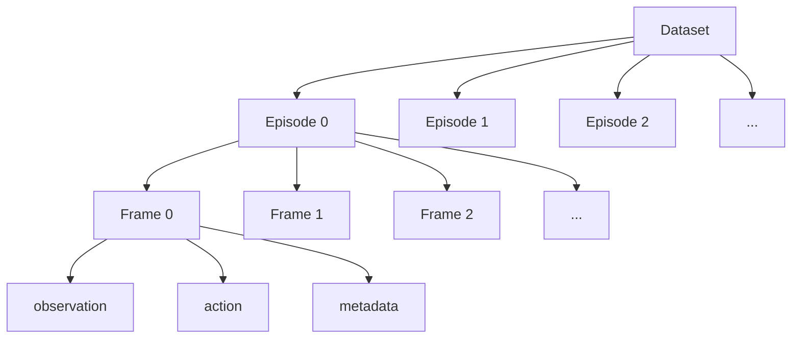
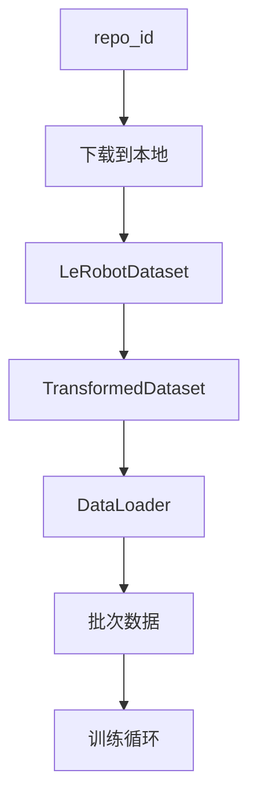

# 第五章：数据格式入门 —— LeRobot 与 RLDS 数据集格式

> 本章目标：理解 OpenPI 使用的两种数据格式（LeRobot 和 RLDS）的结构、各字段的语义、以及如何把自己采集的数据转换为 OpenPI 能消费的格式。

**前情提要**：上一章我们理解了配置系统如何串联一切，其中 `DataConfig` 定义了数据管线。但管线的"源头"是什么？数据以什么格式存储？各个字段代表什么含义？这就是本章要回答的问题。

**知识链接**：
- [第四章：配置驱动设计](./04_配置驱动设计)
- [第二章：π₀ 一句话做了什么？](./02_pi0一句话做了什么)

---

## 5.1 为什么数据格式很重要？

在机器人学习中，数据格式是一个被低估但极其关键的问题。原因有三：

1. **异构性**：每个实验室/公司都有自己的数据存储习惯——有人存 HDF5，有人存 ROS bag，有人存 pickle
2. **字段命名混乱**：同一个概念（如"机器人关节角度"），在不同数据集中可能叫 `joint_positions`、`qpos`、`arm_state`、`observation/state`
3. **维度不统一**：不同机器人的状态维度、动作维度完全不同（3 自由度到 30+ 自由度）

OpenPI 通过两层设计解决这个问题：
- **统一的数据集格式**：要求所有数据转为 LeRobot 或 RLDS 格式
- **可插拔的变换管线**：通过 RepackTransform + DataTransform 适配不同的字段名和结构

---

## 5.2 LeRobot 数据集格式：OpenPI 的主要数据源

[LeRobot](https://github.com/huggingface/lerobot) 是 HuggingFace 开源的机器人数据集库。OpenPI 使用 LeRobot 作为**主要的数据加载方式**（除了大规模 DROID 训练使用 RLDS 外）。

### 5.2.1 LeRobot 数据集的概念模型

一个 LeRobot 数据集由以下层次组成：



| 概念 | 含义 | 类比 |
|------|------|------|
| Dataset | 完整数据集 | 一部纪录片集合 |
| Episode | 一段连续的操作录像（从开始到结束） | 一集纪录片 |
| Frame | 某个时刻的完整快照 | 一帧画面 |

### 5.2.2 一个 Frame 包含什么？

每个 Frame 是一个字典，包含该时刻的所有信息：

```python
frame = {
    # 观测数据（模型的输入）
    "observation.images.top": np.ndarray,       # 俯视相机图像 (H, W, 3)
    "observation.images.wrist": np.ndarray,     # 腕部相机图像 (H, W, 3)
    "observation.state": np.ndarray,            # 机器人本体状态 (state_dim,)
    
    # 动作数据（模型要学习预测的输出）
    "action": np.ndarray,                       # 该时刻执行的动作 (action_dim,)
    
    # 元数据
    "episode_index": int,                       # 属于哪个 episode
    "frame_index": int,                         # 在 episode 内的帧编号
    "timestamp": float,                         # 时间戳
    "task_index": int,                          # 任务索引（对应语言指令）
}
```

### 5.2.3 具体字段的语义

以 LIBERO 数据集为例（7 自由度机械臂 + 1 夹爪）：

| 字段 | 形状 | 含义 | 值范围 |
|------|------|------|--------|
| `observation.images.top` | (256, 256, 3) | 俯视相机 RGB 图像 | [0, 255] uint8 |
| `observation.images.wrist` | (256, 256, 3) | 腕部相机 RGB 图像 | [0, 255] uint8 |
| `observation.state` | (8,) | 7 关节角度 + 1 夹爪开合 | 各关节范围不同 |
| `action` | (7,) | 7 维动作（6 关节增量 + 1 夹爪绝对值） | [-1, 1] 归一化或原始弧度 |

### 5.2.4 Task（任务）字段

LeRobot 支持多任务数据集。每个 episode 关联一个 `task_index`，通过 `dataset.meta.tasks` 查表可以得到对应的自然语言描述：

```python
tasks = {
    0: "pick up the red cup",
    1: "open the drawer",
    2: "put the bowl on the plate",
}
```

当 `DataConfig.prompt_from_task=True` 时，OpenPI 会自动把 task 文本作为模型的语言指令输入。

### 5.2.5 LeRobot 的存储格式

LeRobot 数据集在磁盘上的文件结构：

```
my_dataset/
├── meta/
│   ├── info.json           # 数据集元信息（fps、特征定义）
│   ├── episodes.jsonl      # 每个 episode 的信息（长度、task 等）
│   └── tasks.jsonl         # 任务列表
├── data/
│   ├── chunk-000/
│   │   └── episode_000000.parquet  # 非图像数据（state、action）
│   ├── chunk-001/
│   │   └── ...
├── images/
│   ├── observation.images.top/
│   │   ├── episode_000000/
│   │   │   ├── frame_000000.png
│   │   │   ├── frame_000001.png
│   │   │   └── ...
│   └── observation.images.wrist/
│       └── ...
```

- **Parquet 文件**：存储结构化数据（状态、动作、元数据），支持高效随机访问
- **图像文件**：单独存储为 PNG/JPEG，按 episode 组织

### 5.2.6 HuggingFace Hub 集成

LeRobot 数据集可以推送到 HuggingFace Hub 并通过 `repo_id` 加载：

```python
# 配置中只需要一个 repo_id
data=LeRobotLiberoDataConfig(
    repo_id="physical-intelligence/libero",  # 自动从 Hub 下载
)
```

首次使用时会自动下载到本地缓存（`$HF_LEROBOT_HOME` 或 `~/.cache/huggingface/lerobot`）。

---

## 5.3 RLDS 格式：大规模数据集的流式加载

RLDS（Reinforcement Learning Datasets）是 Google 基于 TensorFlow Datasets 的格式，OpenPI 主要用它来处理**大规模 DROID 数据集**（数百 GB 级别）。

### 5.3.1 为什么大规模数据需要 RLDS？

| 特性 | LeRobot | RLDS |
|------|---------|------|
| 加载方式 | **随机访问**（全部加载到内存/索引） | **流式加载**（按需读取） |
| 适合数据量 | < 100GB | 任意大小 |
| 数据格式 | Parquet + PNG | TFRecord |
| 多数据集混合 | 手动 | 原生支持加权采样 |

当数据集达到数百 GB 时（如完整的 DROID 数据集有 2000+ 小时），全量加载到内存是不现实的。RLDS 的流式加载模式可以边训练边从磁盘/网络读取数据。

### 5.3.2 RLDS 的数据结构

RLDS 中的数据也是 Episode → Step 的层次结构：

```python
# 一个 RLDS episode 的结构
episode = {
    "steps": [
        {
            "observation": {
                "exterior_image_1_left": tf.Tensor,  # 图像
                "wrist_image_left": tf.Tensor,        # 图像
                "joint_position": tf.Tensor,          # (7,)
                "gripper_position": tf.Tensor,        # (1,)
            },
            "action": tf.Tensor,  # (8,) 动作
            "language_instruction": tf.Tensor,  # 字节字符串
        },
        # ... 更多 steps
    ],
    "metadata": {
        "recording_folderpath": "...",
        "file_path": "...",
    }
}
```

### 5.3.3 OpenPI 中的 RLDS 使用

在 OpenPI 中，RLDS 加载由 `DroidRldsDataset` 类处理（`training/droid_rlds_dataset.py`）。配置方式：

```python
data=RLDSDroidDataConfig(
    rlds_data_dir="/path/to/droid_tfrecords",
    action_space=DroidActionSpace.JOINT_VELOCITY,
    datasets=[
        RLDSDataset(name="droid", version="1.0.1", weight=1.0,
                    filter_dict_path="gs://openpi-assets/droid/droid_sample_ranges.json"),
    ],
)
```

`filter_dict_path` 指向一个 JSON 文件，定义了要使用的 episode 和时间步范围（用于数据过滤，如去除空闲片段）。

---

## 5.4 动作序列的构造：action_sequence_keys

π₀ 模型不是预测单步动作，而是预测**未来多步的动作序列**（action chunk）。数据加载器需要从数据集中构造这个序列。

### 5.4.1 构造逻辑

假设 `action_horizon=50`，当前帧是第 `t` 帧：

```python
action_sequence = []
for i in range(action_horizon):  # i = 0, 1, ..., 49
    frame = dataset[t + i]
    action_sequence.append(frame["action"])  # 取第 t+i 帧的动作

# 最终形状：(50, action_dim)
action_chunk = np.stack(action_sequence)
```

如果 episode 剩余帧不够 50 步，会用最后一步的动作**填充**到 50 步。

### 5.4.2 action_sequence_keys 的作用

`action_sequence_keys` 指定从数据集中用哪些 key 来构造动作序列。通常就是 `("action",)` 或 `("actions",)`——取决于数据集的命名习惯。

但在某些复杂场景中，动作可能由多个字段拼接：

```python
action_sequence_keys = ("arm_action", "gripper_action")
# 数据加载器会自动拼接：concat(arm_action, gripper_action) → 完整动作
```

---

## 5.5 OpenPI 支持的机器人平台数据

当前 OpenPI 预配置支持以下平台的数据：

| 平台 | 动作维度 | 状态维度 | 相机数 | 典型 action_horizon |
|------|----------|----------|--------|---------------------|
| ALOHA (单臂) | 7 | 7 | 1 | 50 |
| ALOHA (双臂) | 14 | 14 | 1-3 | 50 |
| DROID (Franka) | 8 | 8 | 2 | 10-15 |
| LIBERO (仿真) | 7 | 8 | 2 | 50 |
| UR5 | 7 | 7 | 1-2 | 50 |

**注意**：`action_dim` 和 `state_dim` 不一定相等。例如 LIBERO 的状态是 8 维（7 关节 + 1 夹爪位置），但动作是 7 维（6 关节增量 + 1 夹爪绝对值）。

---

## 5.6 绝对动作 vs 相对动作（Delta Actions）

这是一个容易让新手困惑的概念。机器人数据集中的"动作"有两种表示方式：

### 绝对动作（Absolute Actions）

动作直接表示目标关节位置：

```
action[t] = [1.2, -0.5, 0.8, ...]  # 目标关节角度（弧度）
```

机器人控制器会把当前位置移动到这个目标位置。

### 相对动作（Delta Actions / Relative Actions）

动作表示相对于当前位置的增量：

```
action[t] = [+0.02, -0.01, +0.005, ...]  # 关节角度变化量
```

机器人控制器会在当前位置基础上加上这个增量。

### π₀ 的偏好

π₀ 系列模型**倾向于使用相对动作**进行训练。原因是：
- 相对动作的数值范围更集中（接近 0），更容易归一化
- 不同 episode 的绝对位置差异大，但相对增量的模式更一致

如果你的数据集存储的是绝对动作，OpenPI 通过 `DeltaActions` 变换自动转换：

$$
\Delta a_t = a_t - s_0
$$

其中 $s_0$ 是当前 action chunk 第一步的状态。推理时，`AbsoluteActions` 做反向转换：

$$
a_t = \Delta a_t + s_0
$$

**重要例外**：夹爪动作通常保持绝对值（0=关闭，1=打开），不做 delta 转换。这通过 `delta_action_mask` 控制：

```python
# 前 6 维（关节）做 delta，最后 1 维（夹爪）保持绝对
delta_action_mask = [True, True, True, True, True, True, False]
```

---

## 5.7 如何把自己的数据转为 LeRobot 格式

OpenPI 提供了一个最小示例脚本 `examples/libero/convert_libero_data_to_lerobot.py`，你可以以此为模板转换自己的数据。

### 核心流程

```python
from lerobot.common.datasets.lerobot_dataset import LeRobotDataset

# Step 1：定义数据集结构
dataset = LeRobotDataset.create(
    repo_id="my-username/my-robot-data",
    robot_type="my_robot",
    fps=10,  # 数据采集频率
    features={
        "image": {
            "dtype": "image",
            "shape": (480, 640, 3),
            "names": ["height", "width", "channel"],
        },
        "state": {
            "dtype": "float32",
            "shape": (8,),
            "names": ["state"],
        },
        "actions": {
            "dtype": "float32",
            "shape": (7,),
            "names": ["actions"],
        },
    },
)

# Step 2：逐帧写入数据
for episode_data in my_raw_data:
    for frame in episode_data:
        dataset.add_frame({
            "image": frame["camera_rgb"],         # (H, W, 3) uint8
            "state": frame["joint_positions"],    # (8,) float32
            "actions": frame["action_command"],   # (7,) float32
        })
    # 每个 episode 结束时调用
    dataset.save_episode(task="pick up the cup")

# Step 3：（可选）推送到 HuggingFace Hub
dataset.push_to_hub()
```

### 关键注意事项

| 注意点 | 说明 |
|--------|------|
| 图像格式 | 必须是 uint8 的 (H, W, 3) numpy array |
| 状态/动作类型 | 必须是 float32 的 numpy array |
| fps 要准确 | 决定了 action_horizon 对应的实际时间长度 |
| task 描述 | 尽量使用清晰的自然语言（模型会以此为指令） |
| 字段名 | 自由命名，通过 RepackTransform 映射到 OpenPI 的标准名 |

### Feature 定义的要求

每个 feature 需要指定：
- `dtype`：数据类型。图像用 `"image"`（LeRobot 会自动处理编解码），其他用 `"float32"` 等
- `shape`：数据形状
- `names`：维度命名（用于文档目的）

---

## 5.8 数据加载在 OpenPI 中的实现

了解数据是如何被消费的，有助于理解格式要求的来源。

### 5.8.1 LeRobot 数据集的加载流程



`LeRobotDataset.__getitem__(index)` 的返回值是一个字典，包含该帧的所有数据。OpenPI 的 `TransformedDataset` 在其外面包了一层，每次取数据时自动应用变换管线。

### 5.8.2 动作序列的自动构造

数据加载器内部会自动把单步动作拼接为动作序列。这个逻辑在 `LeRobotDataset` 的配置中指定：

```python
dataset = LeRobotDataset(
    repo_id=data_config.repo_id,
    delta_timestamps={
        "action": [i / fps for i in range(action_horizon)],
        # 例如 fps=10, horizon=50：[0.0, 0.1, 0.2, ..., 4.9]
    },
)
```

`delta_timestamps` 告诉 LeRobot："当我请求第 t 帧时，除了第 t 帧的数据，还需要把未来 50 帧的 action 拼接成一个序列给我。"

最终返回的 `action` 字段形状就是 `(action_horizon, action_dim)` = `(50, 7)`。

---

## 5.9 数据集字段名到模型标准名的映射

这是一个经常让新手卡住的环节：数据集里的字段名和模型期望的字段名不同。

以 LIBERO 为例，映射关系为：

```
数据集字段名                    →  模型标准字段名
───────────────────────────────────────────────
"observation.images.top"         →  "image"           (通过 RepackTransform)
"observation.images.wrist"       →  "wrist_image"     (通过 RepackTransform)
"observation.state"              →  "state"           (通过 RepackTransform)
"action"                         →  "actions"         (通过 RepackTransform)
"task" (从 task_index 查表)      →  "prompt"          (通过 prompt_from_task=True)
```

RepackTransform 的配置定义了这个映射：

```python
RepackTransform({
    "observation/image": "image",
    "observation/wrist_image": "wrist_image",
    "observation/state": "state",
    "actions": "actions",
    "prompt": "prompt",
})
```

**左侧**是模型期望的字段名（变换后的目标），**右侧**是数据集中的原始字段名（使用 `.` 分隔的路径，扁平化后用 `/` 分隔）。

---

## 5.10 本章小结

| 概念 | 核心理解 |
|------|----------|
| LeRobot 格式 | Dataset → Episode → Frame 三层结构，随机访问 |
| RLDS 格式 | TFRecord 流式格式，适合大规模数据 |
| Frame 内容 | observation（图像+状态）+ action + metadata |
| action_sequence | 从当前帧开始拼接 H 步的动作序列 |
| 绝对 vs 相对动作 | Delta = 当前动作 - 初始状态，夹爪通常保持绝对 |
| 数据转换 | 定义 features → 逐帧 add_frame → save_episode |
| 字段映射 | RepackTransform 把数据集字段名映射为模型标准名 |
| HuggingFace 集成 | 通过 repo_id 自动下载、缓存、版本管理 |

**关键心智模型**：


---

## 下一章预告

下一章我们将深入数据变换管线的第一层——RepackTransform 和 Robot-Specific Transform。我们会以 DROID 和 LIBERO 的具体代码为例，详细理解字段重映射的机制、图像处理的细节、以及状态拼接的策略。
