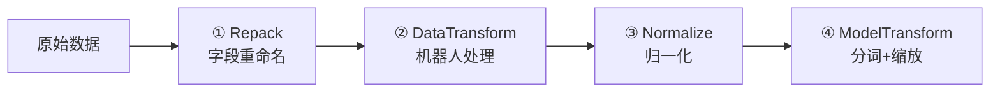

# 第六章：数据变换第一层 —— Repack 与 Robot-Specific Transform

> 本章目标：理解数据变换管线的前两步——RepackTransform 如何做字段重映射，以及各机器人的 DataTransform（如 DroidInputs、LiberoInputs）如何将异构数据统一为模型标准格式。

**前情提要**：上一章我们了解了 LeRobot 和 RLDS 的数据格式。但模型不直接消费这些格式——中间需要经过变换管线。本章进入管线的第一层和第二层。

**知识链接**：
- [第五章：数据格式入门](./05_数据格式入门)
- [第四章：配置驱动设计](./04_配置驱动设计)

---

## 6.1 变换管线的全貌回顾

从第二章我们已经知道，数据从原始格式到进入模型需要经过四层变换：



本章聚焦前两层：Repack 和 DataTransform。

---

## 6.2 RepackTransform：字段名的翻译器

### 6.2.1 问题：同一件事，不同叫法

不同数据集对同一个概念的命名完全不同：

| 概念 | DROID 数据集 | LIBERO 数据集 | ALOHA 数据集 |
|------|-------------|--------------|-------------|
| 主相机图像 | `observation/exterior_image_1_left` | `observation/image` | `observation.images.top` |
| 腕部相机 | `observation/wrist_image_left` | `observation/wrist_image` | — |
| 关节状态 | `observation/joint_position` | `observation/state` | `observation.state` |
| 动作 | `actions` | `actions` | `action` |

模型不可能为每种命名都写一套逻辑。**RepackTransform 的职责就是"翻译"**——把各种方言统一为标准语言。

### 6.2.2 RepackTransform 的工作原理

核心逻辑只有两步：
1. 把嵌套字典**扁平化**（用 `/` 作分隔符）
2. 按映射表**重建**新字典

```python
@dataclasses.dataclass(frozen=True)
class RepackTransform(DataTransformFn):
    structure: dict  # 映射表：新字段名 → 旧字段路径
    
    def __call__(self, data):
        flat = flatten_dict(data)  # {"observation/image": array, ...}
        return jax.tree.map(lambda key: flat[key], self.structure)
```

### 6.2.3 具体例子：LIBERO 的 Repack

```python
RepackTransform({
    "observation/image": "image",            # 主相机
    "observation/wrist_image": "wrist_image", # 腕部相机
    "observation/state": "state",            # 状态
    "actions": "actions",                    # 动作
    "prompt": "prompt",                      # 语言指令
})
```

**读法**：左边是**输入**（数据集中的路径），右边是**输出**（变换后的标准名）。

变换前后的数据对比：

```python
# 变换前（来自 LeRobot 数据集）
data_before = {
    "observation/image": np.array(...),       # (256,256,3)
    "observation/wrist_image": np.array(...), # (256,256,3)
    "observation/state": np.array(...),       # (8,)
    "actions": np.array(...),                 # (7,)
    "prompt": "open the drawer",
}

# 变换后（标准格式）
data_after = {
    "image": np.array(...),        # 改名了
    "wrist_image": np.array(...),  # 改名了
    "state": np.array(...),        # 改名了
    "actions": np.array(...),      # 不变
    "prompt": "open the drawer",   # 不变
}
```

### 6.2.4 DROID 的 Repack（更复杂的例子）

DROID 有更多字段需要重映射：

```python
RepackTransform({
    "observation/exterior_image_1_left": "observation/image",
    "observation/wrist_image_left": "observation/wrist_image",
    "observation/joint_position": "observation/joint_position",
    "observation/gripper_position": "observation/gripper_position",
    "actions": "actions",
    "prompt": "prompt",
})
```

注意 DROID 的 Repack 不会合并 `joint_position` 和 `gripper_position`——这个合并动作留给下一层的 DataTransform 来做。Repack 只负责"改名"，不负责"加工"。

### 6.2.5 设计原则：Repack 只在训练时使用

一个关键细节：**RepackTransform 只对数据集中的数据使用，推理时不使用。**

原因是：推理时的输入字典由用户的机器人控制代码构造，用户可以直接使用标准名。只有从数据集加载时才需要翻译。

---

## 6.3 DataTransform：机器人特定的数据加工

Repack 完成后，字段名已经标准化了。但数据的**内容**还需要加工：

- 多个分散的状态字段需要拼接为一个 state 向量
- 图像可能需要从 float (C,H,W) 转为 uint8 (H,W,C)
- 需要构造 `image_mask` 告诉模型哪些相机有效
- 不存在的相机需要用全零图像填充

这就是各机器人的 `XxxInputs` 类的职责。

---

## 6.4 DroidInputs 逐行解析

```python
@dataclasses.dataclass(frozen=True)
class DroidInputs(transforms.DataTransformFn):
    model_type: ModelType  # PI0 / PI05 / PI0_FAST
    
    def __call__(self, data: dict) -> dict:
        # 1. 拼接状态：7 关节 + 1 夹爪 = 8 维
        gripper_pos = np.asarray(data["observation/gripper_position"])
        if gripper_pos.ndim == 0:
            gripper_pos = gripper_pos[np.newaxis]  # 标量→1维数组
        state = np.concatenate([
            data["observation/joint_position"],  # (7,)
            gripper_pos,                          # (1,)
        ])  # → (8,)
        
        # 2. 解析图像：确保是 uint8 (H,W,C) 格式
        base_image = _parse_image(data["observation/exterior_image_1_left"])
        wrist_image = _parse_image(data["observation/wrist_image_left"])
        
        # 3. 构造标准输出字典
        inputs = {
            "state": state,
            "image": {
                "base_0_rgb": base_image,
                "left_wrist_0_rgb": wrist_image,
                "right_wrist_0_rgb": np.zeros_like(base_image),  # 没有右腕相机，填零
            },
            "image_mask": {
                "base_0_rgb": np.True_,
                "left_wrist_0_rgb": np.True_,
                "right_wrist_0_rgb": np.False_,  # 标记为无效
            },
        }
        
        # 4. 透传动作和prompt（如果有）
        if "actions" in data:
            inputs["actions"] = np.asarray(data["actions"])
        if "prompt" in data:
            inputs["prompt"] = data["prompt"]
        
        return inputs
```

### 逐步拆解关键逻辑

**状态拼接**：DROID 的关节位置和夹爪位置分开存储，需要拼接为一个完整的状态向量 $(8,)$。这是因为模型期望一个统一的 state 输入。

**图像解析 `_parse_image()`**：

```python
def _parse_image(image) -> np.ndarray:
    image = np.asarray(image)
    if np.issubdtype(image.dtype, np.floating):
        image = (255 * image).astype(np.uint8)  # float [0,1] → uint8 [0,255]
    if image.shape[0] == 3:
        image = einops.rearrange(image, "c h w -> h w c")  # CHW → HWC
    return image
```

LeRobot 内部可能把图像存为 float32 的 (C,H,W) 格式（PyTorch 惯例），但模型期望 uint8 的 (H,W,C)。这个函数统一处理两种情况。

**image_mask 的作用**：π₀ 模型支持最多 3 个相机输入。如果某个相机不存在（如 DROID 只有 2 个），用全零填充图像并将对应 mask 设为 `False`。模型在注意力计算中会忽略 mask 为 False 的图像 token。

**π₀-FAST 的特殊处理**：注意代码中有一个 `match self.model_type` 分支——π₀-FAST 不使用 image_mask（所有图像位置都设为 True），因为 FAST 模型的注意力设计不支持部分图像 mask。

---

## 6.5 LiberoInputs 逐行解析

LIBERO 的逻辑更简单（因为 LIBERO 数据格式已经比较规整）：

```python
@dataclasses.dataclass(frozen=True)
class LiberoInputs(transforms.DataTransformFn):
    model_type: ModelType
    
    def __call__(self, data: dict) -> dict:
        base_image = _parse_image(data["observation/image"])
        wrist_image = _parse_image(data["observation/wrist_image"])
        
        inputs = {
            "state": data["observation/state"],  # 已经是(8,)，不需要拼接
            "image": {
                "base_0_rgb": base_image,
                "left_wrist_0_rgb": wrist_image,
                "right_wrist_0_rgb": np.zeros_like(base_image),
            },
            "image_mask": {
                "base_0_rgb": np.True_,
                "left_wrist_0_rgb": np.True_,
                "right_wrist_0_rgb": np.False_,
            },
        }
        
        if "actions" in data:
            inputs["actions"] = data["actions"]
        if "prompt" in data:
            inputs["prompt"] = data["prompt"]
        
        return inputs
```

与 DroidInputs 对比：
- LIBERO 的 state 已经是完整的 $(8,)$ 向量，不需要拼接
- 同样只有 2 个相机，第三个位置填零
- 结构几乎相同——这就是"适配器模式"的体现

---

## 6.6 DataTransform 的输出标准格式

无论哪个机器人的 `XxxInputs`，输出都必须符合以下标准结构：

```python
{
    "state": np.ndarray,          # (state_dim,) float32
    "image": {
        "base_0_rgb": np.ndarray,         # (H, W, 3) uint8
        "left_wrist_0_rgb": np.ndarray,   # (H, W, 3) uint8
        "right_wrist_0_rgb": np.ndarray,  # (H, W, 3) uint8
    },
    "image_mask": {
        "base_0_rgb": np.bool_,           # True=有效
        "left_wrist_0_rgb": np.bool_,
        "right_wrist_0_rgb": np.bool_,
    },
    "actions": np.ndarray,        # (action_horizon, action_dim) 仅训练时有
    "prompt": str,                # 语言指令
}
```

这个标准格式是后续 Normalize 和 ModelTransform 的输入契约。

---

## 6.7 XxxOutputs：推理时的反向变换

训练只需要 Input 方向的变换。但推理时，模型输出的动作需要转回机器人特定格式。这就是 `XxxOutputs` 的职责。

```python
@dataclasses.dataclass(frozen=True)
class DroidOutputs(transforms.DataTransformFn):
    def __call__(self, data: dict) -> dict:
        # 模型输出 action_dim=24（填充后），DROID 只需要前 8 维
        return {"actions": np.asarray(data["actions"][..., :8])}

@dataclasses.dataclass(frozen=True)
class LiberoOutputs(transforms.DataTransformFn):
    def __call__(self, data: dict) -> dict:
        # LIBERO 只需要前 7 维
        return {"actions": np.asarray(data["actions"][..., :7])}
```

**为什么需要截断？** 因为模型的 `action_dim` 被设置为所有平台中最大的维度（如 24），不足的维度用零填充。输出时需要把多余的零去掉，只保留该机器人实际需要的维度。

---

## 6.8 Group 的 push 机制：变换的链式组合

回到第四章提到的 `Group` 类——它用 `push()` 方法来追加变换层：

```python
# 基础变换：DroidInputs + DroidOutputs
data_transforms = Group(
    inputs=[DroidInputs(model_type=ModelType.PI0)],
    outputs=[DroidOutputs()],
)

# 如果使用 delta actions，追加一层
delta_mask = [True, True, True, True, True, True, True, False]  # 前7维delta，夹爪绝对
data_transforms = data_transforms.push(
    inputs=[DeltaActions(delta_mask)],    # 追加到 inputs 末尾
    outputs=[AbsoluteActions(delta_mask)], # 追加到 outputs 开头
)
```

最终的执行顺序：
- **输入方向**：DroidInputs → DeltaActions
- **输出方向**：AbsoluteActions → DroidOutputs

输出的顺序是反过来的——`push` 的 outputs 被追加到**开头**，因为输出管线需要先做"最内层"的反变换。

---

## 6.9 本章小结

| 概念 | 核心理解 |
|------|----------|
| RepackTransform | 纯粹的字段重命名，不修改数据内容 |
| Repack 只用于训练 | 推理时用户直接用标准名构造输入 |
| XxxInputs | 机器人特定的数据加工（拼接、解析、填充） |
| _parse_image() | 统一图像格式：float→uint8，CHW→HWC |
| image_mask | 告诉模型哪些相机位置是真实数据 |
| 标准输出格式 | state + image{3路} + image_mask + actions + prompt |
| XxxOutputs | 截取模型输出中该机器人需要的维度 |
| Group.push() | 链式追加变换，输出方向是反向的 |

---

## 下一章预告

下一章我们进入变换管线的第三层——归一化。我们会理解为什么不同机器人的状态/动作范围差异巨大导致必须归一化、Z-Score 和分位数归一化各自的适用场景、以及 `compute_norm_stats.py` 如何预计算统计量。
