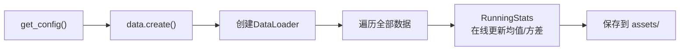

# 第七章：数据变换第二层 —— 归一化：为什么以及如何

> 本章目标：理解为什么不同机器人的状态/动作范围差异导致必须归一化、Z-Score 和分位数归一化各自的原理与适用场景、以及 `compute_norm_stats.py` 如何预计算统计量。

**前情提要**：上一章我们完成了 Repack（字段改名）和 DataTransform（格式统一）。数据已经有了标准的字段结构。但各维度的数值范围还是天差地别——这就是归一化要解决的问题。

**知识链接**：
- [第六章：数据变换第一层](./06_数据变换第一层)

---

## 7.1 为什么必须归一化？

考虑两个不同机器人的状态向量：

| 机器人 | 第1关节范围 | 第7关节范围 | 夹爪范围 |
|--------|-------------|-------------|----------|
| Franka (DROID) | $[-2.9, 2.9]$ rad | $[-3.0, 3.0]$ rad | $[0.0, 0.08]$ m |
| ALOHA | $[-3.14, 3.14]$ rad | $[-3.14, 3.14]$ rad | $[0, 1]$ 无量纲 |

如果不归一化：
- 关节角度的量级是 $\sim 1$
- 夹爪开合可能只有 $\sim 0.01$
- 模型的 Flow Matching 损失会被大量级的维度主导
- 小量级维度的学习信号被淹没

**归一化的目标**：把所有维度映射到大约相同的范围（通常 $[-1, 1]$ 或均值 0 标准差 1），让每个维度对损失的贡献大致相等。

---

## 7.2 两种归一化策略

OpenPI 支持两种归一化方式，通过 `DataConfig.use_quantile_norm` 切换。

### 7.2.1 Z-Score 标准化（默认）

$$
\hat{x} = \frac{x - \mu}{\sigma + \epsilon}
$$

**一句话直觉**：减去均值让数据居中于 0，除以标准差让数据的波动幅度为 1。

**逐项拆解**：

| 符号 | 含义 | 来源 |
|------|------|------|
| $x$ | 原始数据值 | 当前帧的状态/动作 |
| $\mu$ | 该维度在训练集上的均值 | `norm_stats.mean` |
| $\sigma$ | 该维度在训练集上的标准差 | `norm_stats.std` |
| $\epsilon$ | 极小值 $10^{-6}$，防止除零 | 代码硬编码 |
| $\hat{x}$ | 归一化后的值 | 约在 $[-3, 3]$ 范围 |

**代入数字**：假设 Franka 第 1 关节的统计量为 $\mu=0.2$, $\sigma=1.1$：
- 原始值 $x = 1.5$：$\hat{x} = (1.5 - 0.2) / 1.1 = 1.18$
- 原始值 $x = -2.0$：$\hat{x} = (-2.0 - 0.2) / 1.1 = -2.0$

**反归一化**：

$$
x = \hat{x} \cdot (\sigma + \epsilon) + \mu
$$

### 7.2.2 分位数归一化（Quantile Normalization）

$$
\hat{x} = \frac{x - q_{01}}{q_{99} - q_{01} + \epsilon} \times 2 - 1
$$

**一句话直觉**：把数据的 1% 分位数映射到 $-1$，99% 分位数映射到 $+1$。

**逐项拆解**：

| 符号 | 含义 | 来源 |
|------|------|------|
| $q_{01}$ | 训练集中该维度的第 1 百分位数 | `norm_stats.q01` |
| $q_{99}$ | 训练集中该维度的第 99 百分位数 | `norm_stats.q99` |
| $\times 2 - 1$ | 将 $[0, 1]$ 范围映射到 $[-1, 1]$ | — |

**代入数字**：假设夹爪位置的 $q_{01}=0.01$, $q_{99}=0.07$：
- 原始值 $x=0.04$：$\hat{x} = (0.04-0.01)/(0.07-0.01) \times 2 - 1 = 0.5 \times 2 - 1 = 0$
- 原始值 $x=0.07$：$\hat{x} = (0.07-0.01)/(0.07-0.01) \times 2 - 1 = 1$

**反归一化**：

$$
x = \frac{\hat{x} + 1}{2} \times (q_{99} - q_{01} + \epsilon) + q_{01}
$$

### 7.2.3 两种方式的选择

| 特性 | Z-Score | 分位数 |
|------|---------|--------|
| 对异常值敏感 | 是（均值/标准差受极端值影响） | 否（1%/99% 分位数鲁棒） |
| 输出范围 | 无固定边界（理论上 $\pm \infty$） | 接近 $[-1, 1]$（99% 数据） |
| 适用场景 | 数据分布近似高斯 | 数据有长尾或离群值 |
| OpenPI 默认 | ✅ 默认使用 | 通过 `use_quantile_norm=True` 启用 |

---

## 7.3 NormStats 数据结构

归一化统计量存储在 `NormStats` 数据类中：

```python
@pydantic.dataclasses.dataclass
class NormStats:
    mean: np.ndarray    # 均值向量 (dim,)
    std: np.ndarray     # 标准差向量 (dim,)
    q01: np.ndarray | None = None  # 1%分位数 (dim,)（可选）
    q99: np.ndarray | None = None  # 99%分位数 (dim,)（可选）
```

每个维度独立计算统计量。对于 DROID 的 8 维状态：

```python
norm_stats["state"] = NormStats(
    mean=np.array([0.2, -1.1, 0.8, 0.3, -0.1, 0.5, 0.0, 0.03]),  # (8,)
    std=np.array([1.1, 0.9, 0.7, 1.0, 1.2, 0.8, 1.5, 0.02]),     # (8,)
    q01=np.array([-2.5, -2.8, -0.5, ...]),  # (8,)
    q99=np.array([2.8, 0.5, 2.0, ...]),     # (8,)
)
```

---

## 7.4 compute_norm_stats.py：预计算统计量

归一化统计必须在训练前离线计算（不能边训练边算，因为需要遍历整个数据集）。

### 7.4.1 完整工作流程



### 7.4.2 核心逻辑

```python
# 只对 state 和 actions 计算统计
keys = ["state", "actions"]
stats = {key: RunningStats() for key in keys}

for batch in data_loader:
    for key in keys:
        stats[key].update(np.asarray(batch[key]))

# 输出 NormStats
norm_stats = {key: s.get_statistics() for key, s in stats.items()}
normalize.save(output_path, norm_stats)
```

**关键细节**：

1. **只计算 state 和 actions**——图像不做归一化（后续有专门的像素归一化）
2. **使用 RunningStats 在线算法**——不需要把所有数据加载到内存，一个 batch 一个 batch 地增量更新
3. **应用了 Repack + DataTransform**——但没有 ModelTransform（因为统计量是在 data transform 之后、model transform 之前计算的）

### 7.4.3 RunningStats 的在线算法

`RunningStats` 使用 Welford 算法增量计算均值和方差：

```python
# 每个新 batch 更新
self._count += num_elements
self._mean += (batch_mean - self._mean) * (num_elements / self._count)
self._mean_of_squares += (batch_mean_of_squares - self._mean_of_squares) * (num_elements / self._count)

# 方差 = E[X²] - (E[X])²
variance = self._mean_of_squares - self._mean**2
std = np.sqrt(max(0, variance))
```

分位数通过维护直方图来近似计算（5000 个 bin），不需要存储全部数据。

### 7.4.4 使用命令

```bash
uv run scripts/compute_norm_stats.py --config-name pi05_libero
```

输出保存到 `assets/pi05_libero/physical-intelligence/libero/` 目录下。

---

## 7.5 Normalize 和 Unnormalize 的代码实现

### Normalize（输入方向）

```python
@dataclasses.dataclass(frozen=True)
class Normalize(DataTransformFn):
    norm_stats: dict[str, NormStats] | None
    use_quantiles: bool = False
    
    def __call__(self, data):
        if self.norm_stats is None:
            return data  # 没有统计量就跳过
        
        return apply_tree(data, self.norm_stats, self._normalize)
    
    def _normalize(self, x, stats):
        mean = stats.mean[..., :x.shape[-1]]
        std = stats.std[..., :x.shape[-1]]
        return (x - mean) / (std + 1e-6)
```

### Unnormalize（输出方向）

```python
@dataclasses.dataclass(frozen=True)
class Unnormalize(DataTransformFn):
    norm_stats: dict[str, NormStats] | None
    use_quantiles: bool = False
    
    def __call__(self, data):
        if self.norm_stats is None:
            return data
        return apply_tree(data, self.norm_stats, self._unnormalize)
    
    def _unnormalize(self, x, stats):
        mean = pad_to_dim(stats.mean, x.shape[-1], axis=-1, value=0.0)
        std = pad_to_dim(stats.std, x.shape[-1], axis=-1, value=1.0)
        return x * (std + 1e-6) + mean
```

**`pad_to_dim` 的作用**：反归一化时，如果模型输出维度（如 24）大于 norm_stats 的维度（如 8），多出的维度用 mean=0, std=1 填充——相当于不做反归一化，保持原值。

---

## 7.6 归一化在管线中的位置

归一化夹在 DataTransform 和 ModelTransform 之间：

| 阶段 | 操作 | state 的值范围 |
|------|------|----------------|
| DataTransform 后 | 原始物理量 | 如 $[-2.9, 2.9]$ |
| **Normalize 后** | **标准化值** | **约 $[-3, 3]$** |
| ModelTransform 后 | 不再改变数值 | 约 $[-3, 3]$ |
| 模型内部 | Flow Matching 操作 | — |
| 模型输出 | 归一化的动作 | 约 $[-3, 3]$ |
| **Unnormalize 后** | **还原物理量** | **如关节角度弧度** |

**训练和推理必须使用相同的 norm_stats**——这就是为什么统计量被存储在 checkpoint 的 `assets/` 目录中，随模型一起分发。

---

## 7.7 跨平台共享 norm_stats

当微调到一个基础模型已经见过的机器人时，可以直接复用预训练时的统计量：

```python
data=LeRobotAlohaDataConfig(
    assets=AssetsConfig(asset_id="trossen"),
    # 从 pi0_base/assets/trossen/ 加载统计量
)
```

这避免了为小数据集重新计算不稳定的统计量。大数据集（如 DROID 10k+ 小时）的统计量更准确、更有代表性。

---

## 7.8 本章小结

| 概念 | 核心理解 |
|------|----------|
| 归一化动机 | 不同维度量级差异巨大，归一化让学习更均匀 |
| Z-Score | $(x - \mu) / \sigma$，默认方式 |
| 分位数归一化 | 基于 q01/q99，对异常值鲁棒 |
| NormStats | 存储 mean/std/q01/q99 的数据类 |
| compute_norm_stats.py | 遍历数据集预计算统计量 |
| RunningStats | Welford 在线算法 + 直方图分位数 |
| 对称设计 | Normalize ↔ Unnormalize 严格可逆 |
| 存储位置 | assets/config_name/repo_id/ |

---

## 下一章预告

下一章我们进入变换管线的最后一层——ModelTransform。我们会详解图像如何缩放到 224×224、语言指令如何被分词为 token 序列、π₀.₅ 如何把状态量化为离散 token，以及 FAST 分词器如何将连续动作 token 化。
