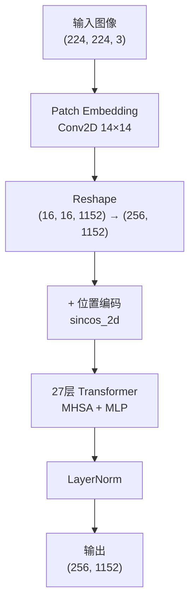
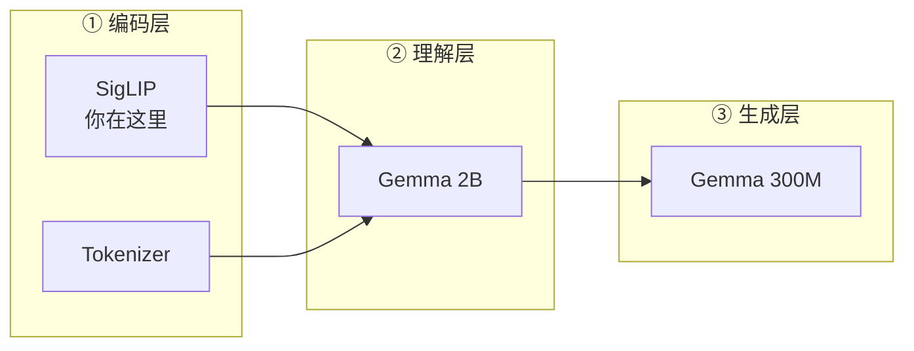

# 第九章：SigLIP 视觉编码器 —— 图像如何变为 Token

> 本章目标：理解 SigLIP 如何将一张 224×224 的 RGB 图像转化为 256 个语义丰富的视觉 token，包括 Patch Embedding、位置编码、Transformer 编码的完整流程。

**前情提要**：上一章完成了 ModelTransform，图像已经缩放到 224×224。现在数据正式进入模型——第一个处理它的组件就是 SigLIP 视觉编码器。

**知识链接**：
- [第八章：ModelTransform](./08_数据变换第三层_ModelTransform)
- [第一章：什么是 VLA？](./01_什么是VLA)

---

## 9.1 SigLIP 是什么？

SigLIP（Sigmoid Loss for Image-text Pre-training）是 Google 提出的视觉-语言对比学习模型。它的核心思想是：

- 在数亿个（图像, 文本描述）配对上训练
- 学习一个视觉编码器，能把图像映射到与文本同一个语义空间
- 与 CLIP 的区别：使用 Sigmoid Loss（逐对独立的二分类），而非 Softmax（全局对比）

对 π₀ 来说，SigLIP 的价值在于：**它已经学会了理解图像内容**。它能识别物体、理解空间关系、区分颜色——这些都是机器人操控所需要的视觉能力。

---

## 9.2 OpenPI 中使用的 SigLIP 变体

OpenPI 使用 **SigLIP So400m/14** 变体：

| 参数 | 值 | 含义 |
|------|-----|------|
| 模型规模 | So400m | ~400M 参数 |
| Patch 大小 | 14×14 | 每个 patch 是 14×14 像素 |
| 输入分辨率 | 224×224 | 标准输入尺寸 |
| Patch 数量 | 16×16 = 256 | 224÷14 = 16 |
| 隐藏维度 (width) | 1152 | 每个 token 的表示维度 |
| Transformer 层数 (depth) | 27 | 编码器深度 |
| 注意力头数 | 16 | 多头注意力 |
| MLP 维度 | 4608 | 4×width |
| 池化类型 | **none** | 保留所有 256 个空间 token |

**`pool_type="none"` 是关键**：通常 ViT 做分类时会把 256 个 token 池化为 1 个全局表示。但 π₀ 需要保留所有空间信息——每个 patch 的局部信息对精细操控很重要（比如物体的精确位置）。

---

## 9.3 前向传播完整流程

一张图像在 SigLIP 中的处理流程：



### 步骤 1：Patch Embedding

将图像切割为 16×16 = 256 个不重叠的 patch，每个 patch 14×14 像素。通过一个卷积层实现：

```python
x = nn.Conv(
    features=self.width,     # 输出通道 = 1152
    kernel_size=self.patch_size,  # (14, 14)
    strides=self.patch_size,      # 步长 = 14（不重叠）
    padding="VALID",
)(image)  # 输入 (1, 224, 224, 3) → 输出 (1, 16, 16, 1152)
```

**代入数字**：
- 输入：$(1, 224, 224, 3)$
- 卷积核：$(14, 14, 3, 1152)$——把 $14 \times 14 \times 3 = 588$ 个像素值线性映射到 1152 维
- 输出：$(1, 16, 16, 1152)$

然后 reshape 为序列：$(1, 16, 16, 1152) \to (1, 256, 1152)$

### 步骤 2：位置编码

使用 2D 正弦余弦位置编码（sincos_2d），让模型知道每个 patch 在空间中的位置：

```python
x = x + posemb_sincos_2d(h=16, w=16, width=1152)
```

编码方式：将 1152 维分为 4 等份（各 288 维），分别编码 x 坐标的 sin、x 坐标的 cos、y 坐标的 sin、y 坐标的 cos。

**为什么用固定的 sincos 而不是可学习的位置编码？** 因为 sincos 编码可以自然地泛化到不同分辨率（虽然这里固定 224×224，但这是 PaliGemma 预训练的选择）。

### 步骤 3：27 层 Transformer 编码

每一层 Transformer Block 包含：

```python
# 一个 Encoder1DBlock
y = LayerNorm(x)
y = MultiHeadSelfAttention(y)  # 256 个 token 互相关注
x = x + y                       # 残差连接

y = LayerNorm(x)
y = MLP(y)                      # 逐 token 的非线性变换
x = x + y                       # 残差连接
```

经过 27 层后，每个 token 的 1152 维表示已经融合了全图的上下文信息。

### 步骤 4：最终 LayerNorm

```python
output = LayerNorm(x)  # (1, 256, 1152)
```

---

## 9.4 从 SigLIP 输出到 Gemma 输入的投影

SigLIP 的输出维度是 1152，但 Gemma 2B 的输入维度是 2048。需要一个线性投影层来对齐：

```python
# 在 Pi0.__init__ 中（实际在 PaliGemma 预训练时已定义）
# img_tokens shape: (batch, 256, 1152)
# 投影到 Gemma 的维度
img_tokens = linear_proj(img_tokens)  # → (batch, 256, 2048)
```

这个投影层是 PaliGemma 预训练时学到的——它知道如何把视觉特征"翻译"为语言模型能理解的格式。

---

## 9.5 多相机处理

π₀ 支持最多 3 个相机。每个相机独立通过 SigLIP 编码：

```python
# 假设有 2 个有效相机 + 1 个全零填充
for cam_name, image in images.items():
    if image_mask[cam_name]:  # 只编码有效图像
        tokens = siglip(image)  # (256, 1152)
        all_tokens.append(tokens)
    else:
        # mask 为 False 的图像不编码（或编码后在注意力中被忽略）
```

最终的视觉 token 序列：
- 2 个有效相机：$2 \times 256 = 512$ 个视觉 token
- 3 个有效相机：$3 \times 256 = 768$ 个视觉 token

这些 token 拼接后与文本 token 一起构成 Gemma 的前缀输入。

---

## 9.6 Scan 模式：内存优化

注意 SigLIP 在 OpenPI 中使用了 `scan=True`：

```python
img = _siglip.Module(
    num_classes=paligemma_config.width,
    variant="So400m/14",
    pool_type="none",
    scan=True,       # ← 启用 scan 模式
    dtype_mm=config.dtype,
)
```

Scan 模式利用 JAX 的 `nn.scan` 将 27 层 Transformer 编译为一个循环，而不是展开为 27 个独立的层。好处是：
- **大幅减少编译时间**（只需要编译 1 层的计算图，而非 27 层）
- **减少编译后的内存占用**

代价是稍慢一点（循环 vs 展开），但对于推理来说可以忽略不计。

---

## 9.7 SigLIP 在 π₀ 系统中的位置

回到我们的三层心智模型：



SigLIP 是第一个接触原始像素的组件。它的输出质量直接决定了后续 Gemma 能否正确理解场景。这也是为什么用一个在数亿图文对上预训练过的大型视觉模型（400M 参数）——它已经具备了强大的视觉理解能力。

---

## 9.8 本章小结

| 概念 | 核心理解 |
|------|----------|
| SigLIP 作用 | 将 224×224 图像编码为 256 个语义 token |
| So400m/14 | 400M 参数，patch=14，depth=27 |
| Patch Embedding | Conv2D 14×14 → 每个 patch 映射为 1152 维 |
| pool_type=none | 保留全部 256 个空间 token |
| 位置编码 | sincos_2d 固定编码 |
| 输出投影 | 1152 → 2048 维（对齐 Gemma） |
| 多相机 | 每相机独立编码，token 拼接 |
| Scan 模式 | 27 层用循环实现，节省编译时间 |

---

## 下一章预告

下一章我们进入 Gemma 语言模型——π₀ 系统的"大脑"。我们会理解 Decoder-only Transformer 的结构、双 Gemma 设计（2B 主模型 + 300M 动作专家）、以及 GQA、RMSNorm、RoPE 这些关键技术如何配合工作。
